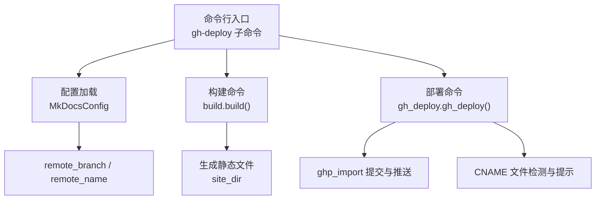
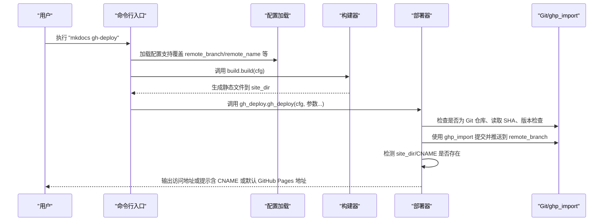
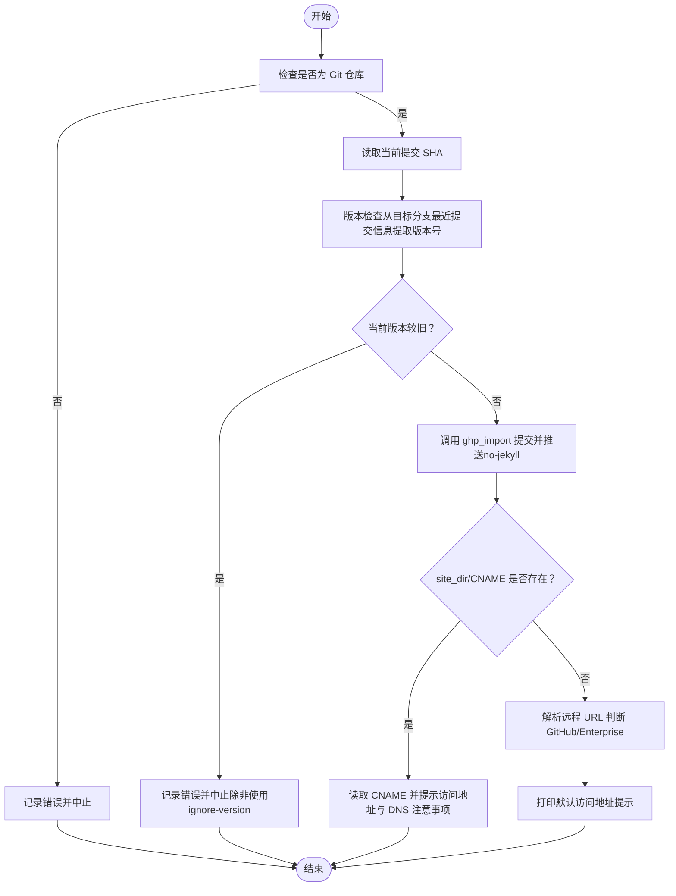
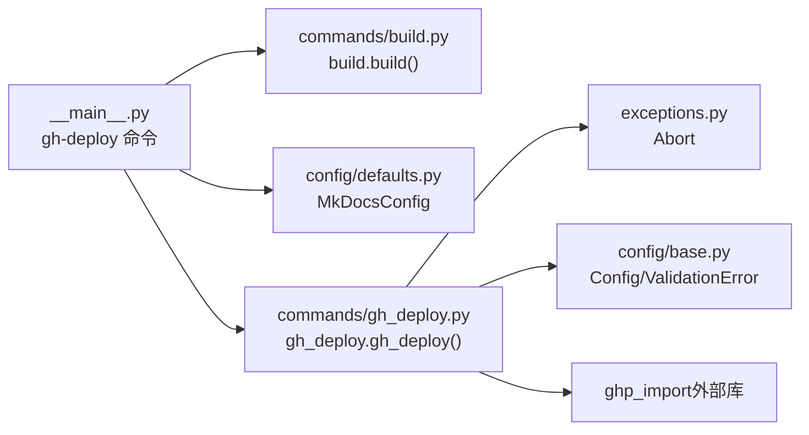

# GitHub Pages 部署

<cite>
**本文引用的文件**
- [mkdocs/commands/gh_deploy.py](file://mkdocs/commands/gh_deploy.py)
- [mkdocs/commands/build.py](file://mkdocs/commands/build.py)
- [mkdocs/config/defaults.py](file://mkdocs/config/defaults.py)
- [mkdocs/config/base.py](file://mkdocs/config/base.py)
- [mkdocs/exceptions.py](file://mkdocs/exceptions.py)
- [mkdocs/__main__.py](file://mkdocs/__main__.py)
- [docs/user-guide/deploying-your-docs.md](file://docs/user-guide/deploying-your-docs.md)
- [docs/CNAME](file://docs/CNAME)
- [mkdocs/tests/gh_deploy_tests.py](file://mkdocs/tests/gh_deploy_tests.py)
- [mkdocs.yml](file://mkdocs.yml)
</cite>

## 目录
1. [简介](#简介)
2. [项目结构](#项目结构)
3. [核心组件](#核心组件)
4. [架构总览](#架构总览)
5. [详细组件分析](#详细组件分析)
6. [依赖关系分析](#依赖关系分析)
7. [性能考量](#性能考量)
8. [故障排除指南](#故障排除指南)
9. [结论](#结论)
10. [附录](#附录)

## 简介
本指南面向使用 MkDocs 在 GitHub（含 GitHub Enterprise）上部署静态文档站点的用户，系统讲解 mkdocs gh-deploy 命令的工作原理、参数与配置项、部署流程（分支与远程仓库设置）、CNAME 文件处理、版本检查机制、部署消息格式、以及常见问题排查与回滚策略。内容基于仓库中的实现与文档，确保可操作性与准确性。

## 项目结构
围绕 GitHub Pages 部署的关键文件与职责如下：
- 命令入口与参数解析：在命令行层定义 gh-deploy 子命令及其参数，并加载配置后调用构建与部署逻辑。
- 构建阶段：执行站点构建，生成静态文件到 site_dir。
- 部署阶段：通过 ghp-import 将构建产物提交到指定远程分支（默认 gh-pages），并推送至远端。
- 配置项：remote_branch、remote_name 等影响部署行为。
- 文档与示例：官方用户指南与示例 CNAME 文件，说明部署流程与自定义域名。

图表来源
- [mkdocs/__main__.py](file://mkdocs/__main__.py#L293-L325)
- [mkdocs/commands/build.py](file://mkdocs/commands/build.py#L1-L200)
- [mkdocs/commands/gh_deploy.py](file://mkdocs/commands/gh_deploy.py#L100-L170)
- [mkdocs/config/defaults.py](file://mkdocs/config/defaults.py#L144-L148)

章节来源
- [mkdocs/__main__.py](file://mkdocs/__main__.py#L293-L325)
- [mkdocs/commands/build.py](file://mkdocs/commands/build.py#L1-L200)
- [mkdocs/commands/gh_deploy.py](file://mkdocs/commands/gh_deploy.py#L100-L170)
- [mkdocs/config/defaults.py](file://mkdocs/config/defaults.py#L144-L148)

## 核心组件
- 命令行子命令 gh-deploy：负责加载配置、触发构建、调用部署逻辑，并传递参数（如 message、force、no-history、ignore-version、shell 等）。
- 部署函数 gh_deploy.gh_deploy：校验当前目录是否为 Git 仓库、读取当前提交 SHA、进行版本检查、调用 ghp_import 完成提交与推送、处理 CNAME 文件与输出访问地址。
- 配置项 remote_branch 与 remote_name：分别控制目标远程分支与远程名称，默认值分别为 gh-pages 与 origin。
- 构建命令 build.build：根据配置生成静态站点到 site_dir。
- 异常与日志：Abort 异常用于中止流程；日志记录部署状态与警告信息。

章节来源
- [mkdocs/__main__.py](file://mkdocs/__main__.py#L293-L325)
- [mkdocs/commands/gh_deploy.py](file://mkdocs/commands/gh_deploy.py#L100-L170)
- [mkdocs/config/defaults.py](file://mkdocs/config/defaults.py#L144-L148)
- [mkdocs/commands/build.py](file://mkdocs/commands/build.py#L1-L200)
- [mkdocs/exceptions.py](file://mkdocs/exceptions.py#L13-L20)

## 架构总览
下图展示了从命令行到部署完成的整体流程，包括参数传递、构建与部署调用、以及 CNAME 处理与版本检查。

图表来源
- [mkdocs/__main__.py](file://mkdocs/__main__.py#L293-L325)
- [mkdocs/commands/build.py](file://mkdocs/commands/build.py#L1-L200)
- [mkdocs/commands/gh_deploy.py](file://mkdocs/commands/gh_deploy.py#L100-L170)

## 详细组件分析

### 命令行参数与帮助文本
- 支持的参数与含义：
  - -m/--message：自定义提交信息模板（默认模板包含版本号与提交 SHA）。
  - -b/--remote-branch：目标远程分支（默认 gh-pages）。
  - -r/--remote-name：远程名称（默认 origin）。
  - --force：强制推送。
  - --no-history：以单次提交替换历史。
  - --ignore-version：忽略版本检查。
  - --shell：使用 shell 调用 Git。
  - -d/--site-dir：覆盖 site_dir。
- 帮助文本由全局变量提供并在装饰器中注入。

章节来源
- [mkdocs/__main__.py](file://mkdocs/__main__.py#L126-L146)
- [mkdocs/__main__.py](file://mkdocs/__main__.py#L293-L325)

### 配置项：remote_branch 与 remote_name
- remote_branch：默认 gh-pages，用于控制部署目标分支。
- remote_name：默认 origin，用于控制推送的远程名称。
- 这些配置项由 MkDocsConfig 提供默认值，可在命令行或配置文件中覆盖。

章节来源
- [mkdocs/config/defaults.py](file://mkdocs/config/defaults.py#L144-L148)
- [mkdocs/config/base.py](file://mkdocs/config/base.py#L123-L243)

### 构建阶段：build.build
- 根据配置生成静态站点到 site_dir，供部署阶段使用。
- 支持 --dirty 优化仅增量构建（在命令行层传入）。

章节来源
- [mkdocs/commands/build.py](file://mkdocs/commands/build.py#L1-L200)
- [mkdocs/__main__.py](file://mkdocs/__main__.py#L305-L325)

### 部署阶段：gh_deploy.gh_deploy
- 核心流程：
  1) 校验当前目录是否为 Git 仓库。
  2) 读取当前提交 SHA 并填充默认提交信息模板。
  3) 版本检查：从目标分支最近一次提交信息提取版本号，与当前 MkDocs 版本比较，若旧版本则中止（除非使用 --ignore-version）。
  4) 调用 ghp_import 提交到指定分支并推送，同时设置 no-jekyll。
  5) 检测 site_dir/CNAME 文件是否存在：
     - 若存在，读取域名并提示访问地址与 DNS 配置注意事项；
     - 否则尝试解析远程 URL，判断是否为 GitHub（Enterprise）场景并给出相应提示。
- 错误处理：捕获 ghp_import 的 GhpError 并抛出 Abort 中止流程。

图表来源
- [mkdocs/commands/gh_deploy.py](file://mkdocs/commands/gh_deploy.py#L100-L170)

章节来源
- [mkdocs/commands/gh_deploy.py](file://mkdocs/commands/gh_deploy.py#L100-L170)
- [mkdocs/exceptions.py](file://mkdocs/exceptions.py#L13-L20)

### CNAME 文件处理
- 当 site_dir 下存在 CNAME 文件时，部署器会读取其中的域名，并提示访问地址与 DNS 配置注意事项。
- 用户指南文档明确：CNAME 文件应放置于 docs_dir 根目录，以便构建后被复制到 site_dir 并随站点一起推送。

章节来源
- [mkdocs/commands/gh_deploy.py](file://mkdocs/commands/gh_deploy.py#L144-L157)
- [docs/user-guide/deploying-your-docs.md](file://docs/user-guide/deploying-your-docs.md#L78-L94)
- [docs/CNAME](file://docs/CNAME#L1-L2)

### GitHub Enterprise 特殊配置
- 当远程 URL 不指向 github.com（含 ssh/http）时，视为 GitHub Enterprise 场景。
- 部署器会检测该情况并输出“站点将很快可用”的通用提示，不生成特定域名链接。
- 用户指南文档提供了针对不同站点类型（Project Pages、User/Organization Pages）的部署差异说明。

章节来源
- [mkdocs/commands/gh_deploy.py](file://mkdocs/commands/gh_deploy.py#L50-L69)
- [mkdocs/commands/gh_deploy.py](file://mkdocs/commands/gh_deploy.py#L161-L169)
- [docs/user-guide/deploying-your-docs.md](file://docs/user-guide/deploying-your-docs.md#L7-L76)

### 版本检查机制与部署消息格式
- 版本检查：从目标分支最近一次提交信息中提取语义化版本号，与当前 MkDocs 版本比较，若旧版本则中止（除非使用 --ignore-version）。
- 默认提交信息模板包含 MkDocs 版本与当前提交 SHA，可通过 -m/--message 自定义模板。

章节来源
- [mkdocs/commands/gh_deploy.py](file://mkdocs/commands/gh_deploy.py#L72-L98)
- [mkdocs/commands/gh_deploy.py](file://mkdocs/commands/gh_deploy.py#L20-L20)
- [mkdocs/commands/gh_deploy.py](file://mkdocs/commands/gh_deploy.py#L117-L120)

### 部署流程（分支与远程仓库）
- Project Pages：默认将站点提交到项目仓库的 gh-pages 分支（remote_branch 默认值）。
- User/Organization Pages：需在专用 orgname.github.io 仓库中运行部署，remote_branch 可设为 master。
- 远程名称：默认 origin，可通过 -r/--remote-name 覆盖。

章节来源
- [docs/user-guide/deploying-your-docs.md](file://docs/user-guide/deploying-your-docs.md#L15-L76)
- [mkdocs/config/defaults.py](file://mkdocs/config/defaults.py#L144-L148)

## 依赖关系分析
- 命令行层依赖配置加载模块与构建模块，最终调用部署模块。
- 部署模块依赖 ghp_import 完成提交与推送，并通过 Git 子进程调用实现版本检查与远程 URL 解析。
- 配置层提供 remote_branch 与 remote_name 的默认值与验证。

图表来源
- [mkdocs/__main__.py](file://mkdocs/__main__.py#L293-L325)
- [mkdocs/commands/build.py](file://mkdocs/commands/build.py#L1-L200)
- [mkdocs/config/defaults.py](file://mkdocs/config/defaults.py#L144-L148)
- [mkdocs/commands/gh_deploy.py](file://mkdocs/commands/gh_deploy.py#L100-L170)
- [mkdocs/exceptions.py](file://mkdocs/exceptions.py#L13-L20)
- [mkdocs/config/base.py](file://mkdocs/config/base.py#L123-L243)

章节来源
- [mkdocs/__main__.py](file://mkdocs/__main__.py#L293-L325)
- [mkdocs/commands/gh_deploy.py](file://mkdocs/commands/gh_deploy.py#L100-L170)
- [mkdocs/config/defaults.py](file://mkdocs/config/defaults.py#L144-L148)
- [mkdocs/exceptions.py](file://mkdocs/exceptions.py#L13-L20)
- [mkdocs/config/base.py](file://mkdocs/config/base.py#L123-L243)

## 性能考量
- 使用 --dirty（在命令行层传入）可仅增量构建已修改页面，缩短构建时间。
- --no-history 会以单次提交替换历史，适合保持历史简洁但需谨慎使用。
- 避免在本地仓库包含未跟踪或未提交的文件，以免被一并纳入部署（用户指南明确警告）。

章节来源
- [mkdocs/commands/build.py](file://mkdocs/commands/build.py#L1-L200)
- [docs/user-guide/deploying-your-docs.md](file://docs/user-guide/deploying-your-docs.md#L33-L46)

## 故障排除指南
- 权限错误（无法找到 git）：当系统未安装或未将 git 添加到 PATH 时，会记录错误并中止。请确认 git 已正确安装且可从当前终端调用。
- 网络连接问题：推送失败通常与网络或远程仓库访问权限有关。建议先在本地使用 git 命令验证连接与凭据。
- 版本不兼容（旧版 MkDocs）：若目标分支最近一次提交信息中的版本号大于当前 MkDocs 版本，部署会被中止。可使用 --ignore-version 绕过检查（不推荐）。
- ghp_import 错误：捕获 GhpError 并中止，查看日志中的具体错误信息定位问题。
- CNAME 未生效：确认 CNAME 文件位于 docs_dir 根目录并在构建后被复制到 site_dir；同时确保 DNS 记录已正确配置。
- GitHub Enterprise：当远程 URL 非 github.com 时，不会生成特定域名链接，请按 Enterprise 环境的访问规则配置。

章节来源
- [mkdocs/commands/gh_deploy.py](file://mkdocs/commands/gh_deploy.py#L30-L34)
- [mkdocs/commands/gh_deploy.py](file://mkdocs/commands/gh_deploy.py#L140-L142)
- [mkdocs/commands/gh_deploy.py](file://mkdocs/commands/gh_deploy.py#L91-L97)
- [mkdocs/tests/gh_deploy_tests.py](file://mkdocs/tests/gh_deploy_tests.py#L122-L140)
- [docs/user-guide/deploying-your-docs.md](file://docs/user-guide/deploying-your-docs.md#L78-L94)

## 结论
mkdocs gh-deploy 将构建与部署整合为一键流程，通过 ghp_import 实现对 GitHub Pages 的标准提交与推送。借助 remote_branch、remote_name、CNAME 文件与版本检查机制，用户可以灵活地在不同站点类型与企业环境中完成部署。遇到问题时，优先检查 Git 可用性、网络连通性、版本一致性与 CNAME 配置，必要时结合测试用例与日志定位根因。

## 附录
- 示例配置文件：mkdocs.yml 展示了站点名称、导航、插件与主题等配置项，可作为部署前检查的参考。
- 测试用例：gh_deploy_tests.py 覆盖了远程 URL 解析、版本检查日志、错误处理等场景，便于理解边界条件与行为预期。

章节来源
- [mkdocs.yml](file://mkdocs.yml#L1-L80)
- [mkdocs/tests/gh_deploy_tests.py](file://mkdocs/tests/gh_deploy_tests.py#L1-L186)