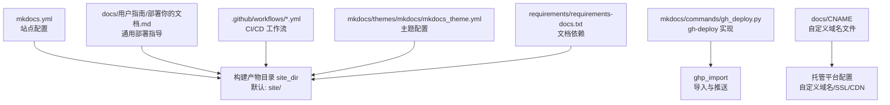
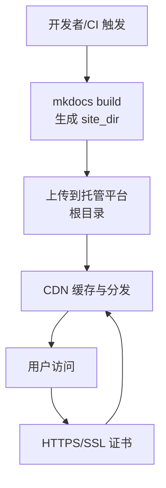
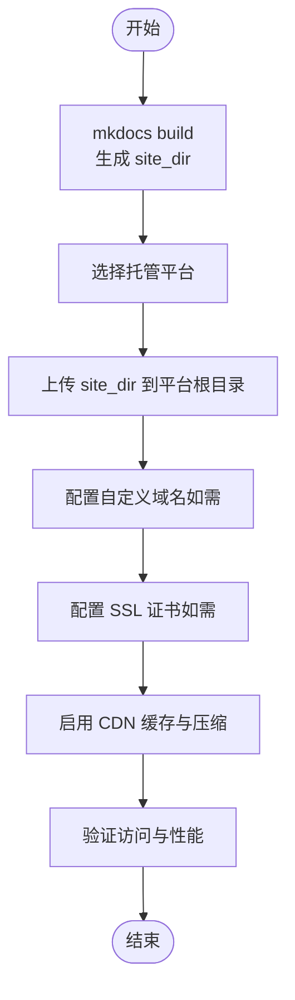
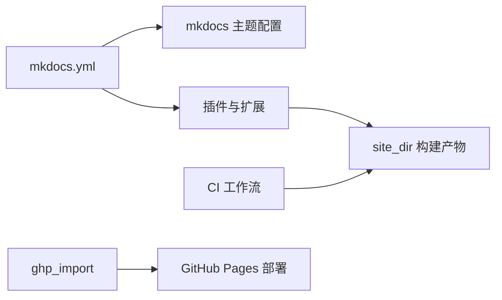

# 其他平台部署

<cite>
**本文引用的文件**
- [README.md](file://README.md)
- [mkdocs.yml](file://mkdocs.yml)
- [docs/用户指南/部署你的文档.md](file://docs/用户指南/部署你的文档.md)
- [.github/workflows/ci.yml](file://.github/workflows/ci.yml)
- [.github/workflows/deploy-release.yml](file://.github/workflows/deploy-release.yml)
- [.github/workflows/docs.yml](file://.github/workflows/docs.yml)
- [mkdocs/commands/gh_deploy.py](file://mkdocs/commands/gh_deploy.py)
- [mkdocs/config/defaults.py](file://mkdocs/config/defaults.py)
- [mkdocs/themes/mkdocs/mkdocs_theme.yml](file://mkdocs/themes/mkdocs/mkdocs_theme.yml)
- [requirements/requirements-docs.txt](file://requirements/requirements-docs.txt)
- [docs/CNAME](file://docs/CNAME)
</cite>

## 目录
1. [简介](#简介)
2. [项目结构](#项目结构)
3. [核心组件](#核心组件)
4. [架构总览](#架构总览)
5. [详细组件分析](#详细组件分析)
6. [依赖关系分析](#依赖关系分析)
7. [性能考虑](#性能考虑)
8. [故障排查指南](#故障排查指南)
9. [结论](#结论)
10. [附录](#附录)

## 简介
本指南面向希望将 MkDocs 构建的静态站点部署到除 GitHub Pages 外的其他静态托管平台（如 GitLab Pages、Netlify、Vercel、Surge.sh 等）的用户。内容涵盖：
- 各平台的部署步骤与配置要点
- 自动化部署与 CI/CD 集成思路
- 自定义域名、SSL 与 CDN 的配置方法
- 性能优化与最佳实践
- 平台特有约束与规避策略

## 项目结构
围绕“静态托管平台部署”的目标，以下文件与目录最为相关：
- 文档与配置：mkdocs.yml、docs/ 用户指南/部署你的文档.md、docs/CNAME
- 部署实现：mkdocs/commands/gh_deploy.py、mkdocs/config/defaults.py
- CI/CD 工作流：.github/workflows/*.yml
- 主题与依赖：mkdocs/themes/mkdocs/mkdocs_theme.yml、requirements/requirements-docs.txt

图表来源
- [mkdocs.yml](file://mkdocs.yml#L1-L80)
- [docs/用户指南/部署你的文档.md](file://docs/用户指南/部署你的文档.md#L1-L224)
- [mkdocs/commands/gh_deploy.py](file://mkdocs/commands/gh_deploy.py#L1-L170)
- [.github/workflows/ci.yml](file://.github/workflows/ci.yml#L1-L105)
- [mkdocs/themes/mkdocs/mkdocs_theme.yml](file://mkdocs/themes/mkdocs/mkdocs_theme.yml#L1-L29)
- [requirements/requirements-docs.txt](file://requirements/requirements-docs.txt#L1-L135)
- [docs/CNAME](file://docs/CNAME#L1-L2)

章节来源
- [mkdocs.yml](file://mkdocs.yml#L1-L80)
- [docs/用户指南/部署你的文档.md](file://docs/用户指南/部署你的文档.md#L1-L224)

## 核心组件
- 构建输出目录 site_dir：默认为 site/，可通过 mkdocs.yml 配置。部署时只需将该目录内容上传至托管平台根目录即可。
- gh-deploy 命令与实现：通过 ghp_import 将构建产物提交并推送到指定远程分支（默认 gh-pages），并支持自定义消息、历史控制等。
- CI/CD 工作流：提供测试、样式检查、包构建与发布等自动化流程，可作为部署流水线的基础模板。

章节来源
- [mkdocs/config/defaults.py](file://mkdocs/config/defaults.py#L79-L80)
- [docs/用户指南/部署你的文档.md](file://docs/用户指南/部署你的文档.md#L125-L139)
- [mkdocs/commands/gh_deploy.py](file://mkdocs/commands/gh_deploy.py#L100-L170)
- [.github/workflows/ci.yml](file://.github/workflows/ci.yml#L1-L105)

## 架构总览
下图展示了从源码到托管平台的关键路径：本地或 CI 触发构建 → 生成静态站点 → 上传至托管平台 → 访问与加速。

图表来源
- [docs/用户指南/部署你的文档.md](file://docs/用户指南/部署你的文档.md#L125-L139)
- [mkdocs/config/defaults.py](file://mkdocs/config/defaults.py#L79-L80)

## 详细组件分析

### GitHub Pages（参考）
- 项目页面与组织/用户页面的差异与工作流
- 使用 mkdocs gh-deploy 自动构建并推送到 gh-pages 或 master 分支
- 自定义域名与 CNAME 文件的放置与注意事项

章节来源
- [docs/用户指南/部署你的文档.md](file://docs/用户指南/部署你的文档.md#L7-L116)
- [docs/CNAME](file://docs/CNAME#L1-L2)
- [mkdocs/commands/gh_deploy.py](file://mkdocs/commands/gh_deploy.py#L100-L170)

### GitLab Pages
- 部署方式
  - 在 GitLab CI 中执行 mkdocs build，将 site_dir 内容上传为 Pages 资产。
  - 或在本地使用 Git 推送至 GitLab 远程仓库并启用 Pages 功能。
- 关键配置
  - 使用 GitLab CI 的作业阶段，安装依赖后运行构建。
  - 将构建产物目录 site_dir 作为 Pages 发布目录。
- 自定义域名与 SSL
  - 在 GitLab 项目设置中配置自定义域名与 SSL 证书。
  - 如需 404 页面，确保站点包含 404.html 并按平台要求放置。
- CDN 加速
  - GitLab Pages 默认使用 GitLab CDN；可在项目设置中启用缓存与压缩。
- CI/CD 集成
  - 参考本仓库的 CI 工作流模板，将构建步骤替换为 GitLab Runner 环境下的执行。

章节来源
- [docs/用户指南/部署你的文档.md](file://docs/用户指南/部署你的文档.md#L118-L144)
- [mkdocs/config/defaults.py](file://mkdocs/config/defaults.py#L79-L80)
- [.github/workflows/ci.yml](file://.github/workflows/ci.yml#L1-L105)

### Netlify
- 部署方式
  - 通过 CLI 或 Web 控制台上传 site_dir 内容。
  - 使用 Netlify Functions/Forms 等扩展功能（非必需）。
- 自定义域名与 SSL
  - 在站点设置中绑定自定义域名，Netlify 会自动签发与续期免费 SSL 证书。
  - 支持强制 HTTPS 重定向与缓存策略。
- CDN 加速
  - Netlify 全球 CDN，默认开启缓存与压缩。
- CI/CD 集成
  - 可在 CI 中构建并上传到 Netlify（第三方工具或 API），或直接在 Netlify 设置仓库同步。
  - 参考本仓库 CI 模板，将构建产物上传到 Netlify。

章节来源
- [docs/用户指南/部署你的文档.md](file://docs/用户指南/部署你的文档.md#L118-L144)
- [mkdocs/config/defaults.py](file://mkdocs/config/defaults.py#L79-L80)
- [.github/workflows/ci.yml](file://.github/workflows/ci.yml#L1-L105)

### Vercel
- 部署方式
  - 将 site_dir 作为静态导出目录，Vercel 自动识别并部署。
  - 可通过 vercel.json 配置重写、缓存与构建行为。
- 自定义域名与 SSL
  - 在 Vercel 项目设置中添加域名，系统自动配置 SSL。
- CDN 加速
  - Vercel 全球边缘网络，具备高性能缓存与压缩。
- CI/CD 集成
  - 在 CI 中构建并推送至 Vercel（通过 CLI 或 API），或直接连接 Git 仓库自动部署。

章节来源
- [docs/用户指南/部署你的文档.md](file://docs/用户指南/部署你的文档.md#L118-L144)
- [mkdocs/config/defaults.py](file://mkdocs/config/defaults.py#L79-L80)
- [.github/workflows/ci.yml](file://.github/workflows/ci.yml#L1-L105)

### Surge.sh
- 部署方式
  - 使用 surge 命令将 site_dir 发布到指定域名。
  - 适合快速预览与临时发布。
- 自定义域名与 SSL
  - Surge 支持自定义域名；SSL 通常需要自行准备证书或使用平台提供的方案。
- CDN 加速
  - Surge 使用全球 CDN，具备较好的边缘缓存能力。
- CI/CD 集成
  - 在 CI 中安装 surge-cli 并执行发布命令。

章节来源
- [docs/用户指南/部署你的文档.md](file://docs/用户指南/部署你的文档.md#L118-L144)
- [mkdocs/config/defaults.py](file://mkdocs/config/defaults.py#L79-L80)
- [.github/workflows/ci.yml](file://.github/workflows/ci.yml#L1-L105)

### 通用部署流程（跨平台）

图表来源
- [docs/用户指南/部署你的文档.md](file://docs/用户指南/部署你的文档.md#L125-L139)
- [mkdocs/config/defaults.py](file://mkdocs/config/defaults.py#L79-L80)

## 依赖关系分析
- 构建与部署依赖
  - mkdocs 与相关插件用于生成站点
  - ghp_import 用于 gh-deploy 流程（GitHub Pages）
  - CI 工作流提供测试、样式检查与构建打包
- 主题与配置
  - mkdocs 主题配置影响导航深度、高亮语言与分析等
  - mkdocs.yml 提供站点名称、URL、导航、插件等全局配置

图表来源
- [mkdocs.yml](file://mkdocs.yml#L1-L80)
- [mkdocs/themes/mkdocs/mkdocs_theme.yml](file://mkdocs/themes/mkdocs/mkdocs_theme.yml#L1-L29)
- [requirements/requirements-docs.txt](file://requirements/requirements-docs.txt#L1-L135)
- [.github/workflows/ci.yml](file://.github/workflows/ci.yml#L1-L105)
- [mkdocs/commands/gh_deploy.py](file://mkdocs/commands/gh_deploy.py#L1-L170)

章节来源
- [mkdocs.yml](file://mkdocs.yml#L1-L80)
- [mkdocs/themes/mkdocs/mkdocs_theme.yml](file://mkdocs/themes/mkdocs/mkdocs_theme.yml#L1-L29)
- [requirements/requirements-docs.txt](file://requirements/requirements-docs.txt#L1-L135)
- [.github/workflows/ci.yml](file://.github/workflows/ci.yml#L1-L105)

## 性能考虑
- 构建与输出
  - 使用 mkdocs build 生成静态站点，确保 site_dir 包含所有必要资源。
  - 在 mkdocs.yml 中合理配置导航深度、高亮语言与额外 CSS/JS，避免冗余资源。
- CDN 与缓存
  - 优先选择自带 CDN 的平台（如 Netlify、Vercel、GitLab Pages），并启用缓存与压缩。
  - 对图片、字体等静态资源进行压缩与格式优化。
- 自定义域名与 SSL
  - 使用平台提供的免费 SSL 证书，减少 TLS 握手开销。
  - 配置 HTTP/2 或 HTTP/3 以提升传输效率（若平台支持）。
- CI/CD 优化
  - 在 CI 中缓存依赖与构建产物，缩短流水线时间。
  - 仅在变更发生时触发部署，避免不必要的重复构建。

章节来源
- [docs/用户指南/部署你的文档.md](file://docs/用户指南/部署你的文档.md#L125-L144)
- [mkdocs/config/defaults.py](file://mkdocs/config/defaults.py#L79-L80)
- [.github/workflows/ci.yml](file://.github/workflows/ci.yml#L1-L105)

## 故障排查指南
- 无法找到 git
  - gh-deploy 依赖 git，若提示找不到 git，请确认环境已安装并加入 PATH。
- 版本回退阻止
  - gh-deploy 会检查上次部署的 MkDocs 版本，若当前版本更低则中止部署。
- 未跟踪文件被包含
  - 若本地存在未提交/未跟踪的更改，gh-deploy 会将其一并提交，可能导致意外变更。
- 自定义域名不生效
  - 确保 CNAME 文件位于 docs_dir，并随构建产物一起上传。
  - 检查 DNS 解析与平台设置中的域名绑定状态。

章节来源
- [mkdocs/commands/gh_deploy.py](file://mkdocs/commands/gh_deploy.py#L23-L98)
- [docs/CNAME](file://docs/CNAME#L1-L2)
- [docs/用户指南/部署你的文档.md](file://docs/用户指南/部署你的文档.md#L78-L94)

## 结论
- MkDocs 生成的静态站点可无缝部署到多种托管平台。
- 通过 CI/CD 工作流与平台原生能力，可实现自动化、可复用的部署流程。
- 自定义域名、SSL 与 CDN 是提升可用性与性能的关键环节。
- 针对不同平台的特性（如 GitLab Pages 的 Pages 资产、Netlify/Vercel 的全球 CDN），应结合其配置项与最佳实践进行优化。

## 附录
- 部署命令与配置要点（示例）
  - 通用：mkdocs build；将 site_dir 内容上传至托管平台根目录
  - GitHub Pages：mkdocs gh-deploy（内部使用 ghp_import 导入并推送）
  - GitLab Pages：在 CI 中构建并上传为 Pages 资产
  - Netlify：上传 site_dir 或通过 CLI 发布
  - Vercel：将 site_dir 作为静态导出目录
  - Surge.sh：使用 surge 命令发布 site_dir

章节来源
- [docs/用户指南/部署你的文档.md](file://docs/用户指南/部署你的文档.md#L125-L144)
- [mkdocs/commands/gh_deploy.py](file://mkdocs/commands/gh_deploy.py#L100-L170)
- [.github/workflows/ci.yml](file://.github/workflows/ci.yml#L1-L105)