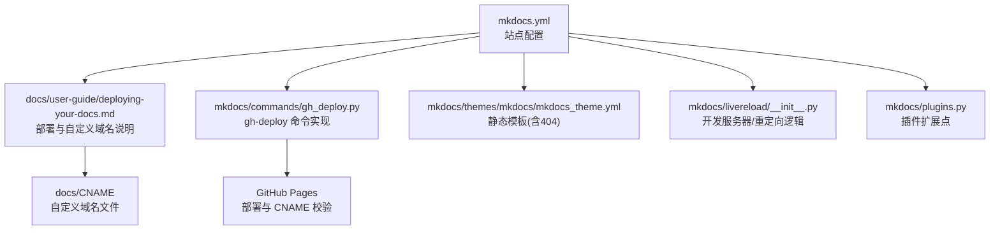
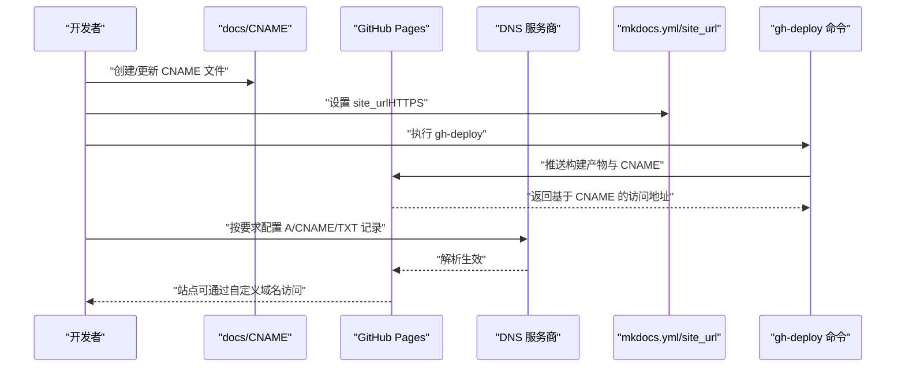
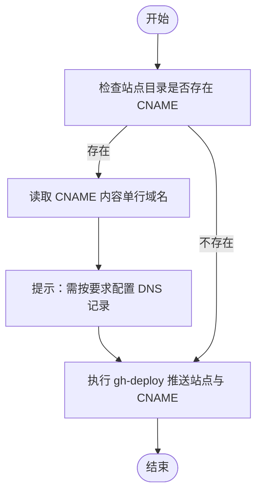
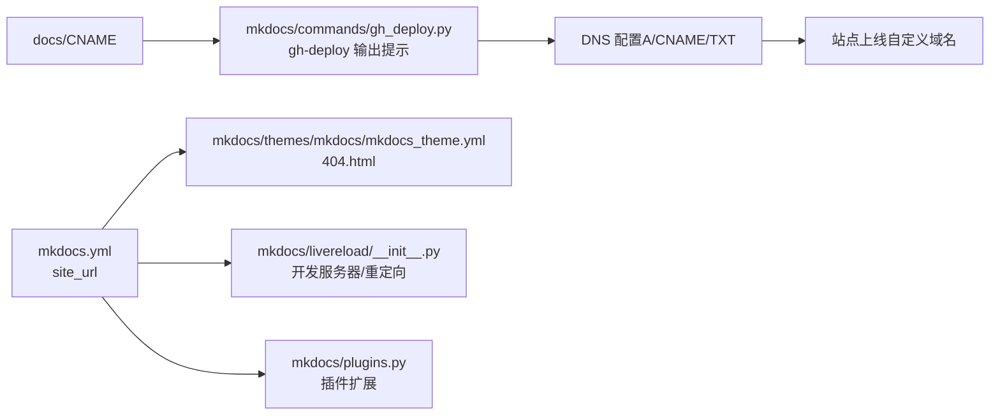

# 自定义域名与 SSL

<cite>
**本文引用的文件**
- [docs/CNAME](file://docs/CNAME)
- [docs/user-guide/deploying-your-docs.md](file://docs/user-guide/deploying-your-docs.md)
- [mkdocs.yml](file://mkdocs.yml)
- [mkdocs/commands/gh_deploy.py](file://mkdocs/commands/gh_deploy.py)
- [docs/user-guide/configuration.md](file://docs/user-guide/configuration.md)
- [mkdocs/themes/mkdocs/mkdocs_theme.yml](file://mkdocs/themes/mkdocs/mkdocs_theme.yml)
- [mkdocs/livereload/__init__.py](file://mkdocs/livereload/__init__.py)
- [mkdocs/plugins.py](file://mkdocs/plugins.py)
</cite>

## 目录
1. [简介](#简介)
2. [项目结构](#项目结构)
3. [核心组件](#核心组件)
4. [架构总览](#架构总览)
5. [详细组件分析](#详细组件分析)
6. [依赖关系分析](#依赖关系分析)
7. [性能考量](#性能考量)
8. [故障排查指南](#故障排查指南)
9. [结论](#结论)
10. [附录](#附录)

## 简介
本指南面向希望为 MkDocs 文档站点配置“自定义域名 + SSL 证书”的读者，覆盖以下关键目标：
- 创建与配置 CNAME 文件以启用自定义域名
- 配置 DNS 记录（A、CNAME、TXT），确保域名解析正确
- 在不同托管与服务场景下申请与部署 SSL 证书（Let’s Encrypt、Cloudflare、阿里云）
- 实现 HTTPS 强制跳转与安全响应头设置建议
- 验证域名所有权与常见 DNS 解析问题排查
- 证书自动续期与监控最佳实践

本仓库提供了官方文档与部署命令实现，可作为配置与验证的依据。

## 项目结构
围绕“自定义域名与 SSL”，本仓库中与之直接相关的文件与职责如下：
- docs/CNAME：示例自定义域名文件，用于 GitHub Pages 等平台识别自定义域
- docs/user-guide/deploying-your-docs.md：官方部署文档，包含自定义域名与 CNAME 的说明
- mkdocs.yml：站点配置，包含 site_url 等关键项
- mkdocs/commands/gh_deploy.py：GitHub Pages 部署命令实现，会读取 CNAME 并输出访问提示
- docs/user-guide/configuration.md：配置项说明，含 site_url、edit_uri 等
- mkdocs/themes/mkdocs/mkdocs_theme.yml：主题静态模板清单（含 404.html）
- mkdocs/livereload/__init__.py：开发服务器与重定向逻辑（有助于理解静态站点行为）
- mkdocs/plugins.py：插件系统接口，便于扩展（如重定向、安全头）

图表来源
- [mkdocs.yml](file://mkdocs.yml#L1-L80)
- [docs/user-guide/deploying-your-docs.md](file://docs/user-guide/deploying-your-docs.md#L78-L105)
- [docs/CNAME](file://docs/CNAME#L1-L2)
- [mkdocs/commands/gh_deploy.py](file://mkdocs/commands/gh_deploy.py#L144-L170)
- [mkdocs/themes/mkdocs/mkdocs_theme.yml](file://mkdocs/themes/mkdocs/mkdocs_theme.yml#L3-L5)
- [mkdocs/livereload/__init__.py](file://mkdocs/livereload/__init__.py#L299-L325)
- [mkdocs/plugins.py](file://mkdocs/plugins.py#L58-L200)

章节来源
- [mkdocs.yml](file://mkdocs.yml#L1-L80)
- [docs/user-guide/deploying-your-docs.md](file://docs/user-guide/deploying-your-docs.md#L78-L105)
- [docs/CNAME](file://docs/CNAME#L1-L2)
- [mkdocs/commands/gh_deploy.py](file://mkdocs/commands/gh_deploy.py#L144-L170)
- [mkdocs/themes/mkdocs/mkdocs_theme.yml](file://mkdocs/themes/mkdocs/mkdocs_theme.yml#L3-L5)
- [mkdocs/livereload/__init__.py](file://mkdocs/livereload/__init__.py#L299-L325)
- [mkdocs/plugins.py](file://mkdocs/plugins.py#L58-L200)

## 核心组件
- CNAME 文件与部署命令
  - CNAME 文件位于 docs/CNAME，内容为单行域名（不含协议与路径）
  - gh-deploy 命令在部署时会读取站点目录中的 CNAME 文件，若存在则输出基于该域名的访问提示，并提醒 DNS 配置要求
- 站点 URL 与 Canonical 链接
  - mkdocs.yml 中的 site_url 用于生成页面的 canonical 链接与本地开发挂载路径
- 主题静态模板
  - 主题配置包含 404.html，便于在自定义域名下提供统一的错误页
- 开发服务器与重定向
  - 开发服务器对目录访问进行 302 重定向，有助于理解静态站点在不同路径下的行为
- 插件扩展
  - 可通过插件系统扩展功能（例如重定向、安全头注入等）

章节来源
- [docs/CNAME](file://docs/CNAME#L1-L2)
- [mkdocs/commands/gh_deploy.py](file://mkdocs/commands/gh_deploy.py#L144-L170)
- [mkdocs.yml](file://mkdocs.yml#L1-L80)
- [mkdocs/themes/mkdocs/mkdocs_theme.yml](file://mkdocs/themes/mkdocs/mkdocs_theme.yml#L3-L5)
- [mkdocs/livereload/__init__.py](file://mkdocs/livereload/__init__.py#L299-L325)
- [mkdocs/plugins.py](file://mkdocs/plugins.py#L58-L200)

## 架构总览
下图展示了从“配置自定义域名”到“站点上线”的关键流程，以及与仓库内文件的对应关系：

图表来源
- [docs/CNAME](file://docs/CNAME#L1-L2)
- [docs/user-guide/deploying-your-docs.md](file://docs/user-guide/deploying-your-docs.md#L78-L105)
- [mkdocs/commands/gh_deploy.py](file://mkdocs/commands/gh_deploy.py#L144-L170)
- [mkdocs.yml](file://mkdocs.yml#L1-L80)

## 详细组件分析

### CNAME 文件与 GitHub Pages 集成
- CNAME 文件位置与格式
  - 位于 docs/CNAME，内容为单行域名（不含协议与路径）
- 部署流程要点
  - gh-deploy 命令会在部署时检查站点目录是否存在 CNAME 文件
  - 若存在，会输出基于该域名的访问提示，并提醒 DNS 配置要求
- 官方文档说明
  - 部署文档明确指出：需要在 docs_dir 根部放置 CNAME 文件；若通过网页界面设置自定义域，需将其复制回 docs_dir，避免下次部署被覆盖

图表来源
- [mkdocs/commands/gh_deploy.py](file://mkdocs/commands/gh_deploy.py#L144-L170)
- [docs/user-guide/deploying-your-docs.md](file://docs/user-guide/deploying-your-docs.md#L78-L105)
- [docs/CNAME](file://docs/CNAME#L1-L2)

章节来源
- [docs/CNAME](file://docs/CNAME#L1-L2)
- [docs/user-guide/deploying-your-docs.md](file://docs/user-guide/deploying-your-docs.md#L78-L105)
- [mkdocs/commands/gh_deploy.py](file://mkdocs/commands/gh_deploy.py#L144-L170)

### DNS 记录配置要求（A、CNAME、TXT）
- A 记录
  - 将域名指向托管平台提供的 IP 地址（例如 GitHub Pages 的 IP）
- CNAME 记录
  - 将 www 子域或其他子域指向托管平台分配的 CNAME（如 username.github.io）
- TXT 讝录
  - 用于域名所有权验证（例如 Let’s Encrypt ACME 挑战或邮箱验证）
- 注意事项
  - 不同托管平台的 DNS 要求可能不同，需参考对应平台文档
  - 配置后需等待 DNS 生效（通常几分钟至几小时）

章节来源
- [docs/user-guide/deploying-your-docs.md](file://docs/user-guide/deploying-your-docs.md#L78-L105)

### SSL 证书申请与配置（Let’s Encrypt、Cloudflare、阿里云）
- Let’s Encrypt
  - 通过 ACME 协议自动签发与续期
  - 需要满足域名所有权验证（TXT 或 HTTP 验证）
  - 建议使用自动化工具（如 certbot、acme.sh）配合定时任务实现自动续期
- Cloudflare
  - 提供免费 DV 证书，可自动签发与续期
  - 建议开启 SSL/TLS 完全/严格模式，并启用 HTTP->HTTPS 强制跳转
  - 使用自有域名时，需将域名解析托管到 Cloudflare，并按其指引配置
- 阿里云
  - 通过阿里云 SSL 证书服务申请免费/付费证书
  - 支持上传 CSR 或在线生成，自动部署到负载均衡/CDN
  - 建议结合 CDN 启用 HTTPS 强制跳转与安全响应头
- 通用建议
  - 优先使用托管平台提供的免费证书（如 GitHub Pages + Cloudflare）
  - 对于自有服务器，建议使用自动化工具与监控告警

章节来源
- [docs/user-guide/deploying-your-docs.md](file://docs/user-guide/deploying-your-docs.md#L78-L105)

### HTTPS 强制跳转与安全头设置
- HTTPS 强制跳转
  - 托管平台（如 Cloudflare）可配置规则将 HTTP 请求重定向至 HTTPS
  - 自建服务器可借助 Nginx/Apache 规则实现
- 安全响应头
  - 建议设置 HSTS、X-Frame-Options、X-Content-Type-Options、Referrer-Policy 等
  - 通过托管平台的安全策略或自定义中间件注入
- MkDocs 侧注意事项
  - site_url 必须使用 HTTPS，以生成正确的 canonical 链接
  - 主题静态模板包含 404.html，可在自定义域名下提供一致的错误页体验

章节来源
- [mkdocs.yml](file://mkdocs.yml#L1-L80)
- [mkdocs/themes/mkdocs/mkdocs_theme.yml](file://mkdocs/themes/mkdocs/mkdocs_theme.yml#L3-L5)

### 验证域名所有权与 DNS 解析问题排查
- 验证步骤
  - 使用 nslookup/dig 查询 A/CNAME/TXT 记录是否正确
  - 使用在线工具（如 DNS Checker）跨地域验证解析
  - 通过托管平台控制台查看 CNAME 是否生效
- 常见问题
  - DNS 缓存未刷新：等待 TTL 过期或手动清理缓存
  - 记录冲突：检查是否存在重复或错误的记录
  - 根域与 www 域名：确保两者均配置正确
  - 证书链问题：确认中间证书已正确安装

章节来源
- [docs/user-guide/deploying-your-docs.md](file://docs/user-guide/deploying-your-docs.md#L78-L105)

### 证书自动续期与监控最佳实践
- 自动续期
  - 使用 cron 或计划任务定期运行证书续期脚本
  - 结合 webhook 或通知系统在失败时告警
- 监控
  - 监控证书到期时间与域名解析状态
  - 建立健康检查与错误日志收集机制
- 与 MkDocs 的关系
  - 证书与 DNS 配置完成后，站点即可通过 HTTPS 正常访问
  - site_url 与主题模板确保页面链接与错误页的一致性

章节来源
- [mkdocs.yml](file://mkdocs.yml#L1-L80)
- [mkdocs/themes/mkdocs/mkdocs_theme.yml](file://mkdocs/themes/mkdocs/mkdocs_theme.yml#L3-L5)

## 依赖关系分析
- 配置依赖
  - site_url 影响页面的 canonical 链接与本地开发挂载路径
  - CNAME 文件决定部署后自定义域名的可用性
- 命令依赖
  - gh-deploy 依赖 CNAME 文件的存在与否，决定输出提示与后续 DNS 配置提醒
- 主题依赖
  - 主题静态模板包含 404.html，影响自定义域名下的错误页一致性
- 开发服务器依赖
  - 目录访问的 302 重定向有助于理解静态站点路径行为

图表来源
- [mkdocs.yml](file://mkdocs.yml#L1-L80)
- [docs/CNAME](file://docs/CNAME#L1-L2)
- [mkdocs/commands/gh_deploy.py](file://mkdocs/commands/gh_deploy.py#L144-L170)
- [mkdocs/themes/mkdocs/mkdocs_theme.yml](file://mkdocs/themes/mkdocs/mkdocs_theme.yml#L3-L5)
- [mkdocs/livereload/__init__.py](file://mkdocs/livereload/__init__.py#L299-L325)
- [mkdocs/plugins.py](file://mkdocs/plugins.py#L58-L200)

章节来源
- [mkdocs.yml](file://mkdocs.yml#L1-L80)
- [docs/CNAME](file://docs/CNAME#L1-L2)
- [mkdocs/commands/gh_deploy.py](file://mkdocs/commands/gh_deploy.py#L144-L170)
- [mkdocs/themes/mkdocs/mkdocs_theme.yml](file://mkdocs/themes/mkdocs/mkdocs_theme.yml#L3-L5)
- [mkdocs/livereload/__init__.py](file://mkdocs/livereload/__init__.py#L299-L325)
- [mkdocs/plugins.py](file://mkdocs/plugins.py#L58-L200)

## 性能考量
- DNS 解析延迟
  - 选择就近的 DNS 服务商，减少解析时延
- 证书链长度
  - 优先使用较短的证书链，减少握手开销
- 静态资源优化
  - 利用 CDN 加速，合理设置缓存策略
- 本地开发
  - 开发服务器的重定向与热更新有助于提升迭代效率

## 故障排查指南
- CNAME 未生效
  - 确认 CNAME 文件存在于 docs_dir，并已在 gh-deploy 之前复制到站点构建目录
  - 检查托管平台是否识别 CNAME
- DNS 未解析
  - 使用 nslookup/dig 验证 A/CNAME/TXT 记录
  - 等待 DNS 生效（考虑 TTL）
- HTTPS 访问异常
  - 确认证书已签发且未过期
  - 检查托管平台的 SSL/TLS 设置（如强制 HTTPS）
- 页面链接不一致
  - 确保 site_url 使用 HTTPS
  - 检查主题模板中的静态文件路径

章节来源
- [docs/user-guide/deploying-your-docs.md](file://docs/user-guide/deploying-your-docs.md#L78-L105)
- [mkdocs/commands/gh_deploy.py](file://mkdocs/commands/gh_deploy.py#L144-L170)
- [mkdocs.yml](file://mkdocs.yml#L1-L80)
- [mkdocs/livereload/__init__.py](file://mkdocs/livereload/__init__.py#L299-L325)

## 结论
通过本仓库提供的 CNAME 示例、部署文档与配置项，可以系统地完成“自定义域名 + SSL”的配置。建议优先采用托管平台提供的免费证书与 DNS 管理能力，结合自动化续期与监控，确保站点稳定、安全地对外提供服务。

## 附录
- 相关配置项参考
  - site_url：用于生成 canonical 链接与本地开发挂载路径
  - edit_uri / edit_uri_template：编辑链接配置（与域名无关，但影响页面链接一致性）
- 插件扩展
  - 可通过插件系统实现重定向、安全头注入等功能（参见插件基类与事件模型）

章节来源
- [docs/user-guide/configuration.md](file://docs/user-guide/configuration.md#L29-L132)
- [mkdocs/plugins.py](file://mkdocs/plugins.py#L58-L200)