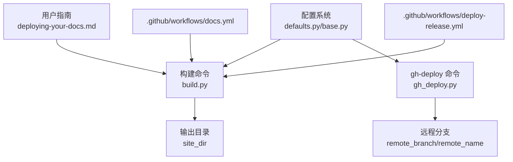
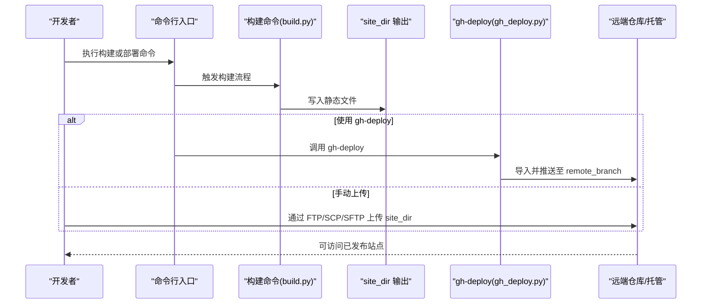
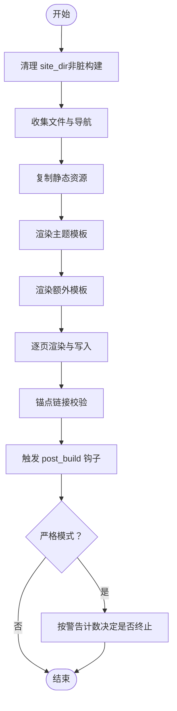
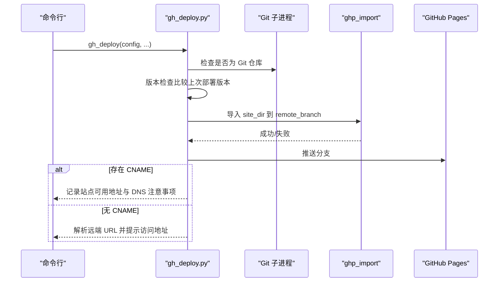
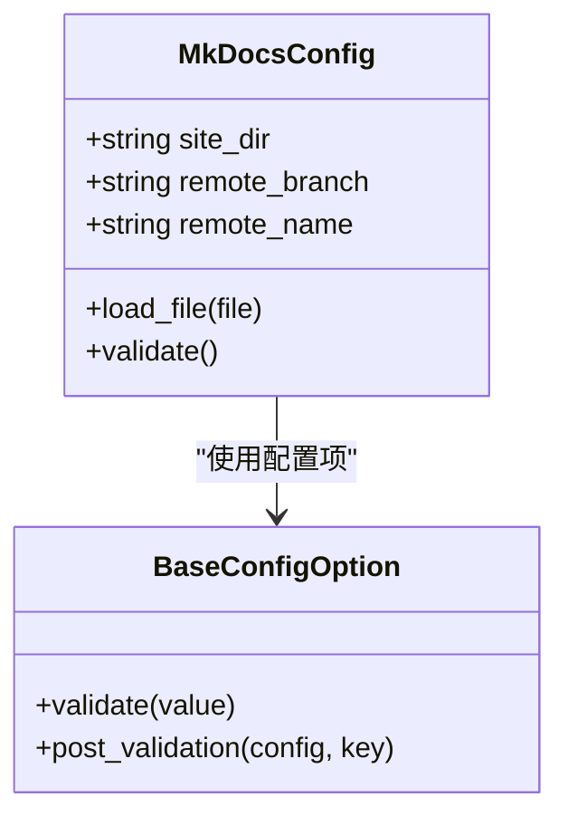
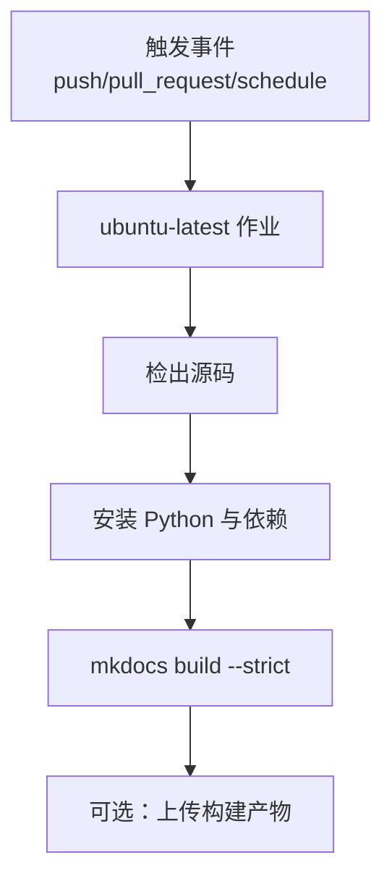
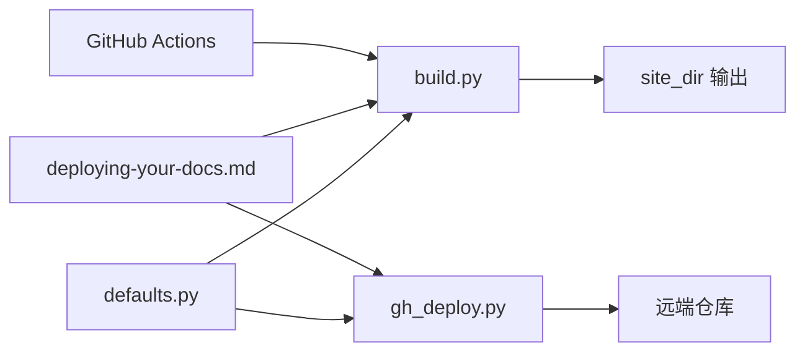

# 部署与发布

<cite>
**本文引用的文件**
- [docs/user-guide/deploying-your-docs.md](file://docs/user-guide/deploying-your-docs.md)
- [mkdocs/commands/gh_deploy.py](file://mkdocs/commands/gh_deploy.py)
- [mkdocs/commands/build.py](file://mkdocs/commands/build.py)
- [mkdocs/config/defaults.py](file://mkdocs/config/defaults.py)
- [mkdocs/config/base.py](file://mkdocs/config/base.py)
- [.github/workflows/docs.yml](file://.github/workflows/docs.yml)
- [.github/workflows/deploy-release.yml](file://.github/workflows/deploy-release.yml)
- [mkdocs/utils/cache.py](file://mkdocs/utils/cache.py)
</cite>

## 目录
1. [简介](#简介)
2. [项目结构](#项目结构)
3. [核心组件](#核心组件)
4. [架构总览](#架构总览)
5. [详细组件分析](#详细组件分析)
6. [依赖关系分析](#依赖关系分析)
7. [性能考虑](#性能考虑)
8. [故障排查指南](#故障排查指南)
9. [结论](#结论)
10. [附录](#附录)

## 简介
本指南面向使用 MkDocs 的团队与个人，系统讲解如何在多种平台上完成站点构建与发布，覆盖 GitHub Pages、Read the Docs、静态托管（FTP/SCP/SFTP）、本地分发以及自定义域名与 SSL 配置。同时提供 CI/CD 最佳实践、部署前准备、部署后验证、失败处理与回滚策略，以及性能优化与 CDN 建议。

## 项目结构
围绕“部署与发布”的关键文件与职责如下：
- 用户文档：用户指南中的部署章节，提供平台部署步骤与注意事项
- 构建命令：负责生成静态站点到 site_dir
- GitHub Pages 部署命令：封装 gh-deploy 流程，调用外部工具提交到远端分支
- 配置系统：提供 site_dir、remote_branch、remote_name 等部署相关配置项
- 工作流：仓库内已有的 GitHub Actions 示例，可用于文档构建与发布

**图表来源**
- [docs/user-guide/deploying-your-docs.md](file://docs/user-guide/deploying-your-docs.md#L1-L224)
- [mkdocs/commands/build.py](file://mkdocs/commands/build.py#L249-L370)
- [mkdocs/commands/gh_deploy.py](file://mkdocs/commands/gh_deploy.py#L100-L170)
- [mkdocs/config/defaults.py](file://mkdocs/config/defaults.py#L38-L219)
- [.github/workflows/docs.yml](file://.github/workflows/docs.yml#L1-L21)

**章节来源**
- [docs/user-guide/deploying-your-docs.md](file://docs/user-guide/deploying-your-docs.md#L1-L224)
- [mkdocs/commands/build.py](file://mkdocs/commands/build.py#L249-L370)
- [mkdocs/commands/gh_deploy.py](file://mkdocs/commands/gh_deploy.py#L100-L170)
- [mkdocs/config/defaults.py](file://mkdocs/config/defaults.py#L38-L219)
- [.github/workflows/docs.yml](file://.github/workflows/docs.yml#L1-L21)

## 核心组件
- 构建命令：执行全量构建，清理旧产物，写入 site_dir，并触发插件事件
- gh-deploy 命令：校验当前是否为 Git 仓库、版本检查、调用外部导入工具提交到指定远端分支
- 配置系统：提供 site_dir、remote_branch、remote_name 等部署相关配置项
- 用户指南：提供各平台部署步骤、自定义域名与 404 页面说明

**章节来源**
- [mkdocs/commands/build.py](file://mkdocs/commands/build.py#L249-L370)
- [mkdocs/commands/gh_deploy.py](file://mkdocs/commands/gh_deploy.py#L100-L170)
- [mkdocs/config/defaults.py](file://mkdocs/config/defaults.py#L144-L148)
- [docs/user-guide/deploying-your-docs.md](file://docs/user-guide/deploying-your-docs.md#L1-L224)

## 架构总览
MkDocs 的部署由“构建 → 提交/上传 → 发布”三段式组成。构建阶段由 build 命令负责；发布阶段可选择内置 gh-deploy 或手动上传至任意静态托管。

**图表来源**
- [mkdocs/commands/build.py](file://mkdocs/commands/build.py#L249-L370)
- [mkdocs/commands/gh_deploy.py](file://mkdocs/commands/gh_deploy.py#L100-L170)

## 详细组件分析

### 组件一：构建流程（build）
- 清理与初始化：在非脏构建模式下清理 site_dir，打印构建信息
- 数据收集：扫描文档、主题模板、额外模板，生成导航
- 页面渲染：逐页读取、渲染、写入目标路径
- 插件钩子：贯穿 pre_build、nav、page、post_build 等阶段
- 错误处理：严格模式下根据警告计数终止

**图表来源**
- [mkdocs/commands/build.py](file://mkdocs/commands/build.py#L249-L370)

**章节来源**
- [mkdocs/commands/build.py](file://mkdocs/commands/build.py#L249-L370)

### 组件二：GitHub Pages 部署（gh-deploy）
- 仓库校验：确认当前目录为 Git 仓库
- 版本检查：比较上次部署时的 MkDocs 版本，避免降级部署
- 提交与推送：调用外部导入工具将 site_dir 内容提交到 remote_branch，并推送到远端
- CNAME 处理：若存在 CNAME 文件，记录访问地址并提示 DNS 配置
- 远端 URL 解析：解析 remote 名称对应的 GitHub 地址，给出访问链接

**图表来源**
- [mkdocs/commands/gh_deploy.py](file://mkdocs/commands/gh_deploy.py#L100-L170)

**章节来源**
- [mkdocs/commands/gh_deploy.py](file://mkdocs/commands/gh_deploy.py#L100-L170)

### 组件三：配置系统（defaults/base）
- site_dir：构建输出目录，默认为 site
- remote_branch：gh-deploy 默认提交分支，默认为 gh-pages
- remote_name：gh-deploy 默认远端名称，默认为 origin
- 配置加载与校验：从 mkdocs.yml 加载，执行预/校验/后处理，严格模式下错误即停

**图表来源**
- [mkdocs/config/defaults.py](file://mkdocs/config/defaults.py#L38-L219)
- [mkdocs/config/base.py](file://mkdocs/config/base.py#L37-L243)

**章节来源**
- [mkdocs/config/defaults.py](file://mkdocs/config/defaults.py#L79-L148)
- [mkdocs/config/base.py](file://mkdocs/config/base.py#L181-L243)

### 组件四：用户指南（部署章节）
- GitHub Pages：区分项目页与用户/组织页两种工作流；提供 gh-deploy 命令与自定义域名配置（CNAME 文件）
- Read the Docs：直接对接 Git，自动构建
- 其他托管：通用静态托管上传方式（FTP/SCP/SFTP），将 site_dir 内容上传至服务器根目录
- 本地分发：file:// 方案需注意 site_url、use_directory_urls、search 插件等限制
- 404 页面：构建时生成 404.html，GitHub Pages 在自定义域名下自动生效

**章节来源**
- [docs/user-guide/deploying-your-docs.md](file://docs/user-guide/deploying-your-docs.md#L7-L224)

### 组件五：CI/CD 工作流示例
- 文档构建工作流：拉取源码、安装依赖、以严格模式构建站点
- 发布工作流：基于标签构建并发布到 PyPI（与文档发布不同，但展示了 CI 模板）

**图表来源**
- [.github/workflows/docs.yml](file://.github/workflows/docs.yml#L1-L21)
- [.github/workflows/deploy-release.yml](file://.github/workflows/deploy-release.yml#L1-L22)

**章节来源**
- [.github/workflows/docs.yml](file://.github/workflows/docs.yml#L1-L21)
- [.github/workflows/deploy-release.yml](file://.github/workflows/deploy-release.yml#L1-L22)

## 依赖关系分析
- 构建命令依赖配置系统提供的 site_dir 等参数
- gh-deploy 命令依赖配置系统提供的 remote_branch/remote_name，并调用外部导入工具
- 用户指南提供平台部署步骤与注意事项，指导实际操作
- CI 工作流依赖构建命令与配置文件

**图表来源**
- [mkdocs/config/defaults.py](file://mkdocs/config/defaults.py#L79-L148)
- [mkdocs/commands/build.py](file://mkdocs/commands/build.py#L249-L370)
- [mkdocs/commands/gh_deploy.py](file://mkdocs/commands/gh_deploy.py#L100-L170)
- [docs/user-guide/deploying-your-docs.md](file://docs/user-guide/deploying-your-docs.md#L1-L224)
- [.github/workflows/docs.yml](file://.github/workflows/docs.yml#L1-L21)

**章节来源**
- [mkdocs/config/defaults.py](file://mkdocs/config/defaults.py#L38-L219)
- [mkdocs/commands/build.py](file://mkdocs/commands/build.py#L249-L370)
- [mkdocs/commands/gh_deploy.py](file://mkdocs/commands/gh_deploy.py#L100-L170)
- [docs/user-guide/deploying-your-docs.md](file://docs/user-guide/deploying-your-docs.md#L1-L224)
- [.github/workflows/docs.yml](file://.github/workflows/docs.yml#L1-L21)

## 性能考虑
- 构建性能
  - 使用“脏构建”仅增量更新修改过的页面，适合本地开发预览
  - 合理配置 plugins，避免耗时扩展
  - 将大体积资源外链至 CDN，减少 site_dir 体积
- 传输性能
  - 优先使用带压缩的上传协议（如 SCP 的压缩通道）
  - 对于 GitHub Pages，使用默认分支策略与最小化提交历史
- 缓存与网络
  - 使用缓存下载工具减少重复网络请求（如主题资源）
  - 在 CI 中缓存 Python 依赖与构建缓存目录

**章节来源**
- [mkdocs/commands/build.py](file://mkdocs/commands/build.py#L270-L279)
- [mkdocs/utils/cache.py](file://mkdocs/utils/cache.py#L16-L37)

## 故障排查指南
- 无法识别为 Git 仓库
  - 确认当前目录为 Git 仓库，且 git 已安装并加入 PATH
- 版本降级被阻止
  - 若上一次部署使用了更高版本 MkDocs，不允许使用更低版本再次部署
- CNAME 未生效
  - 确保 CNAME 文件位于 docs_dir，并随构建产物一起提交
  - 按平台要求配置 DNS 记录
- 自定义域名 404 不显示
  - 仅在自定义域名下，GitHub Pages 会自动使用 404.html
- CI 构建失败
  - 使用严格模式构建，关注日志中的警告与错误
  - 确保依赖安装顺序与版本满足要求

**章节来源**
- [mkdocs/commands/gh_deploy.py](file://mkdocs/commands/gh_deploy.py#L23-L34)
- [mkdocs/commands/gh_deploy.py](file://mkdocs/commands/gh_deploy.py#L72-L98)
- [docs/user-guide/deploying-your-docs.md](file://docs/user-guide/deploying-your-docs.md#L78-L95)
- [docs/user-guide/deploying-your-docs.md](file://docs/user-guide/deploying-your-docs.md#L211-L217)
- [.github/workflows/docs.yml](file://.github/workflows/docs.yml#L18-L20)

## 结论
通过构建命令与 gh-deploy 命令的配合，结合配置系统的灵活参数与用户指南的平台指引，MkDocs 能够在 GitHub Pages、Read the Docs、静态托管与本地分发等多种场景下高效完成文档发布。配合 CI/CD 工作流与严格的构建流程，可进一步提升发布可靠性与一致性。

## 附录

### A. 平台部署要点速览
- GitHub Pages
  - 使用 gh-deploy 命令，提交到 remote_branch（默认 gh-pages）
  - 自定义域名需在 docs_dir 放置 CNAME 文件，并配置 DNS
- Read the Docs
  - 直接对接 Git 仓库，自动构建
- 静态托管（FTP/SCP/SFTP）
  - 构建完成后将 site_dir 内容上传至服务器根目录
- 本地分发（file://）
  - 设置 site_url 为空字符串，关闭 use_directory_urls，禁用 search 插件或改用兼容方案

**章节来源**
- [docs/user-guide/deploying-your-docs.md](file://docs/user-guide/deploying-your-docs.md#L7-L224)

### B. CI/CD 最佳实践
- 在 PR 与主分支上均运行构建任务，确保变更可被验证
- 使用严格模式构建，尽早暴露问题
- 对于 GitHub Pages，可在 CI 中直接执行 gh-deploy，或在工件中产出 site_dir 供下游发布任务使用

**章节来源**
- [.github/workflows/docs.yml](file://.github/workflows/docs.yml#L1-L21)