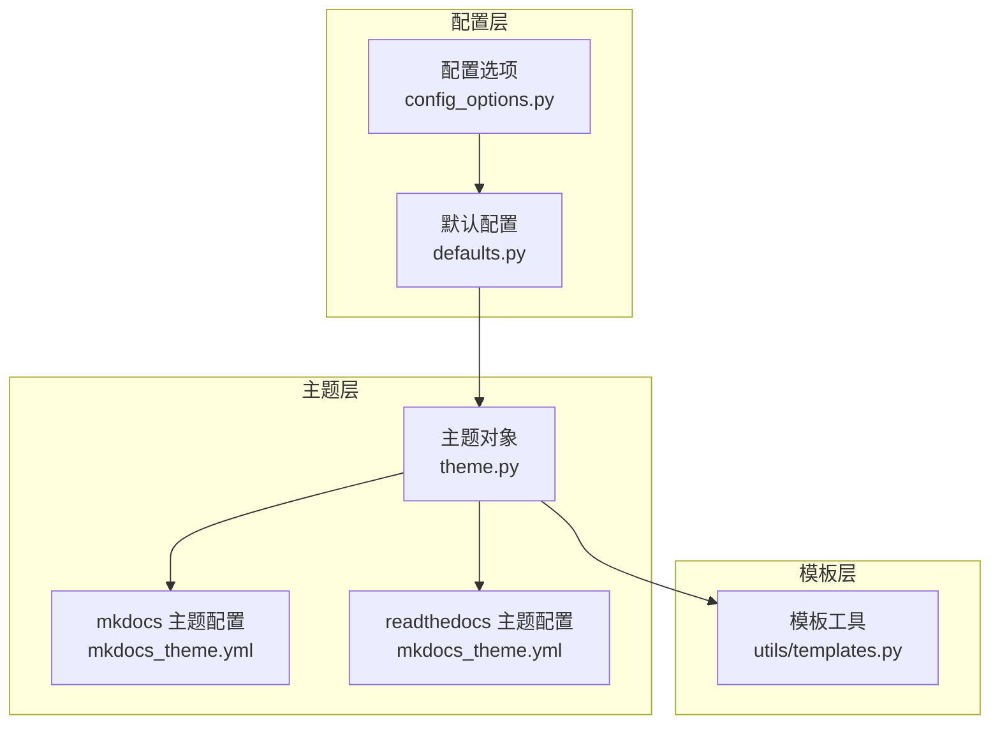
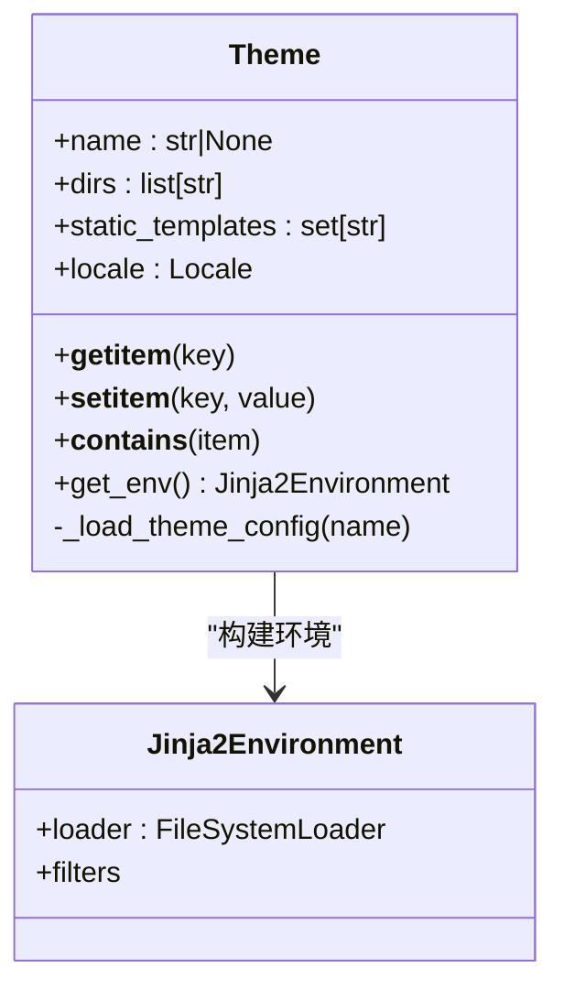
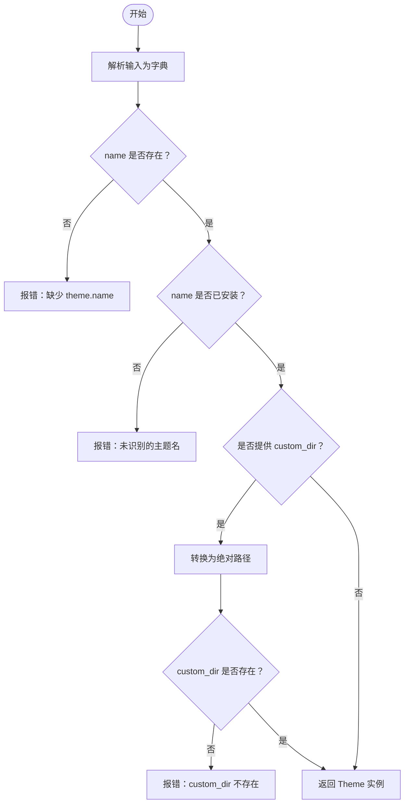
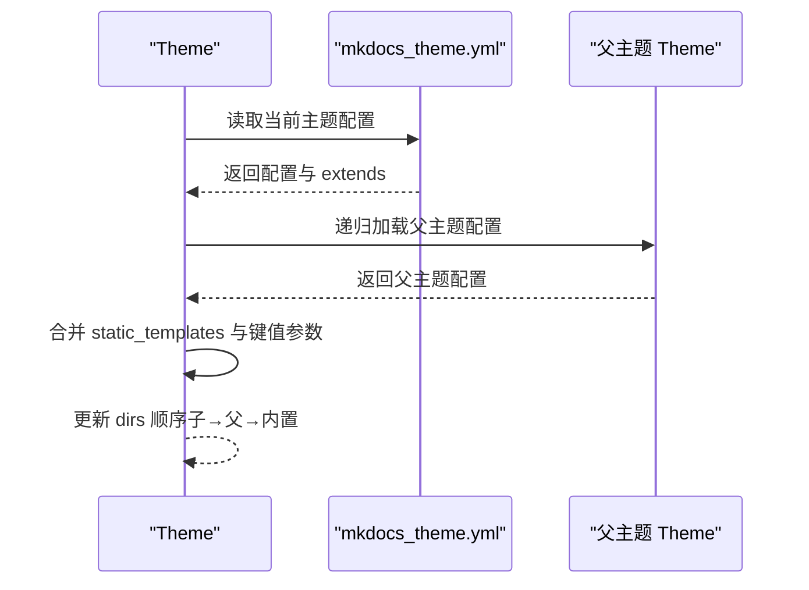
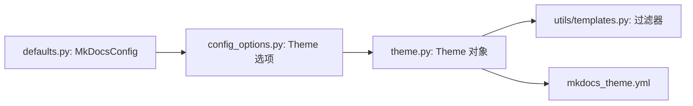

# 主题配置

<cite>
**本文引用的文件列表**
- [mkdocs/theme.py](file://mkdocs/theme.py)
- [mkdocs/config/config_options.py](file://mkdocs/config/config_options.py)
- [mkdocs/config/defaults.py](file://mkdocs/config/defaults.py)
- [mkdocs/utils/templates.py](file://mkdocs/utils/templates.py)
- [mkdocs/themes/mkdocs/mkdocs_theme.yml](file://mkdocs/themes/mkdocs/mkdocs_theme.yml)
- [mkdocs/themes/readthedocs/mkdocs_theme.yml](file://mkdocs/themes/readthedocs/mkdocs_theme.yml)
- [docs/user-guide/configuration.md](file://docs/user-guide/configuration.md)
- [docs/user-guide/customizing-your-theme.md](file://docs/user-guide/customizing-your-theme.md)
- [docs/dev-guide/themes.md](file://docs/dev-guide/themes.md)
- [mkdocs/tests/theme_tests.py](file://mkdocs/tests/theme_tests.py)
- [mkdocs/tests/config/config_options_tests.py](file://mkdocs/tests/config/config_options_tests.py)
- [mkdocs/tests/config/config_options_legacy_tests.py](file://mkdocs/tests/config/config_options_legacy_tests.py)
</cite>

## 目录
1. [简介](#简介)
2. [项目结构与定位](#项目结构与定位)
3. [核心组件](#核心组件)
4. [架构总览](#架构总览)
5. [详细组件解析](#详细组件解析)
6. [依赖关系分析](#依赖关系分析)
7. [性能与可维护性考量](#性能与可维护性考量)
8. [故障排查与调试](#故障排查与调试)
9. [结论](#结论)
10. [附录：常用配置清单与示例路径](#附录常用配置清单与示例路径)

## 简介
本篇文档聚焦 MkDocs 的“主题配置系统”，系统性阐述 theme 配置项的设置方法、可用主题选择、主题特定参数、额外资源（CSS/JS/模板）注入、主题继承与覆盖机制、配置验证与调试技巧，以及如何配置自定义主题与传递主题参数。内容基于源码与官方文档，配合测试用例与图示，帮助读者从入门到进阶掌握主题配置。

## 项目结构与定位
- 主题对象与环境构建位于主题模块，负责加载主题配置、解析继承链、合并用户配置、构建 Jinja2 环境。
- 配置选项与默认配置位于配置模块，统一校验 theme、extra_css、extra_javascript、extra_templates 等顶层配置。
- 主题的特定参数由各主题的配置文件提供，如 mkdocs 与 readthedocs 主题的 mkdocs_theme.yml。
- 模板工具提供脚本标签过滤器等能力，支撑 extra_javascript 的属性渲染。



图表来源
- [mkdocs/config/config_options.py](file://mkdocs/config/config_options.py#L816-L883)
- [mkdocs/config/defaults.py](file://mkdocs/config/defaults.py#L73-L130)
- [mkdocs/theme.py](file://mkdocs/theme.py#L23-L167)
- [mkdocs/utils/templates.py](file://mkdocs/utils/templates.py#L25-L56)

章节来源
- [mkdocs/config/defaults.py](file://mkdocs/config/defaults.py#L73-L130)
- [mkdocs/config/config_options.py](file://mkdocs/config/config_options.py#L816-L883)
- [mkdocs/theme.py](file://mkdocs/theme.py#L23-L167)

## 核心组件
- 主题对象 Theme：封装 theme 配置、目录搜索顺序、静态模板集合、语言本地化、Jinja2 环境构建。
- 配置选项 Theme：校验 theme 的 name/custom_dir/static_templates/locale 等输入，解析已安装主题列表，处理自定义目录绝对路径与存在性检查。
- 默认配置 MkDocsConfig：定义顶层 theme、extra_css、extra_javascript、extra_templates 等配置项及其默认值。
- 模板工具：提供 url 过滤器与 script_tag 过滤器，用于 extra_javascript 的属性渲染。

章节来源
- [mkdocs/theme.py](file://mkdocs/theme.py#L23-L167)
- [mkdocs/config/config_options.py](file://mkdocs/config/config_options.py#L816-L883)
- [mkdocs/config/defaults.py](file://mkdocs/config/defaults.py#L73-L130)
- [mkdocs/utils/templates.py](file://mkdocs/utils/templates.py#L25-L56)

## 架构总览
主题配置在配置阶段完成校验与归一化，在构建阶段由主题对象加载主题配置文件、解析继承链，并通过 Jinja2 环境渲染模板。extra_css/extra_javascript/extra_templates 作为顶层配置，分别通过默认配置与模板工具参与页面上下文与渲染。

```mermaid
sequenceDiagram
participant U as "用户配置"
participant CFG as "MkDocsConfig"
participant OPT as "Theme 配置选项"
participant THEME as "Theme 对象"
participant ENV as "Jinja2 环境"
participant TPL as "模板工具"
U->>CFG : 提交 theme/extra_* 配置
CFG->>OPT : 校验 theme.name/custom_dir/locale
OPT-->>THEME : 实例化 Theme(name, custom_dir, static_templates, locale, ...)
THEME->>THEME : 加载 mkdocs_theme.yml 并解析 extends
THEME->>ENV : 构建 FileSystemLoader(dirs)
ENV->>TPL : 注册 url/script_tag 过滤器
ENV-->>CFG : 返回可用的模板环境
CFG-->>U : 验证通过，进入构建流程
```

图表来源
- [mkdocs/config/defaults.py](file://mkdocs/config/defaults.py#L73-L130)
- [mkdocs/config/config_options.py](file://mkdocs/config/config_options.py#L816-L883)
- [mkdocs/theme.py](file://mkdocs/theme.py#L124-L167)
- [mkdocs/utils/templates.py](file://mkdocs/utils/templates.py#L43-L56)

## 详细组件解析

### 主题对象 Theme
- 职责
  - 解析 theme 配置：name、custom_dir、static_templates、locale、其他键值参数。
  - 加载主题配置文件并支持继承（extends），递归加载父主题配置。
  - 维护模板搜索目录顺序（优先 custom_dir，再父主题，最后内置模板）。
  - 构建 Jinja2 环境，注册 url 与 script_tag 过滤器，安装翻译。
- 关键行为
  - 目录顺序：custom_dir → 父主题 → 内置模板目录。
  - 静态模板：内置 404.html 与 sitemap.xml，可叠加 static_templates。
  - 语言：locale 解析为本地化对象，影响翻译安装。
  - 环境：禁用自动重载，避免构建中编辑模板导致问题。



图表来源
- [mkdocs/theme.py](file://mkdocs/theme.py#L23-L167)

章节来源
- [mkdocs/theme.py](file://mkdocs/theme.py#L23-L167)

### 配置选项 Theme（校验与归一化）
- 输入形态
  - 字符串：仅 theme.name。
  - 字典：必须包含 name；可包含 custom_dir、static_templates、locale 等。
- 校验规则
  - 已安装主题名检查。
  - 至少需要 name 或 custom_dir。
  - custom_dir 必须存在且为绝对路径（相对 config_file_path 自动转绝对）。
  - locale 必须为字符串。
- 输出
  - 返回 Theme 实例，供后续构建使用。



图表来源
- [mkdocs/config/config_options.py](file://mkdocs/config/config_options.py#L816-L883)

章节来源
- [mkdocs/config/config_options.py](file://mkdocs/config/config_options.py#L816-L883)
- [mkdocs/tests/config/config_options_tests.py](file://mkdocs/tests/config/config_options_tests.py#L1144-L1283)
- [mkdocs/tests/config/config_options_legacy_tests.py](file://mkdocs/tests/config/config_options_legacy_tests.py#L936-L1066)

### 默认配置与顶层主题参数
- theme：默认值为 mkdocs，类型为 Theme（即上述配置选项）。
- extra_css：顶层 CSS 列表，默认空。
- extra_javascript：顶层 JS 列表，支持类型、异步/延迟等属性（1.5+ 新特性）。
- extra_templates：顶层模板列表，按全局上下文渲染。
- 其他主题特定参数：由各主题的 mkdocs_theme.yml 定义，例如导航深度、高亮样式、快捷键、分析配置等。

章节来源
- [mkdocs/config/defaults.py](file://mkdocs/config/defaults.py#L73-L130)
- [docs/user-guide/configuration.md](file://docs/user-guide/configuration.md#L577-L614)

### 主题特定配置参数与示例
- mkdocs 主题
  - static_templates、locale、include_search_page、search_index_only、highlightjs、hljs_languages/style/style_dark、navigation_depth、nav_style、color_mode、user_color_mode_toggle、analytics.gtag、shortcuts。
- readthedocs 主题
  - static_templates、locale、include_search_page、search_index_only、highlightjs、hljs_languages/style、analytics.gtag/anonymize_ip、include_homepage_in_sidebar、prev_next_buttons_location、navigation_depth、titles_only、sticky_navigation、collapse_navigation、logo。

章节来源
- [mkdocs/themes/mkdocs/mkdocs_theme.yml](file://mkdocs/themes/mkdocs/mkdocs_theme.yml#L1-L29)
- [mkdocs/themes/readthedocs/mkdocs_theme.yml](file://mkdocs/themes/readthedocs/mkdocs_theme.yml#L1-L26)

### 额外资源：extra_css、extra_javascript、extra_templates
- extra_css
  - 顶层 CSS 文件列表（相对 docs_dir），由主题在模板中链接。
- extra_javascript
  - 顶层 JS 文件列表，支持类型、异步/延迟等属性；推荐使用 script_tag 过滤器渲染。
- extra_templates
  - 顶层模板（HTML/XML）按全局上下文渲染，适合生成站点地图、RSS 等。

章节来源
- [mkdocs/config/defaults.py](file://mkdocs/config/defaults.py#L123-L130)
- [docs/user-guide/configuration.md](file://docs/user-guide/configuration.md#L577-L614)
- [mkdocs/utils/templates.py](file://mkdocs/utils/templates.py#L43-L56)

### 主题继承与覆盖机制
- 继承声明
  - 在主题配置文件中通过 extends 指定父主题名称。
- 加载顺序
  - 子主题 → 父主题 → 内置模板目录。
- 合并与覆盖
  - static_templates 叠加；其他键值参数以子主题为准覆盖父主题。
- 测试验证
  - 测试覆盖了继承链加载、static_templates 合并、目录顺序正确性等。



图表来源
- [mkdocs/theme.py](file://mkdocs/theme.py#L124-L157)
- [mkdocs/tests/theme_tests.py](file://mkdocs/tests/theme_tests.py#L88-L126)

章节来源
- [mkdocs/theme.py](file://mkdocs/theme.py#L124-L157)
- [mkdocs/tests/theme_tests.py](file://mkdocs/tests/theme_tests.py#L88-L126)

### 自定义主题与主题参数传递
- 使用 custom_dir
  - 当 theme.name 为已安装主题时，custom_dir 用于覆盖父主题同名文件；需与父主题目录结构一致。
  - 当 theme.name 为 null 时，custom_dir 作为完整独立主题使用。
- 参数传递
  - 除 name/custom_dir 外的键值参数会直接写入 Theme 对象，供模板访问。
- 开发指南
  - 参考开发者指南了解最小化主题要求、模板与媒体文件组织方式。

章节来源
- [docs/user-guide/customizing-your-theme.md](file://docs/user-guide/customizing-your-theme.md#L47-L101)
- [docs/dev-guide/themes.md](file://docs/dev-guide/themes.md#L22-L48)

## 依赖关系分析
- 配置层依赖
  - defaults.py 定义顶层 schema，其中 theme 为 Theme 类型。
  - config_options.py 的 Theme 选项负责校验与实例化 Theme。
- 主题层依赖
  - theme.py 依赖 utils 获取主题目录、缓存清理、国际化安装。
  - theme.py 依赖 utils.templates 提供的过滤器。
- 模板层依赖
  - utils/templates.py 依赖 normalize_url 与 Markup，提供 url 与 script_tag 过滤器。



图表来源
- [mkdocs/config/defaults.py](file://mkdocs/config/defaults.py#L73-L130)
- [mkdocs/config/config_options.py](file://mkdocs/config/config_options.py#L816-L883)
- [mkdocs/theme.py](file://mkdocs/theme.py#L23-L167)
- [mkdocs/utils/templates.py](file://mkdocs/utils/templates.py#L25-L56)

章节来源
- [mkdocs/config/defaults.py](file://mkdocs/config/defaults.py#L73-L130)
- [mkdocs/config/config_options.py](file://mkdocs/config/config_options.py#L816-L883)
- [mkdocs/theme.py](file://mkdocs/theme.py#L23-L167)
- [mkdocs/utils/templates.py](file://mkdocs/utils/templates.py#L25-L56)

## 性能与可维护性考量
- 模板环境禁用自动重载：避免构建过程中频繁扫描模板导致性能问题。
- 目录顺序优化：优先 custom_dir 与父主题，减少不必要的文件查找。
- 配置校验前置：在配置阶段尽早发现错误，降低构建失败成本。
- 主题继承链：合理拆分公共配置与差异化配置，提升复用性与可维护性。

[本节为通用建议，不直接分析具体文件]

## 故障排查与调试
- 常见错误与定位
  - 未识别的主题名：确认已安装主题列表与拼写。
  - 缺少 name 或 custom_dir：至少提供其一。
  - custom_dir 不存在或非绝对路径：确保路径存在且为绝对路径。
  - locale 类型错误：locale 必须为字符串。
- 验证与日志
  - 配置加载后会输出警告与错误信息；严格模式下任何警告也会终止构建。
  - 主题配置文件缺失或为空：会触发相应提示或回退默认行为。
- 单元测试参考
  - 测试覆盖了主题配置的各种边界情况与错误场景，可作为排障对照。

章节来源
- [mkdocs/config/config_options.py](file://mkdocs/config/config_options.py#L816-L883)
- [mkdocs/tests/config/config_options_tests.py](file://mkdocs/tests/config/config_options_tests.py#L1144-L1283)
- [mkdocs/tests/config/config_options_legacy_tests.py](file://mkdocs/tests/config/config_options_legacy_tests.py#L936-L1066)
- [mkdocs/tests/theme_tests.py](file://mkdocs/tests/theme_tests.py#L16-L126)

## 结论
MkDocs 的主题配置系统通过“配置选项校验 + 主题对象加载 + Jinja2 环境构建”的分层设计，实现了灵活的主题选择、继承与覆盖、额外资源注入与本地化支持。遵循本文档的配置方法与调试技巧，可在保证可维护性的前提下，快速搭建满足需求的主题方案。

[本节为总结，不直接分析具体文件]

## 附录：常用配置清单与示例路径
- 主题选择与基础参数
  - theme.name：选择已安装主题。
  - theme.custom_dir：自定义主题目录（覆盖/独立）。
  - theme.static_templates：静态模板集合。
  - theme.locale：语言代码。
- 主题特定参数（示例）
  - mkdocs：导航深度、高亮样式、快捷键、分析配置等。
  - readthedocs：导航深度、侧边栏行为、Logo 等。
- 额外资源
  - extra_css：顶层 CSS 列表。
  - extra_javascript：顶层 JS 列表（支持类型、异步/延迟等属性）。
  - extra_templates：顶层模板列表。
- 示例与文档路径
  - 主题配置校验与错误消息：参见配置选项测试。
  - 自定义主题与覆盖机制：参见自定义主题指南与主题测试。
  - 主题特定参数：参见各主题的 mkdocs_theme.yml。

章节来源
- [docs/user-guide/configuration.md](file://docs/user-guide/configuration.md#L577-L614)
- [docs/user-guide/customizing-your-theme.md](file://docs/user-guide/customizing-your-theme.md#L47-L101)
- [docs/dev-guide/themes.md](file://docs/dev-guide/themes.md#L22-L48)
- [mkdocs/themes/mkdocs/mkdocs_theme.yml](file://mkdocs/themes/mkdocs/mkdocs_theme.yml#L1-L29)
- [mkdocs/themes/readthedocs/mkdocs_theme.yml](file://mkdocs/themes/readthedocs/mkdocs_theme.yml#L1-L26)
- [mkdocs/tests/config/config_options_tests.py](file://mkdocs/tests/config/config_options_tests.py#L1144-L1283)
- [mkdocs/tests/theme_tests.py](file://mkdocs/tests/theme_tests.py#L16-L126)