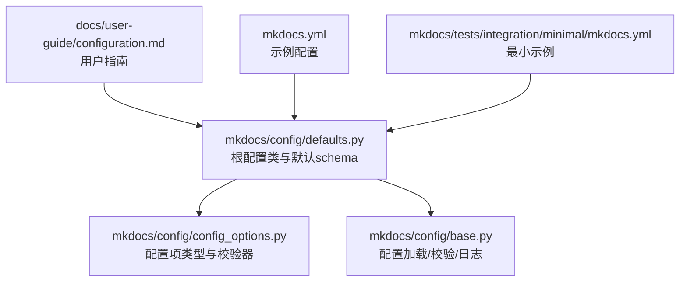
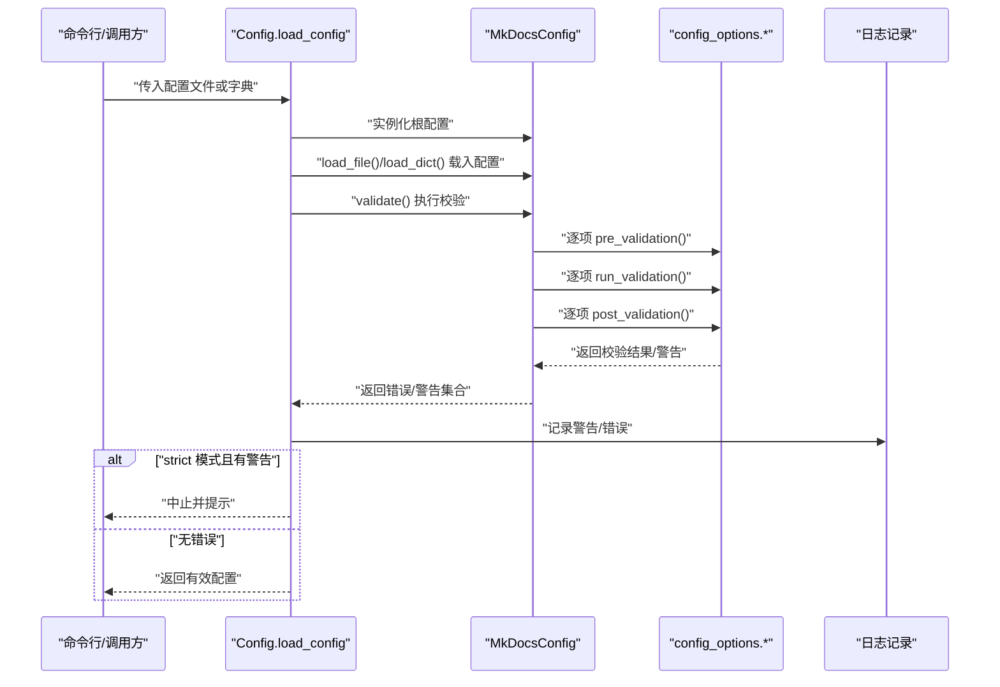
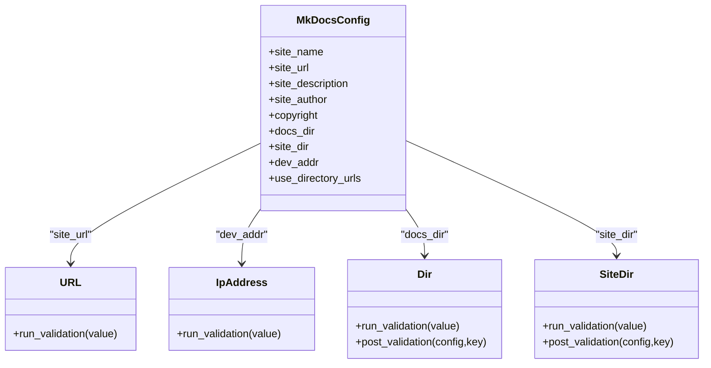

# 基础配置

<cite>
**本文引用的文件列表**
- [mkdocs/config/defaults.py](file://mkdocs/config/defaults.py)
- [mkdocs/config/config_options.py](file://mkdocs/config/config_options.py)
- [mkdocs/config/base.py](file://mkdocs/config/base.py)
- [docs/user-guide/configuration.md](file://docs/user-guide/configuration.md)
- [mkdocs.yml](file://mkdocs.yml)
- [mkdocs/tests/config/config_options_tests.py](file://mkdocs/tests/config/config_options_tests.py)
- [mkdocs/tests/config/config_tests.py](file://mkdocs/tests/config/config_tests.py)
- [mkdocs/tests/integration/minimal/mkdocs.yml](file://mkdocs/tests/integration/minimal/mkdocs.yml)
</cite>

## 目录
1. [简介](#简介)
2. [项目结构与入口](#项目结构与入口)
3. [核心配置项总览](#核心配置项总览)
4. [架构概览](#架构概览)
5. [详细组件解析](#详细组件解析)
6. [依赖关系分析](#依赖关系分析)
7. [性能与最佳实践](#性能与最佳实践)
8. [故障排查指南](#故障排查指南)
9. [结论](#结论)

## 简介
本章节聚焦 MkDocs 的“基础配置”能力，系统梳理站点基本信息（如站点名称、URL、描述、作者等）、文档与输出目录、开发服务器地址、目录化链接风格、版权信息等常用配置项的定义、校验规则与使用场景，并提供可操作的最佳实践与常见问题处理建议。内容基于源码实现与官方用户指南文档进行归纳总结，确保技术细节准确、可追溯。

## 项目结构与入口
- 配置定义与默认值集中在配置模块中：
  - 根配置类与默认 schema 定义：[mkdocs/config/defaults.py](file://mkdocs/config/defaults.py)
  - 配置项类型与校验器：[mkdocs/config/config_options.py](file://mkdocs/config/config_options.py)
  - 配置加载、校验与日志：[mkdocs/config/base.py](file://mkdocs/config/base.py)
- 用户指南文档对配置项进行语义说明与示例：[docs/user-guide/configuration.md](file://docs/user-guide/configuration.md)
- 示例配置文件：
  - 主仓库示例：[mkdocs.yml](file://mkdocs.yml)
  - 测试用最小示例：[mkdocs/tests/integration/minimal/mkdocs.yml](file://mkdocs/tests/integration/minimal/mkdocs.yml)

图表来源
- [mkdocs/config/defaults.py](file://mkdocs/config/defaults.py#L38-L105)
- [mkdocs/config/config_options.py](file://mkdocs/config/config_options.py#L492-L527)
- [mkdocs/config/base.py](file://mkdocs/config/base.py#L340-L392)
- [docs/user-guide/configuration.md](file://docs/user-guide/configuration.md#L1-L14)
- [mkdocs.yml](file://mkdocs.yml#L1-L80)
- [mkdocs/tests/integration/minimal/mkdocs.yml](file://mkdocs/tests/integration/minimal/mkdocs.yml#L1-L7)

章节来源
- [mkdocs/config/defaults.py](file://mkdocs/config/defaults.py#L38-L105)
- [docs/user-guide/configuration.md](file://docs/user-guide/configuration.md#L1-L14)

## 核心配置项总览
以下为“基础配置”中最常用的站点信息与路径/服务配置项，均来自根配置类的 schema 定义与用户指南说明。

- 站点基本信息
  - site_name：站点标题（必填）
  - site_url：站点的规范 URL（用于 canonical 链接与 serve 挂载路径）
  - site_description：站点描述（HTML meta）
  - site_author：作者名（HTML meta）
  - copyright：页脚版权信息
- 文档与输出目录
  - docs_dir：文档源目录（默认 docs）
  - site_dir：构建输出目录（默认 site）
- 开发与链接风格
  - dev_addr：本地开发服务器监听地址（格式 IP:PORT，默认 127.0.0.1:8000）
  - use_directory_urls：是否生成目录化链接（默认 true）

章节来源
- [mkdocs/config/defaults.py](file://mkdocs/config/defaults.py#L44-L83)
- [mkdocs/config/defaults.py](file://mkdocs/config/defaults.py#L96-L104)
- [docs/user-guide/configuration.md](file://docs/user-guide/configuration.md#L17-L143)
- [docs/user-guide/configuration.md](file://docs/user-guide/configuration.md#L546-L562)
- [docs/user-guide/configuration.md](file://docs/user-guide/configuration.md#L723-L731)
- [docs/user-guide/configuration.md](file://docs/user-guide/configuration.md#L675-L712)

## 架构概览
配置系统采用“类即 schema”的设计：根配置类通过类属性声明各配置项，每个配置项由对应的类型校验器负责预校验、运行时校验与后处理。配置加载流程如下：

图表来源
- [mkdocs/config/base.py](file://mkdocs/config/base.py#L340-L392)
- [mkdocs/config/defaults.py](file://mkdocs/config/defaults.py#L205-L214)

章节来源
- [mkdocs/config/base.py](file://mkdocs/config/base.py#L181-L243)
- [mkdocs/config/defaults.py](file://mkdocs/config/defaults.py#L38-L105)

## 详细组件解析

### 站点基本信息
- site_name
  - 类型与默认：字符串；必填项
  - 作用：作为主题上下文变量传递给模板渲染
  - 参考：[mkdocs/config/defaults.py](file://mkdocs/config/defaults.py#L44)
  - 示例：[mkdocs.yml](file://mkdocs.yml#L1)、[mkdocs/tests/integration/minimal/mkdocs.yml](file://mkdocs/tests/integration/minimal/mkdocs.yml#L1)
- site_url
  - 类型与默认：可选 URL（目录化），默认 null
  - 作用：添加 canonical 链接到页面 head；serve 时按 URL 路径挂载
  - 校验：必须包含 scheme 与 netloc；目录化 URL 将自动补全末尾斜杠
  - 参考：[mkdocs/config/defaults.py](file://mkdocs/config/defaults.py#L64)、[mkdocs/config/config_options.py](file://mkdocs/config/config_options.py#L492-L527)
  - 示例：[mkdocs.yml](file://mkdocs.yml#L2)
- site_description / site_author
  - 类型与默认：可选字符串
  - 作用：写入 HTML meta 标签
  - 参考：[mkdocs/config/defaults.py](file://mkdocs/config/defaults.py#L67-L71)
  - 示例：[mkdocs.yml](file://mkdocs.yml#L3-L4)、[mkdocs/tests/integration/minimal/mkdocs.yml](file://mkdocs/tests/integration/minimal/mkdocs.yml#L6)
- copyright
  - 类型与默认：可选字符串
  - 作用：页脚版权信息
  - 参考：[mkdocs/config/defaults.py](file://mkdocs/config/defaults.py#L82)
  - 示例：[mkdocs.yml](file://mkdocs.yml#L52)

章节来源
- [mkdocs/config/defaults.py](file://mkdocs/config/defaults.py#L44-L83)
- [mkdocs/config/config_options.py](file://mkdocs/config/config_options.py#L492-L527)
- [docs/user-guide/configuration.md](file://docs/user-guide/configuration.md#L17-L143)
- [mkdocs.yml](file://mkdocs.yml#L1-L80)
- [mkdocs/tests/integration/minimal/mkdocs.yml](file://mkdocs/tests/integration/minimal/mkdocs.yml#L1-L7)

### 文档与输出目录
- docs_dir
  - 类型与默认：目录（存在性检查），默认 docs
  - 作用：文档源目录
  - 校验：绝对路径；不可与配置文件同级父目录
  - 参考：[mkdocs/config/defaults.py](file://mkdocs/config/defaults.py#L76)、[mkdocs/config/config_options.py](file://mkdocs/config/config_options.py#L725-L737)
  - 示例：[mkdocs.yml](file://mkdocs.yml#L1-L80)
- site_dir
  - 类型与默认：目录（存在性检查），默认 site
  - 作用：构建输出目录
  - 校验：与 docs_dir 不互相包含，避免复制回环与重复嵌套
  - 参考：[mkdocs/config/defaults.py](file://mkdocs/config/defaults.py#L79)、[mkdocs/config/config_options.py](file://mkdocs/config/config_options.py#L774-L800)
  - 示例：[mkdocs.yml](file://mkdocs.yml#L1-L80)

章节来源
- [mkdocs/config/defaults.py](file://mkdocs/config/defaults.py#L76-L83)
- [mkdocs/config/config_options.py](file://mkdocs/config/config_options.py#L725-L800)
- [docs/user-guide/configuration.md](file://docs/user-guide/configuration.md#L546-L562)
- [mkdocs.yml](file://mkdocs.yml#L1-L80)

### 开发与链接风格
- dev_addr
  - 类型与默认：IP:PORT 字符串，格式校验
  - 默认值：127.0.0.1:8000
  - 作用：本地开发服务器监听地址
  - 校验：必须是 “IP:PORT” 格式；IP 支持 localhost 或合法 IPv4/IPv6；端口需为整数
  - 参考：[mkdocs/config/defaults.py](file://mkdocs/config/defaults.py#L96)、[mkdocs/config/config_options.py](file://mkdocs/config/config_options.py#L463-L490)
  - 示例：[mkdocs.yml](file://mkdocs.yml#L1-L80)
- use_directory_urls
  - 类型与默认：布尔，true
  - 作用：控制生成目录化链接（/dir/）或文件化链接（/dir.html）
  - 场景：目录化链接更友好；文件化链接适用于无法访问 index.html 的环境
  - 参考：[mkdocs/config/defaults.py](file://mkdocs/config/defaults.py#L99-L104)、[docs/user-guide/configuration.md](file://docs/user-guide/configuration.md#L675-L712)

章节来源
- [mkdocs/config/defaults.py](file://mkdocs/config/defaults.py#L96-L104)
- [mkdocs/config/config_options.py](file://mkdocs/config/config_options.py#L463-L490)
- [docs/user-guide/configuration.md](file://docs/user-guide/configuration.md#L675-L731)

### 配置项类型与校验器
- URL
  - 功能：校验 URL 合法性（必须包含 scheme 与 netloc），可要求目录化 URL
  - 应用：site_url（目录化）、repo_url（非目录化）
  - 参考：[mkdocs/config/config_options.py](file://mkdocs/config/config_options.py#L492-L527)
- IpAddress
  - 功能：校验 IP:PORT 格式，支持 localhost 与 IPv4/IPv6
  - 应用：dev_addr
  - 参考：[mkdocs/config/config_options.py](file://mkdocs/config/config_options.py#L463-L490)
- Dir / DocsDir / SiteDir
  - 功能：目录路径校验，可选择是否存在检查；SiteDir 还会校验与 docs_dir 的互斥关系
  - 应用：docs_dir、site_dir
  - 参考：[mkdocs/config/config_options.py](file://mkdocs/config/config_options.py#L714-L800)
- Type / Optional / Choice
  - 功能：类型约束、可选值、默认值
  - 应用：site_name、site_description、site_author、copyright、use_directory_urls 等
  - 参考：[mkdocs/config/config_options.py](file://mkdocs/config/config_options.py#L323-L382)

章节来源
- [mkdocs/config/config_options.py](file://mkdocs/config/config_options.py#L323-L527)
- [mkdocs/config/config_options.py](file://mkdocs/config/config_options.py#L714-L800)

## 依赖关系分析
- 根配置类 MkDocsConfig 通过类属性声明各配置项，这些属性均为配置项类型对象（如 Type、URL、Dir、IpAddress 等）。配置加载时，Config.validate() 会依次调用每个配置项的 pre_validation/run_validation/post_validation 生命周期钩子，最终完成校验与警告收集。
- URL 与 IpAddress 校验器在运行时抛出 ValidationError，触发配置加载失败；Dir/SiteDir 在 post_validation 中执行额外约束（如互不包含）。
- 用户指南文档与示例配置文件共同提供了配置项的语义与典型用法，便于理解与实践。

图表来源
- [mkdocs/config/defaults.py](file://mkdocs/config/defaults.py#L44-L104)
- [mkdocs/config/config_options.py](file://mkdocs/config/config_options.py#L492-L527)
- [mkdocs/config/config_options.py](file://mkdocs/config/config_options.py#L463-L490)
- [mkdocs/config/config_options.py](file://mkdocs/config/config_options.py#L714-L800)

章节来源
- [mkdocs/config/defaults.py](file://mkdocs/config/defaults.py#L38-L105)
- [mkdocs/config/config_options.py](file://mkdocs/config/config_options.py#L463-L800)

## 性能与最佳实践
- 目录化链接（use_directory_urls=true）通常更利于 SEO 与可读性，适合大多数托管平台；若需直接从文件系统打开页面或某些静态托管不支持 index.html 访问，则应设为 false。
- 将构建输出目录（site_dir）与文档目录（docs_dir）设置为不同层级，避免相互包含，减少不必要的文件复制与构建时间。
- 使用 site_url 时确保其为完整可访问的 URL（含协议与主机），以便搜索引擎正确索引与 serve 正确挂载路径。
- 如需在本地开发时自定义监听地址，使用 dev_addr 并确保 IP 与端口格式正确。
- 在严格模式下（strict），任何警告都会导致构建中止，适合 CI 环境。

[本节为通用建议，无需特定文件引用]

## 故障排查指南
- URL 格式错误
  - 现象：site_url 报错“URL 不合法”
  - 原因：缺少 scheme 或 netloc，或未按目录化要求补全末尾斜杠
  - 处理：确保包含 http(s):// 与域名；目录化 URL 自动补斜杠
  - 参考：[mkdocs/config/config_options.py](file://mkdocs/config/config_options.py#L511-L527)
- dev_addr 格式错误
  - 现象：报错“必须是 IP:PORT 格式”
  - 原因：IP 非 localhost 且不是合法 IPv4/IPv6，或端口非整数
  - 处理：修正为 127.0.0.1:8000 或有效 IP:PORT
  - 参考：[mkdocs/config/config_options.py](file://mkdocs/config/config_options.py#L470-L490)
- docs_dir 与 site_dir 互包含
  - 现象：报错“docs_dir 不应在 site_dir 内”或“site_dir 不应在 docs_dir 内”
  - 原因：二者存在包含关系，可能导致复制回环或重复嵌套
  - 处理：调整为不同层级或不同目录
  - 参考：[mkdocs/config/config_options.py](file://mkdocs/config/config_options.py#L781-L800)
- 配置文件不存在
  - 现象：找不到配置文件
  - 原因：默认 mkdocs.yml 不存在或指定路径错误
  - 处理：确认文件存在或使用 -f/--config-file 指定路径
  - 参考：[mkdocs/config/base.py](file://mkdocs/config/base.py#L290-L338)
- 严格模式下构建失败
  - 现象：出现警告即中止
  - 原因：strict=true 或命令行启用 --strict
  - 处理：修复警告或关闭严格模式
  - 参考：[mkdocs/config/base.py](file://mkdocs/config/base.py#L385-L391)

章节来源
- [mkdocs/config/config_options.py](file://mkdocs/config/config_options.py#L463-L527)
- [mkdocs/config/config_options.py](file://mkdocs/config/config_options.py#L774-L800)
- [mkdocs/config/base.py](file://mkdocs/config/base.py#L290-L338)
- [mkdocs/config/base.py](file://mkdocs/config/base.py#L385-L391)

## 结论
MkDocs 的基础配置以“类即 schema”的方式清晰定义了站点信息、目录与开发服务等关键参数，并通过类型化校验器保障配置合法性。遵循本文档的配置项说明、校验规则与最佳实践，可快速搭建稳定可靠的文档站点；遇到问题时，结合错误信息与本指南的故障排查建议，能够高效定位并解决配置相关问题。