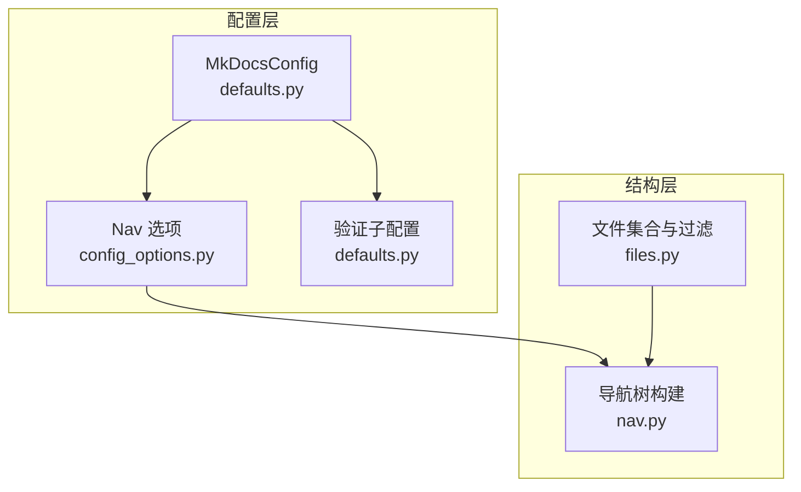
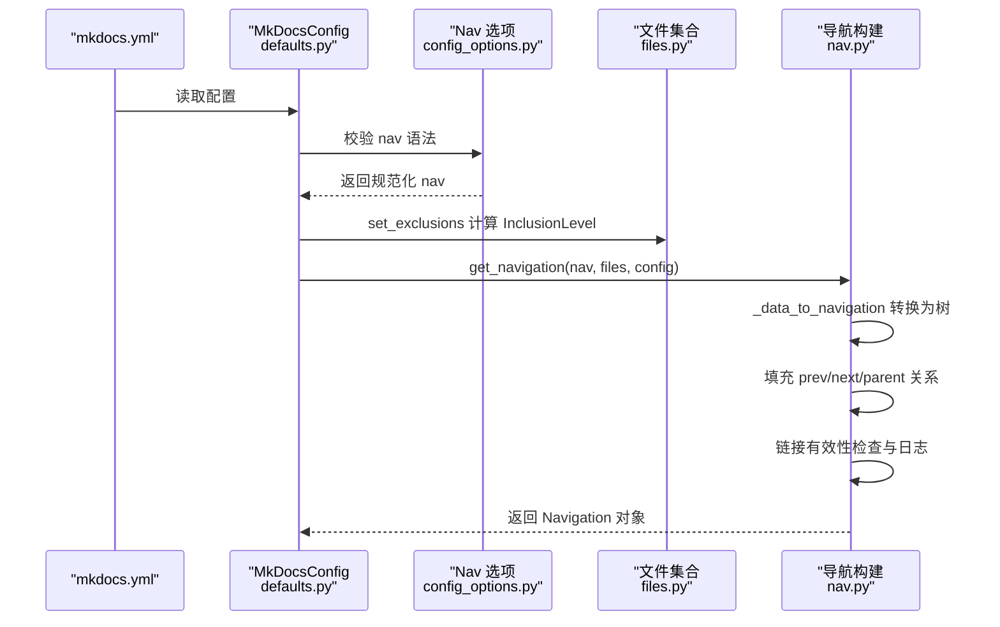
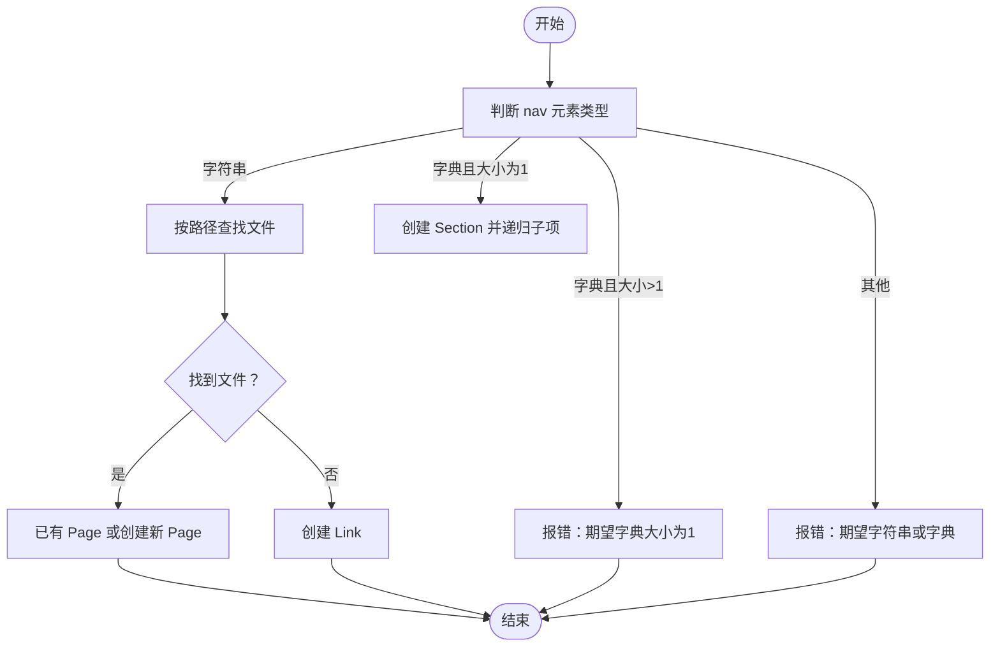
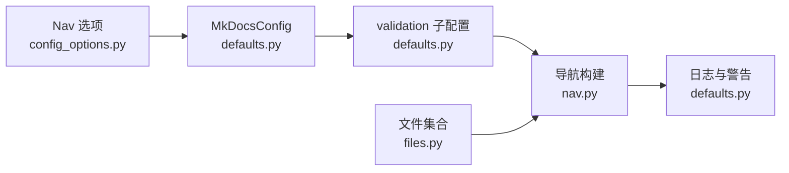

# 导航配置

<cite>
**本文引用的文件**
- [mkdocs/structure/nav.py](file://mkdocs/structure/nav.py)
- [mkdocs/config/config_options.py](file://mkdocs/config/config_options.py)
- [mkdocs/config/defaults.py](file://mkdocs/config/defaults.py)
- [mkdocs/structure/files.py](file://mkdocs/structure/files.py)
- [mkdocs/tests/structure/nav_tests.py](file://mkdocs/tests/structure/nav_tests.py)
- [mkdocs/tests/config/config_options_legacy_tests.py](file://mkdocs/tests/config/config_options_legacy_tests.py)
- [mkdocs/tests/config/config_options_tests.py](file://mkdocs/tests/config/config_options_tests.py)
- [mkdocs.yml](file://mkdocs.yml)
- [docs/user-guide/configuration.md](file://docs/user-guide/configuration.md)
</cite>

## 目录
1. [简介](#简介)
2. [项目结构](#项目结构)
3. [核心组件](#核心组件)
4. [架构总览](#架构总览)
5. [详细组件分析](#详细组件分析)
6. [依赖关系分析](#依赖关系分析)
7. [性能考量](#性能考量)
8. [故障排查指南](#故障排查指南)
9. [结论](#结论)
10. [附录](#附录)

## 简介
本文件系统性阐述 MkDocs 导航（nav）配置的完整语法与结构，覆盖页面列表、嵌套分组、外部链接、以及与 exclude_docs、draft_docs、not_in_nav 的文件过滤交互；同时给出导航验证规则、链接检查配置与复杂多级导航的最佳实践与常见模式。

## 项目结构
导航配置位于配置层与结构层协作完成：
- 配置层负责解析与校验 nav 语法、定义验证级别与过滤策略
- 结构层负责将 nav 配置映射为导航树（Section/Page/Link），并进行链接有效性检查与父子关系建立

图表来源
- [mkdocs/config/defaults.py](file://mkdocs/config/defaults.py#L38-L219)
- [mkdocs/config/config_options.py](file://mkdocs/config/config_options.py#L861-L908)
- [mkdocs/structure/files.py](file://mkdocs/structure/files.py#L527-L544)
- [mkdocs/structure/nav.py](file://mkdocs/structure/nav.py#L130-L185)

章节来源
- [mkdocs/config/defaults.py](file://mkdocs/config/defaults.py#L38-L219)
- [mkdocs/config/config_options.py](file://mkdocs/config/config_options.py#L861-L908)
- [mkdocs/structure/files.py](file://mkdocs/structure/files.py#L527-L544)
- [mkdocs/structure/nav.py](file://mkdocs/structure/nav.py#L130-L185)

## 核心组件
- 导航数据模型
  - Navigation：导航根容器，包含 items（Section/Page/Link 列表）与扁平 pages 列表
  - Section：可嵌套的导航分组，包含 title 与 children
  - Link：外链或相对路径链接，不包含 children
- 导航构建流程
  - 从配置读取 nav 或基于文件推断
  - 将字符串/字典/列表转换为导航树
  - 填充页面间上一页/下一页/父级关系
  - 执行链接有效性检查与日志输出
- 文件过滤与导航联动
  - exclude_docs、draft_docs、not_in_nav 影响哪些文档进入导航与警告
  - set_exclusions 计算每个文件的 InclusionLevel 并影响 is_in_nav/is_included

章节来源
- [mkdocs/structure/nav.py](file://mkdocs/structure/nav.py#L21-L185)
- [mkdocs/structure/files.py](file://mkdocs/structure/files.py#L31-L61)
- [mkdocs/structure/files.py](file://mkdocs/structure/files.py#L527-L544)

## 架构总览
导航配置从 YAML 解析到运行时导航树的端到端流程如下：

图表来源
- [mkdocs/config/defaults.py](file://mkdocs/config/defaults.py#L47-L48)
- [mkdocs/config/config_options.py](file://mkdocs/config/config_options.py#L861-L908)
- [mkdocs/structure/files.py](file://mkdocs/structure/files.py#L527-L544)
- [mkdocs/structure/nav.py](file://mkdocs/structure/nav.py#L130-L185)

## 详细组件分析

### 1) 导航语法与结构
- 顶层 nav 是一个列表，元素可以是：
  - 字符串：表示文档路径（如 index.md）
  - 键值对字典：键为分组标题，值为子列表或单个路径
- 子项支持任意层级嵌套，形成 Section/Page/Link 的树形结构
- 若未显式配置 nav，将根据文档文件按路径自动推断并嵌套

章节来源
- [mkdocs/config/config_options.py](file://mkdocs/config/config_options.py#L861-L908)
- [mkdocs/structure/nav.py](file://mkdocs/structure/nav.py#L130-L137)
- [mkdocs/tests/structure/nav_tests.py](file://mkdocs/tests/structure/nav_tests.py#L15-L37)
- [mkdocs/tests/structure/nav_tests.py](file://mkdocs/tests/structure/nav_tests.py#L201-L297)

### 2) 页面列表与分组导航
- 页面列表：直接以字符串列出文档路径
- 分组导航：使用字典形式，键为分组标题，值为子列表或单个路径
- 支持混合：列表中可混用字符串与字典，实现“首页 + 分组”的组合

章节来源
- [mkdocs.yml](file://mkdocs.yml#L20-L29)
- [mkdocs/tests/structure/nav_tests.py](file://mkdocs/tests/structure/nav_tests.py#L15-L37)
- [mkdocs/tests/structure/nav_tests.py](file://mkdocs/tests/structure/nav_tests.py#L201-L297)

### 3) 外部链接与绝对路径处理
- Link 类型用于外链或绝对路径
- 绝对路径在默认验证级别下会被记录为“可能指向外部资源”
- 可通过 validation.nav.absolute_links 设置为 relative_to_docs，使绝对路径按相对 docs 根路径解析并参与一致性检查

章节来源
- [mkdocs/structure/nav.py](file://mkdocs/structure/nav.py#L164-L185)
- [mkdocs/tests/structure/nav_tests.py](file://mkdocs/tests/structure/nav_tests.py#L105-L171)
- [docs/user-guide/configuration.md](file://docs/user-guide/configuration.md#L462-L482)

### 4) 文件过滤与导航联动
- exclude_docs：排除构建站点的文件，这些文件不会出现在导航中
- draft_docs：草稿文件在 serve 中可用但不会出现在 build 中
- not_in_nav：有意不在导航中的文件，避免触发 omitted_files 警告
- set_exclusions 基于 gitignore 风格模式计算每个文件的 InclusionLevel，并影响 is_in_nav/is_included

章节来源
- [mkdocs/config/defaults.py](file://mkdocs/config/defaults.py#L51-L62)
- [mkdocs/structure/files.py](file://mkdocs/structure/files.py#L527-L544)
- [docs/user-guide/configuration.md](file://docs/user-guide/configuration.md#L300-L399)
- [mkdocs/tests/structure/nav_tests.py](file://mkdocs/tests/structure/nav_tests.py#L419-L447)

### 5) 导航树构建与父子关系
- _data_to_navigation 将 nav 数据递归转换为 Section/Page/Link
- _add_parent_links 为所有子节点设置 parent 指针
- _add_previous_and_next_links 为相邻页面设置 prev/next

图表来源
- [mkdocs/config/config_options.py](file://mkdocs/config/config_options.py#L868-L898)
- [mkdocs/structure/nav.py](file://mkdocs/structure/nav.py#L188-L223)

章节来源
- [mkdocs/structure/nav.py](file://mkdocs/structure/nav.py#L188-L223)
- [mkdocs/tests/config/config_options_legacy_tests.py](file://mkdocs/tests/config/config_options_legacy_tests.py#L1116-L1173)
- [mkdocs/tests/config/config_options_tests.py](file://mkdocs/tests/config/config_options_tests.py#L1349-L1374)

### 6) 验证规则与链接检查
- omitted_files：当文档存在但未出现在 nav 中时发出日志（可通过 not_in_nav 屏蔽）
- not_found：导航引用了不存在的文档路径或被排除的文件
- absolute_links：导航中出现绝对路径时的日志级别控制（支持 relative_to_docs）

章节来源
- [mkdocs/config/defaults.py](file://mkdocs/config/defaults.py#L169-L199)
- [mkdocs/structure/nav.py](file://mkdocs/structure/nav.py#L148-L185)
- [docs/user-guide/configuration.md](file://docs/user-guide/configuration.md#L440-L461)

### 7) 复杂多级导航最佳实践
- 使用分组字典组织内容，键为中文标题，值为子列表
- 在子列表中混合字符串与字典，实现“页面 + 子分组”组合
- 保持路径风格一致，优先使用相对路径；需要跨目录时再考虑绝对路径
- 对草稿与私有文档使用 draft_docs/not_in_nav 区分对待

章节来源
- [mkdocs.yml](file://mkdocs.yml#L20-L29)
- [docs/user-guide/configuration.md](file://docs/user-guide/configuration.md#L363-L389)

## 依赖关系分析
- Nav 选项依赖 MkDocsConfig 的 validation 子配置
- 导航构建依赖文件集合与过滤结果
- 链接检查依赖验证级别与绝对链接处理策略

图表来源
- [mkdocs/config/config_options.py](file://mkdocs/config/config_options.py#L861-L908)
- [mkdocs/config/defaults.py](file://mkdocs/config/defaults.py#L169-L199)
- [mkdocs/structure/files.py](file://mkdocs/structure/files.py#L527-L544)
- [mkdocs/structure/nav.py](file://mkdocs/structure/nav.py#L130-L185)

章节来源
- [mkdocs/config/config_options.py](file://mkdocs/config/config_options.py#L861-L908)
- [mkdocs/config/defaults.py](file://mkdocs/config/defaults.py#L169-L199)
- [mkdocs/structure/files.py](file://mkdocs/structure/files.py#L527-L544)
- [mkdocs/structure/nav.py](file://mkdocs/structure/nav.py#L130-L185)

## 性能考量
- 导航树构建为线性遍历与递归，时间复杂度近似 O(N)，N 为导航项数量
- set_exclusions 使用 pathspec 进行模式匹配，整体开销与文件数成正比
- 建议：
  - 控制 nav 列表长度，避免过深嵌套
  - 合理使用 exclude_docs/draft_docs，减少无效文件参与导航与渲染

## 故障排查指南
- nav 语法错误
  - 报错示例：期望 nav 为列表，得到字典；期望 nav 项为字符串或字典，得到其他类型
  - 定位：config_options.Nav._validate_nav_item
- 引用不存在的文档
  - 日志：not_found 级别警告
  - 定位：nav.py 中对 Link 的检查
- 绝对路径问题
  - 默认会提示“可能指向外部资源”，可设 absolute_links 为 relative_to_docs
  - 定位：nav.py 中对绝对路径的分支逻辑
- 文档未入导航
  - 日志：omitted_files 级别提示
  - 解决：将文件加入 nav，或将文件加入 not_in_nav 以屏蔽警告
  - 定位：defaults.py 中 validation.nav.* 与 nav.py 的日志输出

章节来源
- [mkdocs/tests/config/config_options_legacy_tests.py](file://mkdocs/tests/config/config_options_legacy_tests.py#L1116-L1173)
- [mkdocs/tests/config/config_options_tests.py](file://mkdocs/tests/config/config_options_tests.py#L1349-L1374)
- [mkdocs/structure/nav.py](file://mkdocs/structure/nav.py#L148-L185)
- [mkdocs/config/defaults.py](file://mkdocs/config/defaults.py#L169-L199)
- [docs/user-guide/configuration.md](file://docs/user-guide/configuration.md#L440-L461)

## 结论
MkDocs 的导航配置以简洁的 YAML 列表/字典语法表达复杂的多级结构，结合文件过滤与验证机制，既能满足大型文档站的导航需求，又能通过严格或宽松的验证策略平衡质量与效率。建议在大型项目中采用分组化、层次清晰的 nav 结构，并配合 exclude_docs/draft_docs/not_in_nav 实现“可见性”与“可维护性”的统一管理。

## 附录
- 示例配置参考：mkdocs.yml 中的 nav 与 exclude_docs
- 用户指南：配置项与验证规则详述见用户指南文档

章节来源
- [mkdocs.yml](file://mkdocs.yml#L20-L35)
- [docs/user-guide/configuration.md](file://docs/user-guide/configuration.md#L300-L499)