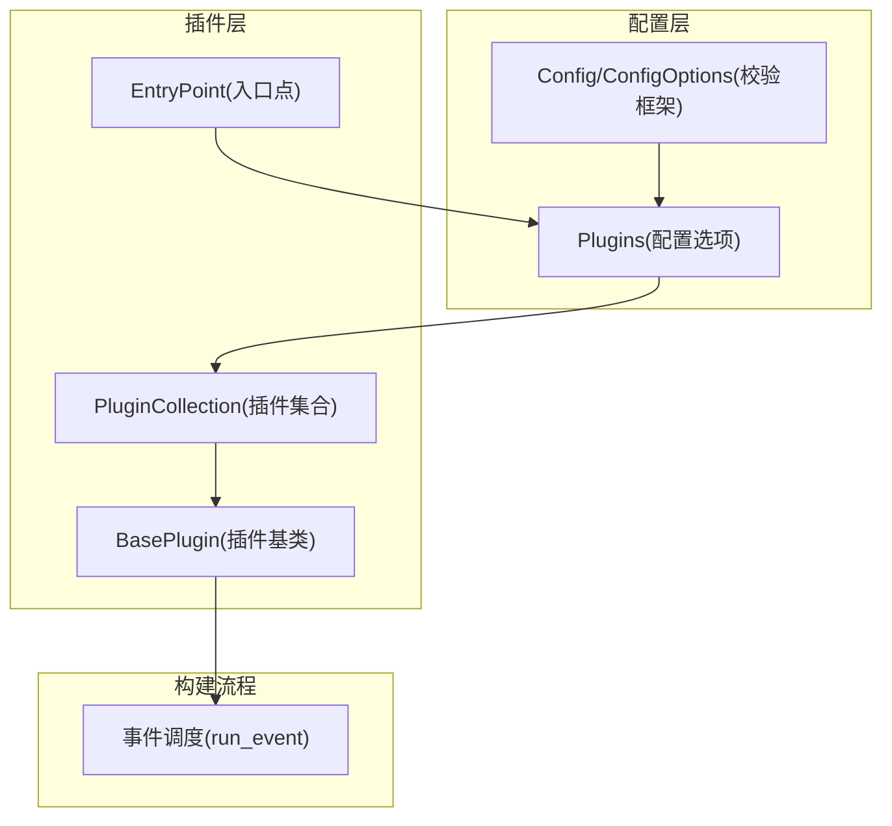
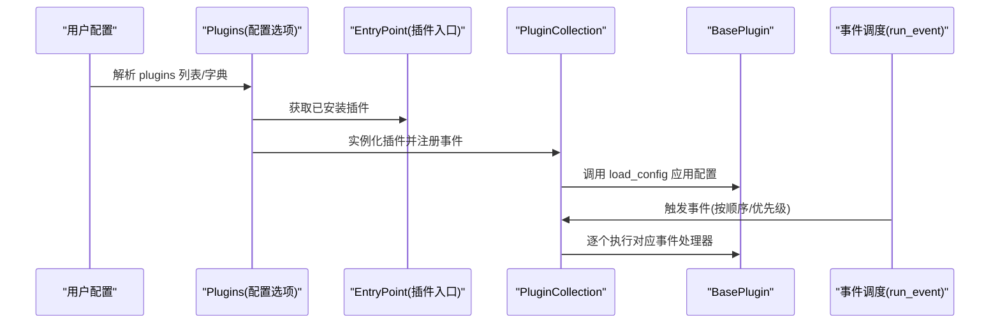
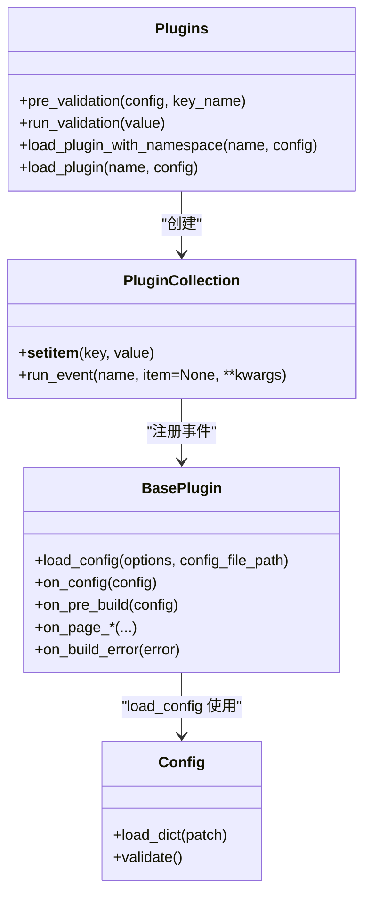

# 插件配置

<cite>
**本文引用的文件**
- [mkdocs/plugins.py](file://mkdocs/plugins.py)
- [mkdocs/config/config_options.py](file://mkdocs/config/config_options.py)
- [mkdocs/config/base.py](file://mkdocs/config/base.py)
- [mkdocs/contrib/search/__init__.py](file://mkdocs/contrib/search/__init__.py)
- [docs/dev-guide/plugins.md](file://docs/dev-guide/plugins.md)
- [docs/user-guide/configuration.md](file://docs/user-guide/configuration.md)
- [mkdocs/tests/plugin_tests.py](file://mkdocs/tests/plugin_tests.py)
- [mkdocs/tests/config/config_options_tests.py](file://mkdocs/tests/config/config_options_tests.py)
</cite>

## 目录
1. [简介](#简介)
2. [项目结构与定位](#项目结构与定位)
3. [核心组件](#核心组件)
4. [架构总览](#架构总览)
5. [详细组件解析](#详细组件解析)
6. [依赖关系分析](#依赖关系分析)
7. [性能与可维护性考量](#性能与可维护性考量)
8. [故障排查指南](#故障排查指南)
9. [结论](#结论)
10. [附录：配置示例与最佳实践](#附录配置示例与最佳实践)

## 简介
本文件系统化梳理 MkDocs 的插件配置系统，围绕 plugins 配置项的语法、启用/禁用、参数传递、优先级与覆盖机制、验证与错误处理、第三方插件配置与最佳实践进行深入说明，并结合源码与测试用例给出可操作的指导。

## 项目结构与定位
- 插件配置由配置选项类负责解析与校验，最终实例化为插件集合；插件集合在构建流程中按事件顺序驱动各插件执行。
- 关键模块：
  - 配置解析与校验：config_options 中的 Plugins 类
  - 插件运行时：plugins 中的 BasePlugin、PluginCollection、事件调度
  - 配置基类与校验框架：config/base 中的 Config、BaseConfigOption
  - 官方插件示例：contrib/search 提供了标准插件的配置与行为参考
  - 文档与用户指南：dev-guide/plugins.md 与 user-guide/configuration.md 提供使用说明

图表来源
- [mkdocs/config/config_options.py](file://mkdocs/config/config_options.py#L1041-L1166)
- [mkdocs/plugins.py](file://mkdocs/plugins.py#L493-L647)
- [mkdocs/config/base.py](file://mkdocs/config/base.py#L37-L243)

章节来源
- [mkdocs/config/config_options.py](file://mkdocs/config/config_options.py#L1041-L1166)
- [mkdocs/plugins.py](file://mkdocs/plugins.py#L493-L647)
- [mkdocs/config/base.py](file://mkdocs/config/base.py#L37-L243)

## 核心组件
- Plugins 配置选项：负责解析 plugins 列表或字典，加载已安装插件，实例化 BasePlugin 子类，应用插件配置并注册事件处理器。
- BasePlugin：定义插件生命周期事件（如 on_config、on_pre_build、on_page_* 等），支持通过 config_scheme 或子类 Config 指定配置模式。
- PluginCollection：维护插件实例与事件映射，按事件类型有序调用各插件处理器。
- 配置校验框架：Config/ConfigOptions 提供类型、默认值、必填、警告与错误等统一校验能力。

章节来源
- [mkdocs/config/config_options.py](file://mkdocs/config/config_options.py#L1041-L1166)
- [mkdocs/plugins.py](file://mkdocs/plugins.py#L58-L647)
- [mkdocs/config/base.py](file://mkdocs/config/base.py#L123-L243)

## 架构总览
下图展示了从配置到插件执行的关键路径：配置解析 -> 插件发现与实例化 -> 事件注册 -> 事件调度。

图表来源
- [mkdocs/config/config_options.py](file://mkdocs/config/config_options.py#L1059-L1166)
- [mkdocs/plugins.py](file://mkdocs/plugins.py#L509-L574)

## 详细组件解析

### 1) Plugins 配置选项与解析
- 支持两种输入形式：
  - 列表：每项为字符串（插件名）或形如 {name: {...}} 的字典（带配置）
  - 字典：键为插件名，值为配置对象（无配置时需显式传空字典 {}）
- 校验规则：
  - 输入必须为列表或字典；否则抛出错误
  - 列表项必须是字符串或仅含一个键的字典；否则抛出错误
  - 字典键必须为字符串；否则抛出错误
  - 插件名必须存在于已安装插件集合；否则抛出错误
  - 插件配置必须为字典；否则抛出错误
- 实例化与命名：
  - 同一插件多次出现会自动追加序号后缀，形成唯一实例名
  - 若插件未声明支持多实例，则重复声明会记录警告
- enabled 选项：
  - 若插件自身不包含 enabled 键，MkDocs 会识别并应用通用 enabled 布尔选项以禁用插件
  - 若 enabled 非布尔值，将报错
- 配置应用与错误传播：
  - 将插件配置交由插件自身的 load_config 进行二次校验
  - 插件返回的警告会被规范化并附加插件前缀
  - 插件返回的错误会被拼接并抛出

章节来源
- [mkdocs/config/config_options.py](file://mkdocs/config/config_options.py#L1059-L1166)
- [mkdocs/tests/config/config_options_tests.py](file://mkdocs/tests/config/config_options_tests.py#L1986-L2305)

### 2) 插件发现与命名空间加载
- 已安装插件通过入口点 group='mkdocs.plugins' 发现
- 当未显式指定命名空间时，可尝试基于当前主题名进行“主题/插件名”的命名空间匹配
- 可通过在插件名前加“/”显式跳过命名空间解析
- 对于首次加载的插件，若其声明了 on_startup/on_shutdown，将被缓存以便 serve 场景复用

章节来源
- [mkdocs/plugins.py](file://mkdocs/plugins.py#L40-L52)
- [mkdocs/config/config_options.py](file://mkdocs/config/config_options.py#L1088-L1103)

### 3) 插件实例化与事件注册
- 插件类必须继承 BasePlugin
- 插件实例加入 PluginCollection 时，会扫描所有以 on_ 开头的方法并注册到对应事件列表
- 事件注册时会根据装饰器设置的优先级排序；未设置优先级的事件默认优先级为 0

章节来源
- [mkdocs/plugins.py](file://mkdocs/plugins.py#L535-L542)
- [mkdocs/plugins.py](file://mkdocs/plugins.py#L509-L531)

### 4) 事件调度与执行顺序
- PluginCollection.run_event 按事件名遍历已注册的处理器
- 处理器按优先级降序执行；同优先级按配置中出现顺序执行
- 处理器可返回新对象或修改传入对象；返回 None 表示保持原对象不变
- 特殊事件 on_page_read_source 仅允许一个处理器，重复注册会发出警告

章节来源
- [mkdocs/plugins.py](file://mkdocs/plugins.py#L551-L574)
- [mkdocs/plugins.py](file://mkdocs/plugins.py#L518-L531)
- [mkdocs/tests/plugin_tests.py](file://mkdocs/tests/plugin_tests.py#L135-L184)

### 5) 配置验证与错误处理
- Config/ConfigOptions 提供统一的预校验、运行时校验、后校验阶段
- 插件配置同样遵循该框架：先由 Plugins 校验插件存在与配置格式，再由插件自身 load_config 校验其 schema
- 错误与警告：
  - 插件配置错误会被拼接为统一消息抛出
  - 插件配置警告会被规范化并附加插件前缀
  - 严格模式下，任何警告也会导致终止

章节来源
- [mkdocs/config/base.py](file://mkdocs/config/base.py#L181-L243)
- [mkdocs/config/config_options.py](file://mkdocs/config/config_options.py#L1151-L1163)

### 6) 官方搜索插件示例
- SearchPlugin 展示了：
  - 使用子 Config 定义插件配置项（如 lang、separator、indexing 等）
  - 在 on_config 中根据主题语言设置默认值
  - 在 on_pre_build 创建索引对象，在 on_post_build 输出索引与语言资源
- 可作为自定义插件配置 schema 的参考模板

章节来源
- [mkdocs/contrib/search/__init__.py](file://mkdocs/contrib/search/__init__.py#L54-L121)

## 依赖关系分析

图表来源
- [mkdocs/config/config_options.py](file://mkdocs/config/config_options.py#L1041-L1166)
- [mkdocs/plugins.py](file://mkdocs/plugins.py#L493-L647)
- [mkdocs/config/base.py](file://mkdocs/config/base.py#L123-L243)

章节来源
- [mkdocs/config/config_options.py](file://mkdocs/config/config_options.py#L1041-L1166)
- [mkdocs/plugins.py](file://mkdocs/plugins.py#L493-L647)
- [mkdocs/config/base.py](file://mkdocs/config/base.py#L123-L243)

## 性能与可维护性考量
- 插件缓存：对声明了启动/关闭事件的插件进行缓存，减少 serve 场景下的重复实例化开销
- 事件优先级：通过优先级控制事件执行顺序，避免不必要的全局重排
- 配置验证分层：先做存在性与格式校验，再做插件内部 schema 校验，降低错误传播成本
- 建议：
  - 尽量使用子 Config 定义插件 schema，获得更强的类型安全与可读性
  - 对需要多实例的插件，明确声明 supports_multiple_instances
  - 合理使用 CombinedEvent 与 event_priority 组合复杂事件链路

章节来源
- [mkdocs/config/config_options.py](file://mkdocs/config/config_options.py#L1131-L1138)
- [mkdocs/plugins.py](file://mkdocs/plugins.py#L426-L457)

## 故障排查指南
- 常见错误与提示
  - “插件未安装”：确认插件已在环境中安装且入口点正确注册
  - “无效的插件配置”：检查 plugins 是否为列表或字典，列表项是否为字符串或单键字典
  - “插件配置非字典”：确保每个插件的配置为字典对象
  - “重复的 on_page_read_source 处理器”：同一事件只允许一个处理器，避免冲突
  - “enabled 非布尔值”：enabled 必须为布尔
- 日志与调试
  - 使用 get_plugin_logger 记录日志，便于区分插件来源
  - 严格模式下，任何警告都会导致构建失败
- 测试参考
  - 单元测试覆盖了插件配置的各种边界情况与错误场景，可作为排障对照

章节来源
- [mkdocs/tests/plugin_tests.py](file://mkdocs/tests/plugin_tests.py#L82-L103)
- [mkdocs/tests/plugin_tests.py](file://mkdocs/tests/plugin_tests.py#L162-L167)
- [mkdocs/tests/plugin_tests.py](file://mkdocs/tests/plugin_tests.py#L267-L329)
- [mkdocs/tests/config/config_options_tests.py](file://mkdocs/tests/config/config_options_tests.py#L2245-L2305)

## 结论
MkDocs 的插件配置系统以 Plugins 配置选项为核心，结合入口点发现、命名空间加载、事件注册与调度，形成了清晰、可扩展且强约束的插件生态。通过 Config/ConfigOptions 的分层校验与 BasePlugin 的事件模型，既保证了易用性，也提供了足够的灵活性与可控性。建议在实际项目中遵循本文的语法与最佳实践，充分利用优先级与多实例能力，合理组织复杂插件组合。

## 附录：配置示例与最佳实践

- 基本语法
  - 列表形式：plugins: [search, your_plugin]
  - 字典形式：plugins: {search: {}, your_plugin: {option1: value}}
  - 禁用默认插件：plugins: [] 或显式列出所需插件
- 参数传递
  - 为插件提供嵌套键值对；注意缩进与冒号
  - 支持布尔、整数、字符串、列表、字典等多种类型
- 启用/禁用
  - 通过 enabled: false 条件性禁用插件（当插件自身未定义 enabled 时）
  - 通过空列表完全禁用所有插件
- 优先级与覆盖
  - 事件按配置中出现顺序执行；可通过 event_priority 控制
  - 同优先级按出现顺序；不同优先级按降序执行
  - 多实例插件会自动追加序号后缀；重复声明会触发警告
- 第三方插件
  - 通过 pip 安装后在配置中启用
  - 查阅插件文档以确定其支持的配置项
- 最佳实践
  - 使用子 Config 明确插件 schema，提升可维护性
  - 对需要多实例的插件声明 supports_multiple_instances
  - 合理拆分插件职责，避免单一插件承担过多功能
  - 使用 get_plugin_logger 输出插件日志，便于问题定位

章节来源
- [docs/dev-guide/plugins.md](file://docs/dev-guide/plugins.md#L24-L56)
- [docs/user-guide/configuration.md](file://docs/user-guide/configuration.md#L880-L946)
- [mkdocs/contrib/search/__init__.py](file://mkdocs/contrib/search/__init__.py#L54-L121)