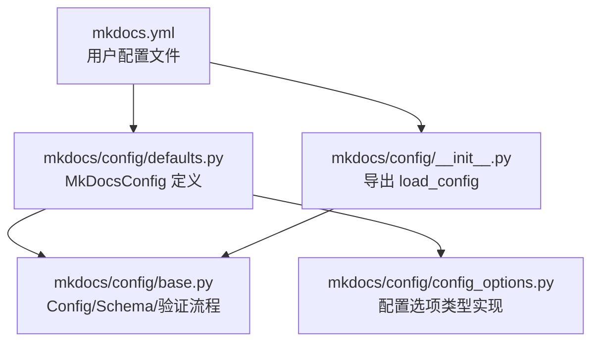
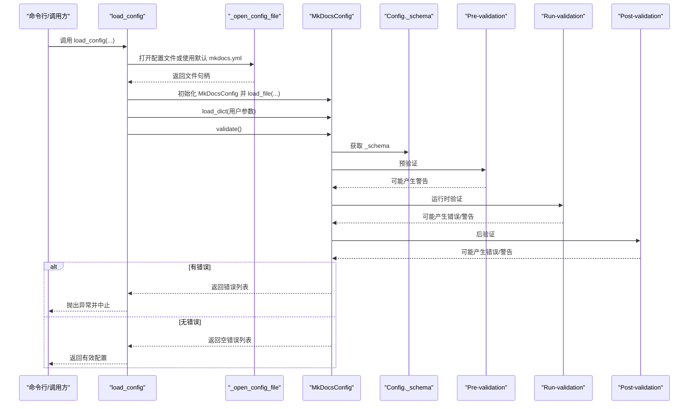
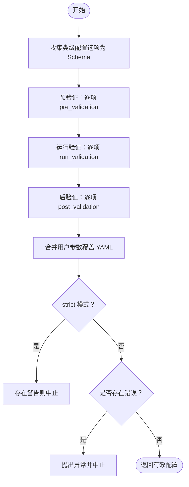
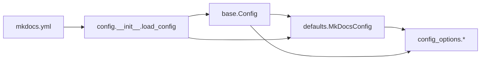

# 配置系统

<cite>
**本文引用的文件**
- [mkdocs/config/base.py](file://mkdocs/config/base.py)
- [mkdocs/config/defaults.py](file://mkdocs/config/defaults.py)
- [mkdocs/config/config_options.py](file://mkdocs/config/config_options.py)
- [mkdocs/config/__init__.py](file://mkdocs/config/__init__.py)
- [mkdocs.yml](file://mkdocs.yml)
- [mkdocs/tests/config/config_tests.py](file://mkdocs/tests/config/config_tests.py)
- [mkdocs/tests/integration/minimal/mkdocs.yml](file://mkdocs/tests/integration/minimal/mkdocs.yml)
- [mkdocs/tests/integration/subpages/mkdocs.yml](file://mkdocs/tests/integration/subpages/mkdocs.yml)
- [mkdocs/tests/integration/complicated_config/mkdocs.yml](file://mkdocs/tests/integration/complicated_config/mkdocs.yml)
- [mkdocs/themes/mkdocs/mkdocs_theme.yml](file://mkdocs/themes/mkdocs/mkdocs_theme.yml)
- [mkdocs/themes/readthedocs/mkdocs_theme.yml](file://mkdocs/themes/readthedocs/mkdocs_theme.yml)
</cite>

## 目录
1. [简介](#简介)
2. [项目结构](#项目结构)
3. [核心组件](#核心组件)
4. [架构总览](#架构总览)
5. [详细组件分析](#详细组件分析)
6. [依赖关系分析](#依赖关系分析)
7. [性能考量](#性能考量)
8. [故障排查指南](#故障排查指南)
9. [结论](#结论)
10. [附录](#附录)

## 简介
本文件系统性梳理 MkDocs 的配置系统，围绕 mkdocs.yml 的完整结构与可用选项展开，覆盖站点配置、主题设置、插件配置、导航配置、路径与目录校验、URL 与编辑链接、SEO 元数据、严格模式与验证级别、以及配置加载与错误处理流程。同时给出配置模板与最佳实践建议，并解释配置继承与覆盖机制。

## 项目结构
MkDocs 的配置系统由三层组成：
- 根配置对象：MkDocsConfig（定义顶层配置项）
- 配置选项类型：config_options（对每类配置进行类型、取值范围、默认值、后处理逻辑的约束）
- 基础框架：base（统一的 Config 对象、Schema 构建、预/运行/后验证、配置文件读取与合并）

**图表来源**
- [mkdocs/config/defaults.py](file://mkdocs/config/defaults.py#L38-L214)
- [mkdocs/config/config_options.py](file://mkdocs/config/config_options.py#L1-L1227)
- [mkdocs/config/base.py](file://mkdocs/config/base.py#L123-L392)
- [mkdocs/config/__init__.py](file://mkdocs/config/__init__.py#L1-L4)

**章节来源**
- [mkdocs/config/defaults.py](file://mkdocs/config/defaults.py#L38-L214)
- [mkdocs/config/config_options.py](file://mkdocs/config/config_options.py#L1-L1227)
- [mkdocs/config/base.py](file://mkdocs/config/base.py#L123-L392)
- [mkdocs/config/__init__.py](file://mkdocs/config/__init__.py#L1-L4)

## 核心组件
- MkDocsConfig：顶层配置对象，声明所有可用配置项及其类型与默认值；负责从 YAML 加载、合并用户传参、执行验证与后处理。
- 配置选项类型：如 Type、Optional、Choice、URL、Dir、File、ListOfItems、DictOfItems、Theme、Nav、MarkdownExtensions、Plugins、Hooks、PathSpec 等，分别对字符串、布尔、列表、字典、路径、URL、导航树、Markdown 扩展、插件集合、钩子脚本、路径模式等进行强约束。
- 基础框架：Config 抽象、BaseConfigOption 抽象、ValidationError 异常、load_config 加载器、_open_config_file 文件打开器。

**章节来源**
- [mkdocs/config/defaults.py](file://mkdocs/config/defaults.py#L38-L214)
- [mkdocs/config/config_options.py](file://mkdocs/config/config_options.py#L323-L1227)
- [mkdocs/config/base.py](file://mkdocs/config/base.py#L37-L392)

## 架构总览
下图展示了配置加载与验证的端到端流程，包括文件读取、Schema 构建、预验证、运行验证、后验证、警告与错误收集、严格模式处理。

**图表来源**
- [mkdocs/config/base.py](file://mkdocs/config/base.py#L340-L392)
- [mkdocs/config/defaults.py](file://mkdocs/config/defaults.py#L205-L214)

**章节来源**
- [mkdocs/config/base.py](file://mkdocs/config/base.py#L340-L392)
- [mkdocs/config/defaults.py](file://mkdocs/config/defaults.py#L205-L214)

## 详细组件分析

### 1) 配置文件与加载入口
- 默认配置文件名：优先尝试 mkdocs.yml 或 mkdocs.yaml。
- 支持传入文件对象、字符串路径或 None（默认）。
- 加载顺序：先加载 YAML 文件，再合并用户传参；随后执行验证，记录警告与错误，严格模式下若存在警告也会中止。

**章节来源**
- [mkdocs/config/base.py](file://mkdocs/config/base.py#L290-L338)
- [mkdocs/config/base.py](file://mkdocs/config/base.py#L340-L392)
- [mkdocs/config/__init__.py](file://mkdocs/config/__init__.py#L1-L4)

### 2) 根配置 MkDocsConfig（顶层配置项）
- 必填项：site_name（未提供时报错）
- 关键配置项概览（非穷举）：
  - 站点信息：site_name、site_url、site_description、site_author、copyright
  - 导航与页面：nav、exclude_docs、draft_docs、not_in_nav
  - 目录与输出：docs_dir、site_dir、use_directory_urls
  - 版本发布：remote_branch、remote_name
  - 主题：theme（名称、自定义目录、本地化、静态模板、变量等）
  - 编辑与仓库：repo_url、repo_name、edit_uri、edit_uri_template
  - 资源注入：extra_css、extra_javascript、extra_templates
  - Markdown 扩展：markdown_extensions、mdx_configs
  - 插件与钩子：plugins、hooks
  - 开发与监控：dev_addr、watch
  - 严格模式与验证：strict、validation.nav.*、validation.links.*
  - 额外数据：extra

**章节来源**
- [mkdocs/config/defaults.py](file://mkdocs/config/defaults.py#L38-L214)
- [mkdocs.yml](file://mkdocs.yml#L1-L80)

### 3) 配置选项类型详解

#### 3.1 基础类型与通用包装
- Type：限定类型与长度（如字符串、整数、元组等），用于大多数标量字段。
- Optional：为任意配置项包裹一层可选，允许 None。
- Choice：限定枚举值集合。
- OptionallyRequired：兼容旧式“可选+默认”语义（已标注软弃用）。

**章节来源**
- [mkdocs/config/config_options.py](file://mkdocs/config/config_options.py#L323-L382)
- [mkdocs/config/config_options.py](file://mkdocs/config/config_options.py#L529-L567)
- [mkdocs/config/config_options.py](file://mkdocs/config/config_options.py#L148-L187)

#### 3.2 路径与目录
- FilesystemObject/Dir/File：基于文件系统路径的校验，支持相对路径解析与存在性检查。
- DocsDir：确保 docs_dir 不是 config 文件父目录，避免构建时回写。
- SiteDir：确保 docs_dir 与 site_dir 不互相包含，防止重复嵌套与清理误删。
- ListOfPaths：列表项必须为存在的文件路径。

**章节来源**
- [mkdocs/config/config_options.py](file://mkdocs/config/config_options.py#L689-L803)

#### 3.3 URL 与地址
- URL：要求包含 scheme 与 netloc，支持 is_dir=True 自动补全结尾斜杠。
- IpAddress：校验“主机:端口”格式，支持 IPv6 方括号与 localhost 规范化。
- Dev 地址：默认 127.0.0.1:8000，支持 IPv6 地址。

**章节来源**
- [mkdocs/config/config_options.py](file://mkdocs/config/config_options.py#L492-L527)
- [mkdocs/config/config_options.py](file://mkdocs/config/config_options.py#L463-L490)
- [mkdocs/config/defaults.py](file://mkdocs/config/defaults.py#L96-L97)

#### 3.4 导航与路径模式
- Nav：递归校验导航树，支持字符串与单键字典组合；空列表在顶层会转为 None。
- PathSpec：基于 gitignore 语法的多行模式串，用于 exclude_docs、draft_docs、not_in_nav。

**章节来源**
- [mkdocs/config/config_options.py](file://mkdocs/config/config_options.py#L861-L908)
- [mkdocs/config/config_options.py](file://mkdocs/config/config_options.py#L1217-L1227)

#### 3.5 主题与静态资源
- Theme：校验主题名称存在性、custom_dir 绝对路径与存在性、locale 类型、生成 theme.Theme 实例。
- ExtraScript/ExtraScriptValue：extra_javascript 支持字符串或带属性的对象（含 type、defer、async）。
- extra_css/extra_templates：列表或字符串，分别注入 CSS 与模板。

**章节来源**
- [mkdocs/config/config_options.py](file://mkdocs/config/config_options.py#L805-L859)
- [mkdocs/config/config_options.py](file://mkdocs/config/config_options.py#L918-L953)
- [mkdocs/config/defaults.py](file://mkdocs/config/defaults.py#L123-L130)

#### 3.6 Markdown 扩展
- MarkdownExtensions：支持列表、字典或混合形式；内置扩展可去重；最终生成扩展名列表并填充 mdx_configs。
- mdx_configs：私有字段，仅由框架填充，供 Markdown 使用。

**章节来源**
- [mkdocs/config/config_options.py](file://mkdocs/config/config_options.py#L955-L1039)
- [mkdocs/config/defaults.py](file://mkdocs/config/defaults.py#L132-L139)

#### 3.7 插件与钩子
- Plugins：支持字符串或键值对；自动解析命名空间（按当前主题前缀扩展）；支持多实例计数与 enabled 控制；加载插件配置并收集警告/错误。
- Hooks：将指定 Python 文件作为模块导入并注册为插件实例。

**章节来源**
- [mkdocs/config/config_options.py](file://mkdocs/config/config_options.py#L1041-L1166)
- [mkdocs/config/config_options.py](file://mkdocs/config/config_options.py#L1168-L1215)

#### 3.8 验证与严格模式
- validation.nav 与 validation.links：细粒度控制导航与链接的警告级别（warn/info/ignore/relative_to_docs）。
- strict：开启后，任何警告都会导致构建中止。

**章节来源**
- [mkdocs/config/defaults.py](file://mkdocs/config/defaults.py#L169-L200)

### 4) 配置继承与覆盖机制
- Schema 构建：类级声明的配置选项被收集为 _schema，保证验证顺序与必填约束。
- 预/运行/后验证：三阶段验证确保跨字段依赖与后处理逻辑正确执行。
- 用户覆盖：load_dict 后的用户参数会覆盖 YAML 中的同名项；严格模式下警告也会中止。
- 子配置传播：PropagatingSubConfig 将顶层设置传播到各子配置（如 validation.*）。

**图表来源**
- [mkdocs/config/base.py](file://mkdocs/config/base.py#L136-L151)
- [mkdocs/config/base.py](file://mkdocs/config/base.py#L181-L243)
- [mkdocs/config/base.py](file://mkdocs/config/base.py#L245-L270)

**章节来源**
- [mkdocs/config/base.py](file://mkdocs/config/base.py#L136-L151)
- [mkdocs/config/base.py](file://mkdocs/config/base.py#L181-L243)
- [mkdocs/config/base.py](file://mkdocs/config/base.py#L245-L270)

### 5) 导航配置（nav）与页面组织
- nav 支持字符串（页面文件）与单键字典（标题到页面/子导航）的嵌套组合。
- 空列表在顶层会被视为 None，表示不生成导航。
- 测试用例覆盖了简单与复杂嵌套导航结构。

**章节来源**
- [mkdocs/config/config_options.py](file://mkdocs/config/config_options.py#L861-L908)
- [mkdocs/tests/integration/minimal/mkdocs.yml](file://mkdocs/tests/integration/minimal/mkdocs.yml#L1-L7)
- [mkdocs/tests/integration/subpages/mkdocs.yml](file://mkdocs/tests/integration/subpages/mkdocs.yml#L1-L2)
- [mkdocs/tests/integration/complicated_config/mkdocs.yml](file://mkdocs/tests/integration/complicated_config/mkdocs.yml#L3-L13)

### 6) 主题设置与本地化
- 主题名称与自定义目录：支持 name 与 custom_dir；校验主题存在性与 custom_dir 可用性。
- 主题默认变量：各主题提供默认配置（如导航深度、高亮样式、快捷键、分析配置等）。
- 本地化：locale 字段需为字符串；主题与用户配置共同决定界面语言。

**章节来源**
- [mkdocs/config/config_options.py](file://mkdocs/config/config_options.py#L805-L859)
- [mkdocs/themes/mkdocs/mkdocs_theme.yml](file://mkdocs/themes/mkdocs/mkdocs_theme.yml#L1-L29)
- [mkdocs/themes/readthedocs/mkdocs_theme.yml](file://mkdocs/themes/readthedocs/mkdocs_theme.yml#L1-L26)
- [mkdocs.yml](file://mkdocs.yml#L9-L19)

### 7) 插件配置与钩子
- 插件支持多种写法：字符串、键值对；自动按当前主题前缀扩展命名空间。
- 多实例检测：同一插件多次声明会发出警告（若插件未声明支持多实例）。
- 钩子：通过 hooks 指定 Python 文件，导入后作为插件实例注册。

**章节来源**
- [mkdocs/config/config_options.py](file://mkdocs/config/config_options.py#L1041-L1166)
- [mkdocs/config/config_options.py](file://mkdocs/config/config_options.py#L1168-L1215)
- [mkdocs.yml](file://mkdocs.yml#L57-L77)

### 8) SEO 与元数据
- site_url：站点根 URL，用于 sitemap、canonical 等。
- site_description/site_author：HTML meta 标签。
- repo_url/repo_name/edit_uri/edit_uri_template：编辑链接生成。
- extra：向模板传递额外变量。

**章节来源**
- [mkdocs/config/defaults.py](file://mkdocs/config/defaults.py#L64-L122)
- [mkdocs.yml](file://mkdocs.yml#L1-L80)

### 9) 高级配置技巧与性能优化
- 使用 strict 模式在 CI 中尽早暴露问题。
- 合理设置 validation.* 级别，平衡日志噪声与质量。
- 将大型资源放入 extra_* 列表，减少模板渲染压力。
- 通过 exclude_docs/draft_docs 控制扫描范围，提升增量构建效率。
- 在开发模式下使用 dev_addr 指定 IPv6 地址以适配本地网络环境。

**章节来源**
- [mkdocs/config/defaults.py](file://mkdocs/config/defaults.py#L140-L142)
- [mkdocs/config/defaults.py](file://mkdocs/config/defaults.py#L169-L200)
- [mkdocs/config/config_options.py](file://mkdocs/config/config_options.py#L463-L490)

## 依赖关系分析
- MkDocsConfig 依赖 config_options 中的各类选项类型完成强约束。
- Config 基类提供统一的验证生命周期与 Schema 收集机制。
- load_config 串联文件打开、YAML 解析、配置合并与验证。

**图表来源**
- [mkdocs/config/defaults.py](file://mkdocs/config/defaults.py#L38-L214)
- [mkdocs/config/config_options.py](file://mkdocs/config/config_options.py#L1-L1227)
- [mkdocs/config/base.py](file://mkdocs/config/base.py#L123-L392)
- [mkdocs/config/__init__.py](file://mkdocs/config/__init__.py#L1-L4)

**章节来源**
- [mkdocs/config/defaults.py](file://mkdocs/config/defaults.py#L38-L214)
- [mkdocs/config/config_options.py](file://mkdocs/config/config_options.py#L1-L1227)
- [mkdocs/config/base.py](file://mkdocs/config/base.py#L123-L392)
- [mkdocs/config/__init__.py](file://mkdocs/config/__init__.py#L1-L4)

## 性能考量
- 验证阶段尽量避免昂贵操作；必要时在 post_validation 中延迟计算。
- MarkdownExtensions 在加载时会尝试注册扩展，应避免无效或冲突扩展。
- SiteDir 与 DocsDir 的相互包含检查可避免深层嵌套与重复复制，减少磁盘 IO。
- 使用 PathSpec 精确排除不需要扫描的文件，缩短构建时间。

**章节来源**
- [mkdocs/config/config_options.py](file://mkdocs/config/config_options.py#L1018-L1033)
- [mkdocs/config/config_options.py](file://mkdocs/config/config_options.py#L781-L802)

## 故障排查指南
- 缺失配置文件：打开文件失败会抛出配置错误。
- 缺少必填项：如 site_name 未提供，验证阶段报错。
- 无效配置类型：如 nav 不是列表、URL 缺少 scheme、插件未安装、Theme 名称不存在等。
- 警告与严格模式：严格模式下任何警告都会中止；可通过降低 validation.* 级别缓解。
- 路径冲突：docs_dir 与 site_dir 互相包含会导致错误；请调整为子目录关系。

**章节来源**
- [mkdocs/tests/config/config_tests.py](file://mkdocs/tests/config/config_tests.py#L17-L29)
- [mkdocs/tests/config/config_tests.py](file://mkdocs/tests/config/config_tests.py#L247-L273)
- [mkdocs/config/base.py](file://mkdocs/config/base.py#L376-L391)

## 结论
MkDocs 的配置系统通过“强类型 + 分层验证 + 明确的覆盖与传播规则”实现了高可靠性与可维护性。遵循本文档的结构说明、最佳实践与排障建议，可在不同规模与场景下高效搭建稳定的文档站点。

## 附录

### A. 配置模板与示例
- 最小化示例：见集成测试中的最小配置。
- 复杂示例：见集成测试中的复杂配置，涵盖导航、主题、资源注入、Markdown 扩展、插件、严格模式等。

**章节来源**
- [mkdocs/tests/integration/minimal/mkdocs.yml](file://mkdocs/tests/integration/minimal/mkdocs.yml#L1-L7)
- [mkdocs/tests/integration/complicated_config/mkdocs.yml](file://mkdocs/tests/integration/complicated_config/mkdocs.yml#L1-L47)

### B. 主题默认变量参考
- mkdocs 主题默认变量：导航深度、高亮样式、颜色模式、快捷键、分析配置等。
- readthedocs 主题默认变量：导航深度、搜索页、高亮样式、分析配置、侧边栏行为等。

**章节来源**
- [mkdocs/themes/mkdocs/mkdocs_theme.yml](file://mkdocs/themes/mkdocs/mkdocs_theme.yml#L1-L29)
- [mkdocs/themes/readthedocs/mkdocs_theme.yml](file://mkdocs/themes/readthedocs/mkdocs_theme.yml#L1-L26)