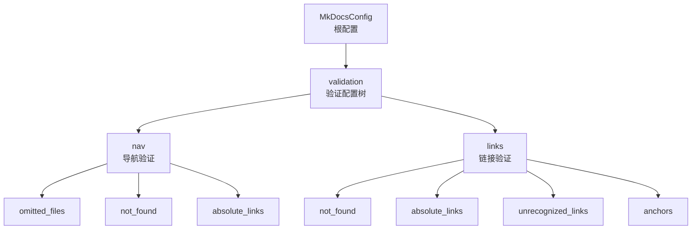
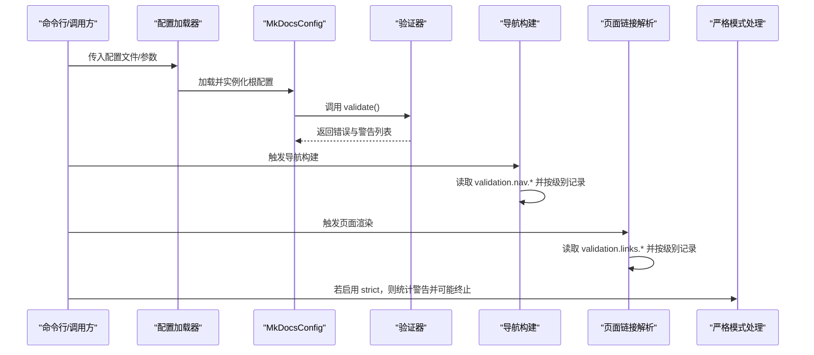
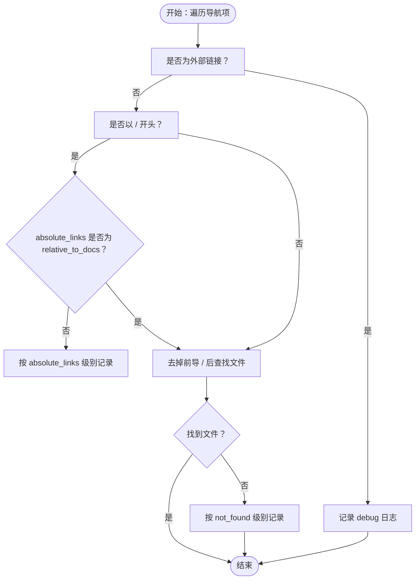
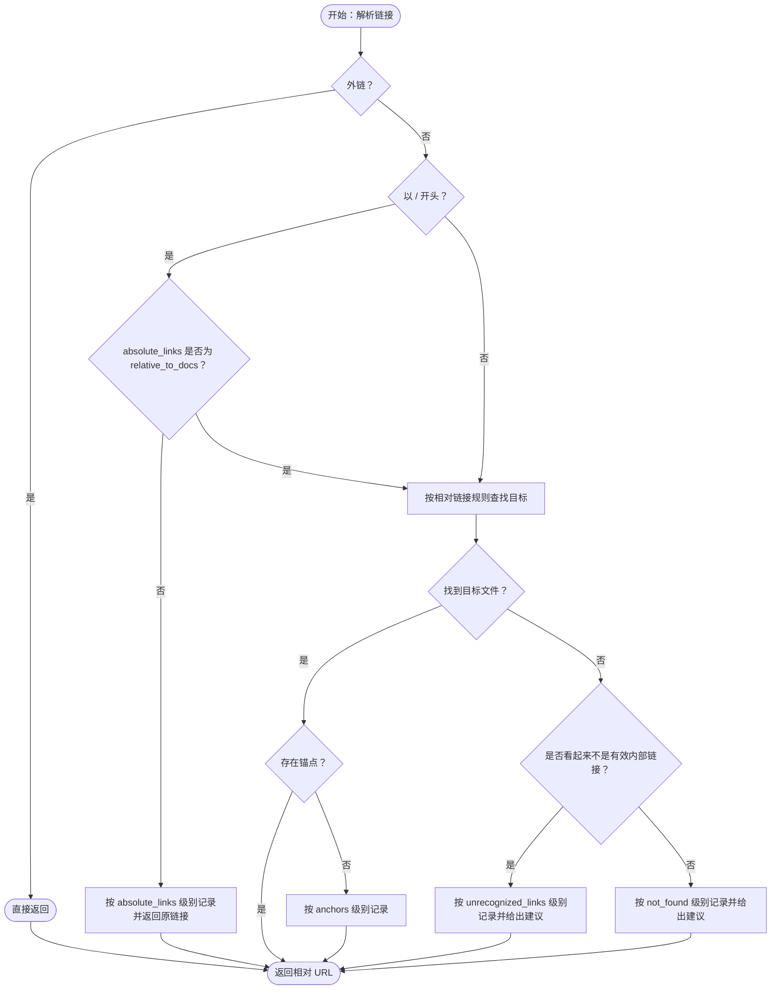
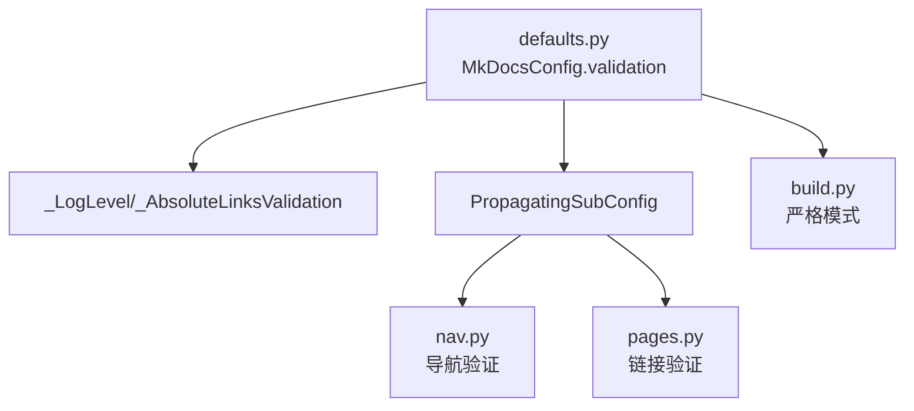

# 验证配置

<cite>
**本文引用的文件**
- [mkdocs/config/defaults.py](file://mkdocs/config/defaults.py)
- [mkdocs/config/config_options.py](file://mkdocs/config/config_options.py)
- [mkdocs/config/base.py](file://mkdocs/config/base.py)
- [mkdocs/structure/nav.py](file://mkdocs/structure/nav.py)
- [mkdocs/structure/pages.py](file://mkdocs/structure/pages.py)
- [mkdocs/commands/build.py](file://mkdocs/commands/build.py)
- [docs/user-guide/configuration.md](file://docs/user-guide/configuration.md)
- [mkdocs/tests/config/config_options_tests.py](file://mkdocs/tests/config/config_options_tests.py)
- [mkdocs/tests/structure/nav_tests.py](file://mkdocs/tests/structure/nav_tests.py)
- [mkdocs/tests/structure/page_tests.py](file://mkdocs/tests/structure/page_tests.py)
</cite>

## 目录
1. [简介](#简介)
2. [项目结构](#项目结构)
3. [核心组件](#核心组件)
4. [架构总览](#架构总览)
5. [详细组件分析](#详细组件分析)
6. [依赖关系分析](#依赖关系分析)
7. [性能考量](#性能考量)
8. [故障排除指南](#故障排除指南)
9. [结论](#结论)
10. [附录](#附录)

## 简介
本文件系统性阐述 MkDocs 的验证配置体系，重点覆盖 validation 配置块的完整结构与各验证级别的设置，包括导航验证（nav）与链接验证（links）的配置项、警告级别映射、日志输出控制、严格模式（strict）的影响、以及在不同环境下的验证策略建议。文档同时提供调试方法与常见问题排查技巧，并通过图示帮助读者理解验证流程与关键组件之间的交互。

## 项目结构
验证配置位于根配置对象中，采用分层子配置结构：
- 根配置对象包含 validation 子树
- validation 下分为 nav 与 links 两个子配置
- 每个子配置下包含若干验证项，如 omitted_files、not_found、absolute_links、unrecognized_links、anchors 等
- 各项的值为 warn/info/ignore 或特殊值 relative_to_docs（仅 links.absolute_links）

图表来源
- [mkdocs/config/defaults.py](file://mkdocs/config/defaults.py#L169-L199)

章节来源
- [mkdocs/config/defaults.py](file://mkdocs/config/defaults.py#L169-L199)

## 核心组件
- 验证配置类定义：在根配置类中定义了 validation 子树及其嵌套的 nav 与 links 子配置，每个子配置项均以 _LogLevel 或 _AbsoluteLinksValidation 类型约束其取值范围。
- 日志级别映射：_LogLevel 将字符串映射到 logging.WARNING/INFO/DEBUG，用于统一 warn/info/ignore 的行为；_AbsoluteLinksValidation 在此基础上增加 relative_to_docs 特殊值。
- 验证传播机制：PropagatingSubConfig 使得顶层设置可自动传播到子配置，例如在 validation: 设置 absolute_links: warn 会同时作用于 nav.absolute_links 与 links.absolute_links。
- 运行时验证逻辑：导航构建与页面链接解析分别在 nav.py 与 pages.py 中执行，依据配置选择日志级别或直接抛错（严格模式）。

章节来源
- [mkdocs/config/defaults.py](file://mkdocs/config/defaults.py#L12-L33)
- [mkdocs/config/defaults.py](file://mkdocs/config/defaults.py#L169-L199)
- [mkdocs/config/config_options.py](file://mkdocs/config/config_options.py#L125-L146)

## 架构总览
验证配置从配置加载到运行时验证的总体流程如下：

图表来源
- [mkdocs/config/base.py](file://mkdocs/config/base.py#L340-L392)
- [mkdocs/structure/nav.py](file://mkdocs/structure/nav.py#L150-L185)
- [mkdocs/structure/pages.py](file://mkdocs/structure/pages.py#L419-L516)
- [mkdocs/commands/build.py](file://mkdocs/commands/build.py#L249-L351)

## 详细组件分析

### 验证配置树与默认值
- validation.nav
  - omitted_files: 默认 info，用于提示未出现在导航中的文档文件
  - not_found: 默认 warn，用于提示导航中引用的相对路径不存在
  - absolute_links: 默认 info，用于提示导航中绝对路径（以 / 开头）的行为
- validation.links
  - not_found: 默认 warn，用于提示 Markdown 文档内部相对链接目标不存在
  - absolute_links: 默认 info，用于提示 Markdown 文档内部绝对链接（以 / 开头）
  - unrecognized_links: 默认 info，用于提示看起来不像是有效内部链接的相对链接（如末尾带 /）
  - anchors: 默认 info，用于提示 Markdown 文档内部锚点不存在

章节来源
- [mkdocs/config/defaults.py](file://mkdocs/config/defaults.py#L169-L199)

### 日志级别与传播机制
- 日志级别映射
  - warn -> WARNING
  - info -> INFO
  - ignore -> DEBUG
- 绝对链接特殊值
  - relative_to_docs：仅 links.absolute_links 支持，表示将 / 开头的链接视为相对于 docs_dir 的相对链接进行校验
- 传播规则
  - 当在 validation 层级设置某项（如 absolute_links），PropagatingSubConfig 会将其传播到 nav 与 links 子配置中对应键上

章节来源
- [mkdocs/config/defaults.py](file://mkdocs/config/defaults.py#L12-L33)
- [mkdocs/config/defaults.py](file://mkdocs/config/defaults.py#L169-L199)
- [mkdocs/config/config_options.py](file://mkdocs/config/config_options.py#L125-L146)

### 导航验证（nav）工作流
导航验证主要在构建导航时扫描 Link 列表，根据配置决定日志级别：
- 外部链接：始终记录 debug 级别日志
- 绝对路径（/ 开头）且非 relative_to_docs：按 absolute_links 级别记录
- 其他相对路径：按 not_found 级别记录
- 未在导航中出现的文档：按 omitted_files 级别记录

图表来源
- [mkdocs/structure/nav.py](file://mkdocs/structure/nav.py#L164-L185)
- [mkdocs/structure/nav.py](file://mkdocs/structure/nav.py#L188-L223)

章节来源
- [mkdocs/structure/nav.py](file://mkdocs/structure/nav.py#L150-L185)
- [mkdocs/structure/nav.py](file://mkdocs/structure/nav.py#L188-L223)

### 链接验证（links）工作流
页面链接解析在渲染阶段执行，根据配置决定日志级别与建议：
- 外链：直接返回
- 绝对路径（/ 开头）：若 absolute_links 不为 relative_to_docs，则按该级别记录；否则按相对链接规则处理
- 自链接（仅查询/锚点）：直接返回
- 相对路径：尝试多种可能的目标路径，若找不到则按 not_found 或 unrecognized_links 记录，并给出建议
- 锚点：若目标页无该锚点，按 anchors 记录

图表来源
- [mkdocs/structure/pages.py](file://mkdocs/structure/pages.py#L419-L516)

章节来源
- [mkdocs/structure/pages.py](file://mkdocs/structure/pages.py#L419-L516)

### 严格模式（strict）与日志输出控制
- 严格模式开启后，构建过程中会统计 WARNING 级别的警告数量，一旦存在任何警告即终止构建
- 日志输出由配置项决定：warn/info/ignore 对应不同日志级别；relative_to_docs 仅影响 links.absolute_links 的行为
- 严格模式与配置项的交互在构建入口处完成，严格模式下还会添加计数处理器以统计警告

章节来源
- [mkdocs/config/base.py](file://mkdocs/config/base.py#L387-L390)
- [mkdocs/commands/build.py](file://mkdocs/commands/build.py#L249-L351)

### 验证配置的调试与测试
- 单元测试覆盖了验证配置的典型行为，包括：
  - 顶层与子层混配设置
  - 子层键类型错误与未知键警告
  - absolute_links 的 relative_to_docs 行为
- 测试用例展示了不同配置组合下的日志输出预期

章节来源
- [mkdocs/tests/config/config_options_tests.py](file://mkdocs/tests/config/config_options_tests.py#L1597-L1655)
- [mkdocs/tests/structure/nav_tests.py](file://mkdocs/tests/structure/nav_tests.py#L134-L170)
- [mkdocs/tests/structure/page_tests.py](file://mkdocs/tests/structure/page_tests.py#L1046-L1191)

## 依赖关系分析
验证配置的依赖关系如下：
- 根配置类 MkDocsConfig 定义 validation 子树
- _LogLevel/_AbsoluteLinksValidation 提供类型约束与默认值
- PropagatingSubConfig 实现配置传播
- 运行时验证由 nav.py 与 pages.py 执行
- 严格模式在 build.py 中生效

图表来源
- [mkdocs/config/defaults.py](file://mkdocs/config/defaults.py#L169-L199)
- [mkdocs/config/config_options.py](file://mkdocs/config/config_options.py#L125-L146)
- [mkdocs/structure/nav.py](file://mkdocs/structure/nav.py#L150-L185)
- [mkdocs/structure/pages.py](file://mkdocs/structure/pages.py#L419-L516)
- [mkdocs/commands/build.py](file://mkdocs/commands/build.py#L249-L351)

章节来源
- [mkdocs/config/defaults.py](file://mkdocs/config/defaults.py#L169-L199)
- [mkdocs/config/config_options.py](file://mkdocs/config/config_options.py#L125-L146)
- [mkdocs/structure/nav.py](file://mkdocs/structure/nav.py#L150-L185)
- [mkdocs/structure/pages.py](file://mkdocs/structure/pages.py#L419-L516)
- [mkdocs/commands/build.py](file://mkdocs/commands/build.py#L249-L351)

## 性能考量
- 验证过程主要为日志输出与少量路径匹配，开销较小
- absolute_links 使用 relative_to_docs 时会进行多候选路径生成与查找，建议在大型站点谨慎使用
- 严格模式会引入额外的计数处理器，轻微增加构建时间

## 故障排除指南
- 未识别的配置键
  - 现象：出现“Unrecognised configuration name”警告
  - 排查：检查键名拼写与层级是否正确
- 子层键类型错误
  - 现象：子层键值类型不符（如期望字符串却给数组）
  - 排查：核对配置项类型定义（warn/info/ignore 或 relative_to_docs）
- 绝对链接行为不符合预期
  - 现象：/ 开头链接未被识别为相对链接
  - 排查：确认 links.absolute_links 设置为 relative_to_docs；检查 use_directory_urls 与 docs_dir
- 导航中绝对路径警告过多
  - 现象：大量“绝对路径可能指向外部资源”的日志
  - 排查：调整 nav.absolute_links 级别为 ignore 或改为 relative_to_docs（视需求而定）
- 锚点缺失导致的告警
  - 现象：页面内锚点不存在
  - 排查：启用 anchors 的 warn 级别并修正目标锚点

章节来源
- [mkdocs/tests/config/config_options_tests.py](file://mkdocs/tests/config/config_options_tests.py#L1627-L1655)
- [mkdocs/tests/structure/nav_tests.py](file://mkdocs/tests/structure/nav_tests.py#L134-L170)
- [mkdocs/tests/structure/page_tests.py](file://mkdocs/tests/structure/page_tests.py#L1046-L1191)

## 结论
MkDocs 的验证配置提供了细粒度的日志控制与严格的构建保障。通过合理设置 validation.nav 与 validation.links 的各项级别，可在开发、CI 与生产环境中实现从宽松到严格的差异化策略。结合严格模式，可以在 CI 中将警告直接转为失败，确保文档质量与一致性。

## 附录

### 验证配置项一览与默认值
- validation.nav
  - omitted_files: info
  - not_found: warn
  - absolute_links: info
- validation.links
  - not_found: warn
  - absolute_links: info
  - unrecognized_links: info
  - anchors: info

章节来源
- [docs/user-guide/configuration.md](file://docs/user-guide/configuration.md#L400-L415)

### 严格模式使用场景与影响
- 场景：CI/CD、发布前质量门禁
- 影响：任何警告都会导致构建失败，便于及时发现并修复问题

章节来源
- [docs/user-guide/configuration.md](file://docs/user-guide/configuration.md#L396-L398)
- [mkdocs/config/base.py](file://mkdocs/config/base.py#L387-L390)
- [mkdocs/commands/build.py](file://mkdocs/commands/build.py#L254-L351)

### 不同环境下的验证策略建议
- 开发环境：适度宽松，warn/info/ignore 混合，便于快速迭代
- 预览/PR：中等严格，warn 为主，relative_to_docs 可选
- 生产/发布：严格模式，所有警告转为错误

章节来源
- [docs/user-guide/configuration.md](file://docs/user-guide/configuration.md#L419-L436)