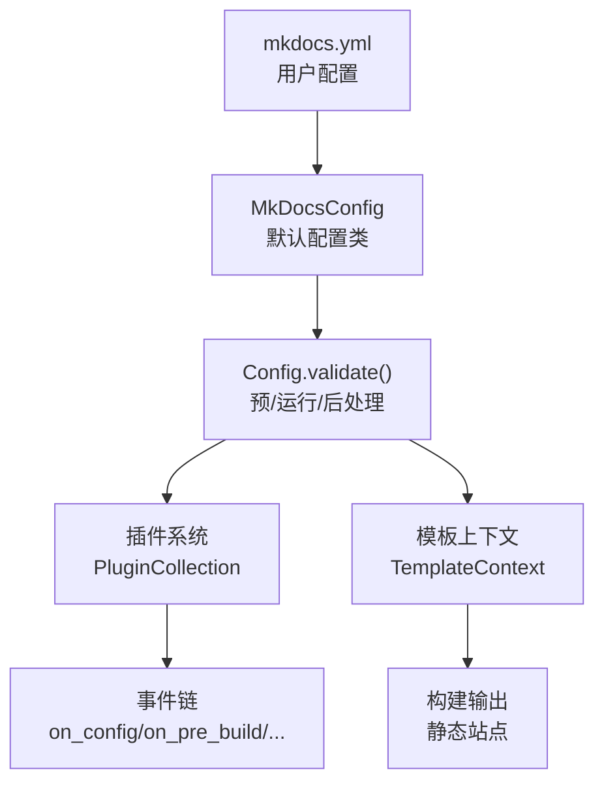
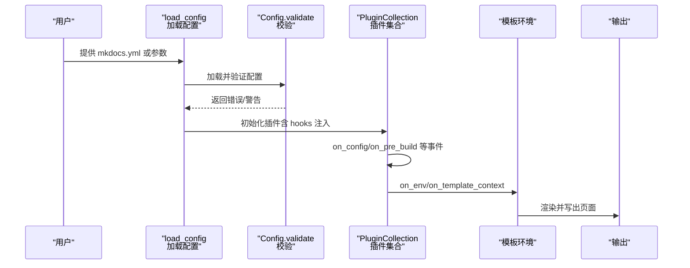
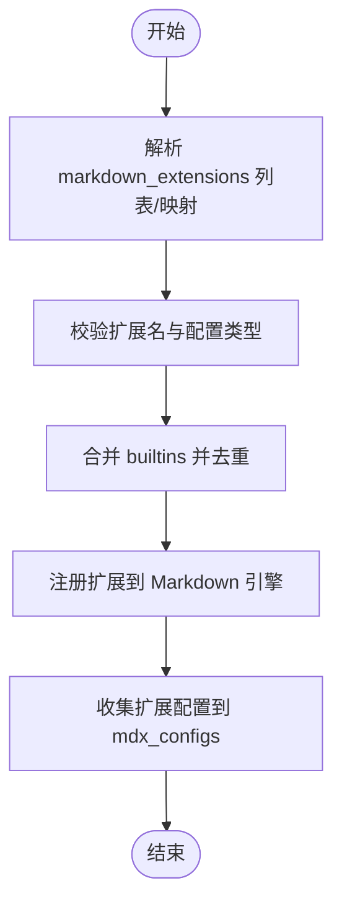
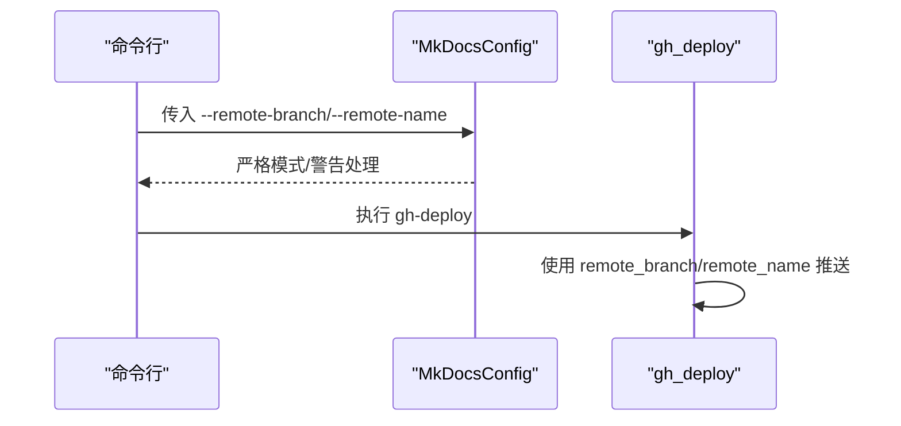
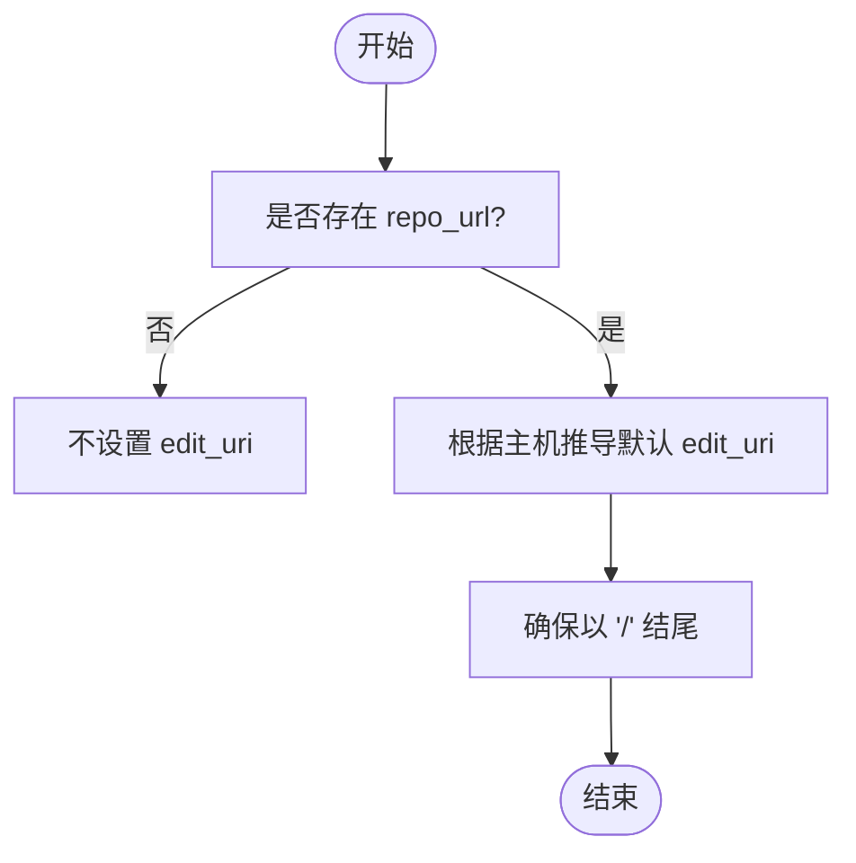
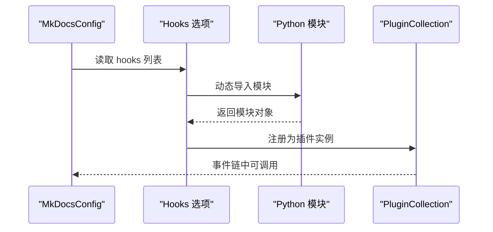
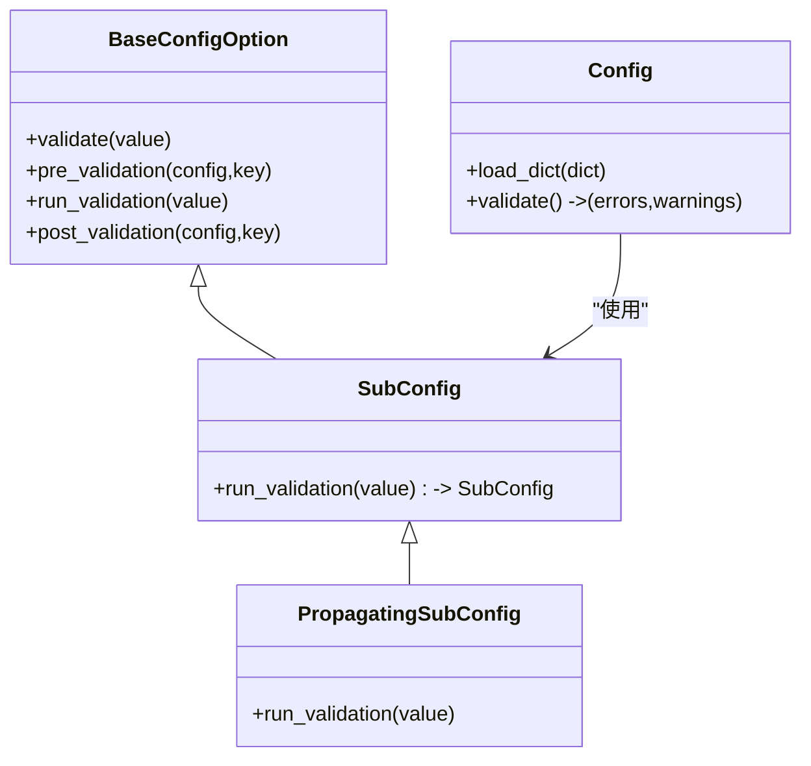
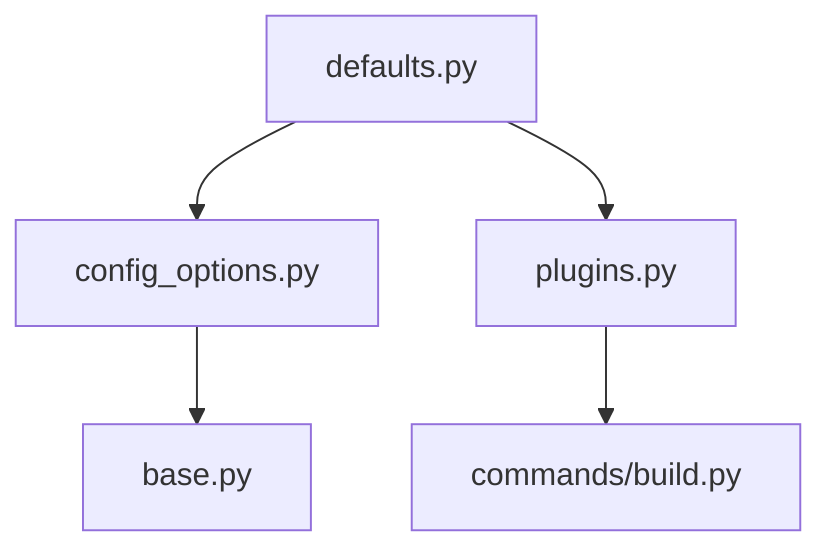

# 高级配置

<cite>
**本文引用的文件**
- [mkdocs\config\defaults.py](file://mkdocs\config\defaults.py)
- [mkdocs\config\config_options.py](file://mkdocs\config\config_options.py)
- [mkdocs\config\base.py](file://mkdocs\config\base.py)
- [mkdocs\plugins.py](file://mkdocs\plugins.py)
- [mkdocs\commands\build.py](file://mkdocs\commands\build.py)
- [mkdocs.yml](file://mkdocs.yml)
- [mkdocs\tests\integration\complicated_config\mkdocs.yml](file://mkdocs\tests\integration\complicated_config\mkdocs.yml)
- [mkdocs\tests\config\config_options_tests.py](file://mkdocs\tests\config\config_options_tests.py)
- [mkdocs\tests\config\config_options_legacy_tests.py](file://mkdocs\tests\config\config_options_legacy_tests.py)
- [mkdocs\tests\cli_tests.py](file://mkdocs\tests\cli_tests.py)
</cite>

## 目录
1. [简介](#简介)
2. [项目结构与入口](#项目结构与入口)
3. [核心组件总览](#核心组件总览)
4. [架构概览](#架构概览)
5. [详细组件解析](#详细组件解析)
6. [依赖关系分析](#依赖关系分析)
7. [性能与优化建议](#性能与优化建议)
8. [故障排查指南](#故障排查指南)
9. [结论](#结论)
10. [附录：配置示例与参考](#附录配置示例与参考)

## 简介
本篇“高级配置”文档聚焦于 MkDocs 的高级配置能力，围绕以下主题展开：
- markdown_extensions 与 mdx_configs 的配置与联动机制
- 远程仓库部署相关配置（remote_branch、remote_name）
- 编辑链接配置（edit_uri、edit_uri_template）与派生逻辑
- extra 配置块的数据传递与模板上下文注入
- hooks 配置与自定义脚本集成
- 部署与性能优化相关配置
- 配置继承与覆盖策略

目标是帮助读者在理解实现原理的基础上，安全、可维护地扩展与定制 MkDocs 的配置。

## 项目结构与入口
- 根配置对象由默认配置类定义，包含所有顶层配置项的类型与默认值。
- 配置校验流程分为预校验、运行时校验、后处理三个阶段，支持警告收集与严格模式。
- 插件系统通过事件钩子贯穿构建生命周期；hooks 可以将本地脚本作为插件实例注入。

**图表来源**
- [mkdocs\config\defaults.py](file://mkdocs\config\defaults.py#L38-L214)
- [mkdocs\config\base.py](file://mkdocs\config\base.py#L181-L243)
- [mkdocs\plugins.py](file://mkdocs\plugins.py#L493-L647)

**章节来源**
- [mkdocs\config\defaults.py](file://mkdocs\config\defaults.py#L38-L214)
- [mkdocs\config\base.py](file://mkdocs\config\base.py#L123-L243)

## 核心组件总览
- 配置基类与校验框架
  - BaseConfigOption：所有配置项的基类，提供默认值、警告、预/运行/后处理生命周期。
  - Config：类型化配置容器，负责加载字典、执行三段式校验、记录警告。
- 默认配置类（MkDocsConfig）
  - 定义顶层配置项：markdown_extensions、mdx_configs、remote_branch、remote_name、edit_uri、edit_uri_template、extra、hooks 等。
- 配置项实现
  - MarkdownExtensions：解析扩展列表/映射，生成扩展名列表，并将扩展配置写入 mdx_configs。
  - EditURI/EditURITemplate：根据 repo_url 推导或显式设置编辑链接模板。
  - Hooks：将本地 Python 脚本导入为模块并注册为插件实例。
  - SubConfig/PropagatingSubConfig：用于嵌套配置与传播行为。
- 插件系统
  - BasePlugin/PluginCollection：统一的插件接口与事件分发，支持优先级与多实例。
- 构建与模板
  - 模板上下文在构建过程中被插件修改，最终渲染输出。

**章节来源**
- [mkdocs\config\config_options.py](file://mkdocs\config\config_options.py#L37-L1227)
- [mkdocs\config\defaults.py](file://mkdocs\config\defaults.py#L38-L214)
- [mkdocs\plugins.py](file://mkdocs\plugins.py#L58-L647)

## 架构概览
下图展示了从配置加载到构建完成的关键交互：

**图表来源**
- [mkdocs\config\base.py](file://mkdocs\config\base.py#L340-L392)
- [mkdocs\plugins.py](file://mkdocs\plugins.py#L575-L647)
- [mkdocs\commands\build.py](file://mkdocs\commands\build.py#L80-L107)

## 详细组件解析

### markdown_extensions 与 mdx_configs
- 配置方式
  - 支持字符串列表、键值对映射或混合形式。键为扩展名，值为该扩展的配置字典。
  - 可通过 builtins 关键字声明内置扩展（不可被用户覆盖），但可通过重复列出并带配置的方式为内置扩展提供配置。
- 数据流
  - 解析阶段：MarkdownExtensions 校验扩展名合法性，收集扩展配置到内部字典。
  - 后处理阶段：将扩展配置写入 mdx_configs（默认键名），供 Markdown 引擎按扩展名注册时使用。
- 典型场景
  - 为 toc、pymdownx 系列等扩展传入配置。
  - 使用 builtins 确保某些扩展始终启用且顺序可控。

**图表来源**
- [mkdocs\config\config_options.py](file://mkdocs\config\config_options.py#L955-L1039)
- [mkdocs\tests\config\config_options_tests.py](file://mkdocs\tests\config\config_options_tests.py#L1741-L1901)
- [mkdocs\tests\config\config_options_legacy_tests.py](file://mkdocs\tests\config\config_options_legacy_tests.py#L1456-L1539)

**章节来源**
- [mkdocs\config\config_options.py](file://mkdocs\config\config_options.py#L955-L1039)
- [mkdocs\tests\config\config_options_tests.py](file://mkdocs\tests\config\config_options_tests.py#L1741-L1901)
- [mkdocs\tests\config\config_options_legacy_tests.py](file://mkdocs\tests\config\config_options_legacy_tests.py#L1456-L1539)

### 远程仓库与部署配置（remote_branch、remote_name）
- remote_branch
  - gh-deploy 默认提交到的分支名，默认为 “gh-pages”。
- remote_name
  - gh-deploy 推送的目标远程名，默认为 “origin”。
- CLI 行为
  - 命令行工具支持通过参数覆盖上述两个配置项，便于在 CI 环境中灵活指定。

**图表来源**
- [mkdocs\config\defaults.py](file://mkdocs\config\defaults.py#L144-L148)
- [mkdocs\tests\cli_tests.py](file://mkdocs\tests\cli_tests.py#L473-L500)

**章节来源**
- [mkdocs\config\defaults.py](file://mkdocs\config\defaults.py#L144-L148)
- [mkdocs\tests\cli_tests.py](file://mkdocs\tests\cli_tests.py#L473-L500)

### 编辑链接配置（edit_uri、edit_uri_template）
- edit_uri
  - 显式设置仓库中的文档目录相对路径，通常形如 “edit/<branch>/<docs_dir>/”。
  - 若未设置且已提供 repo_url，则会基于仓库主机自动推导默认值（例如 GitHub/GitLab 使用 “edit/master/docs/”，Bitbucket 使用 “src/default/docs/”）。
  - 最终确保以斜杠结尾，保证拼接正确。
- edit_uri_template
  - 更灵活的模板格式，允许在模板中使用占位符（如 path、path_noext），并进行 URL 安全转义。
  - 当同时设置了 edit_uri 与 edit_uri_template 时，会发出警告提示后者无效。
- 依赖关系
  - edit_uri 的推导依赖 repo_url；edit_uri_template 的存在不影响 mdx_configs，但会影响编辑链接生成。

**图表来源**
- [mkdocs\config\config_options.py](file://mkdocs\config\config_options.py#L607-L628)
- [mkdocs\config\config_options.py](file://mkdocs\config\config_options.py#L630-L664)

**章节来源**
- [mkdocs\config\config_options.py](file://mkdocs\config\config_options.py#L607-L628)
- [mkdocs\config\config_options.py](file://mkdocs\config\config_options.py#L630-L664)

### extra 配置块与数据传递
- extra
  - 类型为 SubConfig，表示一个任意键值对的映射，用于向模板上下文传递额外数据。
  - 在构建过程中，extra 的键值会被注入到模板上下文，供主题与插件使用。
- 实际应用
  - 主题作者可在主题配置中要求特定的 extra 字段，从而实现“非通用”但又无需在 MkDocs 核心中硬编码的功能。
- 示例参考
  - 复杂配置示例中包含 extra 字段，验证其可用性。

**图表来源**
- [mkdocs\config\defaults.py](file://mkdocs\config\defaults.py#L150-L156)
- [mkdocs\tests\integration\complicated_config\mkdocs.yml](file://mkdocs\tests\integration\complicated_config\mkdocs.yml#L45-L47)

**章节来源**
- [mkdocs\config\defaults.py](file://mkdocs\config\defaults.py#L150-L156)
- [mkdocs\tests\integration\complicated_config\mkdocs.yml](file://mkdocs\tests\integration\complicated_config\mkdocs.yml#L45-L47)

### hooks 配置与自定义脚本集成
- hooks
  - 顶层配置项，接受一个文件路径列表。
  - 每个路径对应一个 Python 文件，MkDocs 将其作为模块动态导入，并将其注册为插件实例。
- 工作流程
  - 预校验阶段：校验路径存在且可导入。
  - 运行阶段：将每个模块注册到插件集合中，后续与正式插件共享事件系统。
- 注意事项
  - 导入前会临时调整 sys.path，确保模块可被正确加载。
  - 与插件同名时的冲突与覆盖策略遵循插件集合的注册规则。

**图表来源**
- [mkdocs\config\config_options.py](file://mkdocs\config\config_options.py#L1168-L1215)
- [mkdocs\config\defaults.py](file://mkdocs\config\defaults.py#L162-L164)

**章节来源**
- [mkdocs\config\config_options.py](file://mkdocs\config\config_options.py#L1168-L1215)
- [mkdocs\config\defaults.py](file://mkdocs\config\defaults.py#L162-L164)

### 配置继承与覆盖策略
- 继承
  - 子配置（SubConfig）可定义独立的子模式，父配置在 post_validation 阶段将匹配的键值传播到子配置中（PropagatingSubConfig）。
- 覆盖
  - 用户配置优先于默认值；严格模式下任何警告都会导致构建终止。
  - 对于插件与 hooks，重复声明可能触发警告（例如多次声明同一插件且未声明支持多实例）。

**图表来源**
- [mkdocs\config\config_options.py](file://mkdocs\config\config_options.py#L52-L146)
- [mkdocs\config\base.py](file://mkdocs\config\base.py#L123-L243)

**章节来源**
- [mkdocs\config\config_options.py](file://mkdocs\config\config_options.py#L52-L146)
- [mkdocs\config\base.py](file://mkdocs\config\base.py#L123-L243)

## 依赖关系分析
- 配置层
  - defaults.py 定义顶层配置项及其默认值与类型约束。
  - config_options.py 提供具体配置项的校验与后处理逻辑。
  - base.py 提供通用的配置容器与三段式校验框架。
- 运行时层
  - plugins.py 定义插件接口与事件系统，hooks 通过 PluginCollection 注入。
  - commands/build.py 展示模板上下文如何被插件修改并渲染输出。

**图表来源**
- [mkdocs\config\defaults.py](file://mkdocs\config\defaults.py#L38-L214)
- [mkdocs\config\config_options.py](file://mkdocs\config\config_options.py#L37-L1227)
- [mkdocs\config\base.py](file://mkdocs\config\base.py#L123-L243)
- [mkdocs\plugins.py](file://mkdocs\plugins.py#L493-L647)
- [mkdocs\commands\build.py](file://mkdocs\commands\build.py#L80-L107)

**章节来源**
- [mkdocs\config\defaults.py](file://mkdocs\config\defaults.py#L38-L214)
- [mkdocs\config\config_options.py](file://mkdocs\config\config_options.py#L37-L1227)
- [mkdocs\config\base.py](file://mkdocs\config\base.py#L123-L243)
- [mkdocs\plugins.py](file://mkdocs\plugins.py#L493-L647)
- [mkdocs\commands\build.py](file://mkdocs\commands\build.py#L80-L107)

## 性能与优化建议
- 减少不必要的插件与扩展
  - 仅启用必要的 markdown_extensions，避免加载重型扩展。
  - 控制 plugins 数量与复杂度，减少事件链开销。
- 合理使用 extra
  - 避免在 extra 中放置过大的二进制数据；如需资源请通过 extra_css/extra_javascript 或主题资源管理。
- 严格模式与增量构建
  - 在开发阶段关闭严格模式以加速迭代；在 CI 中开启严格模式保障质量。
- 监控与日志
  - 利用严格模式下的警告快速定位配置问题，减少构建失败成本。

[本节为通用建议，无需特定文件引用]

## 故障排查指南
- 配置校验失败
  - 检查 Config.validate 输出的错误与警告；严格模式会直接中断构建。
- 插件与 hooks 冲突
  - 多次声明同一插件可能触发警告；确认插件是否支持多实例。
- 编辑链接异常
  - 若同时设置了 edit_uri 与 edit_uri_template，后者会被忽略；检查模板占位符是否正确。
- 部署分支/远程名错误
  - 通过命令行参数覆盖 remote_branch/remote_name，确保与 CI 环境一致。

**章节来源**
- [mkdocs\config\base.py](file://mkdocs\config\base.py#L340-L392)
- [mkdocs\config\config_options.py](file://mkdocs\config\config_options.py#L1168-L1215)
- [mkdocs\config\config_options.py](file://mkdocs\config\config_options.py#L630-L664)
- [mkdocs\tests\cli_tests.py](file://mkdocs\tests\cli_tests.py#L473-L500)

## 结论
通过对配置系统的深入解析，可以清晰地看到：
- markdown_extensions 与 mdx_configs 是解耦设计：前者决定启用哪些扩展，后者承载扩展配置。
- 远程部署与编辑链接配置均具备合理的默认值与派生逻辑，兼顾易用性与灵活性。
- extra 为模板上下文提供了开放的数据通道，使主题与插件能够以最小耦合获得所需信息。
- hooks 与插件共享同一事件模型，便于将本地脚本无缝集成到构建流程中。
- 严格的校验与传播机制确保了配置的一致性与可维护性。

[本节为总结，无需特定文件引用]

## 附录：配置示例与参考
- 官方示例
  - 根配置示例展示了 markdown_extensions、hooks、plugins、extra 等常用配置。
  - 复杂配置示例展示了 remote_branch、remote_name、extra 等高级配置。
- 测试用例
  - 验证了 markdown_extensions 的多种输入形式、builtins 与配置覆盖、错误与警告行为。
  - 验证了 hooks 的导入与注册流程。

**章节来源**
- [mkdocs.yml](file://mkdocs.yml#L36-L80)
- [mkdocs\tests\integration\complicated_config\mkdocs.yml](file://mkdocs\tests\integration\complicated_config\mkdocs.yml#L43-L47)
- [mkdocs\tests\config\config_options_tests.py](file://mkdocs\tests\config\config_options_tests.py#L1741-L1901)
- [mkdocs\tests\config\config_options_legacy_tests.py](file://mkdocs\tests\config\config_options_legacy_tests.py#L1456-L1539)