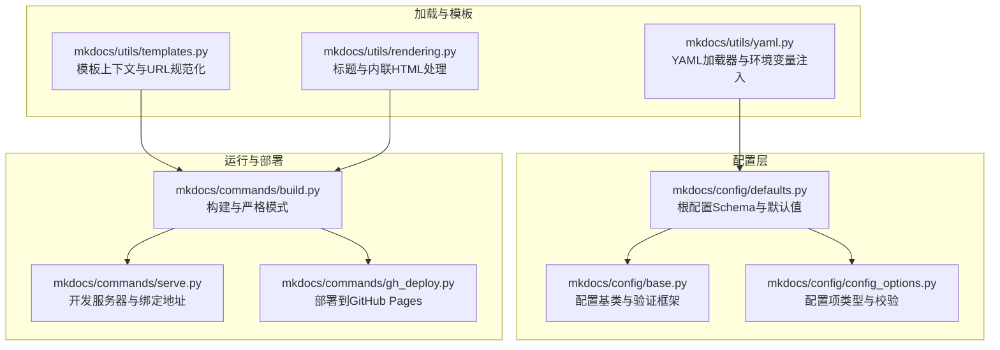
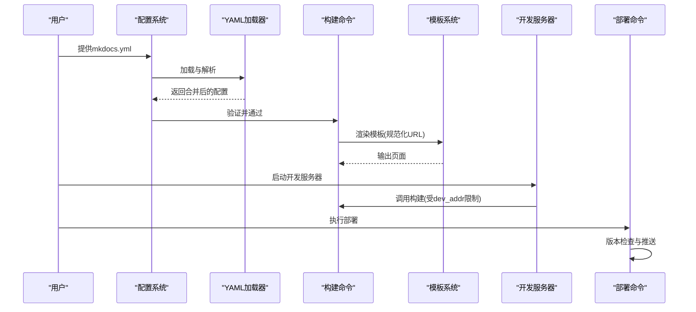
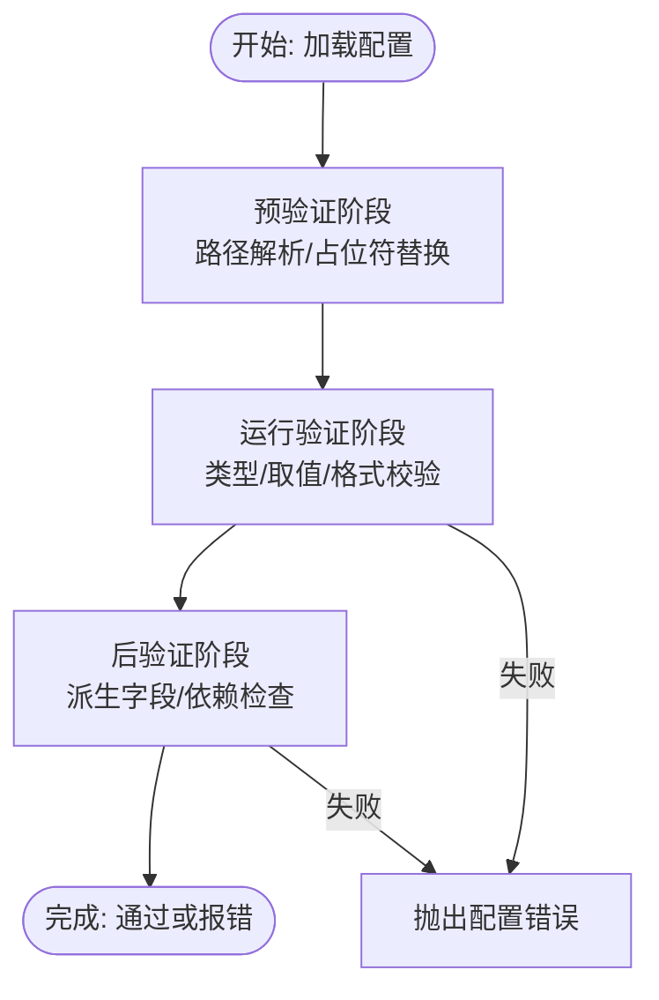
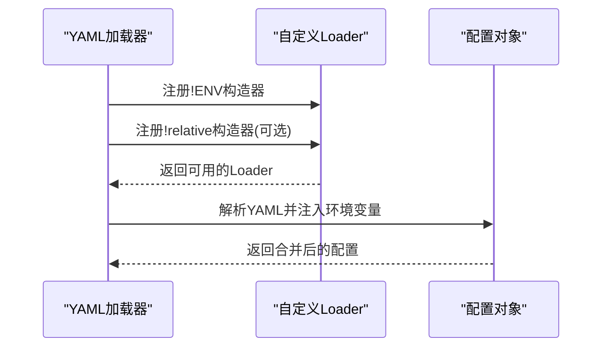
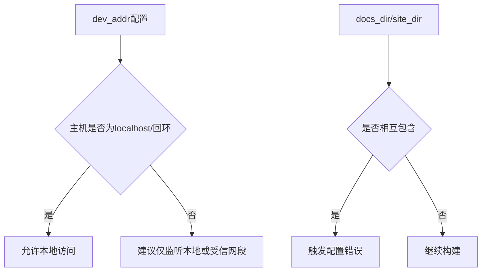
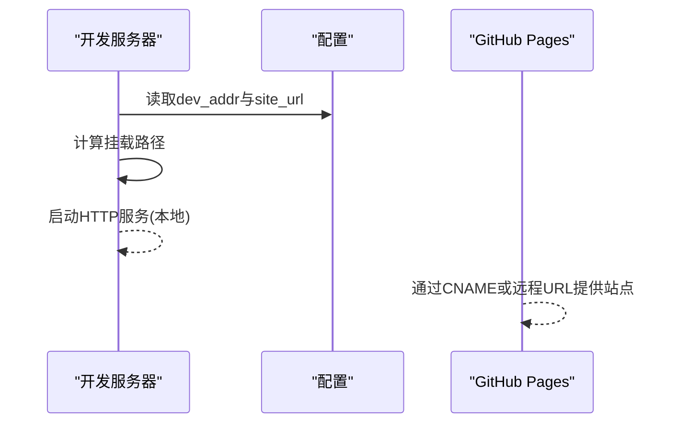
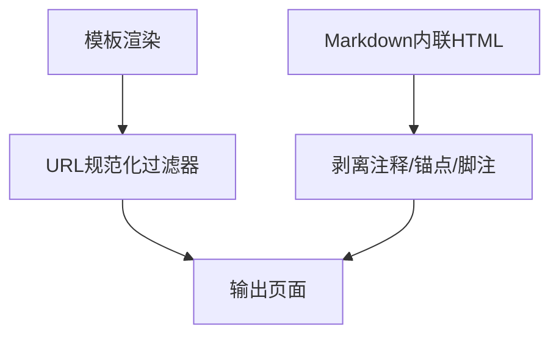
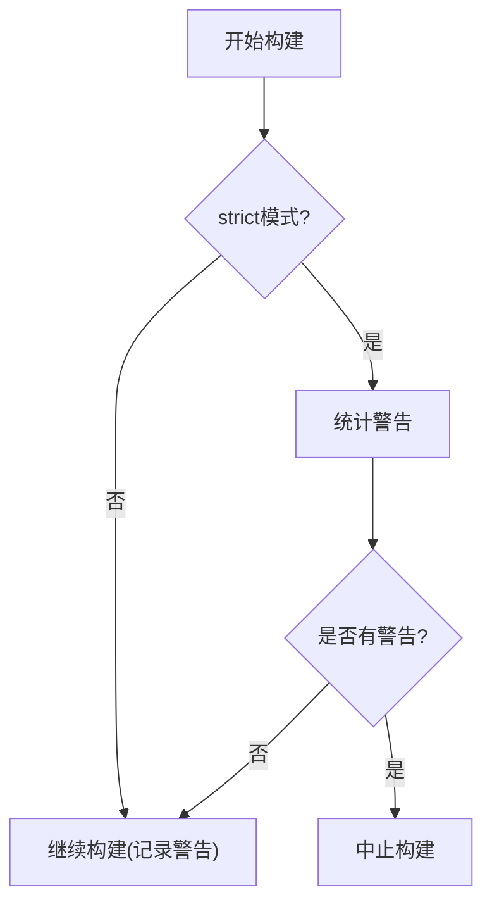
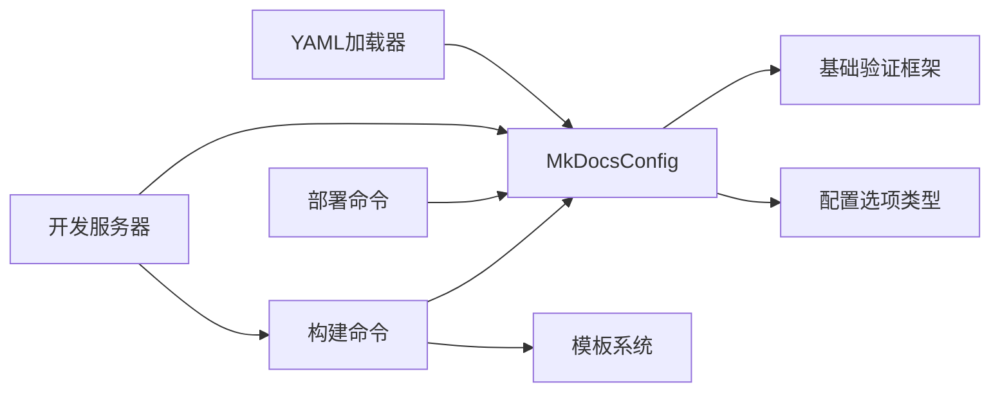

# 安全配置

<cite>
**本文引用的文件**
- [mkdocs/config/base.py](file://mkdocs/config/base.py)
- [mkdocs/config/defaults.py](file://mkdocs/config/defaults.py)
- [mkdocs/config/config_options.py](file://mkdocs/config/config_options.py)
- [mkdocs/utils/yaml.py](file://mkdocs/utils/yaml.py)
- [mkdocs/utils/templates.py](file://mkdocs/utils/templates.py)
- [mkdocs/utils/rendering.py](file://mkdocs/utils/rendering.py)
- [mkdocs/commands/build.py](file://mkdocs/commands/build.py)
- [mkdocs/commands/serve.py](file://mkdocs/commands/serve.py)
- [mkdocs/commands/gh_deploy.py](file://mkdocs/commands/gh_deploy.py)
- [mkdocs/exceptions.py](file://mkdocs/exceptions.py)
- [docs/user-guide/configuration.md](file://docs/user-guide/configuration.md)
</cite>

## 目录
1. [简介](#简介)
2. [项目结构](#项目结构)
3. [核心组件](#核心组件)
4. [架构总览](#架构总览)
5. [详细组件分析](#详细组件分析)
6. [依赖关系分析](#依赖关系分析)
7. [性能考量](#性能考量)
8. [故障排查指南](#故障排查指南)
9. [结论](#结论)
10. [附录](#附录)

## 简介
本指南聚焦于 MkDocs 的安全配置实践，围绕配置文件的安全验证机制、输入过滤、访问控制与权限管理、敏感信息保护与环境变量使用、安全审计与漏洞扫描建议、网络安全配置与 HTTPS 设置，以及常见攻击防护与威胁应对展开。内容基于仓库中的配置系统、构建流程、开发服务器与部署命令等模块进行梳理，并通过可视化图示帮助读者理解。

## 项目结构
MkDocs 的安全相关能力主要分布在以下模块：
- 配置系统：定义配置项类型、校验规则与默认值，确保输入合法与一致
- YAML 加载器：支持环境变量注入与路径占位符，便于在不暴露敏感信息的情况下动态配置
- 模板与渲染：对输出 URL 进行规范化，避免相对路径与跨站脚本风险
- 构建与服务：严格模式下的错误中止、开发服务器地址绑定与路径隔离
- 部署：与 Git/GitHub 集成时的版本检查与推送策略

**图表来源**
- [mkdocs/config/base.py](file://mkdocs/config/base.py#L123-L243)
- [mkdocs/config/config_options.py](file://mkdocs/config/config_options.py#L323-L527)
- [mkdocs/config/defaults.py](file://mkdocs/config/defaults.py#L38-L214)
- [mkdocs/utils/yaml.py](file://mkdocs/utils/yaml.py#L109-L151)
- [mkdocs/utils/templates.py](file://mkdocs/utils/templates.py#L25-L56)
- [mkdocs/utils/rendering.py](file://mkdocs/utils/rendering.py#L22-L56)
- [mkdocs/commands/build.py](file://mkdocs/commands/build.py#L249-L365)
- [mkdocs/commands/serve.py](file://mkdocs/commands/serve.py#L20-L111)
- [mkdocs/commands/gh_deploy.py](file://mkdocs/commands/gh_deploy.py#L100-L170)

**章节来源**
- [mkdocs/config/base.py](file://mkdocs/config/base.py#L123-L243)
- [mkdocs/config/defaults.py](file://mkdocs/config/defaults.py#L38-L214)
- [mkdocs/config/config_options.py](file://mkdocs/config/config_options.py#L323-L527)
- [mkdocs/utils/yaml.py](file://mkdocs/utils/yaml.py#L109-L151)
- [mkdocs/utils/templates.py](file://mkdocs/utils/templates.py#L25-L56)
- [mkdocs/utils/rendering.py](file://mkdocs/utils/rendering.py#L22-L56)
- [mkdocs/commands/build.py](file://mkdocs/commands/build.py#L249-L365)
- [mkdocs/commands/serve.py](file://mkdocs/commands/serve.py#L20-L111)
- [mkdocs/commands/gh_deploy.py](file://mkdocs/commands/gh_deploy.py#L100-L170)

## 核心组件
- 配置验证框架：统一的预/运行/后验证阶段，捕获非法配置并生成警告或错误
- 配置项类型：URL/IP 地址/列表/字典/插件/脚本等，内置类型检查与格式化
- YAML 加载器：支持环境变量注入与相对路径占位符，减少硬编码敏感信息
- 模板与 URL 规范化：在模板中对资源链接进行规范化，降低路径与脚本注入风险
- 构建与严格模式：严格模式下将警告视为错误，便于提前发现潜在问题
- 开发服务器：限制监听地址与端口，避免对外暴露
- 部署流程：与 Git/GitHub 集成时的版本检查与推送策略

**章节来源**
- [mkdocs/config/base.py](file://mkdocs/config/base.py#L181-L243)
- [mkdocs/config/config_options.py](file://mkdocs/config/config_options.py#L323-L527)
- [mkdocs/utils/yaml.py](file://mkdocs/utils/yaml.py#L109-L151)
- [mkdocs/utils/templates.py](file://mkdocs/utils/templates.py#L37-L56)
- [mkdocs/commands/build.py](file://mkdocs/commands/build.py#L249-L365)
- [mkdocs/commands/serve.py](file://mkdocs/commands/serve.py#L55-L78)
- [mkdocs/commands/gh_deploy.py](file://mkdocs/commands/gh_deploy.py#L100-L170)

## 架构总览
下图展示了从配置加载到构建与部署的关键路径，以及安全控制点（严格模式、输入校验、URL 规范化）：

**图表来源**
- [mkdocs/config/base.py](file://mkdocs/config/base.py#L340-L392)
- [mkdocs/utils/yaml.py](file://mkdocs/utils/yaml.py#L128-L151)
- [mkdocs/commands/build.py](file://mkdocs/commands/build.py#L249-L365)
- [mkdocs/utils/templates.py](file://mkdocs/utils/templates.py#L37-L56)
- [mkdocs/commands/serve.py](file://mkdocs/commands/serve.py#L55-L78)
- [mkdocs/commands/gh_deploy.py](file://mkdocs/commands/gh_deploy.py#L100-L170)

## 详细组件分析

### 配置验证与输入过滤
- 预验证/运行验证/后验证三阶段：先预处理（如路径解析），再逐项运行验证（类型、取值范围、格式），最后后处理（派生字段、依赖关系）
- 统一异常类型：配置错误在验证阶段抛出，严格模式下警告也会导致中止
- 输入过滤与格式化：
  - URL 类型强制要求协议与网络位置，目录 URL 自动补尾部斜杠
  - IP 地址类型支持 localhost、IPv4/IPv6 校验与归一化
  - 列表/字典类型对元素逐一验证，键名类型约束
  - 插件与脚本类型对来源与启用状态进行校验
- 未识别配置项：在验证完成后收集“未识别配置名”的警告

**图表来源**
- [mkdocs/config/base.py](file://mkdocs/config/base.py#L181-L243)
- [mkdocs/config/config_options.py](file://mkdocs/config/config_options.py#L492-L527)
- [mkdocs/config/config_options.py](file://mkdocs/config/config_options.py#L463-L490)

**章节来源**
- [mkdocs/config/base.py](file://mkdocs/config/base.py#L181-L243)
- [mkdocs/config/config_options.py](file://mkdocs/config/config_options.py#L463-L490)
- [mkdocs/config/config_options.py](file://mkdocs/config/config_options.py#L492-L527)
- [mkdocs/config/config_options.py](file://mkdocs/config/config_options.py#L207-L298)

### 敏感信息保护与环境变量使用
- 环境变量注入：YAML 加载器注册了环境变量构造器，可在配置中直接读取环境变量，避免将密钥写入版本控制
- 默认值回退：支持多级回退变量与显式默认值，提升灵活性
- 路径占位符：支持相对路径占位符以避免硬编码绝对路径
- 文档说明：官方文档明确介绍了环境变量标签的使用方式与注意事项

**图表来源**
- [mkdocs/utils/yaml.py](file://mkdocs/utils/yaml.py#L109-L125)
- [mkdocs/utils/yaml.py](file://mkdocs/utils/yaml.py#L128-L151)
- [docs/user-guide/configuration.md](file://docs/user-guide/configuration.md#L1068-L1109)

**章节来源**
- [mkdocs/utils/yaml.py](file://mkdocs/utils/yaml.py#L109-L151)
- [docs/user-guide/configuration.md](file://docs/user-guide/configuration.md#L1068-L1109)

### 访问控制与权限管理
- 开发服务器绑定地址：dev_addr 支持 IPv4/IPv6 与 localhost，避免将服务暴露至公网接口
- 本地监听默认值：默认仅监听本地回环地址，降低未授权访问风险
- 文件系统路径校验：docs_dir/site_dir 等路径在验证阶段进行存在性与包含关系检查，防止构建目录覆盖源文件

**图表来源**
- [mkdocs/config/config_options.py](file://mkdocs/config/config_options.py#L463-L490)
- [mkdocs/config/defaults.py](file://mkdocs/config/defaults.py#L96-L97)
- [mkdocs/config/config_options.py](file://mkdocs/config/config_options.py#L774-L800)

**章节来源**
- [mkdocs/config/config_options.py](file://mkdocs/config/config_options.py#L463-L490)
- [mkdocs/config/defaults.py](file://mkdocs/config/defaults.py#L96-L97)
- [mkdocs/config/config_options.py](file://mkdocs/config/config_options.py#L774-L800)

### 网络安全与 HTTPS 设置
- 站点 URL：site_url 作为目录 URL 强制带尾部斜杠，有助于静态资源与链接一致性
- 开发服务器挂载路径：开发服务器根据 site_url 推导挂载路径，避免路径前缀不一致导致的资源 404
- 部署目标：部署到 GitHub Pages 时，会根据远程 URL 与 CNAME 文件推断访问域名

**图表来源**
- [mkdocs/commands/serve.py](file://mkdocs/commands/serve.py#L55-L78)
- [mkdocs/config/config_options.py](file://mkdocs/config/config_options.py#L492-L527)
- [mkdocs/commands/gh_deploy.py](file://mkdocs/commands/gh_deploy.py#L144-L170)

**章节来源**
- [mkdocs/commands/serve.py](file://mkdocs/commands/serve.py#L55-L78)
- [mkdocs/config/config_options.py](file://mkdocs/config/config_options.py#L492-L527)
- [mkdocs/commands/gh_deploy.py](file://mkdocs/commands/gh_deploy.py#L144-L170)

### 模板与输出安全
- URL 规范化：模板过滤器对资源路径进行规范化，避免相对路径与跨站脚本风险
- 内联 HTML 处理：在提取标题文本时剥离注释、锚点链接与脚注引用，减少潜在注入面
- 错误页处理：开发服务器对 404/500 错误页进行回退读取，避免直接暴露内部路径

**图表来源**
- [mkdocs/utils/templates.py](file://mkdocs/utils/templates.py#L37-L56)
- [mkdocs/utils/rendering.py](file://mkdocs/utils/rendering.py#L30-L56)
- [mkdocs/commands/serve.py](file://mkdocs/commands/serve.py#L71-L78)

**章节来源**
- [mkdocs/utils/templates.py](file://mkdocs/utils/templates.py#L37-L56)
- [mkdocs/utils/rendering.py](file://mkdocs/utils/rendering.py#L30-L56)
- [mkdocs/commands/serve.py](file://mkdocs/commands/serve.py#L71-L78)

### 严格模式与安全审计
- 严格模式：当 strict=true 时，任何警告都会导致构建中止，便于在 CI 中强制通过质量门槛
- 警告计数器：在严格模式下统计警告数量并中止，避免忽略潜在问题
- 异常体系：统一的异常类型（配置错误、构建错误、中止）便于区分与处理

**图表来源**
- [mkdocs/commands/build.py](file://mkdocs/commands/build.py#L249-L365)
- [mkdocs/exceptions.py](file://mkdocs/exceptions.py#L13-L20)

**章节来源**
- [mkdocs/commands/build.py](file://mkdocs/commands/build.py#L249-L365)
- [mkdocs/exceptions.py](file://mkdocs/exceptions.py#L13-L20)

### 常见攻击与威胁防护
- 路径遍历与目录包含：通过 docs_dir/site_dir 的包含关系检查，防止构建目录覆盖源文件
- 未识别配置项：对未知键发出警告，避免拼写错误导致的隐藏行为
- 插件与脚本来源：对插件与脚本路径进行存在性与类型校验，避免加载不可信模块
- 开发服务器绑定：限制监听地址，避免将开发服务器暴露至公网

**章节来源**
- [mkdocs/config/config_options.py](file://mkdocs/config/config_options.py#L774-L800)
- [mkdocs/config/base.py](file://mkdocs/config/base.py#L195-L198)
- [mkdocs/config/config_options.py](file://mkdocs/config/config_options.py#L1045-L1166)
- [mkdocs/config/config_options.py](file://mkdocs/config/config_options.py#L463-L490)

## 依赖关系分析
配置系统的依赖关系如下：
- 根配置类依赖配置选项类型与基础验证框架
- YAML 加载器依赖配置对象以注入相对路径占位符
- 构建命令依赖模板系统与配置对象
- 开发服务器依赖构建命令与配置对象
- 部署命令依赖 Git 与远程配置

**图表来源**
- [mkdocs/config/defaults.py](file://mkdocs/config/defaults.py#L38-L214)
- [mkdocs/config/config_options.py](file://mkdocs/config/config_options.py#L323-L527)
- [mkdocs/utils/yaml.py](file://mkdocs/utils/yaml.py#L109-L125)
- [mkdocs/commands/build.py](file://mkdocs/commands/build.py#L249-L365)
- [mkdocs/commands/serve.py](file://mkdocs/commands/serve.py#L55-L78)
- [mkdocs/commands/gh_deploy.py](file://mkdocs/commands/gh_deploy.py#L100-L170)

**章节来源**
- [mkdocs/config/defaults.py](file://mkdocs/config/defaults.py#L38-L214)
- [mkdocs/config/config_options.py](file://mkdocs/config/config_options.py#L323-L527)
- [mkdocs/utils/yaml.py](file://mkdocs/utils/yaml.py#L109-L125)
- [mkdocs/commands/build.py](file://mkdocs/commands/build.py#L249-L365)
- [mkdocs/commands/serve.py](file://mkdocs/commands/serve.py#L55-L78)
- [mkdocs/commands/gh_deploy.py](file://mkdocs/commands/gh_deploy.py#L100-L170)

## 性能考量
- 验证阶段的复杂度：列表/字典类型的逐项验证与警告收集，复杂度与元素数量线性相关
- 模板渲染：URL 规范化与内联 HTML 处理开销较小，通常由构建时间主导
- 开发服务器：LiveReload 在文件变更时触发增量构建，注意监控磁盘 I/O 与 CPU 占用
- 部署：ghp_import 的推送操作取决于网络与远程仓库响应

[本节为通用指导，无需列出具体文件来源]

## 故障排查指南
- 配置错误：查看日志中的配置项名称与错误描述，修正类型或取值
- 严格模式中止：开启严格模式后，修复所有警告；必要时临时关闭以定位问题
- 开发服务器无法访问：确认 dev_addr 是否为 localhost 或受信网段，检查防火墙与端口占用
- 部署失败：检查 Git 可用性、远程分支与版本差异；按提示使用忽略版本参数或升级/降级版本

**章节来源**
- [mkdocs/commands/build.py](file://mkdocs/commands/build.py#L374-L391)
- [mkdocs/exceptions.py](file://mkdocs/exceptions.py#L13-L20)
- [mkdocs/commands/serve.py](file://mkdocs/commands/serve.py#L81-L106)
- [mkdocs/commands/gh_deploy.py](file://mkdocs/commands/gh_deploy.py#L108-L142)

## 结论
MkDocs 的安全配置建立在严格的配置验证、可控的输入过滤与最小暴露原则之上。通过合理使用环境变量、限制开发服务器监听范围、启用严格模式与路径校验，可以有效降低配置错误、路径遍历与未授权访问等风险。结合模板 URL 规范化与内联 HTML 处理，进一步减少输出层面的安全隐患。在 CI/CD 中启用严格模式与自动化测试，可将安全审计纳入常规流程。

[本节为总结性内容，无需列出具体文件来源]

## 附录
- 官方文档关于环境变量与 YAML 标签的使用说明
- 配置项类型参考：URL、IP 地址、列表/字典、插件、脚本等
- 开发服务器与部署命令的默认行为与安全建议

**章节来源**
- [docs/user-guide/configuration.md](file://docs/user-guide/configuration.md#L1068-L1109)
- [mkdocs/config/config_options.py](file://mkdocs/config/config_options.py#L323-L527)
- [mkdocs/commands/serve.py](file://mkdocs/commands/serve.py#L20-L111)
- [mkdocs/commands/gh_deploy.py](file://mkdocs/commands/gh_deploy.py#L100-L170)