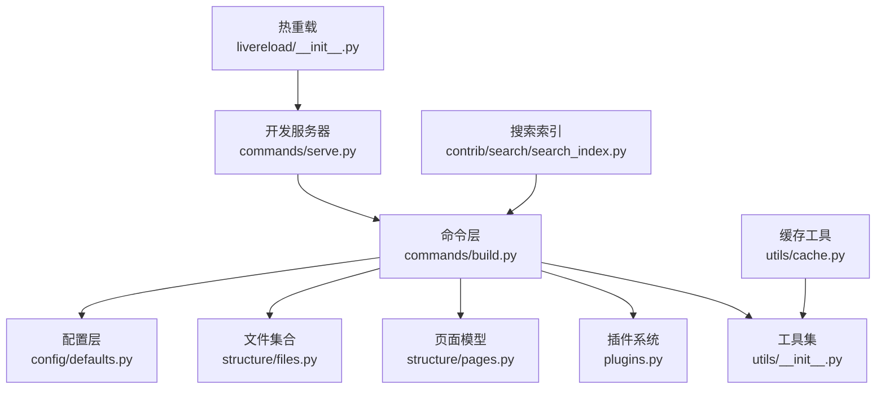
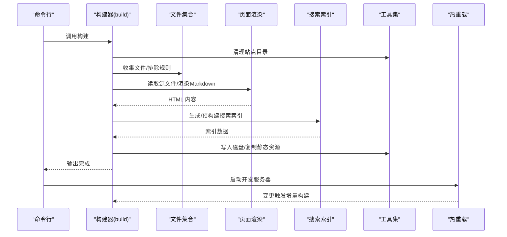
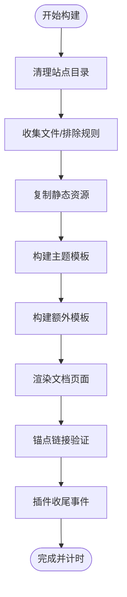
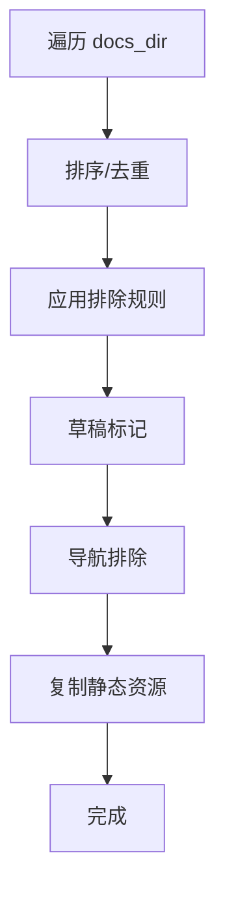
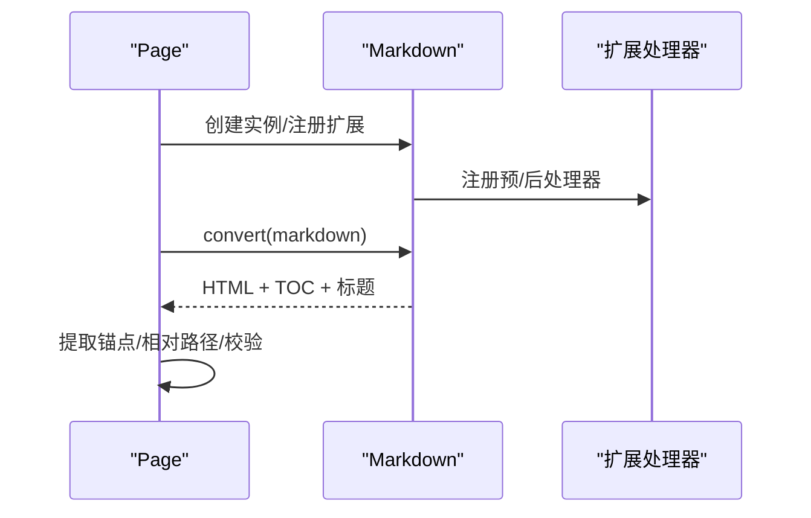
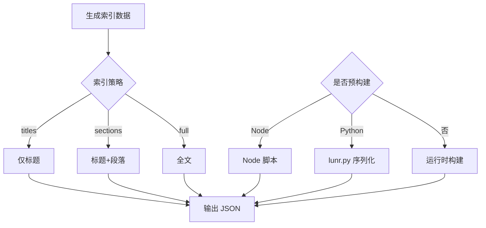
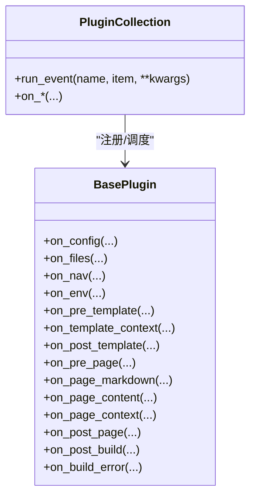
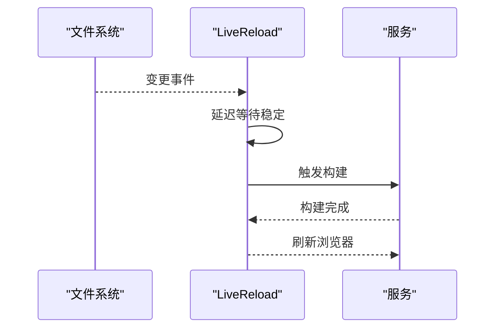
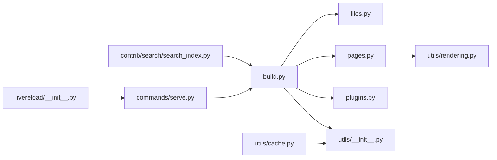

# 性能优化

<cite>
**本文引用的文件**
- [mkdocs/commands/build.py](file://mkdocs/commands/build.py)
- [mkdocs/utils/cache.py](file://mkdocs/utils/cache.py)
- [mkdocs/config/base.py](file://mkdocs/config/base.py)
- [mkdocs/config/defaults.py](file://mkdocs/config/defaults.py)
- [mkdocs/config/config_options.py](file://mkdocs/config/config_options.py)
- [mkdocs/structure/files.py](file://mkdocs/structure/files.py)
- [mkdocs/structure/pages.py](file://mkdocs/structure/pages.py)
- [mkdocs/utils/rendering.py](file://mkdocs/utils/rendering.py)
- [mkdocs/utils/__init__.py](file://mkdocs/utils/__init__.py)
- [mkdocs/plugins.py](file://mkdocs/plugins.py)
- [mkdocs/commands/serve.py](file://mkdocs/commands/serve.py)
- [mkdocs/livereload/__init__.py](file://mkdocs/livereload/__init__.py)
- [mkdocs/contrib/search/search_index.py](file://mkdocs/contrib/search/search_index.py)
- [docs/user-guide/configuration.md](file://docs/user-guide/configuration.md)
</cite>

## 目录
1. [简介](#简介)
2. [项目结构](#项目结构)
3. [核心组件](#核心组件)
4. [架构总览](#架构总览)
5. [详细组件分析](#详细组件分析)
6. [依赖关系分析](#依赖关系分析)
7. [性能考量与优化建议](#性能考量与优化建议)
8. [故障排查指南](#故障排查指南)
9. [结论](#结论)
10. [附录：配置参数与最佳实践](#附录配置参数与最佳实践)

## 简介
本文件面向 MkDocs 的性能优化，系统梳理构建流程、模板渲染、静态资源复制、搜索索引生成等关键环节，并结合代码实现给出可操作的优化策略（缓存、增量构建、懒加载、资源压缩、并行化思路、内存管理、监控与基准测试）及在不同硬件环境下的落地建议。

## 项目结构
围绕性能优化的关键模块与职责如下：
- 构建入口与流程控制：commands/build.py
- 配置与校验：config/base.py、config/defaults.py、config/config_options.py
- 文件与页面模型：structure/files.py、structure/pages.py
- 工具与通用能力：utils/__init__.py、utils/cache.py、utils/rendering.py
- 插件系统：plugins.py
- 开发服务器与热重载：commands/serve.py、livereload/__init__.py
- 搜索索引：contrib/search/search_index.py
- 用户文档与配置说明：docs/user-guide/configuration.md

图表来源
- [mkdocs/commands/build.py](file://mkdocs/commands/build.py#L249-L370)
- [mkdocs/config/defaults.py](file://mkdocs/config/defaults.py#L38-L219)
- [mkdocs/structure/files.py](file://mkdocs/structure/files.py#L62-L627)
- [mkdocs/structure/pages.py](file://mkdocs/structure/pages.py#L35-L570)
- [mkdocs/plugins.py](file://mkdocs/plugins.py#L493-L698)
- [mkdocs/utils/__init__.py](file://mkdocs/utils/__init__.py#L1-L411)
- [mkdocs/commands/serve.py](file://mkdocs/commands/serve.py#L20-L111)
- [mkdocs/livereload/__init__.py](file://mkdocs/livereload/__init__.py#L190-L325)
- [mkdocs/contrib/search/search_index.py](file://mkdocs/contrib/search/search_index.py#L25-L226)
- [mkdocs/utils/cache.py](file://mkdocs/utils/cache.py#L1-L37)

章节来源
- [mkdocs/commands/build.py](file://mkdocs/commands/build.py#L1-L370)
- [mkdocs/config/defaults.py](file://mkdocs/config/defaults.py#L1-L219)
- [mkdocs/structure/files.py](file://mkdocs/structure/files.py#L1-L627)
- [mkdocs/structure/pages.py](file://mkdocs/structure/pages.py#L1-L570)
- [mkdocs/utils/__init__.py](file://mkdocs/utils/__init__.py#L1-L411)
- [mkdocs/plugins.py](file://mkdocs/plugins.py#L1-L698)
- [mkdocs/commands/serve.py](file://mkdocs/commands/serve.py#L1-L111)
- [mkdocs/livereload/__init__.py](file://mkdocs/livereload/__init__.py#L190-L325)
- [mkdocs/contrib/search/search_index.py](file://mkdocs/contrib/search/search_index.py#L1-L226)
- [mkdocs/utils/cache.py](file://mkdocs/utils/cache.py#L1-L37)

## 核心组件
- 构建主流程：负责清理输出目录、收集文件、生成导航、渲染页面与模板、写入磁盘、执行链接验证与插件事件。
- 文件集合与排除规则：统一管理文档页、静态资源、媒体文件；支持基于 gitignore 规则的排除与草稿标记。
- 页面渲染管线：Markdown 解析、扩展注册、标题提取、锚点收集、相对路径转换、链接校验。
- 搜索索引：支持预构建索引（Node 或 Python），按策略选择索引范围以平衡体积与性能。
- 插件系统：贯穿构建生命周期，允许在多阶段注入逻辑，影响性能（如预处理、后处理）。
- 开发服务器与热重载：监听文件变更，触发增量重建与浏览器刷新。
- 缓存工具：网络资源下载与本地缓存，减少重复网络开销。

章节来源
- [mkdocs/commands/build.py](file://mkdocs/commands/build.py#L249-L370)
- [mkdocs/structure/files.py](file://mkdocs/structure/files.py#L524-L627)
- [mkdocs/structure/pages.py](file://mkdocs/structure/pages.py#L263-L570)
- [mkdocs/contrib/search/search_index.py](file://mkdocs/contrib/search/search_index.py#L95-L139)
- [mkdocs/plugins.py](file://mkdocs/plugins.py#L493-L698)
- [mkdocs/commands/serve.py](file://mkdocs/commands/serve.py#L20-L111)
- [mkdocs/livereload/__init__.py](file://mkdocs/livereload/__init__.py#L190-L325)
- [mkdocs/utils/cache.py](file://mkdocs/utils/cache.py#L16-L37)

## 架构总览
下图展示从命令到输出的端到端流程，标注关键性能节点与可优化点。

图表来源
- [mkdocs/commands/build.py](file://mkdocs/commands/build.py#L249-L370)
- [mkdocs/structure/files.py](file://mkdocs/structure/files.py#L546-L588)
- [mkdocs/structure/pages.py](file://mkdocs/structure/pages.py#L263-L293)
- [mkdocs/contrib/search/search_index.py](file://mkdocs/contrib/search/search_index.py#L95-L139)
- [mkdocs/utils/__init__.py](file://mkdocs/utils/__init__.py#L134-L150)
- [mkdocs/commands/serve.py](file://mkdocs/commands/serve.py#L20-L111)
- [mkdocs/livereload/__init__.py](file://mkdocs/livereload/__init__.py#L190-L325)

## 详细组件分析

### 构建主流程与时间度量
- 计时：使用单调时钟记录构建总耗时，并在完成后打印。
- 增量模式：支持 --dirty 仅重建修改过的页面，避免全量扫描。
- 链接验证：对页面内锚点链接进行二次校验，确保一致性。
- 插件事件：在多个阶段触发，可能引入额外开销，需谨慎使用。

图表来源
- [mkdocs/commands/build.py](file://mkdocs/commands/build.py#L249-L370)

章节来源
- [mkdocs/commands/build.py](file://mkdocs/commands/build.py#L249-L370)

### 文件集合与排除策略
- 排除规则：默认忽略隐藏文件与特定模板，支持用户自定义 exclude_docs、draft_docs、not_in_nav。
- 冲突处理：同目录下 index/README 优先级与冲突提示。
- 静态资源复制：按 inclusion 过滤，支持 dirty 模式跳过未修改文件。

图表来源
- [mkdocs/structure/files.py](file://mkdocs/structure/files.py#L546-L588)
- [mkdocs/structure/files.py](file://mkdocs/structure/files.py#L524-L544)
- [mkdocs/structure/files.py](file://mkdocs/structure/files.py#L113-L123)

章节来源
- [mkdocs/structure/files.py](file://mkdocs/structure/files.py#L524-L588)

### 页面渲染与链接处理
- Markdown 扩展：注册原始 HTML 处理器、锚点提取、相对路径处理器、标题提取等。
- 锚点与链接校验：记录页面内锚点、解析相对链接、定位目标文件并给出建议。
- 标题与 TOC：从渲染树中抽取标题文本，用于元信息或摘要。

图表来源
- [mkdocs/structure/pages.py](file://mkdocs/structure/pages.py#L263-L293)
- [mkdocs/structure/pages.py](file://mkdocs/structure/pages.py#L329-L520)
- [mkdocs/utils/rendering.py](file://mkdocs/utils/rendering.py#L22-L56)

章节来源
- [mkdocs/structure/pages.py](file://mkdocs/structure/pages.py#L263-L520)
- [mkdocs/utils/rendering.py](file://mkdocs/utils/rendering.py#L1-L105)

### 搜索索引与预构建
- 索引策略：支持 titles/sections/full 三种粒度，平衡体积与检索质量。
- 预构建：支持 Node 或 Python（lunr.py）两种方式，失败时降级并记录警告。
- 客户端：Web Worker 异步加载与查询，提升交互体验。

图表来源
- [mkdocs/contrib/search/search_index.py](file://mkdocs/contrib/search/search_index.py#L95-L139)
- [docs/user-guide/configuration.md](file://docs/user-guide/configuration.md#L1024-L1067)

章节来源
- [mkdocs/contrib/search/search_index.py](file://mkdocs/contrib/search/search_index.py#L25-L139)
- [docs/user-guide/configuration.md](file://docs/user-guide/configuration.md#L1024-L1067)

### 插件系统与性能影响
- 事件钩子：贯穿配置、文件、导航、模板、页面、构建前后等阶段。
- 优先级与组合：支持为事件设置优先级与合并多个处理器。
- 影响面：插件可改变内容、模板上下文、输出内容，应避免阻塞与重复计算。

图表来源
- [mkdocs/plugins.py](file://mkdocs/plugins.py#L493-L698)

章节来源
- [mkdocs/plugins.py](file://mkdocs/plugins.py#L493-L698)

### 开发服务器与热重载
- 监听与节流：检测文件变化后延迟重建，避免频繁触发。
- 增量构建：通过 serve_url 与 inclusion 控制预览与最终构建差异。
- 浏览器刷新：通知客户端更新。

图表来源
- [mkdocs/commands/serve.py](file://mkdocs/commands/serve.py#L20-L111)
- [mkdocs/livereload/__init__.py](file://mkdocs/livereload/__init__.py#L190-L325)

章节来源
- [mkdocs/commands/serve.py](file://mkdocs/commands/serve.py#L20-L111)
- [mkdocs/livereload/__init__.py](file://mkdocs/livereload/__init__.py#L190-L325)

### 缓存与网络下载
- 下载与缓存：带注释前缀的时间戳跟踪，避免依赖 mtime。
- 版本化 User-Agent：便于服务端区分请求来源。

章节来源
- [mkdocs/utils/cache.py](file://mkdocs/utils/cache.py#L10-L37)

## 依赖关系分析
- 构建主流程依赖文件集合、页面渲染、插件系统与工具集。
- 页面渲染依赖 Markdown 扩展与工具函数。
- 搜索索引依赖外部语言包与可选的 Node/lunr。
- 开发服务器依赖热重载与构建器。

图表来源
- [mkdocs/commands/build.py](file://mkdocs/commands/build.py#L249-L370)
- [mkdocs/structure/files.py](file://mkdocs/structure/files.py#L62-L627)
- [mkdocs/structure/pages.py](file://mkdocs/structure/pages.py#L263-L520)
- [mkdocs/utils/rendering.py](file://mkdocs/utils/rendering.py#L1-L105)
- [mkdocs/contrib/search/search_index.py](file://mkdocs/contrib/search/search_index.py#L25-L139)
- [mkdocs/commands/serve.py](file://mkdocs/commands/serve.py#L20-L111)
- [mkdocs/livereload/__init__.py](file://mkdocs/livereload/__init__.py#L190-L325)
- [mkdocs/utils/cache.py](file://mkdocs/utils/cache.py#L1-L37)
- [mkdocs/utils/__init__.py](file://mkdocs/utils/__init__.py#L1-L411)
- [mkdocs/plugins.py](file://mkdocs/plugins.py#L493-L698)

## 性能考量与优化建议

### 1) 缓存机制
- 网络资源缓存：利用缓存工具对远程资源进行下载与本地缓存，减少重复网络请求。
- 构建时间戳：使用统一时间戳生成策略，保证静态资源与 sitemap 的一致性。
- 建议
  - 对于大体量站点，启用预构建搜索索引以降低运行时开销。
  - 使用 Node 预构建时确保 Node 可用，Python 方案需安装 lunr.py。

章节来源
- [mkdocs/utils/cache.py](file://mkdocs/utils/cache.py#L16-L37)
- [mkdocs/utils/__init__.py](file://mkdocs/utils/__init__.py#L47-L73)
- [docs/user-guide/configuration.md](file://docs/user-guide/configuration.md#L1024-L1067)

### 2) 并行处理与增量构建
- 增量构建：--dirty 仅重建修改过的页面，避免全量扫描；注意预览与最终构建的 inclusion 差异。
- 并行化思路：当前流程为顺序执行，可在不破坏依赖顺序的前提下，将独立页面渲染与静态资源复制并行化（需插件层面配合）。
- 建议
  - 将大型站点拆分为子项目或主题，减少单次构建规模。
  - 在 CI 中使用缓存目录与增量上传，缩短构建时间。

章节来源
- [mkdocs/commands/build.py](file://mkdocs/commands/build.py#L147-L247)
- [mkdocs/structure/files.py](file://mkdocs/structure/files.py#L113-L123)

### 3) 内存管理与对象复用
- LRU 缓存：URL 规范化、主题枚举、文件路径归一化等使用 LRU 缓存，降低重复计算。
- 页面与文件：Page/File 作为轻量对象承载状态，避免在渲染过程中频繁分配大对象。
- 建议
  - 避免在插件中持有全局大对象引用。
  - 对高频字符串拼接与正则匹配进行缓存或预编译。

章节来源
- [mkdocs/utils/__init__.py](file://mkdocs/utils/__init__.py#L169-L287)
- [mkdocs/structure/pages.py](file://mkdocs/structure/pages.py#L35-L160)

### 4) 大型项目优化方案
- 搜索索引策略：根据站点规模选择 titles/sections/full；对超大站点启用预构建。
- 静态资源：启用压缩与合并（CSS/JS），合理组织资源目录，减少 HTTP 请求。
- 懒加载：对图片与非首屏资源采用懒加载，降低首屏渲染压力。
- 建议
  - 使用 CDN 加速静态资源与搜索索引。
  - 分离第三方脚本，避免阻塞主线程。

章节来源
- [mkdocs/contrib/search/search_index.py](file://mkdocs/contrib/search/search_index.py#L95-L139)
- [docs/user-guide/configuration.md](file://docs/user-guide/configuration.md#L1024-L1067)

### 5) 性能监控与基准测试
- 构建时长：通过构建日志中的耗时统计评估优化效果。
- 插件计数：严格模式下统计警告与错误数量，辅助定位问题。
- 基准测试建议
  - 固定硬件环境，对比开启/关闭预构建索引、不同索引策略的耗时。
  - 使用不同站点规模（小/中/大）进行回归测试，记录页面渲染时间分布。

章节来源
- [mkdocs/commands/build.py](file://mkdocs/commands/build.py#L349-L353)
- [mkdocs/utils/__init__.py](file://mkdocs/utils/__init__.py#L370-L386)

### 6) 不同硬件环境下的策略
- CPU 密集型：启用预构建搜索索引，减少运行时 CPU 占用；适当降低索引粒度。
- I/O 密集型：优化静态资源复制与写盘策略，减少随机写；使用 SSD。
- 内存受限：减少一次性加载的页面数量，使用分批渲染；避免在插件中累积大量中间结果。

章节来源
- [mkdocs/contrib/search/search_index.py](file://mkdocs/contrib/search/search_index.py#L95-L139)
- [mkdocs/structure/files.py](file://mkdocs/structure/files.py#L113-L123)

## 故障排查指南
- 构建失败与严格模式：严格模式下会因警告计数而中断，需逐项修复。
- 链接与锚点：页面内锚点缺失或链接错误会在验证阶段输出详细日志与建议。
- 搜索索引：预构建失败会记录警告，必要时回退到运行时构建。
- 热重载卡顿：检查文件变更频率与监听目录，避免不必要的大文件改动。

章节来源
- [mkdocs/commands/build.py](file://mkdocs/commands/build.py#L349-L364)
- [mkdocs/structure/pages.py](file://mkdocs/structure/pages.py#L304-L327)
- [mkdocs/contrib/search/search_index.py](file://mkdocs/contrib/search/search_index.py#L100-L138)
- [mkdocs/livereload/__init__.py](file://mkdocs/livereload/__init__.py#L190-L220)

## 结论
MkDocs 的性能优化应从“缓存、增量、懒加载、资源压缩、并行化”五个维度入手，结合站点规模与硬件条件制定策略。通过合理的配置（如预构建搜索索引、索引策略选择）、严格的监控与基准测试，以及对插件与开发服务器的精细化调优，可显著降低构建时间并提升用户体验。

## 附录：配置参数与最佳实践
- 搜索相关
  - prebuild_index：启用预构建索引（Node 或 Python），适合大型站点。
  - indexing：选择 titles/sections/full，平衡体积与检索质量。
- 构建与开发
  - strict：严格模式，便于发现潜在问题。
  - dev_addr：开发服务器地址与端口。
  - use_directory_urls：目录风格 URL，影响链接与资源路径。
- 资源与主题
  - extra_css/extra_javascript：按需引入，避免冗余。
  - theme/static_templates：仅在需要时添加，减少模板渲染负担。
- 最佳实践
  - 小站点：禁用预构建索引，保持简单。
  - 中大型站点：启用预构建索引，选择 sections/full。
  - CI/CD：缓存依赖与构建产物，使用增量上传。

章节来源
- [mkdocs/config/defaults.py](file://mkdocs/config/defaults.py#L38-L219)
- [docs/user-guide/configuration.md](file://docs/user-guide/configuration.md#L1024-L1067)