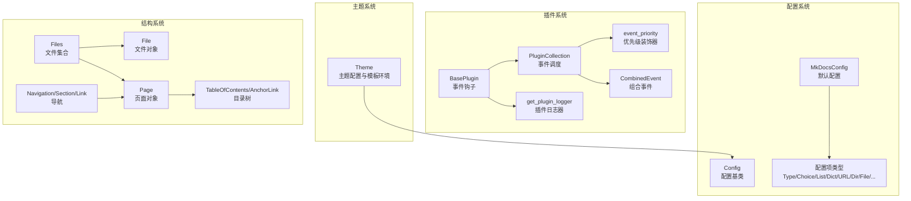
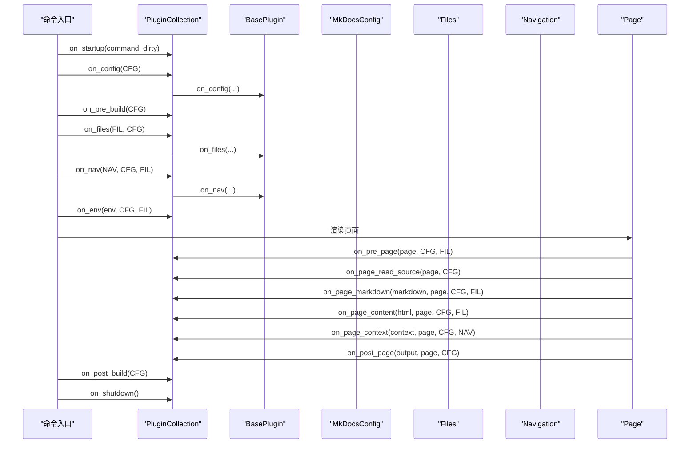
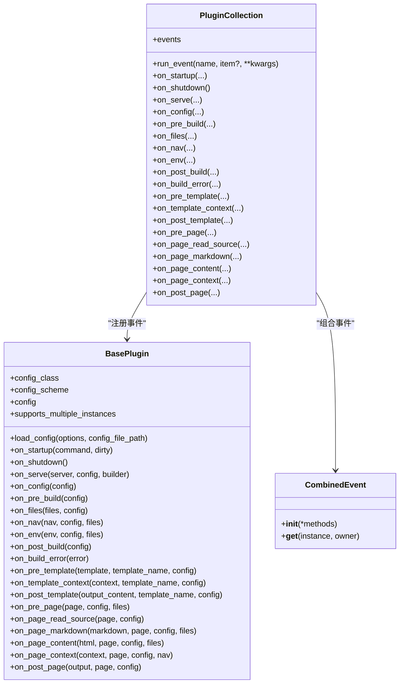
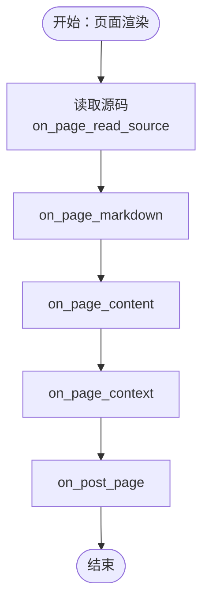
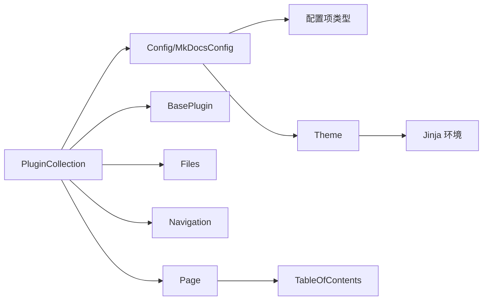

# API 参考

<cite>
**本文引用的文件**
- [mkdocs/plugins.py](file://mkdocs/plugins.py)
- [mkdocs/theme.py](file://mkdocs/theme.py)
- [mkdocs/config/base.py](file://mkdocs/config/base.py)
- [mkdocs/config/defaults.py](file://mkdocs/config/defaults.py)
- [mkdocs/config/config_options.py](file://mkdocs/config/config_options.py)
- [mkdocs/structure/pages.py](file://mkdocs/structure/pages.py)
- [mkdocs/structure/nav.py](file://mkdocs/structure/nav.py)
- [mkdocs/structure/toc.py](file://mkdocs/structure/toc.py)
- [mkdocs/structure/files.py](file://mkdocs/structure/files.py)
- [mkdocs/exceptions.py](file://mkdocs/exceptions.py)
- [mkdocs/tests/plugin_tests.py](file://mkdocs/tests/plugin_tests.py)
- [mkdocs/tests/config/config_options_tests.py](file://mkdocs/tests/config/config_options_tests.py)
</cite>

## 目录
1. [简介](#简介)
2. [项目结构](#项目结构)
3. [核心组件](#核心组件)
4. [架构总览](#架构总览)
5. [详细组件分析](#详细组件分析)
6. [依赖关系分析](#依赖关系分析)
7. [性能考量](#性能考量)
8. [故障排查指南](#故障排查指南)
9. [结论](#结论)
10. [附录](#附录)

## 简介
本文件为 MkDocs 扩展开发的完整 API 参考，覆盖以下方面：
- 插件 API：BasePlugin 类、事件钩子、优先级与组合事件、日志器、插件集合等
- 主题 API：Theme 类的核心接口与配置项
- 配置 API：Config 基类、配置项类型、验证规则与默认值、严格模式
- 结构 API：页面、导航、TOC 的数据模型与处理流程
- 错误类型与异常处理：MkDocs 异常体系及常见错误场景

## 项目结构
围绕扩展开发的关键模块如下：
- 插件系统：插件基类、事件分发、优先级与组合事件、插件日志器
- 主题系统：Theme 类及其模板环境构建
- 配置系统：Config 基类、配置项类型、默认配置、严格模式
- 结构系统：文件、页面、导航、目录树（TOC）
- 异常体系：统一的异常类型与错误传播

图表来源
- [mkdocs/plugins.py](file://mkdocs/plugins.py#L58-L698)
- [mkdocs/theme.py](file://mkdocs/theme.py#L23-L167)
- [mkdocs/config/base.py](file://mkdocs/config/base.py#L123-L393)
- [mkdocs/config/defaults.py](file://mkdocs/config/defaults.py#L38-L219)
- [mkdocs/config/config_options.py](file://mkdocs/config/config_options.py#L323-L800)
- [mkdocs/structure/files.py](file://mkdocs/structure/files.py#L62-L627)
- [mkdocs/structure/pages.py](file://mkdocs/structure/pages.py#L35-L570)
- [mkdocs/structure/nav.py](file://mkdocs/structure/nav.py#L21-L252)
- [mkdocs/structure/toc.py](file://mkdocs/structure/toc.py#L20-L81)

章节来源
- [mkdocs/plugins.py](file://mkdocs/plugins.py#L58-L698)
- [mkdocs/theme.py](file://mkdocs/theme.py#L23-L167)
- [mkdocs/config/base.py](file://mkdocs/config/base.py#L123-L393)
- [mkdocs/config/defaults.py](file://mkdocs/config/defaults.py#L38-L219)
- [mkdocs/config/config_options.py](file://mkdocs/config/config_options.py#L323-L800)
- [mkdocs/structure/files.py](file://mkdocs/structure/files.py#L62-L627)
- [mkdocs/structure/pages.py](file://mkdocs/structure/pages.py#L35-L570)
- [mkdocs/structure/nav.py](file://mkdocs/structure/nav.py#L21-L252)
- [mkdocs/structure/toc.py](file://mkdocs/structure/toc.py#L20-L81)

## 核心组件

### 插件 API
- BasePlugin：所有插件应继承的基类，支持泛型配置类；提供大量事件钩子方法；支持多实例标记；提供 load_config 方法加载与校验配置。
- PluginCollection：插件集合，负责注册事件、按优先级排序、统一调度事件；提供 run_event 方法执行事件链。
- event_priority：事件优先级装饰器，用于控制同一事件多个处理器的顺序。
- CombinedEvent：将多个子处理器合并为一个事件名下的处理器，便于复杂事件编排。
- get_plugin_logger：为插件提供带前缀的日志器。

章节来源
- [mkdocs/plugins.py](file://mkdocs/plugins.py#L58-L698)

### 主题 API
- Theme：主题对象，封装主题名称、自定义模板目录、静态模板集、语言区域等；提供 get_env 构建 Jinja 环境；支持主题继承与配置合并。

章节来源
- [mkdocs/theme.py](file://mkdocs/theme.py#L23-L167)

### 配置 API
- Config：配置基类，定义 schema、默认值、预/运行/后验证阶段；提供 load_dict、load_file、validate 等方法。
- MkDocsConfig：MkDocs 根配置，定义站点名称、导航、目录、主题、插件、验证级别、严格模式等。
- 配置项类型：Type、Choice、Optional、ListOfItems、DictOfItems、URL、Dir、File、SiteDir、Plugins、Hooks、Theme、MarkdownExtensions、EditURI/EditURITemplate、RepoName、Deprecated 等。

章节来源
- [mkdocs/config/base.py](file://mkdocs/config/base.py#L123-L393)
- [mkdocs/config/defaults.py](file://mkdocs/config/defaults.py#L38-L219)
- [mkdocs/config/config_options.py](file://mkdocs/config/config_options.py#L323-L800)

### 结构 API
- Files/ File：文件集合与文件对象，支持虚拟文件生成、内容读写、URL/路径计算、排除规则。
- Page：页面对象，包含标题、元数据、渲染后的 HTML、TOC、编辑链接、上一页/下一页等导航信息。
- Navigation/Section/Link：导航树，支持从配置或自动推断生成，补全父子关系与前后页关系。
- TableOfContents/AnchorLink：页面目录树，由 Markdown TOC 扩展生成，首项默认激活。

章节来源
- [mkdocs/structure/files.py](file://mkdocs/structure/files.py#L62-L627)
- [mkdocs/structure/pages.py](file://mkdocs/structure/pages.py#L35-L570)
- [mkdocs/structure/nav.py](file://mkdocs/structure/nav.py#L21-L252)
- [mkdocs/structure/toc.py](file://mkdocs/structure/toc.py#L20-L81)

### 错误类型与异常处理
- MkDocsException：基础异常类
- Abort：中止构建（系统退出码 1）
- ConfigurationError：配置校验错误
- BuildError：构建期错误
- PluginError：插件事件中可抛出的构建错误

章节来源
- [mkdocs/exceptions.py](file://mkdocs/exceptions.py#L6-L42)

## 架构总览
下面以序列图展示一次构建期间插件事件的典型调用链：

图表来源
- [mkdocs/plugins.py](file://mkdocs/plugins.py#L575-L647)
- [mkdocs/structure/files.py](file://mkdocs/structure/files.py#L546-L589)
- [mkdocs/structure/nav.py](file://mkdocs/structure/nav.py#L130-L186)
- [mkdocs/structure/pages.py](file://mkdocs/structure/pages.py#L263-L327)

## 详细组件分析

### 插件系统：BasePlugin 与 PluginCollection
- BasePlugin
  - 泛型配置：通过 [BasePlugin[Cfg]](file://mkdocs/plugins.py#L72-L76) 消除显式 config_class 赋值
  - 配置加载：[load_config](file://mkdocs/plugins.py#L85-L97) 支持 LegacyConfig 与新式 Config
  - 事件钩子：一次性事件（startup/shutdown/serve）、全局事件（config/pre_build/files/nav/env/post_build/build_error）、模板事件（pre_template/template_context/post_template）、页面事件（pre_page/page_read_source/page_markdown/page_content/page_context/post_page）
  - 多实例支持：supports_multiple_instances 控制是否允许重复添加同名插件
- PluginCollection
  - 注册事件：在 __setitem__ 中扫描 on_* 方法并注册到 events 字典
  - 事件调度：run_event 按优先级顺序调用，支持传入“被修改对象”或返回新对象
  - 优先级与组合：event_priority 装饰器设置 mkdocs_priority；CombinedEvent 将多个子方法合并为单一事件
  - 冲突告警：当多个插件注册同一事件（如 page_read_source）时发出警告

图表来源
- [mkdocs/plugins.py](file://mkdocs/plugins.py#L58-L698)

章节来源
- [mkdocs/plugins.py](file://mkdocs/plugins.py#L58-L698)

### 事件优先级与组合事件
- 优先级装饰器：[event_priority](file://mkdocs/plugins.py#L426-L458) 设置 mkdocs_priority，默认优先级推荐值：100（最早）、50（早）、0（默认）、-50（晚）、-100（最晚）
- 组合事件：[CombinedEvent](file://mkdocs/plugins.py#L460-L491) 允许将多个子处理器合并为同一事件名，子方法命名不可以 on_ 开头
- 测试参考：事件注册与优先级排序、多重 page_read_source 冲突告警

章节来源
- [mkdocs/plugins.py](file://mkdocs/plugins.py#L426-L491)
- [mkdocs/tests/plugin_tests.py](file://mkdocs/tests/plugin_tests.py#L105-L200)

### 插件日志器
- [get_plugin_logger](file://mkdocs/plugins.py#L677-L698) 返回带前缀的 Logger，便于区分插件输出

章节来源
- [mkdocs/plugins.py](file://mkdocs/plugins.py#L677-L698)

### 主题系统：Theme
- 初始化参数：name、custom_dir、static_templates、locale、用户配置键值
- 目录与模板：dirs 由 custom_dir → 主题目录 → MkDocs 内置模板目录组成；static_templates 合并主题与用户配置
- 验证与继承：读取 mkdocs_theme.yml，支持 extends 父主题；校验 locale 并安装翻译
- 环境构建：FileSystemLoader + 禁用自动重载；注册 url/script_tag 过滤器；安装翻译

章节来源
- [mkdocs/theme.py](file://mkdocs/theme.py#L23-L167)

### 配置系统：Config 与 MkDocsConfig
- Config 基类
  - schema 定义：通过类属性声明配置项；支持 pre_validation/run_validation/post_validation
  - 默认值：set_defaults 从 schema 提取默认值
  - 加载与校验：load_dict/load_file；validate 分三段执行
- MkDocsConfig
  - 核心配置项：site_name、nav、site_url、theme、docs_dir、site_dir、use_directory_urls、repo_url/repo_name/edit_uri/edit_uri_template、extra_css/extra_javascript/extra_templates、markdown_extensions/mdx_configs、strict、plugins/hooks/watch、validation（nav/links）
  - 验证级别：_LogLevel/_AbsoluteLinksValidation
- 配置项类型
  - 基础类型：Type、Choice、Optional
  - 容器类型：ListOfItems、DictOfItems、SubConfig/PropagatingSubConfig
  - 文件与路径：Dir、File、SiteDir、ListOfPaths
  - URL/网络：URL、IpAddress、RepoURL（弃用）、EditURI/EditURITemplate、RepoName
  - 特殊：Theme、Plugins、Hooks、MarkdownExtensions、Deprecated
  - 测试参考：类型校验、长度约束、可选包装、弃用迁移、列表/字典容器校验

章节来源
- [mkdocs/config/base.py](file://mkdocs/config/base.py#L123-L393)
- [mkdocs/config/defaults.py](file://mkdocs/config/defaults.py#L38-L219)
- [mkdocs/config/config_options.py](file://mkdocs/config/config_options.py#L323-L800)
- [mkdocs/tests/config/config_options_tests.py](file://mkdocs/tests/config/config_options_tests.py#L66-L200)

### 结构系统：文件、页面、导航、目录树
- Files/ File
  - 文件集合：documentation_pages/static_pages/media_files/javascript_files/css_files
  - 文件对象：src_uri/dest_uri/url、content_bytes/content_string、copy_file/is_modified、is_documentation_page/is_static_page/is_media_file/is_javascript/is_css
  - 排除规则：exclude_docs/draft_docs/not_in_nav；set_exclusions
- Page
  - 属性：title/markdown/content/toc/meta、canonical_url/abs_url/edit_url、previous_page/next_page
  - 渲染：read_source → render（Markdown 扩展、提取锚点、相对路径处理、标题提取）
  - 链接校验：validate_anchor_links
- Navigation/Section/Link
  - 导航生成：get_navigation（从配置或自动推断），补全 homepage/pages、父子关系、前后页
  - 验证：导航/链接绝对路径与未找到告警
- TableOfContents/AnchorLink
  - 由 get_toc 生成，首项默认激活

图表来源
- [mkdocs/structure/pages.py](file://mkdocs/structure/pages.py#L208-L327)
- [mkdocs/plugins.py](file://mkdocs/plugins.py#L626-L646)

章节来源
- [mkdocs/structure/files.py](file://mkdocs/structure/files.py#L62-L627)
- [mkdocs/structure/pages.py](file://mkdocs/structure/pages.py#L35-L570)
- [mkdocs/structure/nav.py](file://mkdocs/structure/nav.py#L130-L252)
- [mkdocs/structure/toc.py](file://mkdocs/structure/toc.py#L20-L81)

## 依赖关系分析
- 插件系统依赖配置系统（传递 config 对象）、结构系统（Files/Navigation/Page）、模板系统（Jinja 环境）
- 主题系统依赖配置系统（Theme 作为配置项）、本地化系统（翻译）
- 配置系统依赖多种配置项类型与验证器
- 结构系统依赖 utils 工具函数与 Markdown 扩展

图表来源
- [mkdocs/plugins.py](file://mkdocs/plugins.py#L58-L698)
- [mkdocs/theme.py](file://mkdocs/theme.py#L23-L167)
- [mkdocs/config/base.py](file://mkdocs/config/base.py#L123-L393)
- [mkdocs/config/defaults.py](file://mkdocs/config/defaults.py#L38-L219)
- [mkdocs/structure/files.py](file://mkdocs/structure/files.py#L62-L627)
- [mkdocs/structure/nav.py](file://mkdocs/structure/nav.py#L21-L252)
- [mkdocs/structure/pages.py](file://mkdocs/structure/pages.py#L35-L570)
- [mkdocs/structure/toc.py](file://mkdocs/structure/toc.py#L20-L81)

## 性能考量
- 事件调度：PluginCollection 使用二分插入按优先级维护事件列表，避免重复排序开销
- 配置验证：Config.validate 分阶段执行，前置校验失败不影响运行校验，后置校验仅在无失败时进行
- 文件复制：Files.copy_static_files 支持 dirty 模式跳过未修改文件
- 目录树：get_toc 仅对非空 TOC 列表做首项激活，避免多余操作

## 故障排查指南
- 配置错误
  - 使用 [ValidationError](file://mkdocs/config/base.py#L109-L114) 抛出校验失败
  - 严格模式：MkDocsConfig.strict 为 True 时，任何警告也会导致中止
  - 常见问题：类型不匹配、必填缺失、弃用项迁移、列表/字典格式错误
- 构建错误
  - 页面链接无效：Navigation/Link 与 Page._RelativePathTreeprocessor 的告警级别可配置
  - 锚点缺失：Page.validate_anchor_links 输出详细上下文
- 插件错误
  - 在事件中抛出 [PluginError](file://mkdocs/exceptions.py#L37-L42) 或 [BuildError](file://mkdocs/exceptions.py#L30-L35)，MkDocs 将中止构建
  - 多个插件注册同一事件（如 page_read_source）会触发冲突告警

章节来源
- [mkdocs/exceptions.py](file://mkdocs/exceptions.py#L6-L42)
- [mkdocs/structure/nav.py](file://mkdocs/structure/nav.py#L164-L185)
- [mkdocs/structure/pages.py](file://mkdocs/structure/pages.py#L304-L327)
- [mkdocs/tests/plugin_tests.py](file://mkdocs/tests/plugin_tests.py#L162-L184)

## 结论
本文档系统性梳理了 MkDocs 扩展开发所需的插件、主题、配置与结构 API，给出了事件钩子、配置项类型、验证规则与默认值、错误类型与异常处理的权威参考。建议在实现插件时：
- 明确事件生命周期与优先级，合理使用 CombinedEvent 编排复杂逻辑
- 通过 MkDocsConfig 的 validation 与 strict 保障配置质量
- 借助 Theme 的 get_env 与静态模板机制扩展主题能力
- 严格遵循配置项类型与默认值约定，减少运行时错误

## 附录

### 插件事件钩子一览（按阶段）
- 一次性事件
  - on_startup(command, dirty)
  - on_shutdown()
  - on_serve(server, config, builder)
- 全局事件
  - on_config(config)
  - on_pre_build(config)
  - on_files(files, config)
  - on_nav(nav, config, files)
  - on_env(env, config, files)
  - on_post_build(config)
  - on_build_error(error)
- 模板事件
  - on_pre_template(template, template_name, config)
  - on_template_context(context, template_name, config)
  - on_post_template(output_content, template_name, config)
- 页面事件
  - on_pre_page(page, config, files)
  - on_page_read_source(page, config)
  - on_page_markdown(markdown, page, config, files)
  - on_page_content(html, page, config, files)
  - on_page_context(context, page, config, nav)
  - on_post_page(output, page, config)

章节来源
- [mkdocs/plugins.py](file://mkdocs/plugins.py#L100-L417)

### 配置项类型与默认值要点
- Type/Tuple/Length：类型与长度校验
- Choice：枚举值校验与默认值
- Optional：可空包装，禁止已有默认值再次包装
- ListOfItems/DictOfItems：容器元素逐一校验
- URL/IpAddress：URL 校验与端口解析
- Dir/File/SiteDir：路径存在性与互斥校验
- Theme：主题名称/自定义目录/静态模板/语言区域
- Plugins/Hooks：插件列表与动态导入
- MarkdownExtensions：内置扩展与配置映射
- Deprecated：弃用项迁移与警告

章节来源
- [mkdocs/config/config_options.py](file://mkdocs/config/config_options.py#L323-L800)
- [mkdocs/config/defaults.py](file://mkdocs/config/defaults.py#L38-L219)