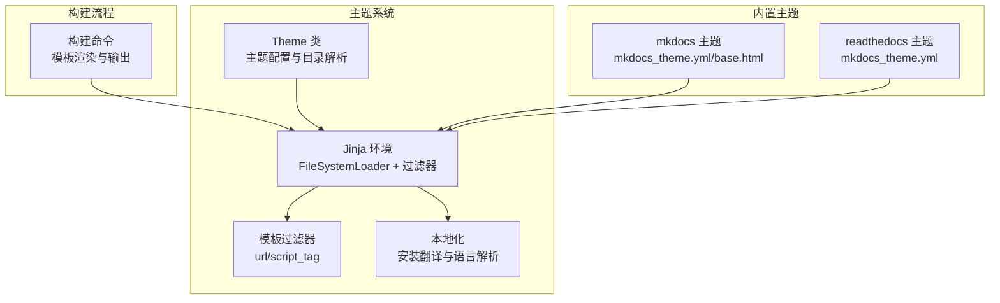
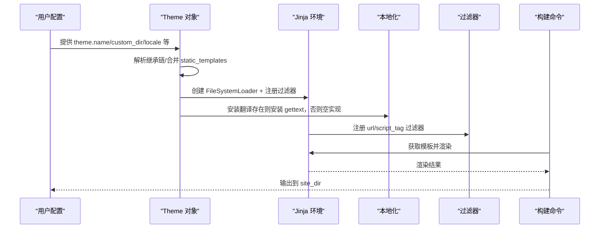
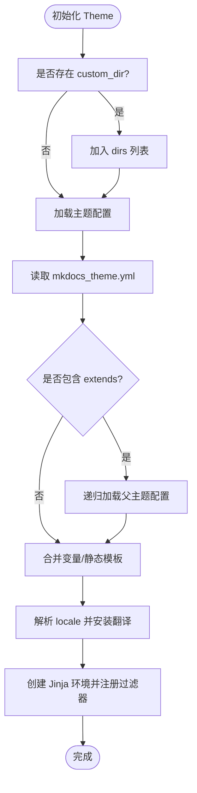
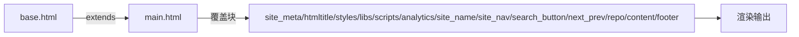
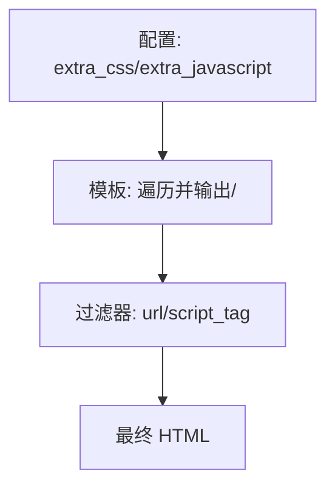
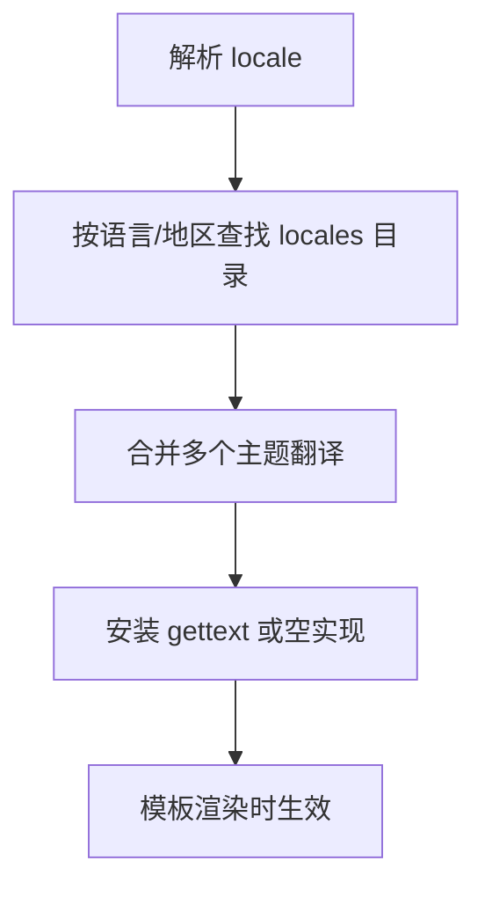
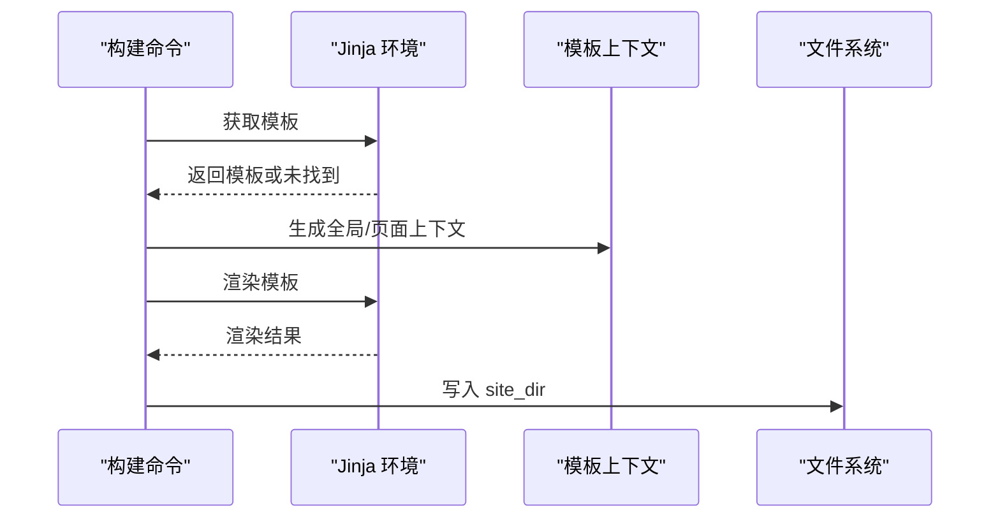
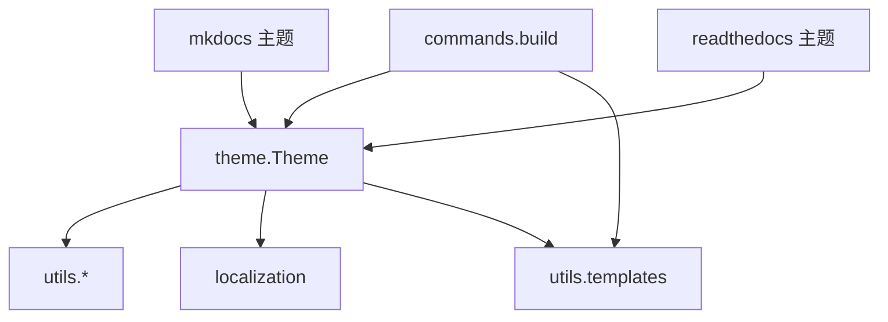

# 主题开发

<cite>
**本文引用的文件**
- [mkdocs/theme.py](file://mkdocs/theme.py)
- [mkdocs/localization.py](file://mkdocs/localization.py)
- [mkdocs/utils/templates.py](file://mkdocs/utils/templates.py)
- [mkdocs/utils/__init__.py](file://mkdocs/utils/__init__.py)
- [mkdocs/commands/build.py](file://mkdocs/commands/build.py)
- [mkdocs/themes/mkdocs/mkdocs_theme.yml](file://mkdocs/themes/mkdocs/mkdocs_theme.yml)
- [mkdocs/themes/readthedocs/mkdocs_theme.yml](file://mkdocs/themes/readthedocs/mkdocs_theme.yml)
- [mkdocs/themes/mkdocs/base.html](file://mkdocs/themes/mkdocs/base.html)
- [mkdocs/themes/mkdocs/main.html](file://mkdocs/themes/mkdocs/main.html)
- [mkdocs/themes/babel.cfg](file://mkdocs/themes/babel.cfg)
- [docs/dev-guide/themes.md](file://docs/dev-guide/themes.md)
- [docs/user-guide/customizing-your-theme.md](file://docs/user-guide/customizing-your-theme.md)
- [mkdocs/tests/theme_tests.py](file://mkdocs/tests/theme_tests.py)
- [mkdocs/config/config_options.py](file://mkdocs/config/config_options.py)
</cite>

## 目录
1. [引言](#引言)
2. [项目结构](#项目结构)
3. [核心组件](#核心组件)
4. [架构总览](#架构总览)
5. [详细组件分析](#详细组件分析)
6. [依赖关系分析](#依赖关系分析)
7. [性能考量](#性能考量)
8. [故障排查指南](#故障排查指南)
9. [结论](#结论)
10. [附录](#附录)

## 引言
本指南面向希望开发、定制与发布 MkDocs 主题的工程师与文档作者。内容覆盖主题系统架构、模板继承、静态资源与国际化、主题配置项、自定义开发流程、继承与覆盖机制、打包与版本管理策略，以及性能优化与浏览器兼容性建议。读者无需深入源码即可理解并实践。

## 项目结构
MkDocs 的主题系统由“主题对象”“模板环境”“构建流程”“本地化与过滤器”“内置主题与示例配置”构成。下图展示与主题开发直接相关的模块与文件：

图表来源
- [mkdocs/theme.py](file://mkdocs/theme.py#L23-L166)
- [mkdocs/utils/templates.py](file://mkdocs/utils/templates.py#L25-L56)
- [mkdocs/localization.py](file://mkdocs/localization.py#L38-L92)
- [mkdocs/commands/build.py](file://mkdocs/commands/build.py#L91-L122)
- [mkdocs/themes/mkdocs/mkdocs_theme.yml](file://mkdocs/themes/mkdocs/mkdocs_theme.yml#L1-L29)
- [mkdocs/themes/readthedocs/mkdocs_theme.yml](file://mkdocs/themes/readthedocs/mkdocs_theme.yml#L1-L26)
- [mkdocs/themes/mkdocs/base.html](file://mkdocs/themes/mkdocs/base.html#L1-L252)

章节来源
- [mkdocs/theme.py](file://mkdocs/theme.py#L23-L166)
- [mkdocs/utils/templates.py](file://mkdocs/utils/templates.py#L25-L56)
- [mkdocs/localization.py](file://mkdocs/localization.py#L38-L92)
- [mkdocs/commands/build.py](file://mkdocs/commands/build.py#L91-L122)
- [mkdocs/themes/mkdocs/mkdocs_theme.yml](file://mkdocs/themes/mkdocs/mkdocs_theme.yml#L1-L29)
- [mkdocs/themes/readthedocs/mkdocs_theme.yml](file://mkdocs/themes/readthedocs/mkdocs_theme.yml#L1-L26)
- [mkdocs/themes/mkdocs/base.html](file://mkdocs/themes/mkdocs/base.html#L1-L252)

## 核心组件
- 主题对象（Theme）：负责加载主题配置、解析继承链、合并目录优先级、注册过滤器与本地化，并生成 Jinja 环境。
- 模板过滤器（url、script_tag）：统一处理相对/绝对 URL 与脚本标签生成，兼容新旧版本 extra_javascript。
- 本地化（i18n）：解析 locale、合并多主题翻译、安装 gettext 扩展或空实现。
- 构建命令（build）：按模板名查找模板、构建上下文、渲染输出、写入站点目录。
- 内置主题（mkdocs、readthedocs）：提供配置样例与模板基线，便于继承与覆盖。

章节来源
- [mkdocs/theme.py](file://mkdocs/theme.py#L23-L166)
- [mkdocs/utils/templates.py](file://mkdocs/utils/templates.py#L25-L56)
- [mkdocs/localization.py](file://mkdocs/localization.py#L38-L92)
- [mkdocs/commands/build.py](file://mkdocs/commands/build.py#L91-L122)

## 架构总览
主题系统以“配置驱动 + 模板继承 + 资源与国际化”为核心，形成可扩展、可覆盖、可本地化的前端渲染层。

图表来源
- [mkdocs/theme.py](file://mkdocs/theme.py#L124-L166)
- [mkdocs/localization.py](file://mkdocs/localization.py#L45-L64)
- [mkdocs/utils/templates.py](file://mkdocs/utils/templates.py#L37-L56)
- [mkdocs/commands/build.py](file://mkdocs/commands/build.py#L91-L122)

## 详细组件分析

### 组件 A：主题对象与继承机制
- 目录优先级：custom_dir → 主题目录（含继承链） → MkDocs 内置模板目录。
- 继承链：读取 mkdocs_theme.yml 的 extends 字段，递归加载父主题，后加载的父主题在前，最终目录顺序为“子主题 → 父主题 → 内置模板”。
- 静态模板：合并 theme.static_templates 与内置模板集合。
- 本地化：解析 locale 并安装翻译；若无 babel，则安装空翻译扩展。
- 环境：禁用自动重载，注册 url/script_tag 过滤器，安装翻译。

图表来源
- [mkdocs/theme.py](file://mkdocs/theme.py#L54-L95)
- [mkdocs/theme.py](file://mkdocs/theme.py#L124-L166)
- [mkdocs/localization.py](file://mkdocs/localization.py#L45-L64)

章节来源
- [mkdocs/theme.py](file://mkdocs/theme.py#L54-L95)
- [mkdocs/theme.py](file://mkdocs/theme.py#L124-L166)
- [mkdocs/tests/theme_tests.py](file://mkdocs/tests/theme_tests.py#L88-L106)

### 组件 B：模板继承与覆盖
- 基础模板：mkdocs 主题通过 base.html 定义块（如 htmltitle、styles、scripts、analytics 等），子主题通过 main.html 继承并覆盖块。
- 覆盖策略：在 custom_dir 中放置同名模板文件即可覆盖父主题；未覆盖的文件仍沿用父主题。
- 搜索与导航：模板中通过条件判断插件是否启用，避免在未启用时产生错误。

图表来源
- [mkdocs/themes/mkdocs/base.html](file://mkdocs/themes/mkdocs/base.html#L1-L252)
- [mkdocs/themes/mkdocs/main.html](file://mkdocs/themes/mkdocs/main.html#L1-L11)

章节来源
- [docs/user-guide/customizing-your-theme.md](file://docs/user-guide/customizing-your-theme.md#L130-L175)
- [docs/dev-guide/themes.md](file://docs/dev-guide/themes.md#L111-L125)
- [mkdocs/themes/mkdocs/base.html](file://mkdocs/themes/mkdocs/base.html#L1-L252)
- [mkdocs/themes/mkdocs/main.html](file://mkdocs/themes/mkdocs/main.html#L1-L11)

### 组件 C：静态资源管理与脚本注入
- extra_css/extra_javascript：主题需显式链接这些资源；脚本支持类型、异步/延迟属性，使用 script_tag 过滤器生成安全标签。
- URL 规范化：url 过滤器根据页面上下文与 base_url 生成相对/绝对路径，避免跨页链接错误。

图表来源
- [docs/dev-guide/themes.md](file://docs/dev-guide/themes.md#L126-L177)
- [mkdocs/utils/templates.py](file://mkdocs/utils/templates.py#L25-L56)

章节来源
- [docs/dev-guide/themes.md](file://docs/dev-guide/themes.md#L126-L177)
- [mkdocs/utils/templates.py](file://mkdocs/utils/templates.py#L25-L56)

### 组件 D：国际化与翻译
- locale 解析：支持语言与地区组合，无效值抛出验证错误。
- 翻译合并：从多个主题目录加载翻译并合并，优先使用具体区域，找不到则回退到通用语言。
- 回退策略：无 babel 时安装空翻译扩展，避免运行时异常。

图表来源
- [mkdocs/localization.py](file://mkdocs/localization.py#L38-L92)
- [mkdocs/themes/babel.cfg](file://mkdocs/themes/babel.cfg#L1-L7)

章节来源
- [mkdocs/localization.py](file://mkdocs/localization.py#L38-L92)
- [mkdocs/themes/babel.cfg](file://mkdocs/themes/babel.cfg#L1-L7)

### 组件 E：构建与模板渲染
- 模板查找：按名称在 Theme 的 dirs 中查找模板，不存在则跳过。
- 上下文构建：聚合导航、页面、基础 URL、额外 CSS/JS、版本与构建时间等。
- 输出写入：渲染成功则写入 site_dir；sitemap.xml 可选压缩。

图表来源
- [mkdocs/commands/build.py](file://mkdocs/commands/build.py#L91-L122)
- [mkdocs/commands/build.py](file://mkdocs/commands/build.py#L29-L58)

章节来源
- [mkdocs/commands/build.py](file://mkdocs/commands/build.py#L91-L122)
- [mkdocs/commands/build.py](file://mkdocs/commands/build.py#L29-L58)

## 依赖关系分析
- 主题对象依赖 utils（入口点发现、主题目录缓存）、localization（i18n）、utils.templates（过滤器）。
- 构建命令依赖 Theme 生成的 Jinja 环境与上下文。
- 内置主题提供配置与模板基线，供继承与覆盖。

图表来源
- [mkdocs/theme.py](file://mkdocs/theme.py#L16-L18)
- [mkdocs/utils/__init__.py](file://mkdocs/utils/__init__.py#L256-L287)
- [mkdocs/commands/build.py](file://mkdocs/commands/build.py#L91-L122)

章节来源
- [mkdocs/theme.py](file://mkdocs/theme.py#L16-L18)
- [mkdocs/utils/__init__.py](file://mkdocs/utils/__init__.py#L256-L287)
- [mkdocs/commands/build.py](file://mkdocs/commands/build.py#L91-L122)

## 性能考量
- 模板自动重载关闭：Theme 环境禁用自动重载，避免构建过程中模板编辑导致的开销与不一致。
- 静态模板与资源：仅模板文件参与渲染，其他文件按同名复制；合理组织静态资源可减少重复请求。
- 搜索索引：根据主题配置决定是否仅生成索引或提供完整搜索实现，避免不必要的脚本与模板注入。
- URL 规范化：使用 url 过滤器减少跨页链接错误，降低调试成本。

章节来源
- [mkdocs/theme.py](file://mkdocs/theme.py#L160-L162)
- [docs/dev-guide/themes.md](file://docs/dev-guide/themes.md#L741-L770)
- [mkdocs/utils/templates.py](file://mkdocs/utils/templates.py#L37-L40)

## 故障排查指南
- 主题继承链错误：当 extends 指向未安装主题时，会抛出验证错误，检查已安装主题列表与名称一致性。
- 自定义目录不存在：custom_dir 必须存在且可访问，否则触发路径校验错误。
- 本地化无效：locale 必须为字符串，且符合语言/地区格式，否则抛出验证错误。
- 模板缺失：找不到模板时会记录警告并跳过，确认模板名与目录结构正确。
- extra_javascript 兼容性：使用 script_tag 过滤器以适配新旧版本字段差异。

章节来源
- [mkdocs/theme.py](file://mkdocs/theme.py#L146-L153)
- [mkdocs/tests/config/config_options_legacy_tests.py](file://mkdocs/tests/config/config_options_legacy_tests.py#L1024-L1038)
- [mkdocs/tests/config/config_options_legacy_tests.py](file://mkdocs/tests/config/config_options_legacy_tests.py#L1040-L1066)
- [mkdocs/commands/build.py](file://mkdocs/commands/build.py#L97-L101)
- [docs/dev-guide/themes.md](file://docs/dev-guide/themes.md#L132-L177)

## 结论
MkDocs 主题系统以清晰的配置与继承模型、完善的模板过滤器与本地化能力、稳健的构建流程，为文档站点提供了高度可定制的前端渲染层。遵循本文档的开发流程与最佳实践，可高效实现主题的创建、定制、继承覆盖、国际化与性能优化。

## 附录

### A. 主题配置文件结构与参数
- mkdocs 主题配置要点
  - static_templates：静态模板集合（默认包含 404.html 与内置 sitemap.xml）。
  - locale：默认语言。
  - include_search_page：是否生成独立搜索页。
  - search_index_only：仅生成索引。
  - highlightjs：是否启用高亮与语言列表、样式主题。
  - navigation_depth/nav_style/color_mode/user_color_mode_toggle：导航深度、风格、颜色模式与用户切换。
  - analytics.gtag：Google Analytics ID。
  - shortcuts：键盘快捷键映射。

- readthedocs 主题配置要点
  - static_templates：静态模板集合。
  - locale：默认语言。
  - include_search_page：是否生成独立搜索页。
  - search_index_only：仅生成索引。
  - highlightjs：是否启用高亮与语言列表、样式主题。
  - analytics.gtag/anonymize_ip：分析配置。
  - include_homepage_in_sidebar/prev_next_buttons_location/navigation_depth/titles_only/sticky_navigation/collapse_navigation/logo：导航与布局选项。

章节来源
- [mkdocs/themes/mkdocs/mkdocs_theme.yml](file://mkdocs/themes/mkdocs/mkdocs_theme.yml#L1-L29)
- [mkdocs/themes/readthedocs/mkdocs_theme.yml](file://mkdocs/themes/readthedocs/mkdocs_theme.yml#L1-L26)

### B. 自定义主题开发流程
- 选择方式
  - 仅使用 custom_dir：适合完全自定义主题，mkdocs_theme.yml 配置需在主题配置中完整声明。
  - 继承现有主题：在 custom_dir 中仅覆盖需要的部分，其余沿用父主题。
- 模板与资源
  - main.html 继承 base.html 并覆盖所需块。
  - 在模板中显式引入 extra_css/extra_javascript。
  - 图片、字体等静态资源放置于对应目录，按同名复制到站点。
- 国际化
  - 在 locales 目录提供翻译文件，遵循 babel.cfg 提取规则。
  - 使用 trans/endtrans 包裹可翻译文本。
- 搜索与导航
  - 根据主题配置 include_search_page 与 search_index_only 决定搜索实现方式。
  - 在模板中按插件启用状态插入搜索相关元素与脚本。

章节来源
- [docs/dev-guide/themes.md](file://docs/dev-guide/themes.md#L22-L80)
- [docs/dev-guide/themes.md](file://docs/dev-guide/themes.md#L178-L218)
- [docs/dev-guide/themes.md](file://docs/dev-guide/themes.md#L691-L800)
- [docs/user-guide/customizing-your-theme.md](file://docs/user-guide/customizing-your-theme.md#L47-L129)

### C. 主题打包、分发与版本管理
- 入口点：通过 Python 入口点注册主题名称与包路径，Theme 对象据此定位主题目录。
- 版本冲突：同一名称主题来自不同包时发出警告，以最后加载者为准。
- 分发建议：提供完整的 mkdocs_theme.yml、模板与静态资源；在文档中说明配置项与覆盖方式；遵循语义化版本并标注最低 MkDocs 版本要求。

章节来源
- [mkdocs/utils/__init__.py](file://mkdocs/utils/__init__.py#L262-L287)
- [mkdocs/theme.py](file://mkdocs/theme.py#L146-L153)