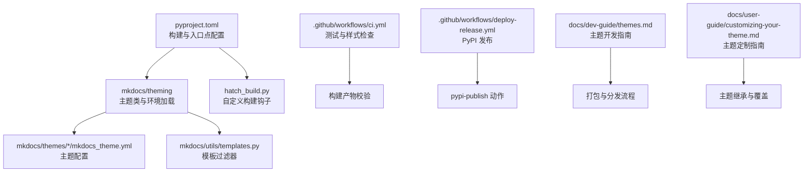
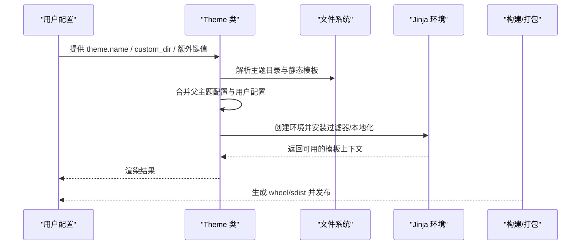
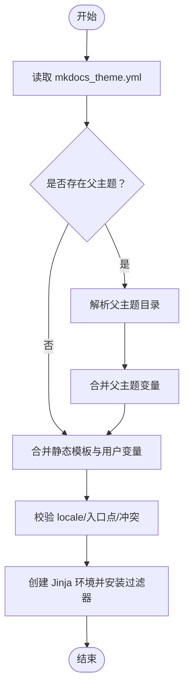
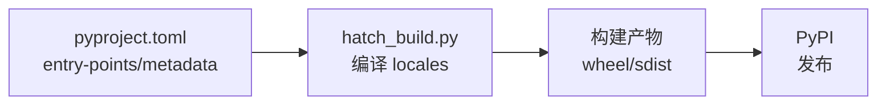
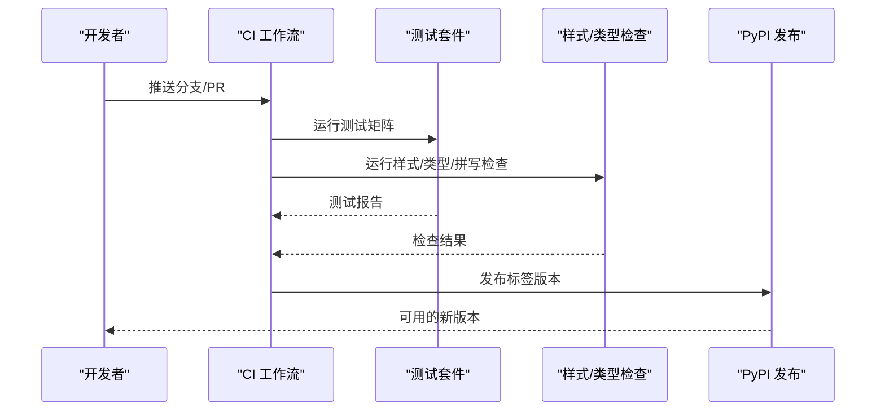
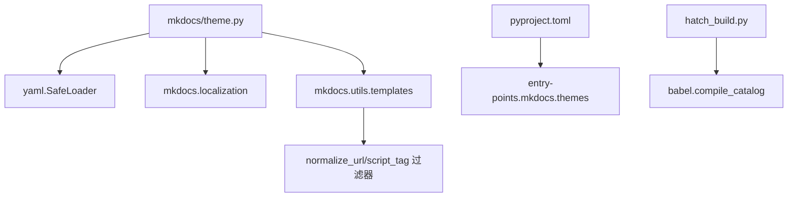

# 主题打包与分发

<cite>
**本文引用的文件**
- [mkdocs\themes\mkdocs\mkdocs_theme.yml](file://mkdocs/themes/mkdocs/mkdocs_theme.yml)
- [mkdocs\themes\readthedocs\mkdocs_theme.yml](file://mkdocs/themes/readthedocs/mkdocs_theme.yml)
- [mkdocs\theme.py](file://mkdocs/theme.py)
- [mkdocs\utils\templates.py](file://mkdocs/utils/templates.py)
- [mkdocs\utils\__init__.py](file://mkdocs/utils/__init__.py)
- [pyproject.toml](file://pyproject.toml)
- [hatch_build.py](file://hatch_build.py)
- [setup.py](file://setup.py)
- [mkdocs\tests\theme_tests.py](file://mkdocs/tests/theme_tests.py)
- [docs\dev-guide\themes.md](file://docs/dev-guide/themes.md)
- [docs\user-guide\customizing-your-theme.md](file://docs/user-guide/customizing-your-theme.md)
- [.github\workflows\ci.yml](file://.github/workflows/ci.yml)
- [.github\workflows\deploy-release.yml](file://.github/workflows/deploy-release.yml)
- [CONTRIBUTING.md](file://CONTRIBUTING.md)
</cite>

## 目录
1. [简介](#简介)
2. [项目结构](#项目结构)
3. [核心组件](#核心组件)
4. [架构总览](#架构总览)
5. [详细组件分析](#详细组件分析)
6. [依赖关系分析](#依赖关系分析)
7. [性能考量](#性能考量)
8. [故障排查指南](#故障排查指南)
9. [结论](#结论)
10. [附录](#附录)

## 简介
本指南面向希望创建、打包与分发 MkDocs 主题的开发者，系统阐述主题打包的标准流程（包结构设计、元数据配置、依赖声明）、分发渠道（PyPI、GitHub、手动分发）、版本管理策略（版本号规范、变更日志维护、向后兼容性）、测试与验证流程（功能测试、兼容性测试、性能测试），以及最佳实践与社区贡献指南。内容基于 MkDocs 源码与官方文档，确保可操作性与一致性。

## 项目结构
围绕主题打包与分发，仓库中与之直接相关的结构要点如下：
- 主题定义与配置：内置主题目录包含主题配置文件与模板资源，用于定义主题行为与默认参数。
- 构建与打包：使用 Hatchling 作为构建后端，通过 pyproject.toml 声明入口点与构建目标；自定义构建钩子在构建时编译主题翻译。
- 测试与验证：单元测试覆盖主题加载、继承、静态模板合并等逻辑；CI/CD 工作流包含测试矩阵、样式检查与发布到 PyPI 的自动化流程。
- 文档与贡献：开发者指南与用户指南明确主题开发、定制与分发流程；贡献指南提供提交与本地开发规范。

图表来源
- [pyproject.toml](file://pyproject.toml#L82-L84)
- [hatch_build.py](file://hatch_build.py#L6-L14)
- [mkdocs\theme.py](file://mkdocs/theme.py#L124-L156)
- [mkdocs\utils\templates.py](file://mkdocs/utils/templates.py#L37-L55)
- [.github\workflows\ci.yml](file://.github/workflows/ci.yml#L86-L104)
- [.github\workflows\deploy-release.yml](file://.github/workflows/deploy-release.yml#L7-L22)

章节来源
- [pyproject.toml](file://pyproject.toml#L1-L240)
- [hatch_build.py](file://hatch_build.py#L1-L15)
- [mkdocs\theme.py](file://mkdocs/theme.py#L1-L167)
- [mkdocs\utils\templates.py](file://mkdocs/utils/templates.py#L1-L56)
- [.github\workflows\ci.yml](file://.github/workflows/ci.yml#L1-L105)
- [.github\workflows\deploy-release.yml](file://.github/workflows/deploy-release.yml#L1-L23)

## 核心组件
- 主题类与配置加载
  - 主题类负责解析主题配置、处理继承链、合并静态模板列表，并为模板渲染提供 Jinja 环境。
  - 配置文件采用 YAML 格式，支持静态模板、导航深度、高亮样式、快捷键、分析配置等键位。
- 构建与打包
  - 使用 Hatchling 作为构建后端，通过入口点注册主题；自定义构建钩子在构建阶段编译主题翻译资源。
  - 构建目标排除测试与源语言文件，仅包含必要的二进制翻译文件与主题资源。
- 测试与验证
  - 单元测试覆盖主题初始化、自定义目录优先级、静态模板合并、继承链加载、空配置回退等场景。
  - CI/CD 包含多 Python 版本与平台矩阵测试、类型检查、样式检查与发布到 PyPI 的自动化流程。
- 文档与贡献
  - 开发者指南提供主题开发、打包与分发的步骤与建议；用户指南说明如何定制现有主题；贡献指南给出提交规范与本地开发流程。

章节来源
- [mkdocs\theme.py](file://mkdocs/theme.py#L23-L167)
- [mkdocs\themes\mkdocs\mkdocs_theme.yml](file://mkdocs/themes/mkdocs/mkdocs_theme.yml#L1-L29)
- [mkdocs\themes\readthedocs\mkdocs_theme.yml](file://mkdocs/themes/readthedocs/mkdocs_theme.yml#L1-L26)
- [pyproject.toml](file://pyproject.toml#L82-L97)
- [hatch_build.py](file://hatch_build.py#L6-L14)
- [mkdocs\tests\theme_tests.py](file://mkdocs/tests/theme_tests.py#L16-L126)
- [.github\workflows\ci.yml](file://.github/workflows/ci.yml#L8-L53)
- [.github\workflows\deploy-release.yml](file://.github/workflows/deploy-release.yml#L7-L22)
- [docs\dev-guide\themes.md](file://docs/dev-guide/themes.md#L827-L1016)
- [docs\user-guide\customizing-your-theme.md](file://docs/user-guide/customizing-your-theme.md#L47-L129)
- [CONTRIBUTING.md](file://CONTRIBUTING.md#L47-L121)

## 架构总览
下图展示主题从配置到渲染的整体流程：主题类读取配置并构建目录搜索路径，合并静态模板，创建 Jinja 环境并安装过滤器与本地化；最终由构建流程产出可分发包。

图表来源
- [mkdocs\theme.py](file://mkdocs/theme.py#L35-L166)
- [mkdocs\utils\templates.py](file://mkdocs/utils/templates.py#L37-L55)
- [pyproject.toml](file://pyproject.toml#L92-L97)

章节来源
- [mkdocs\theme.py](file://mkdocs/theme.py#L124-L166)
- [mkdocs\utils\templates.py](file://mkdocs/utils/templates.py#L25-L55)
- [pyproject.toml](file://pyproject.toml#L92-L97)

## 详细组件分析

### 主题配置与继承
- 配置文件键位
  - 静态模板：控制哪些模板在构建时被当作静态页面处理。
  - 导航与外观：如导航深度、颜色模式、快捷键等。
  - 搜索与高亮：是否包含搜索页、高亮样式与语言列表等。
- 继承机制
  - 主题可通过继承字段指定父主题，实现配置与模板的叠加；若父主题未安装或名称冲突，将触发错误提示。
- 默认行为
  - 若配置文件为空或缺失，主题仍能以最小配置运行，但会丢失部分特性（例如静态模板集合）。

图表来源
- [mkdocs\theme.py](file://mkdocs/theme.py#L124-L156)
- [mkdocs\themes\mkdocs\mkdocs_theme.yml](file://mkdocs/themes/mkdocs/mkdocs_theme.yml#L1-L29)
- [mkdocs\themes\readthedocs\mkdocs_theme.yml](file://mkdocs/themes/readthedocs/mkdocs_theme.yml#L1-L26)

章节来源
- [mkdocs\theme.py](file://mkdocs/theme.py#L124-L156)
- [mkdocs\themes\mkdocs\mkdocs_theme.yml](file://mkdocs/themes/mkdocs/mkdocs_theme.yml#L1-L29)
- [mkdocs\themes\readthedocs\mkdocs_theme.yml](file://mkdocs/themes/readthedocs/mkdocs_theme.yml#L1-L26)

### 构建与打包流程
- 入口点注册
  - 通过项目入口点注册内置主题，使用户可在配置中直接引用。
- 自定义构建钩子
  - 在构建阶段编译主题翻译目录下的消息目录，生成二进制翻译文件，提升运行时效率。
- 构建目标与排除
  - sdist 包含源码与主题资源；wheel 排除测试与源语言文件，仅保留编译后的 mo 文件与主题资源。

图表来源
- [pyproject.toml](file://pyproject.toml#L82-L97)
- [hatch_build.py](file://hatch_build.py#L6-L14)

章节来源
- [pyproject.toml](file://pyproject.toml#L82-L97)
- [hatch_build.py](file://hatch_build.py#L6-L14)

### 测试与验证
- 单元测试覆盖
  - 主题初始化顺序、自定义目录优先级、静态模板合并、继承链加载、空配置回退等。
- CI/CD 覆盖范围
  - 多 Python 版本与平台矩阵测试、类型检查、样式检查、拼写检查、Markdown 与 JS 规范检查，以及发布到 PyPI 的自动化流程。

图表来源
- [.github\workflows\ci.yml](file://.github/workflows/ci.yml#L8-L53)
- [.github\workflows\ci.yml](file://.github/workflows/ci.yml#L86-L104)
- [.github\workflows\deploy-release.yml](file://.github/workflows/deploy-release.yml#L7-L22)

章节来源
- [mkdocs\tests\theme_tests.py](file://mkdocs/tests/theme_tests.py#L16-L126)
- [.github\workflows\ci.yml](file://.github/workflows/ci.yml#L8-L53)
- [.github\workflows\ci.yml](file://.github/workflows/ci.yml#L86-L104)
- [.github\workflows\deploy-release.yml](file://.github/workflows/deploy-release.yml#L7-L22)

### 分发渠道与最佳实践
- PyPI 发布
  - 使用构建工具生成 wheel 与 sdist，通过 GitHub Actions 将发布包上传至 PyPI。
- GitHub 发布
  - 利用标签触发发布工作流，自动构建并发布到 PyPI。
- 手动分发
  - 通过 pip 安装本地构建产物或从源码安装，适用于预发布或私有分发场景。
- 最佳实践
  - 明确主题命名规范（以 mkdocs- 前缀），提供清晰的元数据与入口点；保持配置文件与模板的向后兼容；在发布前完成跨版本与平台测试。

章节来源
- [.github\workflows\deploy-release.yml](file://.github/workflows/deploy-release.yml#L7-L22)
- [docs\dev-guide\themes.md](file://docs/dev-guide/themes.md#L996-L1016)
- [CONTRIBUTING.md](file://CONTRIBUTING.md#L47-L81)

### 版本管理策略
- 版本号规范
  - 使用动态版本策略，版本号由包内初始化文件提供，便于与发布标签一致。
- 变更日志维护
  - 变更记录集中于发布说明文档，按版本维度维护向后不兼容变更与新增特性。
- 向后兼容性
  - 通过测试矩阵覆盖多 Python 版本与平台，确保主题在不同环境下稳定运行；对配置项与模板接口变更需谨慎评估影响。

章节来源
- [pyproject.toml](file://pyproject.toml#L89-L90)
- [docs\about\release-notes.md](file://docs/about/release-notes.md#L1348-L2124)
- [.github\workflows\ci.yml](file://.github/workflows/ci.yml#L8-L53)

## 依赖关系分析
- 主题类依赖
  - 主题类依赖 YAML 加载器、本地化模块与模板工具，用于解析配置、安装过滤器与本地化。
- 构建依赖
  - 构建系统依赖 Hatchling 与自定义构建钩子；入口点注册依赖 Python 元数据发现机制。
- 运行时依赖
  - 主题运行依赖 Jinja2、MarkupSafe、PyYAML 等核心库；国际化支持依赖 Babel。

图表来源
- [mkdocs\theme.py](file://mkdocs/theme.py#L11-L18)
- [mkdocs\utils\templates.py](file://mkdocs/utils/templates.py#L37-L55)
- [pyproject.toml](file://pyproject.toml#L82-L84)
- [hatch_build.py](file://hatch_build.py#L8-L14)

章节来源
- [mkdocs\theme.py](file://mkdocs/theme.py#L11-L18)
- [mkdocs\utils\templates.py](file://mkdocs/utils/templates.py#L1-L56)
- [pyproject.toml](file://pyproject.toml#L82-L84)
- [hatch_build.py](file://hatch_build.py#L6-L14)

## 性能考量
- 构建阶段优化
  - 通过自定义构建钩子在构建时编译翻译资源，减少运行时开销。
  - 构建目标排除测试与源语言文件，减小包体积并提升下载速度。
- 运行时优化
  - 主题类在初始化时缓存主题目录映射，避免重复查找；模板过滤器提供 URL 归一化与脚本标签生成，减少模板中的重复逻辑。
- 测试矩阵
  - 多 Python 版本与平台矩阵有助于提前发现性能退化问题，确保跨环境稳定性。

章节来源
- [hatch_build.py](file://hatch_build.py#L6-L14)
- [mkdocs\utils\__init__.py](file://mkdocs/utils/__init__.py#L256-L287)
- [mkdocs\utils\templates.py](file://mkdocs/utils/templates.py#L37-L55)
- [.github\workflows\ci.yml](file://.github/workflows/ci.yml#L8-L53)

## 故障排查指南
- 主题配置缺失或为空
  - 当主题缺少配置文件或配置为空时，主题仍可运行，但可能丢失部分特性（如静态模板集合）。应确保提供最小可用配置。
- 父主题未安装或名称冲突
  - 若继承的父主题未安装或存在同名冲突，将触发错误提示。请检查已安装主题列表与入口点注册。
- 自定义目录优先级
  - 自定义目录优先于内置主题目录，若覆盖不当可能导致资源缺失。请核对覆盖文件清单与目录结构。
- 构建产物校验失败
  - CI 中对构建产物进行白名单校验，若缺失预期文件，请检查构建目标与排除规则。

章节来源
- [mkdocs\theme.py](file://mkdocs/theme.py#L134-L156)
- [mkdocs\utils\__init__.py](file://mkdocs/utils/__init__.py#L262-L287)
- [mkdocs\tests\theme_tests.py](file://mkdocs/tests/theme_tests.py#L82-L126)
- [.github\workflows\ci.yml](file://.github/workflows/ci.yml#L96-L104)

## 结论
通过遵循本指南，开发者可以系统地完成 MkDocs 主题的打包与分发：设计合理的包结构与配置，声明正确的入口点与依赖，利用 CI/CD 实现自动化测试与发布，并在发布前后进行充分的兼容性与性能验证。同时，结合变更日志与版本管理策略，确保主题演进过程中的向后兼容与用户体验稳定。

## 附录
- 主题开发与定制参考
  - 开发者指南：主题开发、打包与分发流程。
  - 用户指南：主题定制与覆盖模板块的方法。
- 贡献与本地开发
  - 贡献指南：提交规范、本地开发与文档更新流程。

章节来源
- [docs\dev-guide\themes.md](file://docs/dev-guide/themes.md#L827-L1016)
- [docs\user-guide\customizing-your-theme.md](file://docs/user-guide/customizing-your-theme.md#L47-L129)
- [CONTRIBUTING.md](file://CONTRIBUTING.md#L47-L121)