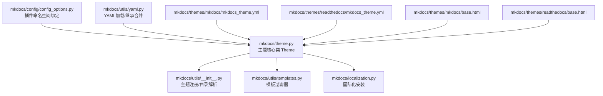
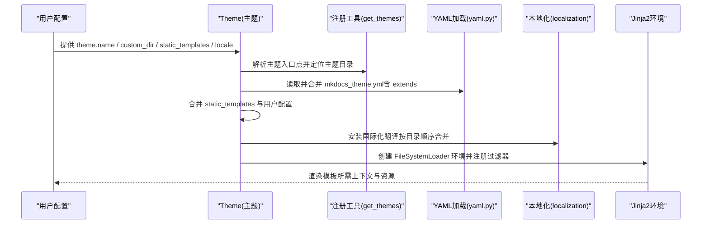
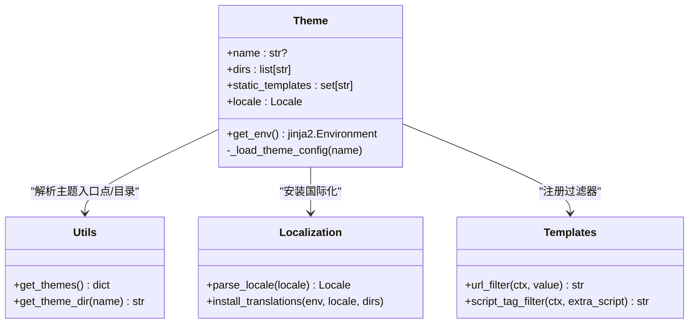
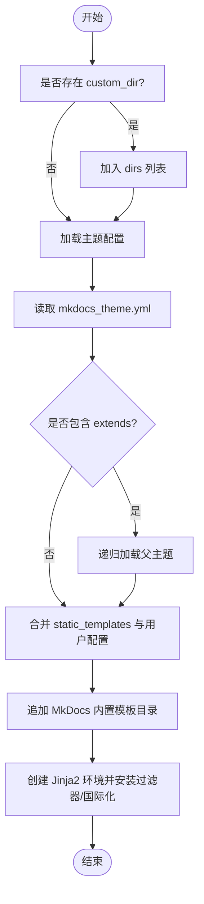
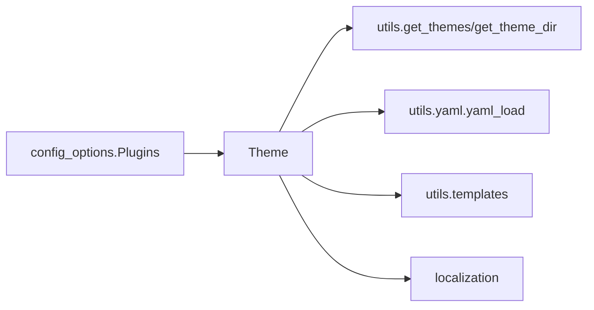

# 主题架构设计

<cite>
**本文档引用的文件**
- [mkdocs/theme.py](file://mkdocs/theme.py)
- [mkdocs/utils/__init__.py](file://mkdocs/utils/__init__.py)
- [mkdocs/utils/templates.py](file://mkdocs/utils/templates.py)
- [mkdocs/localization.py](file://mkdocs/localization.py)
- [mkdocs/config/config_options.py](file://mkdocs/config/config_options.py)
- [mkdocs/utils/yaml.py](file://mkdocs/utils/yaml.py)
- [mkdocs/themes/mkdocs/mkdocs_theme.yml](file://mkdocs/themes/mkdocs/mkdocs_theme.yml)
- [mkdocs/themes/readthedocs/mkdocs_theme.yml](file://mkdocs/themes/readthedocs/mkdocs_theme.yml)
- [mkdocs/themes/mkdocs/base.html](file://mkdocs/themes/mkdocs/base.html)
- [mkdocs/themes/readthedocs/base.html](file://mkdocs/themes/readthedocs/base.html)
- [mkdocs/tests/config/config_options_legacy_tests.py](file://mkdocs/tests/config/config_options_legacy_tests.py)
</cite>

## 目录
1. [引言](#引言)
2. [项目结构](#项目结构)
3. [核心组件](#核心组件)
4. [架构总览](#架构总览)
5. [详细组件分析](#详细组件分析)
6. [依赖关系分析](#依赖关系分析)
7. [性能考量](#性能考量)
8. [故障排查指南](#故障排查指南)
9. [结论](#结论)
10. [附录](#附录)

## 引言
本文件系统性阐述 MkDocs 主题系统的架构设计与实现细节，重点覆盖以下方面：
- 主题加载机制与主题注册发现
- 模板继承体系与静态模板处理
- Jinja2 环境配置与国际化支持
- 主题配置文件 mkdocs_theme.yml 的结构与参数
- 主题目录结构规范与必需/可选文件
- 主题优先级规则与继承链工作原理
- 最佳实践与设计原则

## 项目结构
围绕主题系统的关键代码分布在如下模块：
- 主题核心类与环境构建：mkdocs/theme.py
- 主题注册与入口点解析：mkdocs/utils/__init__.py
- 模板过滤器与上下文：mkdocs/utils/templates.py
- 国际化与翻译安装：mkdocs/localization.py
- 配置项与插件命名空间绑定：mkdocs/config/config_options.py
- YAML 加载与继承合并：mkdocs/utils/yaml.py
- 内置主题配置示例：mkdocs/themes/*/mkdocs_theme.yml
- 内置主题模板基线：mkdocs/themes/*/base.html

图表来源
- [mkdocs/theme.py](file://mkdocs/theme.py#L23-L167)
- [mkdocs/utils/__init__.py](file://mkdocs/utils/__init__.py#L256-L293)
- [mkdocs/utils/templates.py](file://mkdocs/utils/templates.py#L25-L56)
- [mkdocs/localization.py](file://mkdocs/localization.py#L45-L93)
- [mkdocs/config/config_options.py](file://mkdocs/config/config_options.py#L1088-L1117)
- [mkdocs/utils/yaml.py](file://mkdocs/utils/yaml.py#L128-L151)
- [mkdocs/themes/mkdocs/mkdocs_theme.yml](file://mkdocs/themes/mkdocs/mkdocs_theme.yml#L1-L29)
- [mkdocs/themes/readthedocs/mkdocs_theme.yml](file://mkdocs/themes/readthedocs/mkdocs_theme.yml#L1-L26)
- [mkdocs/themes/mkdocs/base.html](file://mkdocs/themes/mkdocs/base.html#L1-L252)
- [mkdocs/themes/readthedocs/base.html](file://mkdocs/themes/readthedocs/base.html#L1-L200)

章节来源
- [mkdocs/theme.py](file://mkdocs/theme.py#L23-L167)
- [mkdocs/utils/__init__.py](file://mkdocs/utils/__init__.py#L256-L293)

## 核心组件
- 主题类 Theme：负责主题配置加载、继承链解析、模板目录优先级构建、Jinja2 环境初始化与过滤器安装、国际化集成。
- 主题注册工具：通过入口点 group='mkdocs.themes' 发现已安装主题，避免同名冲突并记录警告。
- 模板过滤器：提供 URL 规范化与脚本标签生成，统一资源链接与外链脚本注入。
- 国际化支持：按主题目录顺序合并翻译，安装 gettext 或空翻译扩展。
- 插件命名空间绑定：在未显式指定时，自动以当前主题名作为插件前缀进行加载。

章节来源
- [mkdocs/theme.py](file://mkdocs/theme.py#L23-L167)
- [mkdocs/utils/__init__.py](file://mkdocs/utils/__init__.py#L256-L293)
- [mkdocs/utils/templates.py](file://mkdocs/utils/templates.py#L25-L56)
- [mkdocs/localization.py](file://mkdocs/localization.py#L45-L93)
- [mkdocs/config/config_options.py](file://mkdocs/config/config_options.py#L1088-L1117)

## 架构总览
主题系统采用“配置驱动 + 入口点注册 + 模板优先级”的架构模式：
- 配置驱动：用户在 mkdocs.yml 中指定 theme.name 或自定义目录，Theme 类据此构建目录优先级与变量映射。
- 入口点注册：通过 importlib.metadata 解析 mkdocs.themes 组，收集可用主题并去重。
- 模板优先级：自定义目录 > 父主题链 > 内置 MkDocs 模板，确保用户覆盖优先。
- 环境构建：基于 FileSystemLoader 创建 Jinja2 环境，注入过滤器与国际化。

图表来源
- [mkdocs/theme.py](file://mkdocs/theme.py#L54-L167)
- [mkdocs/utils/__init__.py](file://mkdocs/utils/__init__.py#L256-L293)
- [mkdocs/utils/yaml.py](file://mkdocs/utils/yaml.py#L128-L151)
- [mkdocs/localization.py](file://mkdocs/localization.py#L45-L93)

## 详细组件分析

### 主题类 Theme：加载与继承
- 初始化流程
  - 收集目录优先级：custom_dir → 主题目录（递归父主题）→ MkDocs 内置模板目录
  - 合并 static_templates 与用户配置，校验 locale 并转换为 Locale 对象
- 继承链解析
  - 读取 mkdocs_theme.yml，提取 extends 字段并递归加载父主题
  - 若父主题未安装，抛出验证错误
- 环境构建
  - 使用 FileSystemLoader 按目录顺序查找模板
  - 注册 url 与 script_tag 过滤器
  - 安装国际化扩展与翻译

图表来源
- [mkdocs/theme.py](file://mkdocs/theme.py#L23-L167)
- [mkdocs/utils/__init__.py](file://mkdocs/utils/__init__.py#L256-L293)
- [mkdocs/localization.py](file://mkdocs/localization.py#L38-L93)
- [mkdocs/utils/templates.py](file://mkdocs/utils/templates.py#L37-L56)

章节来源
- [mkdocs/theme.py](file://mkdocs/theme.py#L54-L167)

### 主题注册与优先级规则
- 注册机制
  - 通过 importlib.metadata 扫描 group='mkdocs.themes' 的入口点
  - 内置主题与第三方包冲突时，抛出配置错误；重复名称以最后扫描到的为准，并发出警告
- 优先级规则
  - 自定义目录优先于主题目录
  - 父主题链在主题目录之前
  - MkDocs 内置模板目录最后兜底
- 插件命名空间
  - Plugins 在未显式命名空间时，会以当前 theme.name 作为前缀尝试加载

图表来源
- [mkdocs/theme.py](file://mkdocs/theme.py#L54-L167)
- [mkdocs/utils/__init__.py](file://mkdocs/utils/__init__.py#L256-L293)
- [mkdocs/config/config_options.py](file://mkdocs/config/config_options.py#L1088-L1117)

章节来源
- [mkdocs/utils/__init__.py](file://mkdocs/utils/__init__.py#L256-L293)
- [mkdocs/config/config_options.py](file://mkdocs/config/config_options.py#L1088-L1117)

### 模板继承体系与静态模板
- 模板继承
  - 基于 FileSystemLoader 的目录顺序查找，后入者优先
  - 内置主题 base.html 作为通用骨架，子模板通过 include 或块覆盖实现差异化
- 静态模板
  - 由 theme.static_templates 与用户配置共同决定
  - MkDocs 内置模板目录包含默认静态页面（如 404）

章节来源
- [mkdocs/theme.py](file://mkdocs/theme.py#L54-L167)
- [mkdocs/themes/mkdocs/base.html](file://mkdocs/themes/mkdocs/base.html#L1-L252)
- [mkdocs/themes/readthedocs/base.html](file://mkdocs/themes/readthedocs/base.html#L1-L200)

### Jinja2 环境配置与过滤器
- 环境特性
  - FileSystemLoader：按 dirs 顺序查找模板
  - auto_reload=False：构建期间不自动重载，避免编辑模板引发的不一致
- 过滤器
  - url：规范化 URL，支持 page 与 base_url 上下文
  - script_tag：将额外脚本转换为 HTML <script> 标签，支持 type/defer/async 属性
- 国际化
  - 按主题目录顺序合并 locales，安装 gettext 或空翻译扩展

章节来源
- [mkdocs/theme.py](file://mkdocs/theme.py#L158-L167)
- [mkdocs/utils/templates.py](file://mkdocs/utils/templates.py#L37-L56)
- [mkdocs/localization.py](file://mkdocs/localization.py#L45-L93)

### 主题配置文件 mkdocs_theme.yml 结构与参数
- 必需字段
  - static_templates：静态页面模板集合（如 404.html）
  - locale：主题语言环境
- 常用配置项（示例）
  - highlightjs 及 hljs_*：语法高亮开关与样式
  - navigation_depth / nav_style：导航深度与风格
  - color_mode / user_color_mode_toggle：颜色模式与用户切换
  - analytics.gtag：Google Analytics ID
  - shortcuts：键盘快捷键映射
  - readthedocs 特有：include_search_page、include_homepage_in_sidebar、prev_next_buttons_location、sticky_navigation、collapse_navigation、logo 等
- 继承关系
  - extends：声明父主题名称，必须已安装

章节来源
- [mkdocs/themes/mkdocs/mkdocs_theme.yml](file://mkdocs/themes/mkdocs/mkdocs_theme.yml#L1-L29)
- [mkdocs/themes/readthedocs/mkdocs_theme.yml](file://mkdocs/themes/readthedocs/mkdocs_theme.yml#L1-L26)
- [mkdocs/theme.py](file://mkdocs/theme.py#L146-L156)

### 主题目录结构规范
- 必需文件
  - mkdocs_theme.yml：主题配置与继承声明
  - base.html：模板继承根模板
- 可选文件
  - content.html、toc.html、nav-sub.html 等：用于模块化渲染
  - 404.html：静态错误页
  - locales/*：多语言翻译目录
  - 静态资源：css/js/img/webfonts 等
- 目录顺序与覆盖
  - 自定义目录优先，父主题链次之，内置模板最后

章节来源
- [mkdocs/theme.py](file://mkdocs/theme.py#L54-L167)
- [mkdocs/themes/mkdocs/base.html](file://mkdocs/themes/mkdocs/base.html#L1-L252)
- [mkdocs/themes/readthedocs/base.html](file://mkdocs/themes/readthedocs/base.html#L1-L200)

### 验证与测试要点
- 主题名称缺失或无效：当 name 为空且未提供 custom_dir 时，触发验证错误
- 父主题未安装：extends 指向的主题不在已安装列表中时，抛出验证错误
- 插件命名空间：未显式命名空间时，使用 theme.name 作为前缀尝试加载

章节来源
- [mkdocs/tests/config/config_options_legacy_tests.py](file://mkdocs/tests/config/config_options_legacy_tests.py#L936-L983)
- [mkdocs/theme.py](file://mkdocs/theme.py#L146-L156)
- [mkdocs/config/config_options.py](file://mkdocs/config/config_options.py#L1088-L1117)

## 依赖关系分析
- 主题类 Theme 依赖
  - utils.get_themes / get_theme_dir：主题注册与目录解析
  - utils.yaml：YAML 加载与继承合并
  - utils.templates：过滤器注册
  - localization：国际化安装
- 配置层依赖
  - Plugins 在加载插件时根据 theme_key 推断命名空间，提升主题内插件发现效率

图表来源
- [mkdocs/theme.py](file://mkdocs/theme.py#L124-L167)
- [mkdocs/utils/__init__.py](file://mkdocs/utils/__init__.py#L256-L293)
- [mkdocs/utils/yaml.py](file://mkdocs/utils/yaml.py#L128-L151)
- [mkdocs/utils/templates.py](file://mkdocs/utils/templates.py#L25-L56)
- [mkdocs/localization.py](file://mkdocs/localization.py#L45-L93)
- [mkdocs/config/config_options.py](file://mkdocs/config/config_options.py#L1088-L1117)

章节来源
- [mkdocs/theme.py](file://mkdocs/theme.py#L124-L167)
- [mkdocs/config/config_options.py](file://mkdocs/config/config_options.py#L1088-L1117)

## 性能考量
- 模板查找顺序固定：FileSystemLoader 按 dirs 顺序查找，建议将自定义目录置于首位以减少回溯
- 禁用自动重载：构建期间关闭 auto_reload，避免频繁 I/O 与模板重建
- 国际化合并：按目录顺序合并翻译，尽量减少 locales 层级深度与重复翻译
- 静态模板最小化：仅保留必要静态页，降低模板渲染压力

## 故障排查指南
- “缺少配置文件”错误
  - 现象：主题未包含 mkdocs_theme.yml
  - 处理：确认主题包版本与文件完整性
- “父主题未安装”错误
  - 现象：extends 指向的主题不在可用列表
  - 处理：安装对应主题或移除 extends
- “同名主题冲突”
  - 现象：多个包提供相同名称的主题
  - 处理：卸载冲突包或调整入口点命名
- “无效 locale”
  - 现象：locale 格式不合法
  - 处理：修正为合法语言区域码（如 en、zh_CN）

章节来源
- [mkdocs/theme.py](file://mkdocs/theme.py#L134-L156)
- [mkdocs/utils/__init__.py](file://mkdocs/utils/__init__.py#L272-L287)
- [mkdocs/localization.py](file://mkdocs/localization.py#L38-L43)

## 结论
MkDocs 主题系统通过“入口点注册 + 配置驱动 + 目录优先级”的组合，实现了灵活的主题发现、继承与覆盖能力。Theme 类将主题配置、模板目录与 Jinja2 环境整合在一起，辅以国际化与过滤器增强，形成完整的渲染管线。遵循本文档的设计原则与最佳实践，可高效构建与维护高质量主题。

## 附录
- 最佳实践
  - 明确主题继承链，避免过深嵌套
  - 将自定义模板置于 custom_dir，确保覆盖优先
  - 合理配置 static_templates，仅包含必要静态页
  - 使用 locales 目录集中管理翻译，避免重复
  - 保持 mkdocs_theme.yml 结构清晰，参数命名语义化
- 设计原则
  - 可发现性：通过标准入口点注册主题
  - 可覆盖性：目录顺序明确，用户优先
  - 可扩展性：过滤器与国际化插件化
  - 可维护性：配置与模板分离，职责单一