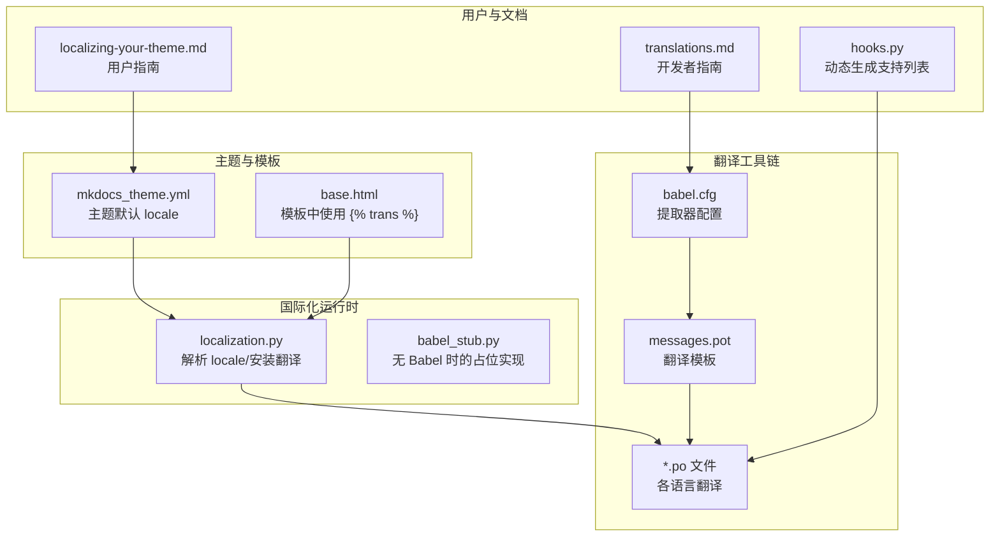
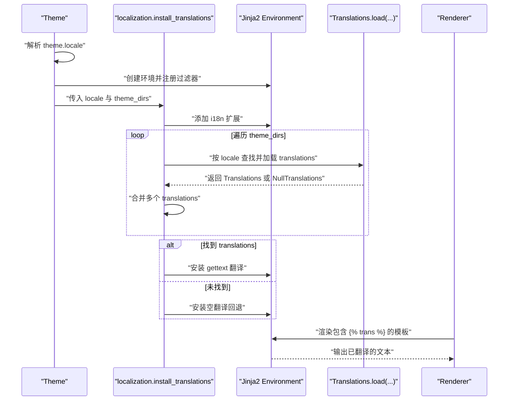
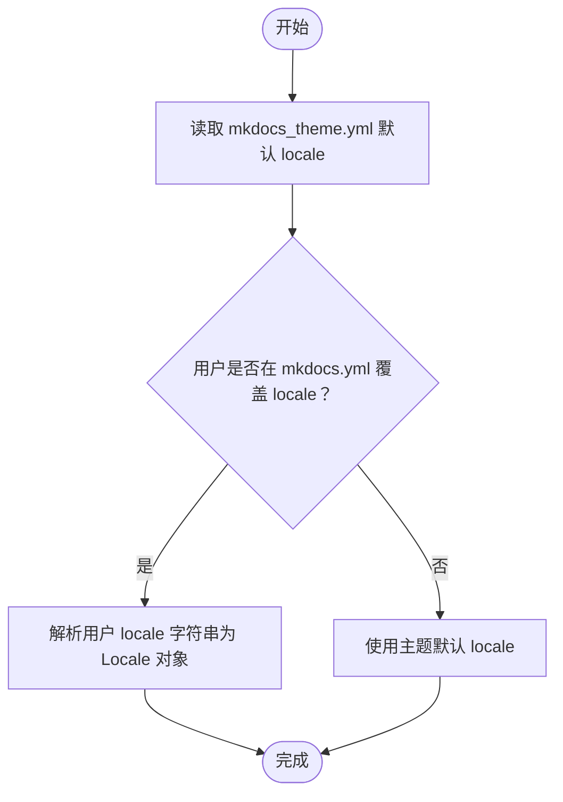
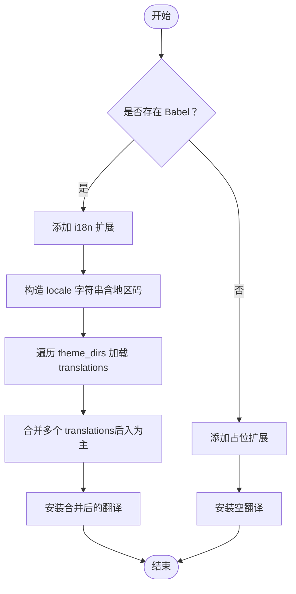
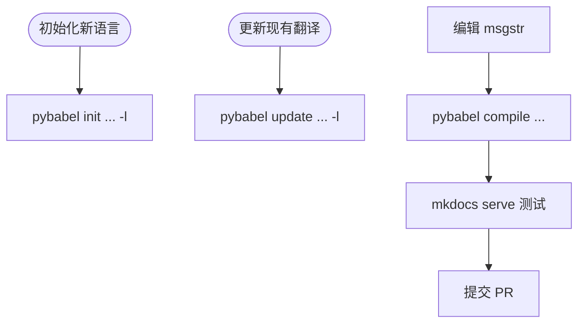
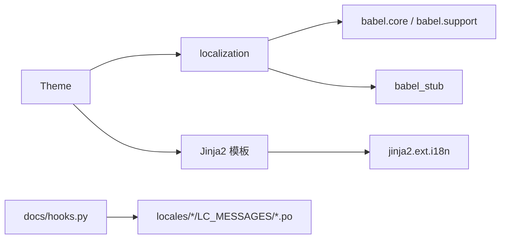

# 国际化支持

<cite>
**本文引用的文件**
- [mkdocs/localization.py](file://mkdocs/localization.py)
- [mkdocs/theme.py](file://mkdocs/theme.py)
- [mkdocs/themes/babel.cfg](file://mkdocs/themes/babel.cfg)
- [mkdocs/utils/babel_stub.py](file://mkdocs/utils/babel_stub.py)
- [mkdocs/themes/mkdocs/mkdocs_theme.yml](file://mkdocs/themes/mkdocs/mkdocs_theme.yml)
- [mkdocs/themes/readthedocs/mkdocs_theme.yml](file://mkdocs/themes/readthedocs/mkdocs_theme.yml)
- [mkdocs/themes/mkdocs/messages.pot](file://mkdocs/themes/mkdocs/messages.pot)
- [mkdocs/themes/mkdocs/locales/de/LC_MESSAGES/messages.po](file://mkdocs/themes/mkdocs/locales/de/LC_MESSAGES/messages.po)
- [docs/dev-guide/translations.md](file://docs/dev-guide/translations.md)
- [docs/user-guide/localizing-your-theme.md](file://docs/user-guide/localizing-your-theme.md)
- [mkdocs/tests/localization_tests.py](file://mkdocs/tests/localization_tests.py)
- [mkdocs/themes/mkdocs/base.html](file://mkdocs/themes/mkdocs/base.html)
- [docs/hooks.py](file://docs/hooks.py)
</cite>

## 目录
1. [引言](#引言)
2. [项目结构](#项目结构)
3. [核心组件](#核心组件)
4. [架构总览](#架构总览)
5. [详细组件分析](#详细组件分析)
6. [依赖关系分析](#依赖关系分析)
7. [性能考量](#性能考量)
8. [故障排查指南](#故障排查指南)
9. [结论](#结论)
10. [附录](#附录)

## 引言
本指南面向 MkDocs 主题的国际化（i18n）开发者与维护者，系统阐述多语言支持的实现机制、翻译文件结构与格式、消息提取与更新流程、本地化配置方法（语言切换、区域设置、文本方向等）、翻译字符串管理策略（键命名、上下文翻译、复数形式处理），以及翻译文件的维护与质量保障流程。文档同时提供最佳实践与常见问题解决方案，帮助你在不改动文档内容的前提下，为主题界面元素提供多语言支持。

## 项目结构
围绕国际化的关键目录与文件如下：
- 翻译运行时与环境：mkdocs/localization.py、mkdocs/utils/babel_stub.py
- 主题配置与模板：mkdocs/themes/mkdocs/mkdocs_theme.yml、mkdocs/themes/readthedocs/mkdocs_theme.yml、mkdocs/themes/mkdocs/base.html
- 翻译工具配置：mkdocs/themes/babel.cfg
- 翻译模板与语料：mkdocs/themes/mkdocs/messages.pot、mkdocs/themes/mkdocs/locales/*/LC_MESSAGES/messages.po
- 用户与开发者文档：docs/user-guide/localizing-your-theme.md、docs/dev-guide/translations.md
- 测试与钩子：mkdocs/tests/localization_tests.py、docs/hooks.py

图表来源
- [mkdocs/theme.py](file://mkdocs/theme.py#L158-L166)
- [mkdocs/localization.py](file://mkdocs/localization.py#L45-L64)
- [mkdocs/themes/babel.cfg](file://mkdocs/themes/babel.cfg#L1-L7)
- [mkdocs/themes/mkdocs/messages.pot](file://mkdocs/themes/mkdocs/messages.pot#L1-L102)
- [mkdocs/themes/mkdocs/locales/de/LC_MESSAGES/messages.po](file://mkdocs/themes/mkdocs/locales/de/LC_MESSAGES/messages.po#L1-L104)
- [docs/user-guide/localizing-your-theme.md](file://docs/user-guide/localizing-your-theme.md#L1-L64)
- [docs/dev-guide/translations.md](file://docs/dev-guide/translations.md#L1-L222)
- [docs/hooks.py](file://docs/hooks.py#L12-L36)

章节来源
- [mkdocs/theme.py](file://mkdocs/theme.py#L158-L166)
- [mkdocs/localization.py](file://mkdocs/localization.py#L45-L64)
- [mkdocs/themes/babel.cfg](file://mkdocs/themes/babel.cfg#L1-L7)
- [mkdocs/themes/mkdocs/messages.pot](file://mkdocs/themes/mkdocs/messages.pot#L1-L102)
- [mkdocs/themes/mkdocs/locales/de/LC_MESSAGES/messages.po](file://mkdocs/themes/mkdocs/locales/de/LC_MESSAGES/messages.po#L1-L104)
- [docs/user-guide/localizing-your-theme.md](file://docs/user-guide/localizing-your-theme.md#L1-L64)
- [docs/dev-guide/translations.md](file://docs/dev-guide/translations.md#L1-L222)
- [docs/hooks.py](file://docs/hooks.py#L12-L36)

## 核心组件
- 主题类负责加载主题配置、构建模板搜索路径，并在渲染前安装翻译扩展与翻译资源。
- 国际化模块负责解析 locale 字符串、安装 Jinja2 i18n 扩展、合并来自多个主题目录的翻译集。
- Babel 工具链用于从模板提取可翻译文本、生成 POT 模板、初始化/更新 PO 翻译、编译 MO 文件。
- 模板通过 Jinja2 的 trans 块与变量替换实现上下文翻译。

章节来源
- [mkdocs/theme.py](file://mkdocs/theme.py#L35-L74)
- [mkdocs/theme.py](file://mkdocs/theme.py#L158-L166)
- [mkdocs/localization.py](file://mkdocs/localization.py#L38-L43)
- [mkdocs/localization.py](file://mkdocs/localization.py#L45-L64)
- [mkdocs/localization.py](file://mkdocs/localization.py#L66-L92)
- [mkdocs/utils/babel_stub.py](file://mkdocs/utils/babel_stub.py#L11-L29)
- [mkdocs/themes/babel.cfg](file://mkdocs/themes/babel.cfg#L1-L7)

## 架构总览
下图展示了从主题配置到模板渲染期间的国际化流程：主题加载 locale → 创建 Jinja2 环境 → 安装 i18n 扩展 → 合并翻译 → 渲染模板中的 trans 块。

图表来源
- [mkdocs/theme.py](file://mkdocs/theme.py#L158-L166)
- [mkdocs/localization.py](file://mkdocs/localization.py#L45-L64)
- [mkdocs/localization.py](file://mkdocs/localization.py#L66-L92)

章节来源
- [mkdocs/theme.py](file://mkdocs/theme.py#L158-L166)
- [mkdocs/localization.py](file://mkdocs/localization.py#L45-L64)
- [mkdocs/localization.py](file://mkdocs/localization.py#L66-L92)

## 详细组件分析

### 组件一：主题配置与 locale 解析
- 主题配置文件中提供默认 locale；当用户未显式指定时，使用该默认值。
- 主题在初始化时解析用户提供的 locale 字符串，转换为 Locale 对象，供模板渲染时使用。
- Locale 支持语言与地区两部分，最终以字符串形式在模板中渲染（如 HTML 的 lang 属性）。

图表来源
- [mkdocs/themes/mkdocs/mkdocs_theme.yml](file://mkdocs/themes/mkdocs/mkdocs_theme.yml#L6)
- [mkdocs/themes/readthedocs/mkdocs_theme.yml](file://mkdocs/themes/readthedocs/mkdocs_theme.yml#L6)
- [mkdocs/theme.py](file://mkdocs/theme.py#L70-L74)

章节来源
- [mkdocs/themes/mkdocs/mkdocs_theme.yml](file://mkdocs/themes/mkdocs/mkdocs_theme.yml#L6)
- [mkdocs/themes/readthedocs/mkdocs_theme.yml](file://mkdocs/themes/readthedocs/mkdocs_theme.yml#L6)
- [mkdocs/theme.py](file://mkdocs/theme.py#L70-L74)

### 组件二：翻译安装与合并策略
- 当存在 Babel 时，安装 Jinja2 i18n 扩展；否则安装占位扩展以保留 trans/endtrans 语法。
- 按 locale 优先级查找 translations：先尝试带地区码的语言标识，再尝试仅语言码。
- 多个 theme_dirs 中的 translations 将被合并，后加载的主题覆盖先前的同名键。

图表来源
- [mkdocs/localization.py](file://mkdocs/localization.py#L45-L64)
- [mkdocs/localization.py](file://mkdocs/localization.py#L66-L92)
- [mkdocs/utils/babel_stub.py](file://mkdocs/utils/babel_stub.py#L29-L35)

章节来源
- [mkdocs/localization.py](file://mkdocs/localization.py#L45-L64)
- [mkdocs/localization.py](file://mkdocs/localization.py#L66-L92)
- [mkdocs/utils/babel_stub.py](file://mkdocs/utils/babel_stub.py#L29-L35)

### 组件三：模板中的翻译使用
- 模板通过 Jinja2 的 trans 块包裹静态文本，支持变量替换与上下文参数。
- 示例：导航按钮“上一页/下一页”、搜索入口、编辑链接等均使用 trans 块。
- HTML 的 lang 属性可直接使用 theme.locale（或其 language 子属性）。

章节来源
- [mkdocs/themes/mkdocs/base.html](file://mkdocs/themes/mkdocs/base.html#L117-L152)
- [mkdocs/themes/mkdocs/base.html](file://mkdocs/themes/mkdocs/base.html#L2)
- [docs/dev-guide/themes.md](file://docs/dev-guide/themes.md#L939-L971)

### 组件四：翻译文件结构与格式
- POT 模板：包含所有待翻译的 msgid 及注释信息，作为各语言 PO 的来源。
- PO 文件：每种语言对应一个 PO 文件，包含 msgid 与 msgstr，以及语言元数据（Plural-Forms 等）。
- 语言目录结构：locales/<lang>/LC_MESSAGES/messages.po。

章节来源
- [mkdocs/themes/mkdocs/messages.pot](file://mkdocs/themes/mkdocs/messages.pot#L1-L102)
- [mkdocs/themes/mkdocs/locales/de/LC_MESSAGES/messages.po](file://mkdocs/themes/mkdocs/locales/de/LC_MESSAGES/messages.po#L1-L104)

### 组件五：消息提取与更新流程
- 提取器配置：babel.cfg 指定模板匹配规则与需提取的属性。
- 初始化新语言：基于 POT 生成目标语言的 PO 文件。
- 更新现有翻译：从最新 POT 更新 PO，忽略过时条目。
- 编译 MO：将 PO 编译为 MO，供运行时加载。

图表来源
- [docs/dev-guide/translations.md](file://docs/dev-guide/translations.md#L104-L109)
- [docs/dev-guide/translations.md](file://docs/dev-guide/translations.md#L141-L146)
- [docs/dev-guide/translations.md](file://docs/dev-guide/translations.md#L176-L179)
- [docs/dev-guide/translations.md](file://docs/dev-guide/translations.md#L194-L201)

章节来源
- [docs/dev-guide/translations.md](file://docs/dev-guide/translations.md#L82-L123)
- [docs/dev-guide/translations.md](file://docs/dev-guide/translations.md#L124-L150)
- [docs/dev-guide/translations.md](file://docs/dev-guide/translations.md#L153-L203)
- [mkdocs/themes/babel.cfg](file://mkdocs/themes/babel.cfg#L1-L7)

### 组件六：本地化配置与用户指南
- 用户需安装 i18n 附加包以启用翻译功能。
- 在 mkdocs.yml 中设置 theme.locale 指定语言与地区。
- 若未支持的 locale，将回退到主题默认 locale 并发出警告。

章节来源
- [docs/user-guide/localizing-your-theme.md](file://docs/user-guide/localizing-your-theme.md#L14-L22)
- [docs/user-guide/localizing-your-theme.md](file://docs/user-guide/localizing-your-theme.md#L41-L53)
- [mkdocs/tests/localization_tests.py](file://mkdocs/tests/localization_tests.py#L36-L45)

## 依赖关系分析
- 主题类依赖 localization 模块进行 locale 解析与翻译安装。
- localization 模块依赖 Babel（可选）或 babel_stub 占位实现。
- 模板依赖 Jinja2 i18n 扩展与已安装的 Translations。
- 文档钩子根据 PO 文件内容动态生成支持语言列表。

图表来源
- [mkdocs/theme.py](file://mkdocs/theme.py#L16-L18)
- [mkdocs/localization.py](file://mkdocs/localization.py#L14-L22)
- [mkdocs/utils/babel_stub.py](file://mkdocs/utils/babel_stub.py#L1-L30)
- [docs/hooks.py](file://docs/hooks.py#L12-L36)

章节来源
- [mkdocs/theme.py](file://mkdocs/theme.py#L16-L18)
- [mkdocs/localization.py](file://mkdocs/localization.py#L14-L22)
- [mkdocs/utils/babel_stub.py](file://mkdocs/utils/babel_stub.py#L1-L30)
- [docs/hooks.py](file://docs/hooks.py#L12-L36)

## 性能考量
- 翻译加载发生在渲染前，且仅在存在 Babel 时执行实际加载；无 Babel 时仅安装占位扩展，开销极低。
- translations 合并采用后入为主的策略，避免重复扫描，提升加载效率。
- 建议在生产构建中预编译 MO 文件，减少运行时 IO 开销。

## 故障排查指南
- locale 解析失败：检查 locale 字符串格式，确保符合语言与地区编码规范。
- 未找到翻译：确认 locales 目录结构与语言标识一致；若不存在对应语言，将回退至空翻译并记录警告。
- 未显示翻译：确认已安装 i18n 附加包并在 mkdocs.yml 中正确设置 theme.locale。
- 复数形式不生效：检查 PO 文件中的 Plural-Forms 设置是否与目标语言一致。

章节来源
- [mkdocs/localization.py](file://mkdocs/localization.py#L38-L43)
- [mkdocs/localization.py](file://mkdocs/localization.py#L55-L59)
- [mkdocs/tests/localization_tests.py](file://mkdocs/tests/localization_tests.py#L30-L45)
- [docs/user-guide/localizing-your-theme.md](file://docs/user-guide/localizing-your-theme.md#L37-L40)

## 结论
MkDocs 的主题国际化通过清晰的配置、可靠的运行时安装与合并策略、完善的工具链与文档，实现了对主题界面文本的多语言支持。遵循本文的流程与最佳实践，你可以高效地为主题贡献翻译、维护翻译文件，并在不改动文档内容的情况下，为用户提供本地化的界面体验。

## 附录

### 翻译字符串管理策略
- 键命名规范：保持简洁、描述性强，避免嵌套层级过深；同一语义尽量统一用词。
- 上下文翻译：使用 Jinja2 trans 块的变量参数传递上下文，避免硬编码。
- 复数形式处理：在 PO 文件中正确设置复数规则，确保不同数量下的文本正确显示。
- 注释与来源：在 POT/PO 中保留源文件与行号信息，便于定位与核对。

章节来源
- [mkdocs/themes/mkdocs/messages.pot](file://mkdocs/themes/mkdocs/messages.pot#L20-L102)
- [mkdocs/themes/mkdocs/locales/de/LC_MESSAGES/messages.po](file://mkdocs/themes/mkdocs/locales/de/LC_MESSAGES/messages.po#L14-L18)
- [docs/dev-guide/translations.md](file://docs/dev-guide/translations.md#L153-L169)

### 与翻译工具的集成与质量保证
- 使用 Babel 命令初始化/更新/编译翻译文件。
- 在本地 serve 测试翻译效果，确认语言切换与回退行为。
- 通过文档钩子自动生成支持语言列表，减少手工维护成本。

章节来源
- [docs/dev-guide/translations.md](file://docs/dev-guide/translations.md#L104-L109)
- [docs/dev-guide/translations.md](file://docs/dev-guide/translations.md#L141-L146)
- [docs/dev-guide/translations.md](file://docs/dev-guide/translations.md#L176-L179)
- [docs/hooks.py](file://docs/hooks.py#L12-L36)