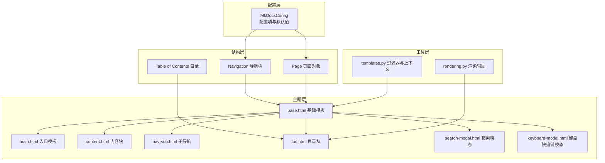
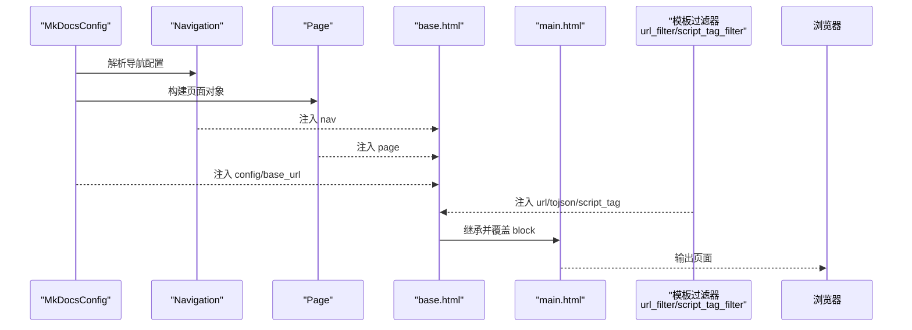
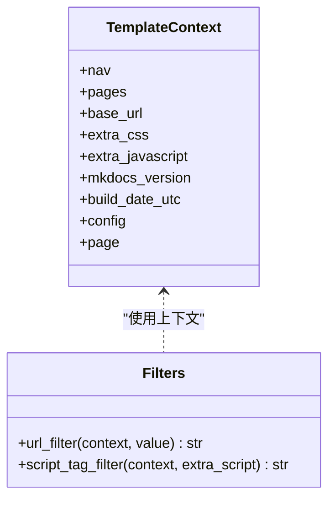
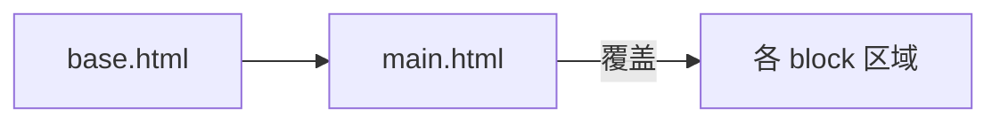
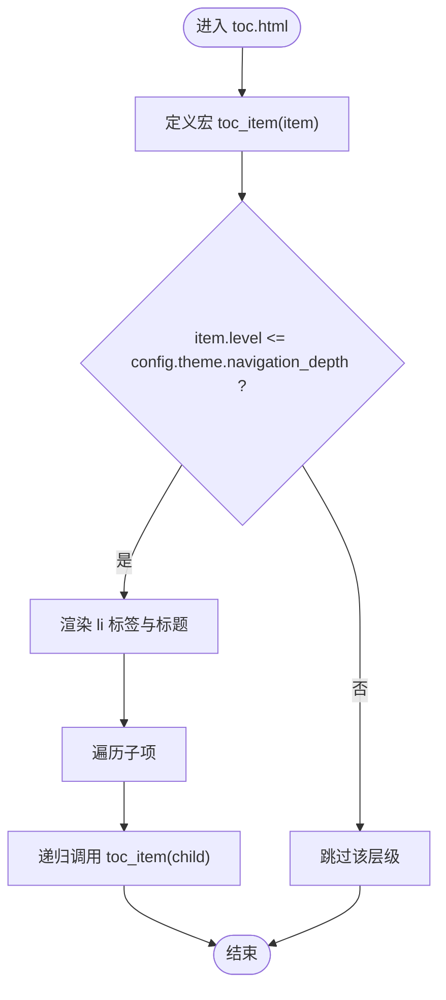
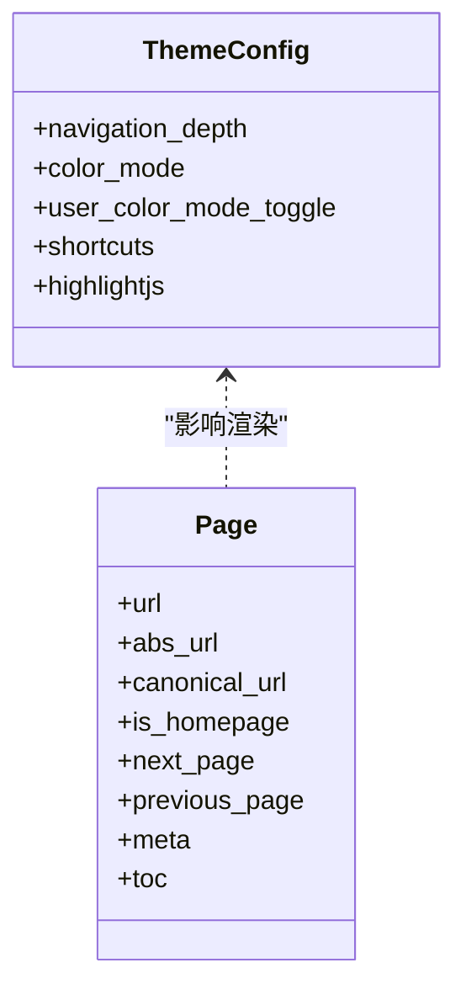
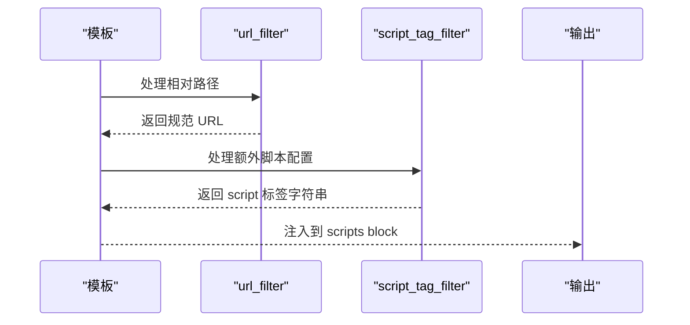
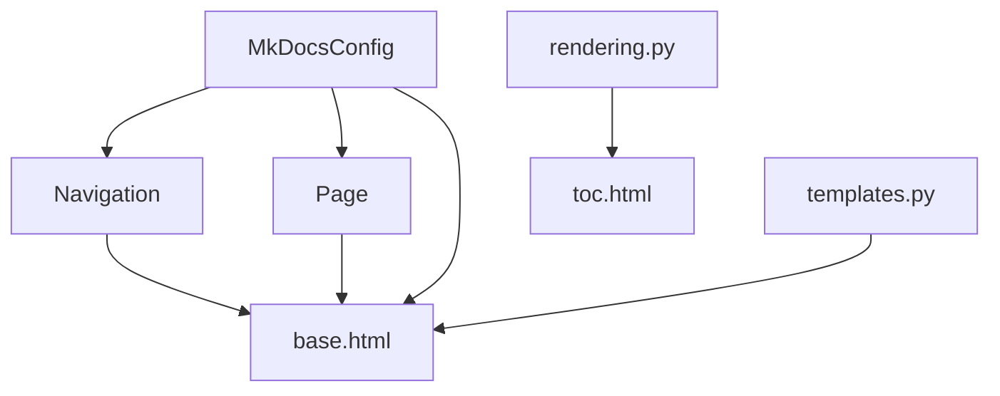

# 模板系统

<cite>
**本文引用的文件**
- [mkdocs/utils/templates.py](file://mkdocs/utils/templates.py)
- [mkdocs/utils/filters.py](file://mkdocs/utils/filters.py)
- [mkdocs/themes/mkdocs/base.html](file://mkdocs/themes/mkdocs/base.html)
- [mkdocs/themes/mkdocs/main.html](file://mkdocs/themes/mkdocs/main.html)
- [mkdocs/themes/mkdocs/content.html](file://mkdocs/themes/mkdocs/content.html)
- [mkdocs/themes/mkdocs/nav-sub.html](file://mkdocs/themes/mkdocs/nav-sub.html)
- [mkdocs/themes/mkdocs/toc.html](file://mkdocs/themes/mkdocs/toc.html)
- [mkdocs/themes/mkdocs/search-modal.html](file://mkdocs/themes/mkdocs/search-modal.html)
- [mkdocs/themes/mkdocs/keyboard-modal.html](file://mkdocs/themes/mkdocs/keyboard-modal.html)
- [mkdocs/themes/mkdocs/mkdocs_theme.yml](file://mkdocs/themes/mkdocs/mkdocs_theme.yml)
- [mkdocs/config/defaults.py](file://mkdocs/config/defaults.py)
- [mkdocs/structure/nav.py](file://mkdocs/structure/nav.py)
- [mkdocs/structure/pages.py](file://mkdocs/structure/pages.py)
- [mkdocs/utils/rendering.py](file://mkdocs/utils/rendering.py)
- [docs/user-guide/customizing-your-theme.md](file://docs/user-guide/customizing-your-theme.md)
- [mkdocs/tests/utils/templates_tests.py](file://mkdocs/tests/utils/templates_tests.py)
</cite>

## 目录
1. [简介](#简介)
2. [项目结构](#项目结构)
3. [核心组件](#核心组件)
4. [架构总览](#架构总览)
5. [详细组件分析](#详细组件分析)
6. [依赖关系分析](#依赖关系分析)
7. [性能考量](#性能考量)
8. [故障排查指南](#故障排查指南)
9. [结论](#结论)
10. [附录](#附录)

## 简介
本指南围绕 MkDocs 的模板系统展开，重点讲解 Jinja2 在主题中的应用方式，包括模板继承、block 定义与包含、全局与页面上下文变量、内置过滤器（如 url、tojson、script_tag）的使用，以及布局设计、响应式实现与组件化开发的最佳实践。读者可据此快速掌握如何基于 MkDocs 主题进行定制化开发。

## 项目结构
MkDocs 的模板系统由“配置层”“结构层”“主题层”“工具层”四部分协同组成：
- 配置层：定义站点配置项与默认值，决定主题行为与资源注入点。
- 结构层：构建导航树、页面对象与目录结构，为模板提供数据模型。
- 主题层：提供基础模板与可覆盖的 block，形成最终页面输出。
- 工具层：提供模板过滤器、渲染辅助函数与测试用例。

图表来源
- [mkdocs/config/defaults.py](file://mkdocs/config/defaults.py#L38-L200)
- [mkdocs/structure/nav.py](file://mkdocs/structure/nav.py#L21-L185)
- [mkdocs/structure/pages.py](file://mkdocs/structure/pages.py#L35-L200)
- [mkdocs/themes/mkdocs/base.html](file://mkdocs/themes/mkdocs/base.html#L1-L252)
- [mkdocs/themes/mkdocs/main.html](file://mkdocs/themes/mkdocs/main.html#L1-L11)
- [mkdocs/themes/mkdocs/content.html](file://mkdocs/themes/mkdocs/content.html#L1-L10)
- [mkdocs/themes/mkdocs/nav-sub.html](file://mkdocs/themes/mkdocs/nav-sub.html#L1-L15)
- [mkdocs/themes/mkdocs/toc.html](file://mkdocs/themes/mkdocs/toc.html#L1-L27)
- [mkdocs/themes/mkdocs/search-modal.html](file://mkdocs/themes/mkdocs/search-modal.html#L1-L22)
- [mkdocs/themes/mkdocs/keyboard-modal.html](file://mkdocs/themes/mkdocs/keyboard-modal.html#L1-L41)
- [mkdocs/utils/templates.py](file://mkdocs/utils/templates.py#L25-L56)
- [mkdocs/utils/rendering.py](file://mkdocs/utils/rendering.py#L22-L105)

章节来源
- [mkdocs/config/defaults.py](file://mkdocs/config/defaults.py#L38-L200)
- [mkdocs/structure/nav.py](file://mkdocs/structure/nav.py#L21-L185)
- [mkdocs/structure/pages.py](file://mkdocs/structure/pages.py#L35-L200)
- [mkdocs/themes/mkdocs/base.html](file://mkdocs/themes/mkdocs/base.html#L1-L252)
- [mkdocs/themes/mkdocs/main.html](file://mkdocs/themes/mkdocs/main.html#L1-L11)
- [mkdocs/utils/templates.py](file://mkdocs/utils/templates.py#L25-L56)

## 核心组件
- 模板上下文类型：TemplateContext，承载导航、页面、基础 URL、额外资源、版本信息等全局上下文。
- URL 规范化过滤器：url_filter，结合 base_url 与当前页面上下文生成规范链接。
- 脚本标签过滤器：script_tag_filter，将额外脚本配置转换为带属性的 HTML 标签。
- 主题入口与继承：main.html 继承 base.html；通过覆盖 block 实现主题定制。
- 导航与目录：Navigation 提供导航树；Page 提供页面元数据；toc.html 展示目录树。
- 模态组件：搜索与键盘快捷键模态框，提升交互体验。
- 渲染辅助：rendering.py 提供标题文本提取等辅助逻辑，保障目录与搜索索引质量。

章节来源
- [mkdocs/utils/templates.py](file://mkdocs/utils/templates.py#L25-L56)
- [mkdocs/themes/mkdocs/main.html](file://mkdocs/themes/mkdocs/main.html#L1-L11)
- [mkdocs/themes/mkdocs/base.html](file://mkdocs/themes/mkdocs/base.html#L1-L252)
- [mkdocs/themes/mkdocs/toc.html](file://mkdocs/themes/mkdocs/toc.html#L1-L27)
- [mkdocs/structure/nav.py](file://mkdocs/structure/nav.py#L21-L185)
- [mkdocs/structure/pages.py](file://mkdocs/structure/pages.py#L35-L200)
- [mkdocs/utils/rendering.py](file://mkdocs/utils/rendering.py#L22-L105)

## 架构总览
下图展示从配置到模板渲染的关键流程：配置驱动结构层构建导航与页面，模板引擎将上下文注入基础模板，再由入口模板继承并覆盖各 block，最终输出页面。

图表来源
- [mkdocs/config/defaults.py](file://mkdocs/config/defaults.py#L38-L200)
- [mkdocs/structure/nav.py](file://mkdocs/structure/nav.py#L130-L185)
- [mkdocs/structure/pages.py](file://mkdocs/structure/pages.py#L35-L200)
- [mkdocs/themes/mkdocs/base.html](file://mkdocs/themes/mkdocs/base.html#L1-L252)
- [mkdocs/themes/mkdocs/main.html](file://mkdocs/themes/mkdocs/main.html#L1-L11)
- [mkdocs/utils/templates.py](file://mkdocs/utils/templates.py#L37-L56)

## 详细组件分析

### 模板上下文与过滤器
- 上下文字段
  - nav：导航树对象，用于渲染主导航与面包屑。
  - pages：页面集合，用于生成站点地图或交叉引用。
  - base_url：基础路径，用于相对链接规范化。
  - extra_css/extra_javascript：额外样式与脚本列表，建议优先使用 config 中对应项。
  - mkdocs_version/build_date_utc：构建信息，便于调试与统计。
  - config：完整配置对象，包含主题选项、插件状态等。
  - page：当前页面对象，包含内容、元数据、上一页/下一页等。
- 过滤器
  - url：将相对路径转换为绝对或规范路径，考虑 base_url 与当前页面上下文。
  - tojson：安全地将对象序列化为 JSON 字符串，适合注入到 JS 变量。
  - script_tag：将额外脚本配置转换为带 type/defer/async 属性的 script 标签。

图表来源
- [mkdocs/utils/templates.py](file://mkdocs/utils/templates.py#L25-L56)

章节来源
- [mkdocs/utils/templates.py](file://mkdocs/utils/templates.py#L25-L56)
- [mkdocs/utils/filters.py](file://mkdocs/utils/filters.py#L1-L2)

### 模板继承与 block 覆盖
- 继承关系：main.html 继承 base.html，作为主题定制的唯一入口。
- 常用 block（节选）
  - htmltitle：自定义页面标题。
  - styles：注入 CSS 资源与第三方库样式。
  - libs：注入高亮库等外部脚本。
  - scripts：注入基础脚本与额外脚本（通过 script_tag）。
  - content：主内容区，通常包含侧边目录与正文。
  - site_nav/search_button/next_prev/repo/footer：导航与页脚区域。
- 覆盖方式：在自定义主题中重写 main.html 并调用 super() 合并父模板功能。

图表来源
- [mkdocs/themes/mkdocs/base.html](file://mkdocs/themes/mkdocs/base.html#L1-L252)
- [mkdocs/themes/mkdocs/main.html](file://mkdocs/themes/mkdocs/main.html#L1-L11)

章节来源
- [mkdocs/themes/mkdocs/base.html](file://mkdocs/themes/mkdocs/base.html#L1-L252)
- [mkdocs/themes/mkdocs/main.html](file://mkdocs/themes/mkdocs/main.html#L1-L11)
- [docs/user-guide/customizing-your-theme.md](file://docs/user-guide/customizing-your-theme.md#L130-L225)

### 导航与目录组件
- 导航树：Navigation 将配置或自动推断的页面组织为嵌套结构，支持 Section/Link/Page 三类节点。
- 子导航：nav-sub.html 递归渲染子菜单，支持多级联动。
- 目录：toc.html 使用宏递归渲染目录树，受主题 navigation_depth 控制；rendering.py 提供标题文本提取，确保目录与搜索结果更准确。

图表来源
- [mkdocs/themes/mkdocs/toc.html](file://mkdocs/themes/mkdocs/toc.html#L8-L26)
- [mkdocs/utils/rendering.py](file://mkdocs/utils/rendering.py#L22-L105)

章节来源
- [mkdocs/structure/nav.py](file://mkdocs/structure/nav.py#L21-L185)
- [mkdocs/themes/mkdocs/nav-sub.html](file://mkdocs/themes/mkdocs/nav-sub.html#L1-L15)
- [mkdocs/themes/mkdocs/toc.html](file://mkdocs/themes/mkdocs/toc.html#L1-L27)
- [mkdocs/utils/rendering.py](file://mkdocs/utils/rendering.py#L22-L105)

### 页面上下文变量与主题配置
- 页面上下文：page 对象包含 url、canonical_url、is_homepage、next_page/previous_page、meta 等，用于动态控制 UI 行为与 SEO 元数据。
- 主题配置：mkdocs_theme.yml 定义静态模板、高亮库、导航深度、颜色模式、快捷键等主题选项，影响模板渲染细节。

图表来源
- [mkdocs/structure/pages.py](file://mkdocs/structure/pages.py#L35-L200)
- [mkdocs/themes/mkdocs/mkdocs_theme.yml](file://mkdocs/themes/mkdocs/mkdocs_theme.yml#L1-L29)

章节来源
- [mkdocs/structure/pages.py](file://mkdocs/structure/pages.py#L35-L200)
- [mkdocs/themes/mkdocs/mkdocs_theme.yml](file://mkdocs/themes/mkdocs/mkdocs_theme.yml#L1-L29)

### 模板过滤器详解
- url 过滤器
  - 功能：将相对路径转换为规范 URL，考虑 base_url 与当前页面上下文。
  - 适用：所有静态资源链接、favicon、导航链接等。
- tojson 过滤器
  - 功能：安全序列化对象为 JSON 字符串，避免 XSS 风险。
  - 适用：向 JS 注入配置、快捷键映射、高亮语言列表等。
- script_tag 过滤器
  - 功能：将额外脚本配置转换为带 type/defer/async 属性的 script 标签。
  - 适用：引入模块化脚本、延迟加载脚本、异步脚本等。

图表来源
- [mkdocs/utils/templates.py](file://mkdocs/utils/templates.py#L37-L56)

章节来源
- [mkdocs/utils/templates.py](file://mkdocs/utils/templates.py#L37-L56)
- [mkdocs/tests/utils/templates_tests.py](file://mkdocs/tests/utils/templates_tests.py#L11-L49)

### 响应式设计与组件化实践
- 响应式框架：Bootstrap 与 Font Awesome 在 base.html 中按需引入，配合主题颜色模式与高亮库实现跨设备一致体验。
- 组件化模板：将导航、目录、模态框拆分为独立模板片段，通过 include 组合复用，降低重复与维护成本。
- 主题定制：通过 main.html 覆盖 block 并使用 super() 合并父模板能力，既保持一致性又允许差异化。

章节来源
- [mkdocs/themes/mkdocs/base.html](file://mkdocs/themes/mkdocs/base.html#L19-L66)
- [mkdocs/themes/mkdocs/main.html](file://mkdocs/themes/mkdocs/main.html#L1-L11)
- [docs/user-guide/customizing-your-theme.md](file://docs/user-guide/customizing-your-theme.md#L130-L225)

## 依赖关系分析
- 模板上下文依赖配置与结构对象，确保导航与页面数据正确传递。
- 过滤器依赖上下文与工具函数，保证 URL 规范化与脚本标签生成的准确性。
- 主题模板依赖过滤器与上下文变量，形成最终页面输出。
- 渲染辅助函数服务于目录与标题提取，提升内容质量。

图表来源
- [mkdocs/config/defaults.py](file://mkdocs/config/defaults.py#L38-L200)
- [mkdocs/structure/nav.py](file://mkdocs/structure/nav.py#L130-L185)
- [mkdocs/structure/pages.py](file://mkdocs/structure/pages.py#L35-L200)
- [mkdocs/utils/templates.py](file://mkdocs/utils/templates.py#L25-L56)
- [mkdocs/utils/rendering.py](file://mkdocs/utils/rendering.py#L22-L105)
- [mkdocs/themes/mkdocs/base.html](file://mkdocs/themes/mkdocs/base.html#L1-L252)
- [mkdocs/themes/mkdocs/toc.html](file://mkdocs/themes/mkdocs/toc.html#L1-L27)

章节来源
- [mkdocs/config/defaults.py](file://mkdocs/config/defaults.py#L38-L200)
- [mkdocs/utils/templates.py](file://mkdocs/utils/templates.py#L25-L56)
- [mkdocs/utils/rendering.py](file://mkdocs/utils/rendering.py#L22-L105)

## 性能考量
- 资源合并与按需加载：通过 config.extra_css 与 config.extra_javascript 控制资源数量，减少首屏渲染压力。
- 目录深度控制：合理设置 theme.navigation_depth，避免过深目录导致 DOM 节点过多。
- 高亮库优化：仅启用必要语言，避免加载冗余脚本。
- 模板缓存：Jinja2 默认具备一定缓存能力，避免在单次构建中重复解析相同模板。

## 故障排查指南
- 链接异常
  - 症状：资源 404 或相对链接失效。
  - 排查：确认 base_url 与 url 过滤器使用是否正确；检查 extra_css/extra_javascript 路径。
- 脚本未生效
  - 症状：模块化脚本报错或异步加载失败。
  - 排查：核对 script_tag 生成的标签属性（type/defer/async），确保路径与 base_url 正确。
- 目录不显示或层级过深
  - 症状：目录缺失或层级过深。
  - 排查：检查 theme.navigation_depth 设置与 toc.html 宏逻辑；确认页面标题与锚点存在。
- 搜索功能不可用
  - 症状：搜索模态框无响应。
  - 排查：确认插件已启用且模板中包含 search-modal.html；检查 base_url 与脚本注入顺序。

章节来源
- [mkdocs/utils/templates.py](file://mkdocs/utils/templates.py#L37-L56)
- [mkdocs/themes/mkdocs/base.html](file://mkdocs/themes/mkdocs/base.html#L229-L242)
- [mkdocs/themes/mkdocs/toc.html](file://mkdocs/themes/mkdocs/toc.html#L8-L26)
- [docs/user-guide/customizing-your-theme.md](file://docs/user-guide/customizing-your-theme.md#L130-L225)

## 结论
MkDocs 的模板系统以 Jinja2 为核心，通过清晰的上下文与过滤器、可继承的模板结构、可配置的主题选项，实现了高度可定制的文档站点。遵循本文的继承与覆盖策略、上下文变量使用规范与组件化实践，可在保证一致性的同时灵活满足各类主题需求。

## 附录
- 开发示例要点
  - 在自定义主题中仅保留 main.html 继承 base.html，并在各 block 中覆盖所需区域。
  - 使用 url 过滤器处理所有静态资源链接，使用 tojson 安全注入配置。
  - 使用 script_tag 过滤器统一管理额外脚本，避免手写标签带来的错误。
  - 通过 mkdocs_theme.yml 调整导航深度、颜色模式与快捷键，提升可用性。
- 最佳实践
  - 保持模板职责单一，将导航、目录、模态框拆分为独立片段。
  - 使用 super() 合并父模板能力，避免覆盖时丢失原有功能。
  - 控制资源体积与请求数，优先使用 CDN 与按需加载策略。