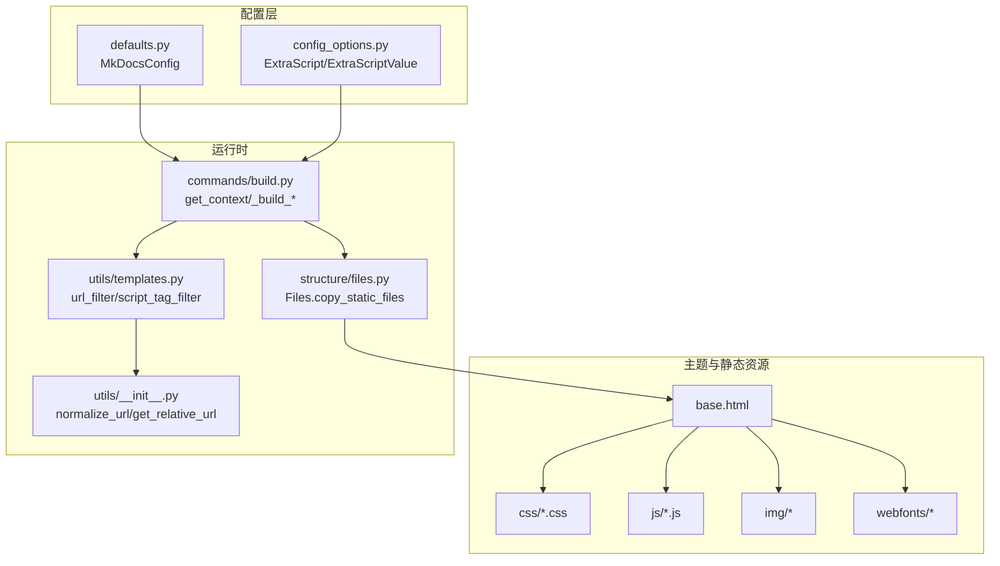
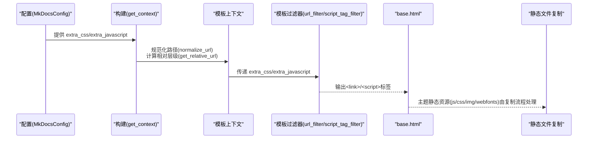
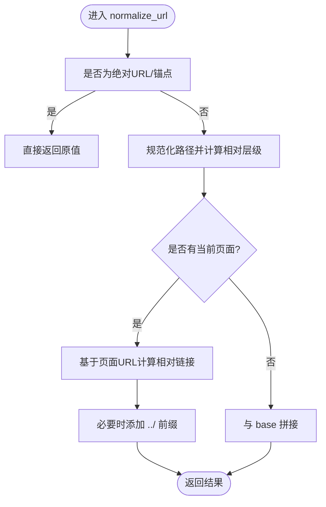
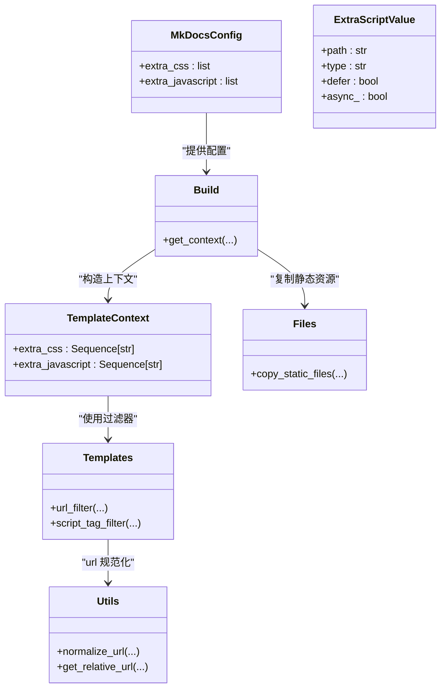

# 静态资源管理

<cite>
**本文引用的文件**
- [mkdocs/themes/mkdocs/base.html](file://mkdocs/themes/mkdocs/base.html)
- [mkdocs/themes/mkdocs/mkdocs_theme.yml](file://mkdocs/themes/mkdocs/mkdocs_theme.yml)
- [mkdocs/config/defaults.py](file://mkdocs/config/defaults.py)
- [mkdocs/config/config_options.py](file://mkdocs/config/config_options.py)
- [mkdocs/utils/templates.py](file://mkdocs/utils/templates.py)
- [mkdocs/commands/build.py](file://mkdocs/commands/build.py)
- [mkdocs/utils/__init__.py](file://mkdocs/utils/__init__.py)
- [mkdocs/structure/files.py](file://mkdocs/structure/files.py)
- [mkdocs/themes/mkdocs/css/base.css](file://mkdocs/themes/mkdocs/css/base.css)
- [mkdocs/themes/mkdocs/js/base.js](file://mkdocs/themes/mkdocs/js/base.js)
- [mkdocs/tests/build_tests.py](file://mkdocs/tests/build_tests.py)
- [mkdocs/tests/utils/templates_tests.py](file://mkdocs/tests/utils/templates_tests.py)
- [mkdocs/tests/utils/utils_tests.py](file://mkdocs/tests/utils/utils_tests.py)
- [mkdocs/tests/structure/file_tests.py](file://mkdocs/tests/structure/file_tests.py)
</cite>

## 目录
1. [简介](#简介)
2. [项目结构](#项目结构)
3. [核心组件](#核心组件)
4. [架构总览](#架构总览)
5. [组件详解](#组件详解)
6. [依赖关系分析](#依赖关系分析)
7. [性能考量](#性能考量)
8. [故障排除指南](#故障排除指南)
9. [结论](#结论)
10. [附录](#附录)

## 简介
本指南聚焦于 MkDocs 主题中的静态资源管理，系统阐述 CSS、JavaScript、字体与图片等资源的组织结构与加载机制；详解 extra_css 与 extra_javascript 的配置与渲染流程；说明资源路径解析、版本控制与缓存策略；给出打包与优化（压缩、合并、CDN）的最佳实践；覆盖资源优先级、条件加载与异步加载等高级特性，并提供排障与性能优化建议。

## 项目结构
围绕静态资源的关键目录与文件如下：
- 主题模板与静态资源：mkdocs/themes/mkdocs/{css,js,img,webfonts,*.html}
- 配置定义：mkdocs/config/defaults.py、mkdocs/config/config_options.py
- 模板过滤器与上下文：mkdocs/utils/templates.py、mkdocs/commands/build.py
- 路径与 URL 工具：mkdocs/utils/__init__.py
- 文件集合与复制逻辑：mkdocs/structure/files.py
- 示例样式与脚本：mkdocs/themes/mkdocs/css/base.css、mkdocs/themes/mkdocs/js/base.js
- 测试用例：多处 tests 下的单元测试

图表来源
- [mkdocs/themes/mkdocs/base.html](file://mkdocs/themes/mkdocs/base.html#L1-L252)
- [mkdocs/config/defaults.py](file://mkdocs/config/defaults.py#L123-L126)
- [mkdocs/config/config_options.py](file://mkdocs/config/config_options.py#L941-L957)
- [mkdocs/utils/templates.py](file://mkdocs/utils/templates.py#L25-L56)
- [mkdocs/commands/build.py](file://mkdocs/commands/build.py#L29-L88)
- [mkdocs/utils/__init__.py](file://mkdocs/utils/__init__.py#L177-L240)
- [mkdocs/structure/files.py](file://mkdocs/structure/files.py#L113-L144)

章节来源
- [mkdocs/themes/mkdocs/base.html](file://mkdocs/themes/mkdocs/base.html#L1-L252)
- [mkdocs/config/defaults.py](file://mkdocs/config/defaults.py#L123-L126)
- [mkdocs/config/config_options.py](file://mkdocs/config/config_options.py#L941-L957)
- [mkdocs/utils/templates.py](file://mkdocs/utils/templates.py#L25-L56)
- [mkdocs/commands/build.py](file://mkdocs/commands/build.py#L29-L88)
- [mkdocs/utils/__init__.py](file://mkdocs/utils/__init__.py#L177-L240)
- [mkdocs/structure/files.py](file://mkdocs/structure/files.py#L113-L144)

## 核心组件
- 配置项与校验
  - extra_css：列表类型，默认为空，用于注入额外 CSS 资源路径。
  - extra_javascript：列表项为 ExtraScript 或字符串，支持 type、defer、async 等属性。
- 模板过滤器
  - url_filter：将资源路径规范化为相对或绝对 URL。
  - script_tag_filter：将 ExtraScript 值渲染为带属性的 script 标签。
- 构建上下文
  - get_context：在构建阶段计算 extra_css 与 extra_javascript 的最终 URL，并注入模板上下文。
- 资源复制
  - Files.copy_static_files：将非文档页面的媒体文件复制到站点目录，包含主题自带的 js/css/img/webfonts 等。

章节来源
- [mkdocs/config/defaults.py](file://mkdocs/config/defaults.py#L123-L126)
- [mkdocs/config/config_options.py](file://mkdocs/config/config_options.py#L918-L957)
- [mkdocs/utils/templates.py](file://mkdocs/utils/templates.py#L25-L56)
- [mkdocs/commands/build.py](file://mkdocs/commands/build.py#L29-L88)
- [mkdocs/structure/files.py](file://mkdocs/structure/files.py#L113-L144)

## 架构总览
静态资源从配置到渲染的关键流程如下：

图表来源
- [mkdocs/commands/build.py](file://mkdocs/commands/build.py#L29-L88)
- [mkdocs/utils/templates.py](file://mkdocs/utils/templates.py#L25-L56)
- [mkdocs/utils/__init__.py](file://mkdocs/utils/__init__.py#L177-L240)
- [mkdocs/themes/mkdocs/base.html](file://mkdocs/themes/mkdocs/base.html#L19-L33)
- [mkdocs/structure/files.py](file://mkdocs/structure/files.py#L113-L144)

## 组件详解

### CSS 加载与优先级
- 主题内置 CSS 通过 base.html 中的 styles 区块加载，包含框架与基础样式。
- extra_css 在 styles 区块末尾追加，天然具有较低优先级；如需覆盖，应确保 extra_css 放置于主题 CSS 之后。
- 路径解析与相对性
  - get_context 将 extra_css 列表中的每个路径规范化为相对于当前页面的 URL。
  - normalize_url 会根据页面 URL 计算 ../ 层级，保证嵌套页正确解析。
- 字体与图片
  - base.css 中使用了背景图与变量，字体来自 webfonts 目录。
  - 图片资源位于 img 目录，复制流程会将其复制到站点目录。

章节来源
- [mkdocs/themes/mkdocs/base.html](file://mkdocs/themes/mkdocs/base.html#L19-L33)
- [mkdocs/commands/build.py](file://mkdocs/commands/build.py#L40-L58)
- [mkdocs/utils/__init__.py](file://mkdocs/utils/__init__.py#L205-L240)
- [mkdocs/themes/mkdocs/css/base.css](file://mkdocs/themes/mkdocs/css/base.css#L1-L367)
- [mkdocs/structure/files.py](file://mkdocs/structure/files.py#L113-L144)

### JavaScript 加载与异步/延迟执行
- 主题内置 JS 与 base.html 中的 scripts 区块加载顺序固定。
- extra_javascript 通过 script_tag_filter 渲染为 script 标签，支持 type、defer、async 属性。
- .mjs 后缀自动识别为模块脚本（type: module），便于现代浏览器按模块加载。
- 条件加载与用户交互
  - base.js 中包含搜索、键盘快捷键、滚动监听等交互逻辑，可结合 extra_javascript 进行扩展。

章节来源
- [mkdocs/themes/mkdocs/base.html](file://mkdocs/themes/mkdocs/base.html#L229-L239)
- [mkdocs/utils/templates.py](file://mkdocs/utils/templates.py#L43-L56)
- [mkdocs/config/config_options.py](file://mkdocs/config/config_options.py#L941-L957)
- [mkdocs/themes/mkdocs/js/base.js](file://mkdocs/themes/mkdocs/js/base.js#L1-L288)

### 资源路径解析与 URL 规范化
- normalize_url
  - 处理相对路径、锚点与绝对 URL，保留查询参数。
  - 对相对路径计算相对层级，必要时添加前导 ../。
- get_relative_url
  - 将目标路径转换为相对于“其他路径”的相对链接，支持目录与文件两种形式。
- 页面上下文
  - get_context 在构建时为 extra_css 与 extra_javascript 分别调用 normalize_url，确保输出 URL 正确。

图表来源
- [mkdocs/utils/__init__.py](file://mkdocs/utils/__init__.py#L205-L240)
- [mkdocs/commands/build.py](file://mkdocs/commands/build.py#L40-L58)

章节来源
- [mkdocs/utils/__init__.py](file://mkdocs/utils/__init__.py#L177-L240)
- [mkdocs/commands/build.py](file://mkdocs/commands/build.py#L29-L58)

### extra_css 与 extra_javascript 配置详解
- extra_css
  - 类型：列表，默认空。
  - 行为：构建时逐项规范化为页面相对 URL，最终以<link>形式注入。
- extra_javascript
  - 类型：列表项为字符串或 ExtraScriptValue。
  - ExtraScriptValue 字段：path、type（默认空）、defer（默认 False）、async（默认 False）。
  - 自动识别：若路径以 .mjs 结尾，则自动设置 type 为 module。
  - 渲染：通过 script_tag_filter 生成<script>标签，支持 defer/async 属性。

章节来源
- [mkdocs/config/defaults.py](file://mkdocs/config/defaults.py#L123-L126)
- [mkdocs/config/config_options.py](file://mkdocs/config/config_options.py#L918-L957)
- [mkdocs/utils/templates.py](file://mkdocs/utils/templates.py#L43-L56)

### 主题静态资源复制与优化
- 复制范围
  - Files.copy_static_files 会复制所有媒体文件（非文档页），包括主题自带的 js、css、img、webfonts。
- 优化建议
  - 压缩：在构建前对 CSS/JS 进行压缩，避免在主题中重复提供未压缩版本。
  - 合并：将多个小脚本合并为单个文件，减少请求数。
  - CDN：将第三方库指向 CDN，减少本地体积与带宽消耗。
  - 版本控制：通过查询参数或文件名版本号进行缓存失效控制。

章节来源
- [mkdocs/structure/files.py](file://mkdocs/structure/files.py#L113-L144)

### 资源优先级与条件加载
- 优先级
  - 主题内置 CSS 先于 extra_css 注入，extra_css 再后于 extra_javascript 注入。
- 条件加载
  - 可通过 extra_javascript 动态判断环境（如用户主题偏好）再决定加载对应资源。
  - 使用 defer/async 控制脚本执行时机，避免阻塞渲染。

章节来源
- [mkdocs/themes/mkdocs/base.html](file://mkdocs/themes/mkdocs/base.html#L19-L33)
- [mkdocs/themes/mkdocs/base.html](file://mkdocs/themes/mkdocs/base.html#L229-L239)
- [mkdocs/config/config_options.py](file://mkdocs/config/config_options.py#L941-L957)

### 缓存策略与版本控制
- 查询参数版本
  - 在资源路径附加 ?v= 时间戳或哈希，实现强缓存下的可控失效。
- 构建时间戳
  - 使用构建时间戳参与缓存控制（例如 sitemap.gz 的 mtime）。
- 路径规范化
  - normalize_url 保持查询参数不变，便于缓存命中。

章节来源
- [mkdocs/utils/__init__.py](file://mkdocs/utils/__init__.py#L205-L240)
- [mkdocs/commands/build.py](file://mkdocs/commands/build.py#L110-L120)

## 依赖关系分析

图表来源
- [mkdocs/config/defaults.py](file://mkdocs/config/defaults.py#L123-L126)
- [mkdocs/config/config_options.py](file://mkdocs/config/config_options.py#L918-L957)
- [mkdocs/utils/templates.py](file://mkdocs/utils/templates.py#L25-L56)
- [mkdocs/commands/build.py](file://mkdocs/commands/build.py#L29-L88)
- [mkdocs/utils/__init__.py](file://mkdocs/utils/__init__.py#L177-L240)
- [mkdocs/structure/files.py](file://mkdocs/structure/files.py#L113-L144)

章节来源
- [mkdocs/config/defaults.py](file://mkdocs/config/defaults.py#L123-L126)
- [mkdocs/config/config_options.py](file://mkdocs/config/config_options.py#L918-L957)
- [mkdocs/utils/templates.py](file://mkdocs/utils/templates.py#L25-L56)
- [mkdocs/commands/build.py](file://mkdocs/commands/build.py#L29-L88)
- [mkdocs/utils/__init__.py](file://mkdocs/utils/__init__.py#L177-L240)
- [mkdocs/structure/files.py](file://mkdocs/structure/files.py#L113-L144)

## 性能考量
- 减少请求数
  - 合并 CSS/JS，优先使用 CDN 承载第三方库。
- 并行与异步
  - 对不关键脚本启用 async/defer，避免阻塞主线程。
- 缓存与版本
  - 通过查询参数版本或内容哈希实现强缓存与精准失效。
- 资源内联
  - 极小的 CSS/JS 可考虑内联，减少请求开销（需权衡缓存收益）。
- 渲染优化
  - 使用相对路径与正确的 base_url，减少重定向与错误请求。

## 故障排除指南
- extra_css/extra_javascript 路径无效
  - 检查路径是否存在于 docs 目录，确认 normalize_url 是否正确生成相对路径。
  - 参考测试用例验证行为：[tests/build_tests.py](file://mkdocs/tests/build_tests.py#L129-L165)、[tests/utils/utils_tests.py](file://mkdocs/tests/utils/utils_tests.py#L113-L171)。
- .mjs 模块脚本未按模块加载
  - 确认路径以 .mjs 结尾，或显式设置 type: module；参考测试：[tests/utils/templates_tests.py](file://mkdocs/tests/utils/templates_tests.py#L10-L49)。
- 嵌套页面资源路径错误
  - get_context 会自动调整 ../ 层级，检查页面 URL 与资源相对位置；参考测试：[tests/build_tests.py](file://mkdocs/tests/build_tests.py#L146-L165)。
- 主题静态资源未复制
  - 确认文件类型为媒体文件（非文档页），且未被过滤规则排除；参考测试：[tests/structure/file_tests.py](file://mkdocs/tests/structure/file_tests.py#L201-L344)、[tests/build_tests.py](file://mkdocs/tests/build_tests.py#L541-L559)。
- 脚本属性未生效
  - 检查 ExtraScriptValue 的 type、defer、async 设置；参考配置定义：[config_options.py](file://mkdocs/config/config_options.py#L918-L957)。

章节来源
- [mkdocs/tests/build_tests.py](file://mkdocs/tests/build_tests.py#L129-L165)
- [mkdocs/tests/utils/templates_tests.py](file://mkdocs/tests/utils/templates_tests.py#L10-L49)
- [mkdocs/tests/utils/utils_tests.py](file://mkdocs/tests/utils/utils_tests.py#L113-L171)
- [mkdocs/tests/structure/file_tests.py](file://mkdocs/tests/structure/file_tests.py#L201-L344)
- [mkdocs/config/config_options.py](file://mkdocs/config/config_options.py#L918-L957)

## 结论
MkDocs 的静态资源管理以清晰的配置与严格的路径规范化为核心，通过模板过滤器与构建上下文实现灵活的注入与渲染。遵循本文的路径解析、优先级与缓存策略，配合 CDN、压缩与合并等优化手段，可在保证可维护性的前提下获得更优的加载性能与用户体验。

## 附录
- 主题配置示例（节选）
  - 主题选项与导航深度、颜色模式、快捷键等：[mkdocs_theme.yml](file://mkdocs/themes/mkdocs/mkdocs_theme.yml#L1-L29)
- 主题样式与脚本示例
  - 基础样式：[base.css](file://mkdocs/themes/mkdocs/css/base.css#L1-L367)
  - 基础脚本：[base.js](file://mkdocs/themes/mkdocs/js/base.js#L1-L288)
- 关键实现参考
  - URL 规范化与相对路径计算：[utils/__init__.py](file://mkdocs/utils/__init__.py#L177-L240)
  - 模板过滤器：[utils/templates.py](file://mkdocs/utils/templates.py#L25-L56)
  - 构建上下文与模板渲染：[commands/build.py](file://mkdocs/commands/build.py#L29-L88)
  - 静态文件复制：[structure/files.py](file://mkdocs/structure/files.py#L113-L144)