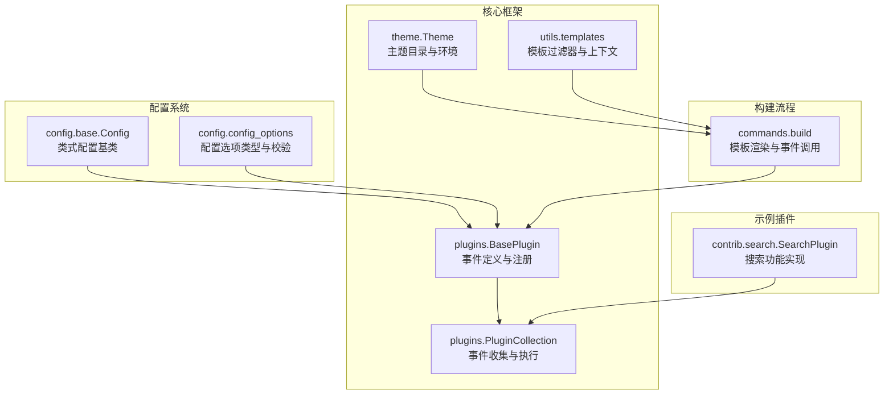
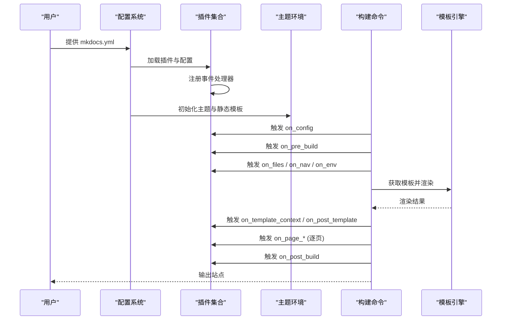
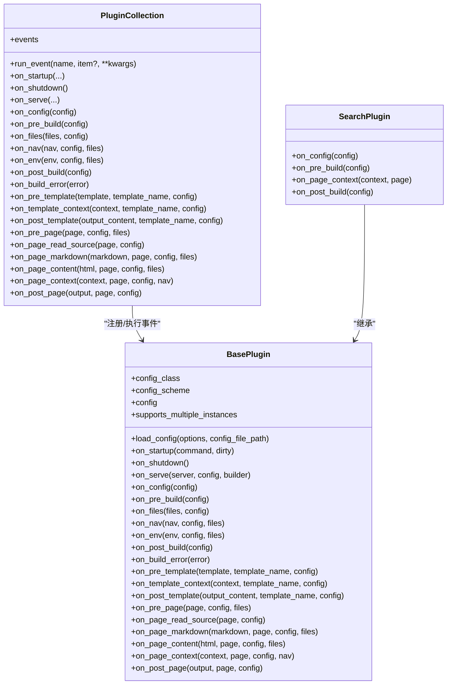
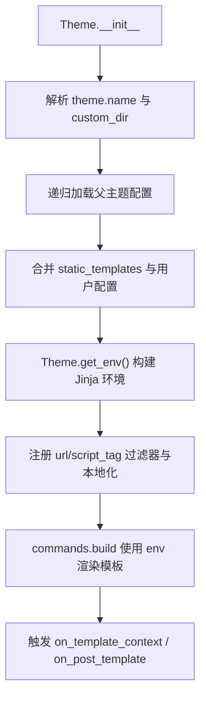
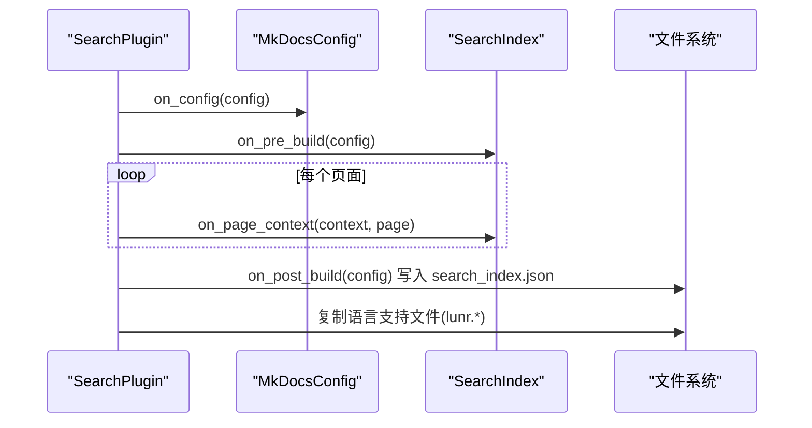
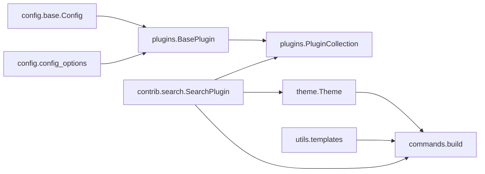

# 扩展开发

<cite>
**本文引用的文件**
- [mkdocs/plugins.py](file://mkdocs/plugins.py)
- [mkdocs/theme.py](file://mkdocs/theme.py)
- [mkdocs/contrib/search/__init__.py](file://mkdocs/contrib/search/__init__.py)
- [mkdocs/config/base.py](file://mkdocs/config/base.py)
- [mkdocs/config/config_options.py](file://mkdocs/config/config_options.py)
- [mkdocs/utils/templates.py](file://mkdocs/utils/templates.py)
- [mkdocs/commands/build.py](file://mkdocs/commands/build.py)
- [docs/dev-guide/plugins.md](file://docs/dev-guide/plugins.md)
- [docs/dev-guide/themes.md](file://docs/dev-guide/themes.md)
- [docs/dev-guide/api.md](file://docs/dev-guide/api.md)
- [mkdocs/tests/plugin_tests.py](file://mkdocs/tests/plugin_tests.py)
- [mkdocs/__init__.py](file://mkdocs/__init__.py)
</cite>

## 目录
1. [简介](#简介)
2. [项目结构](#项目结构)
3. [核心组件](#核心组件)
4. [架构总览](#架构总览)
5. [详细组件分析](#详细组件分析)
6. [依赖关系分析](#依赖关系分析)
7. [性能考量](#性能考量)
8. [故障排查指南](#故障排查指南)
9. [结论](#结论)
10. [附录](#附录)

## 简介
本指南面向希望为 MkDocs 开发“插件与主题”的第三方开发者，系统讲解扩展的架构设计、事件系统、生命周期管理、钩子函数使用、优先级与组合事件、日志与错误处理、第三方扩展的集成与分发策略、调试与测试方法、发布流程以及可复用扩展组件的设计模式。文档以 MkDocs 官方源码与开发者文档为基础，辅以图示帮助不同技术背景的读者快速上手。

## 项目结构
围绕扩展开发的关键模块与文件如下：
- 插件框架与事件系统：mkdocs/plugins.py
- 主题加载与渲染：mkdocs/theme.py、mkdocs/utils/templates.py
- 搜索插件示例：mkdocs/contrib/search/__init__.py
- 配置与校验：mkdocs/config/base.py、mkdocs/config/config_options.py
- 构建流水线调用事件：mkdocs/commands/build.py
- 开发者文档：docs/dev-guide/plugins.md、docs/dev-guide/themes.md、docs/dev-guide/api.md
- 测试样例：mkdocs/tests/plugin_tests.py
- 版本信息：mkdocs/__init__.py



图表来源
- [mkdocs/plugins.py](file://mkdocs/plugins.py#L58-L698)
- [mkdocs/theme.py](file://mkdocs/theme.py#L23-L167)
- [mkdocs/utils/templates.py](file://mkdocs/utils/templates.py#L25-L56)
- [mkdocs/commands/build.py](file://mkdocs/commands/build.py#L80-L107)
- [mkdocs/config/base.py](file://mkdocs/config/base.py#L123-L200)
- [mkdocs/config/config_options.py](file://mkdocs/config/config_options.py#L52-L123)
- [mkdocs/contrib/search/__init__.py](file://mkdocs/contrib/search/__init__.py#L62-L121)

章节来源
- [mkdocs/plugins.py](file://mkdocs/plugins.py#L1-L698)
- [mkdocs/theme.py](file://mkdocs/theme.py#L1-L167)
- [mkdocs/contrib/search/__init__.py](file://mkdocs/contrib/search/__init__.py#L1-L121)
- [mkdocs/config/base.py](file://mkdocs/config/base.py#L1-L200)
- [mkdocs/config/config_options.py](file://mkdocs/config/config_options.py#L1-L200)
- [mkdocs/utils/templates.py](file://mkdocs/utils/templates.py#L1-L56)
- [mkdocs/commands/build.py](file://mkdocs/commands/build.py#L80-L107)
- [docs/dev-guide/plugins.md](file://docs/dev-guide/plugins.md#L1-L567)
- [docs/dev-guide/themes.md](file://docs/dev-guide/themes.md#L1-L800)
- [docs/dev-guide/api.md](file://docs/dev-guide/api.md#L1-L25)
- [mkdocs/tests/plugin_tests.py](file://mkdocs/tests/plugin_tests.py#L1-L200)
- [mkdocs/__init__.py](file://mkdocs/__init__.py#L1-L6)

## 核心组件
- 插件基类与事件系统
  - BasePlugin：定义所有事件钩子（全局、模板、页面事件），支持配置类式 schema、优先级与组合事件。
  - PluginCollection：维护事件注册表，按优先级顺序执行事件，支持多实例与冲突告警。
  - 事件装饰器与组合事件：event_priority、CombinedEvent。
- 主题系统
  - Theme：解析主题配置、继承链、静态模板集合与 Jinja 环境。
  - 模板过滤器：url、script_tag 等。
- 配置系统
  - Config：类式配置 schema，自动收集字段为验证器，支持默认值与后处理。
  - ConfigOptions：提供 Type、List、SubConfig、Optional 等常用校验类型。
- 构建流程中的事件调用
  - commands.build 在模板渲染前后触发相应事件，供插件拦截与修改输出。
- 示例插件
  - contrib.search.SearchPlugin：演示在 on_config/on_pre_build/on_page_context/on_post_build 中扩展站点内容与产物。

章节来源
- [mkdocs/plugins.py](file://mkdocs/plugins.py#L58-L698)
- [mkdocs/theme.py](file://mkdocs/theme.py#L23-L167)
- [mkdocs/utils/templates.py](file://mkdocs/utils/templates.py#L25-L56)
- [mkdocs/config/base.py](file://mkdocs/config/base.py#L123-L200)
- [mkdocs/config/config_options.py](file://mkdocs/config/config_options.py#L52-L123)
- [mkdocs/commands/build.py](file://mkdocs/commands/build.py#L80-L107)
- [mkdocs/contrib/search/__init__.py](file://mkdocs/contrib/search/__init__.py#L62-L121)

## 架构总览
下图展示了从配置到构建再到插件事件的端到端流程，以及主题与模板过滤器的参与位置。



图表来源
- [mkdocs/commands/build.py](file://mkdocs/commands/build.py#L80-L107)
- [mkdocs/plugins.py](file://mkdocs/plugins.py#L575-L647)
- [mkdocs/theme.py](file://mkdocs/theme.py#L158-L167)
- [docs/dev-guide/plugins.md](file://docs/dev-guide/plugins.md#L247-L425)

## 详细组件分析

### 插件基类与事件系统
- 事件分类与生命周期
  - 启动/关闭：on_startup、on_shutdown（仅 serve 场景有跨构建持久化语义）。
  - 全局事件：on_config → on_pre_build → on_files → on_nav → on_env → on_post_build；异常时触发 on_build_error。
  - 模板事件：on_pre_template → on_template_context → on_post_template。
  - 页面事件：on_pre_page → on_page_read_source → on_page_markdown → on_page_content → on_page_context → on_post_page。
- 事件优先级与组合
  - 使用 event_priority 装饰器设置优先级；默认 0；数值越高越先执行。
  - CombinedEvent 支持同一事件在不同优先级注册多个处理器。
- 日志与错误
  - 推荐使用 get_plugin_logger 或以 mkdocs.plugins.* 命名空间记录日志。
  - 异常建议抛出 PluginError，以便向用户友好提示并中断构建；on_build_error 可用于收尾清理。



图表来源
- [mkdocs/plugins.py](file://mkdocs/plugins.py#L58-L698)
- [mkdocs/contrib/search/__init__.py](file://mkdocs/contrib/search/__init__.py#L62-L121)

章节来源
- [mkdocs/plugins.py](file://mkdocs/plugins.py#L58-L698)
- [docs/dev-guide/plugins.md](file://docs/dev-guide/plugins.md#L247-L567)
- [mkdocs/tests/plugin_tests.py](file://mkdocs/tests/plugin_tests.py#L105-L185)

### 主题系统与模板上下文
- 主题加载
  - Theme 解析 theme.name 与 theme.custom_dir，递归加载父主题配置，合并 static_templates，并构建 Jinja 环境（含 url/script_tag 过滤器与本地化）。
- 模板上下文
  - TemplateContext 定义了模板可用变量（config、nav、pages、base_url、mkdocs_version、build_date_utc、page 等）。
- 构建阶段事件
  - commands.build 在模板渲染前后调用 on_template_context 与 on_post_template，允许插件修改模板上下文或输出。



图表来源
- [mkdocs/theme.py](file://mkdocs/theme.py#L124-L167)
- [mkdocs/utils/templates.py](file://mkdocs/utils/templates.py#L25-L56)
- [mkdocs/commands/build.py](file://mkdocs/commands/build.py#L80-L107)

章节来源
- [mkdocs/theme.py](file://mkdocs/theme.py#L23-L167)
- [mkdocs/utils/templates.py](file://mkdocs/utils/templates.py#L25-L56)
- [docs/dev-guide/themes.md](file://docs/dev-guide/themes.md#L1-L800)

### 配置系统与插件配置
- 类式配置（推荐）
  - 通过在 BasePlugin[MyConfig] 中直接定义字段，自动生成 schema 并获得类型安全与默认值。
- 配置选项类型
  - Type、Optional、ListOfItems、SubConfig、Choice、Dir/File 等，支持嵌套与复杂校验。
- 插件命名空间与多实例
  - 支持 theme 命名空间前缀（如 readthedocs/sub_plugin），以及同名插件多实例（自动编号）。

```mermaid
classDiagram
class Config {
+_schema
+load_dict(dct)
+validate()
+set_defaults()
}
class SubConfig~SomeConfig~ {
+validate(value)
}
class ListOfItems~T~ {
+validate(value)
}
class BasePlugin[SomeConfig] {
+config_class
+config_scheme
+config
+load_config(options, config_file_path)
}
BasePlugin --> Config : "使用"
SubConfig --> Config : "生成子配置"
ListOfItems --> BaseConfigOption : "组合"
```

图表来源
- [mkdocs/config/base.py](file://mkdocs/config/base.py#L123-L200)
- [mkdocs/config/config_options.py](file://mkdocs/config/config_options.py#L52-L123)
- [mkdocs/plugins.py](file://mkdocs/plugins.py#L72-L97)

章节来源
- [mkdocs/config/base.py](file://mkdocs/config/base.py#L123-L200)
- [mkdocs/config/config_options.py](file://mkdocs/config/config_options.py#L52-L123)
- [docs/dev-guide/plugins.md](file://docs/dev-guide/plugins.md#L58-L246)

### 搜索插件示例：从配置到产物
- 关键流程
  - on_config：根据主题配置决定是否添加搜索模板与脚本。
  - on_pre_build：初始化 SearchIndex。
  - on_page_context：将页面条目加入索引。
  - on_post_build：生成 search_index.json，并复制语言支持文件。
- 与主题协作
  - 通过 theme.static_templates 与 extra_javascript 控制搜索页面与脚本注入。



图表来源
- [mkdocs/contrib/search/__init__.py](file://mkdocs/contrib/search/__init__.py#L62-L121)

章节来源
- [mkdocs/contrib/search/__init__.py](file://mkdocs/contrib/search/__init__.py#L1-L121)
- [docs/dev-guide/plugins.md](file://docs/dev-guide/plugins.md#L548-L567)

## 依赖关系分析
- 插件与配置
  - BasePlugin 依赖 Config/ConfigOptions 进行配置 schema 定义与校验。
  - PluginCollection 维护事件注册表，按优先级排序，避免重复处理器（如 on_page_read_source）。
- 主题与模板
  - Theme 依赖 utils.get_theme_dir 与 YAML 解析加载主题配置；get_env 注入过滤器与本地化。
  - commands.build 在渲染前后调用模板事件，连接插件与主题。
- 示例插件
  - SearchPlugin 依赖 Theme 的 static_templates 与 extra_javascript，以及 utils.write_file/copy_file 写出产物。



图表来源
- [mkdocs/plugins.py](file://mkdocs/plugins.py#L58-L698)
- [mkdocs/theme.py](file://mkdocs/theme.py#L23-L167)
- [mkdocs/utils/templates.py](file://mkdocs/utils/templates.py#L25-L56)
- [mkdocs/commands/build.py](file://mkdocs/commands/build.py#L80-L107)
- [mkdocs/contrib/search/__init__.py](file://mkdocs/contrib/search/__init__.py#L62-L121)

章节来源
- [mkdocs/plugins.py](file://mkdocs/plugins.py#L58-L698)
- [mkdocs/theme.py](file://mkdocs/theme.py#L23-L167)
- [mkdocs/utils/templates.py](file://mkdocs/utils/templates.py#L25-L56)
- [mkdocs/commands/build.py](file://mkdocs/commands/build.py#L80-L107)
- [mkdocs/contrib/search/__init__.py](file://mkdocs/contrib/search/__init__.py#L62-L121)

## 性能考量
- 事件优先级与组合事件
  - 合理设置优先级，避免多次昂贵操作；必要时使用 CombinedEvent 将同一事件拆分为多段处理。
- 模板与页面事件
  - 尽量在 on_pre_page/on_page_markdown/on_page_content 等早期阶段完成数据准备，减少重复计算。
- 主题与静态模板
  - 合理使用 theme.static_templates，避免不必要的模板重写；利用 Theme.get_env 的缓存与过滤器减少运行时开销。
- 插件多实例
  - 当需要同一插件多次实例时，注意实例编号与状态隔离，避免共享可变状态导致竞态。

## 故障排查指南
- 常见错误类型
  - MkDocsException、ConfigurationError、BuildError、PluginError；建议在插件中捕获异常并抛出 PluginError。
- 日志与调试
  - 使用 get_plugin_logger 或以 mkdocs.plugins.* 命名空间记录日志；结合 --verbose/--debug 查看详细输出。
- 事件冲突与覆盖
  - 对于仅允许单个处理器的事件（如 on_page_read_source），若多个插件注册会触发警告；请检查插件顺序与优先级。
- 配置校验失败
  - 使用 SubConfig/ListOfItems 等类型确保复杂配置的可读性与可维护性；关注 validate 返回的错误与警告列表。

章节来源
- [docs/dev-guide/plugins.md](file://docs/dev-guide/plugins.md#L442-L514)
- [mkdocs/tests/plugin_tests.py](file://mkdocs/tests/plugin_tests.py#L162-L167)

## 结论
通过统一的事件系统与类式配置，MkDocs 为插件与主题扩展提供了清晰、可组合且可测试的开发模型。遵循事件生命周期、合理使用优先级与组合事件、正确处理日志与错误、配合主题与模板上下文，即可构建高质量、可复用的扩展组件，并以标准方式分发与集成。

## 附录

### 开发示例与代码模板（路径指引）
- 插件基类与事件钩子
  - 参考：[BasePlugin 事件定义](file://mkdocs/plugins.py#L100-L416)
  - 参考：[事件优先级装饰器](file://mkdocs/plugins.py#L426-L457)
  - 参考：[组合事件](file://mkdocs/plugins.py#L460-L491)
- 类式配置与选项类型
  - 参考：[Config 基类](file://mkdocs/config/base.py#L123-L200)
  - 参考：[SubConfig/List/Choice 等](file://mkdocs/config/config_options.py#L52-L123)
- 主题与模板上下文
  - 参考：[Theme 主题加载](file://mkdocs/theme.py#L124-L167)
  - 参考：[模板过滤器](file://mkdocs/utils/templates.py#L25-L56)
- 构建流程中的事件调用
  - 参考：[模板渲染前后事件](file://mkdocs/commands/build.py#L80-L107)
- 搜索插件示例
  - 参考：[SearchPlugin 实现](file://mkdocs/contrib/search/__init__.py#L62-L121)
- 开发者文档
  - 参考：[插件开发指南](file://docs/dev-guide/plugins.md#L57-L567)
  - 参考：[主题开发指南](file://docs/dev-guide/themes.md#L22-L800)
  - 参考：[API 参考](file://docs/dev-guide/api.md#L1-L25)

### 发布与分发策略
- 包装与入口点
  - 在 setup.py 中通过 setuptools entry_points 注册插件入口；主题需提供 mkdocs_theme.yml。
- 版本与兼容性
  - 参考版本号：[mkdocs/__version__](file://mkdocs/__init__.py#L5-L5)
- 分发渠道
  - 发布至 PyPI；在 MkDocs Catalog 中登记以提升发现度。

章节来源
- [docs/dev-guide/plugins.md](file://docs/dev-guide/plugins.md#L515-L567)
- [docs/dev-guide/themes.md](file://docs/dev-guide/themes.md#L1-L800)
- [mkdocs/__init__.py](file://mkdocs/__init__.py#L5-L5)