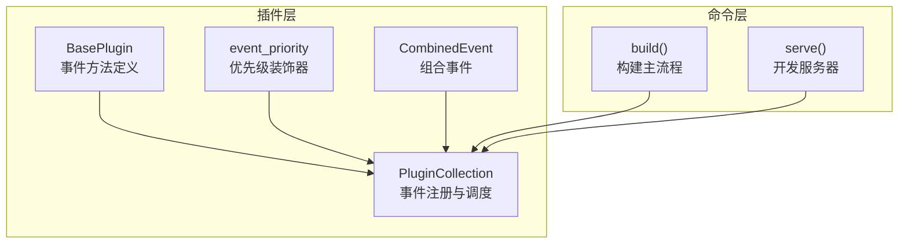
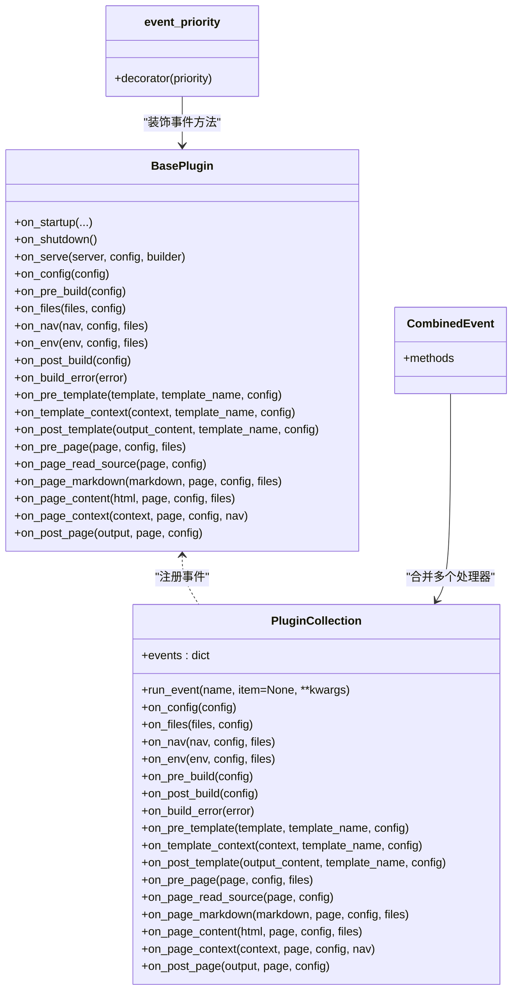
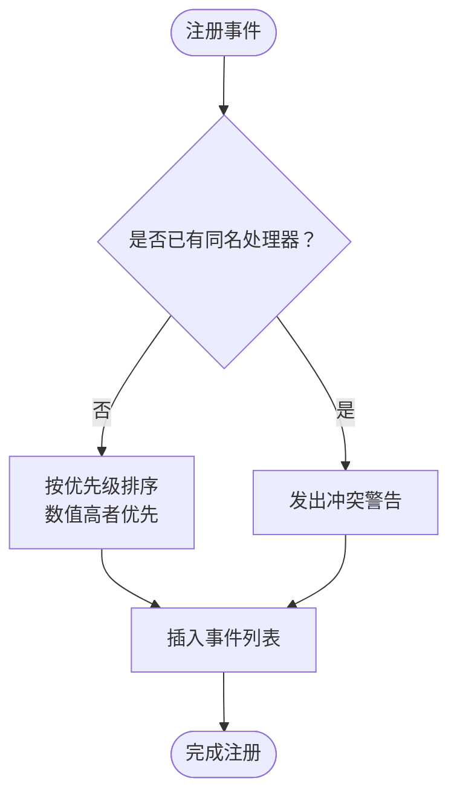
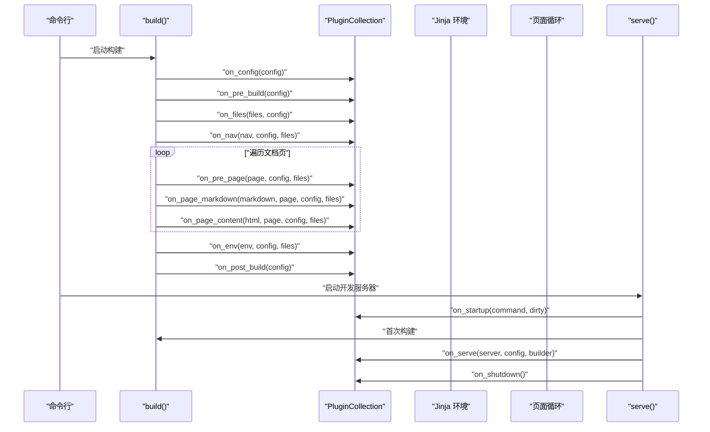
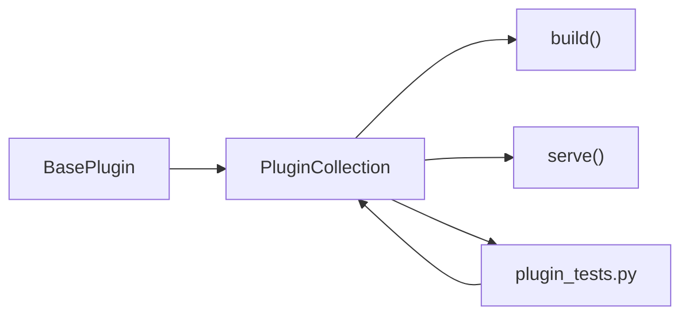

# 事件系统详解

<cite>
**本文引用的文件列表**
- [mkdocs/plugins.py](file://mkdocs/plugins.py)
- [docs/dev-guide/plugins.md](file://docs/dev-guide/plugins.md)
- [mkdocs/commands/build.py](file://mkdocs/commands/build.py)
- [mkdocs/commands/serve.py](file://mkdocs/commands/serve.py)
- [mkdocs/tests/plugin_tests.py](file://mkdocs/tests/plugin_tests.py)
- [mkdocs/contrib/search/__init__.py](file://mkdocs/contrib/search/__init__.py)
- [docs/img/plugin-events.py](file://docs/img/plugin-events.py)
</cite>

## 目录
1. [简介](#简介)
2. [项目结构与事件系统定位](#项目结构与事件系统定位)
3. [核心组件总览](#核心组件总览)
4. [架构概览](#架构概览)
5. [事件类型详解](#事件类型详解)
6. [事件优先级与组合事件](#事件优先级与组合事件)
7. [事件链式处理与控制流](#事件链式处理与控制流)
8. [依赖关系分析](#依赖关系分析)
9. [性能考量](#性能考量)
10. [故障排查指南](#故障排查指南)
11. [结论](#结论)
12. [附录：事件图谱与最佳实践](#附录事件图谱与最佳实践)

## 简介
本文件系统性梳理 MkDocs 插件事件系统，覆盖事件类型、触发时机、参数传递、返回值处理、优先级与组合事件、事件链式处理流程、错误处理与日志记录，并提供可操作的最佳实践与排障建议。目标读者既包括需要深入理解机制的开发者，也包括希望正确使用事件的插件作者与站点维护者。

## 项目结构与事件系统定位
- 事件系统的核心定义位于插件模块中，围绕 BasePlugin、PluginCollection 与事件装饰器展开。
- 构建与服务命令在执行过程中按阶段调用相应事件，形成完整的事件链。
- 文档中提供了事件时序图与使用指南，便于理解事件之间的关系与调用顺序。

图表来源
- [mkdocs/plugins.py](file://mkdocs/plugins.py#L58-L417)
- [mkdocs/commands/build.py](file://mkdocs/commands/build.py#L249-L365)
- [mkdocs/commands/serve.py](file://mkdocs/commands/serve.py#L20-L111)

章节来源
- [mkdocs/plugins.py](file://mkdocs/plugins.py#L58-L417)
- [docs/dev-guide/plugins.md](file://docs/dev-guide/plugins.md#L247-L425)

## 核心组件总览
- BasePlugin：定义所有可用事件方法的签名与默认行为（多数返回原对象或 None，表示不修改）。
- PluginCollection：负责收集插件实例、注册事件处理器、按优先级排序并执行事件链。
- event_priority：为事件处理器设置优先级，数值越高越先执行。
- CombinedEvent：将多个子事件处理器合并到同一事件名下，便于在同一事件上以不同优先级注册多个处理器。

章节来源
- [mkdocs/plugins.py](file://mkdocs/plugins.py#L58-L417)
- [mkdocs/plugins.py](file://mkdocs/plugins.py#L426-L480)

## 架构概览
事件系统采用“声明式事件 + 调度器”的模式：
- 插件通过继承 BasePlugin 并实现 on_* 方法参与事件。
- PluginCollection 在插件加入集合时自动扫描并注册事件。
- 每个事件在运行时按优先级顺序依次调用，支持对传入对象进行就地修改或替换。

图表来源
- [mkdocs/plugins.py](file://mkdocs/plugins.py#L58-L417)
- [mkdocs/plugins.py](file://mkdocs/plugins.py#L426-L480)

## 事件类型详解
以下事件按生命周期分组说明，均来自 BasePlugin 的方法定义与文档注释。

### 一、一次性事件（每轮命令执行一次）
- on_startup(command, dirty)
  - 触发时机：每次命令启动时（如 mkdocs build/serve/gh-deploy），仅在首次调用。
  - 参数：command 为命令字符串；dirty 表示是否启用脏构建。
  - 返回：无（通常用于初始化状态）。
- on_shutdown()
  - 触发时机：命令结束前（尽可能在退出前执行）。
  - 返回：无。
- on_serve(server, config, builder)
  - 触发时机：开发服务器首次构建完成后，仅一次。
  - 参数：LiveReloadServer 实例、全局配置、构建回调。
  - 返回：可返回修改后的 server 实例（常用于扩展监听目录或构建策略）。

章节来源
- [mkdocs/plugins.py](file://mkdocs/plugins.py#L100-L152)
- [docs/dev-guide/plugins.md](file://docs/dev-guide/plugins.md#L270-L294)
- [mkdocs/commands/serve.py](file://mkdocs/commands/serve.py#L53-L108)

### 二、全局事件（每构建一次）
- on_config(config)
  - 触发时机：用户配置加载并验证后立即执行。
  - 参数：全局配置对象。
  - 返回：可返回修改后的配置对象。
- on_pre_build(config)
  - 触发时机：开始构建前，适合执行预构建脚本。
  - 参数：全局配置对象。
  - 返回：无。
- on_files(files, config)
  - 触发时机：文件收集完成，但页面尚未关联。
  - 参数：Files 集合、全局配置。
  - 返回：可返回修改后的 Files 集合。
- on_nav(nav, config, files)
  - 触发时机：导航生成后，适合调整导航结构。
  - 参数：Navigation 对象、全局配置、Files 集合。
  - 返回：可返回修改后的 Navigation。
- on_env(env, config, files)
  - 触发时机：Jinja 环境创建后，适合扩展环境能力。
  - 参数：Jinja2 Environment、全局配置、Files 集合。
  - 返回：可返回修改后的 Environment。
- on_post_build(config)
  - 触发时机：构建完成后，适合执行后置脚本或清理。
  - 参数：全局配置对象。
  - 返回：无。
- on_build_error(error)
  - 触发时机：构建过程中捕获异常时。
  - 参数：异常对象。
  - 返回：无（适合做收尾清理）。

章节来源
- [mkdocs/plugins.py](file://mkdocs/plugins.py#L156-L251)
- [docs/dev-guide/plugins.md](file://docs/dev-guide/plugins.md#L295-L349)
- [mkdocs/commands/build.py](file://mkdocs/commands/build.py#L249-L365)

### 三、模板事件（针对非页面模板）
- on_pre_template(template, template_name, config)
  - 触发时机：模板加载后、渲染前。
  - 参数：Jinja2 Template、模板名、全局配置。
  - 返回：可返回修改后的 Template。
- on_template_context(context, template_name, config)
  - 触发时机：上下文创建后、渲染前。
  - 参数：TemplateContext、模板名、全局配置。
  - 返回：可返回修改后的上下文。
- on_post_template(output_content, template_name, config)
  - 触发时机：模板渲染后、写盘前。
  - 参数：输出内容字符串、模板名、全局配置。
  - 返回：可返回修改后的输出内容；若返回空字符串则跳过写盘。

章节来源
- [mkdocs/plugins.py](file://mkdocs/plugins.py#L254-L306)
- [docs/dev-guide/plugins.md](file://docs/dev-guide/plugins.md#L350-L377)
- [mkdocs/commands/build.py](file://mkdocs/commands/build.py#L61-L88)

### 四、页面事件（针对每个 Markdown 页面）
- on_pre_page(page, config, files)
  - 触发时机：页面处理前。
  - 参数：Page 实例、全局配置、Files 集合。
  - 返回：可返回修改后的 Page。
- on_page_read_source(page, config)
  - 触发时机：页面源码读取前（已弃用，推荐替代方案）。
  - 参数：Page 实例、全局配置。
  - 返回：可返回自定义源码字符串；若返回 None 则走默认读取。
- on_page_markdown(markdown, page, config, files)
  - 触发时机：Markdown 加载后、渲染前。
  - 参数：Markdown 字符串、Page、全局配置、Files。
  - 返回：可返回修改后的 Markdown。
- on_page_content(html, page, config, files)
  - 触发时机：Markdown 渲染为 HTML 后、进入模板前。
  - 参数：HTML 字符串、Page、全局配置、Files。
  - 返回：可返回修改后的 HTML。
- on_page_context(context, page, config, nav)
  - 触发时机：页面上下文创建后、模板渲染前。
  - 参数：TemplateContext、Page、全局配置、Navigation。
  - 返回：可返回修改后的上下文。
- on_post_page(output, page, config)
  - 触发时机：模板渲染后、写盘前。
  - 参数：输出内容字符串、Page、全局配置。
  - 返回：可返回修改后的输出内容；若返回空字符串则跳过写盘。

章节来源
- [mkdocs/plugins.py](file://mkdocs/plugins.py#L308-L417)
- [docs/dev-guide/plugins.md](file://docs/dev-guide/plugins.md#L378-L425)
- [mkdocs/commands/build.py](file://mkdocs/commands/build.py#L147-L247)

## 事件优先级与组合事件
- 优先级设置
  - 使用装饰器为事件方法设置优先级，数值越大越先执行；默认优先级为 0；相同优先级按配置顺序执行。
  - 推荐优先级：100（first）、50（early）、0（default）、-50（late）、-100（last）。
- 组合事件
  - CombinedEvent 可将多个子事件处理器合并到同一事件名下，便于在同一事件上以不同优先级注册多个处理器。
  - 子方法命名不能以 on_ 开头，推荐以 _on_ 或其他前缀区分。
- 多处理器冲突
  - 对于某些事件（如 on_page_read_source），同时存在多个处理器会导致冲突警告，且最终只保留一个有效处理器。

图表来源
- [mkdocs/plugins.py](file://mkdocs/plugins.py#L509-L531)
- [mkdocs/tests/plugin_tests.py](file://mkdocs/tests/plugin_tests.py#L135-L185)

章节来源
- [mkdocs/plugins.py](file://mkdocs/plugins.py#L426-L480)
- [docs/dev-guide/plugins.md](file://docs/dev-guide/plugins.md#L426-L441)
- [mkdocs/tests/plugin_tests.py](file://mkdocs/tests/plugin_tests.py#L135-L185)

## 事件链式处理与控制流
事件链由命令层驱动，按阶段调用对应事件。以下序列图展示构建与服务过程中的关键事件调用点。

图表来源
- [mkdocs/commands/build.py](file://mkdocs/commands/build.py#L249-L365)
- [mkdocs/commands/serve.py](file://mkdocs/commands/serve.py#L53-L108)
- [mkdocs/plugins.py](file://mkdocs/plugins.py#L575-L646)

章节来源
- [mkdocs/commands/build.py](file://mkdocs/commands/build.py#L249-L365)
- [mkdocs/commands/serve.py](file://mkdocs/commands/serve.py#L20-L111)

## 依赖关系分析
- BasePlugin 定义了所有事件方法的签名与默认行为。
- PluginCollection 负责事件注册、排序与执行，是事件调度的核心。
- 命令层（build/serve）在关键节点调用 PluginCollection 的事件方法，形成完整的构建生命周期。
- 测试用例验证了事件注册、优先级排序、冲突警告与链式处理的行为。

图表来源
- [mkdocs/plugins.py](file://mkdocs/plugins.py#L493-L647)
- [mkdocs/commands/build.py](file://mkdocs/commands/build.py#L249-L365)
- [mkdocs/commands/serve.py](file://mkdocs/commands/serve.py#L20-L111)
- [mkdocs/tests/plugin_tests.py](file://mkdocs/tests/plugin_tests.py#L105-L238)

章节来源
- [mkdocs/plugins.py](file://mkdocs/plugins.py#L493-L647)
- [mkdocs/tests/plugin_tests.py](file://mkdocs/tests/plugin_tests.py#L105-L238)

## 性能考量
- 事件链顺序固定，避免在事件中执行耗时操作；必要时使用懒加载或缓存。
- on_env/on_pre_template/on_template_context/on_post_template 等模板事件对每个模板都会触发，应避免重复计算。
- on_page_markdown/on_page_content/on_post_page 等页面事件对每个页面都会触发，注意批量处理与增量更新。
- 使用 event_priority 合理安排处理器顺序，减少不必要的多次修改。

## 故障排查指南
- 错误类型
  - MkDocs 定义了多种错误类型，建议在插件中抛出合适的异常以便用户获得清晰提示。
- 错误事件
  - on_build_error(error) 在捕获异常时被调用，适合做清理工作。
- 日志记录
  - 建议使用 get_plugin_logger 或在 mkdocs.plugins.* 命名空间下记录日志，配合 --verbose/--debug 查看调试信息。
- 冲突与警告
  - 当同一事件存在多个处理器时会发出警告，需检查插件配置与事件注册逻辑。

章节来源
- [docs/dev-guide/plugins.md](file://docs/dev-guide/plugins.md#L442-L514)
- [mkdocs/plugins.py](file://mkdocs/plugins.py#L649-L698)
- [mkdocs/tests/plugin_tests.py](file://mkdocs/tests/plugin_tests.py#L162-L167)

## 结论
MkDocs 的事件系统通过清晰的生命周期划分、灵活的优先级与组合事件机制，为插件生态提供了强大的扩展能力。遵循本文所述的事件类型、参数与返回约定、优先级与组合事件实践，以及错误处理与日志规范，可以编写出稳定、可维护且高性能的插件。

## 附录：事件图谱与最佳实践
- 事件图谱
  - 文档中提供了事件关系图，展示了全局事件与页面事件之间的时序关系与数据流向。
- 最佳实践
  - 明确事件职责边界：不要在 on_config 中做页面级别的修改；不要在 on_pre_build 中访问页面对象。
  - 使用 event_priority 精准控制执行顺序；对可能冲突的事件（如 on_page_read_source）谨慎注册多个处理器。
  - 在模板事件中避免重复渲染；在页面事件中尽量就地修改而非重建对象。
  - 使用 get_plugin_logger 输出统一格式的日志，便于问题定位。
  - 示例参考：搜索插件在 on_config/on_pre_build/on_page_context/on_post_build 中的典型用法。

章节来源
- [docs/dev-guide/plugins.md](file://docs/dev-guide/plugins.md#L252-L267)
- [docs/img/plugin-events.py](file://docs/img/plugin-events.py#L98-L154)
- [mkdocs/contrib/search/__init__.py](file://mkdocs/contrib/search/__init__.py#L62-L121)