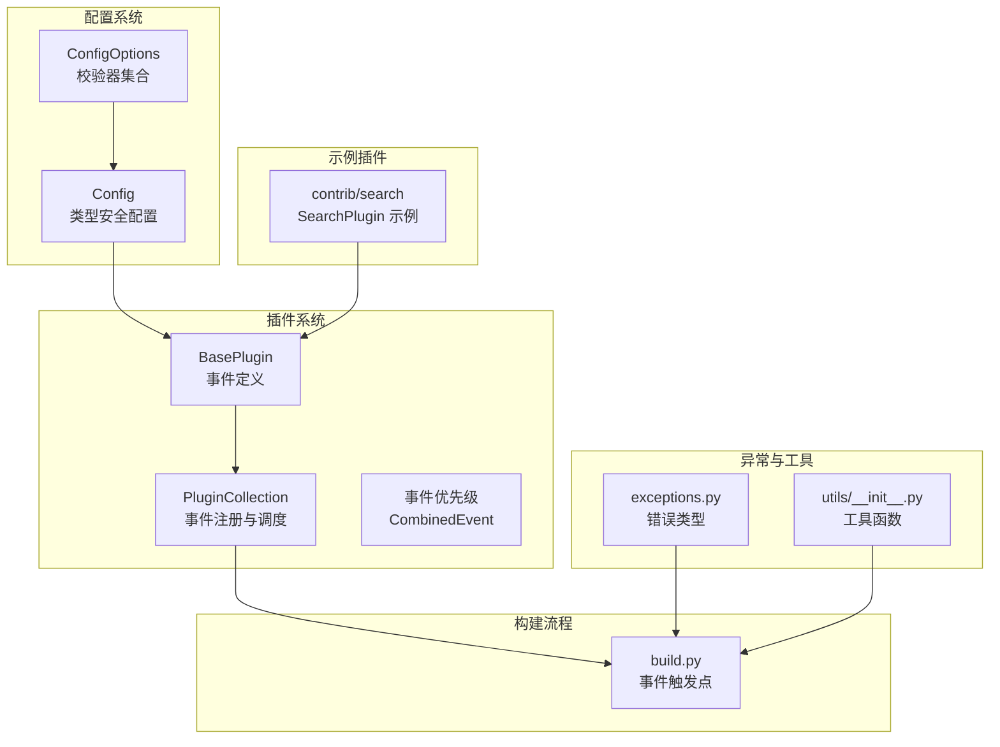
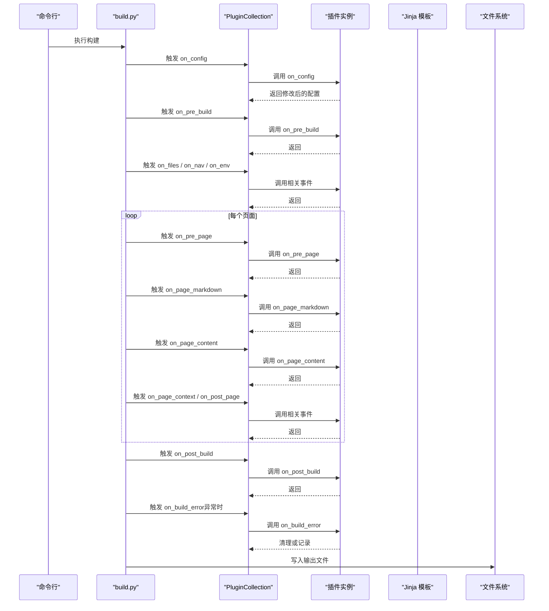
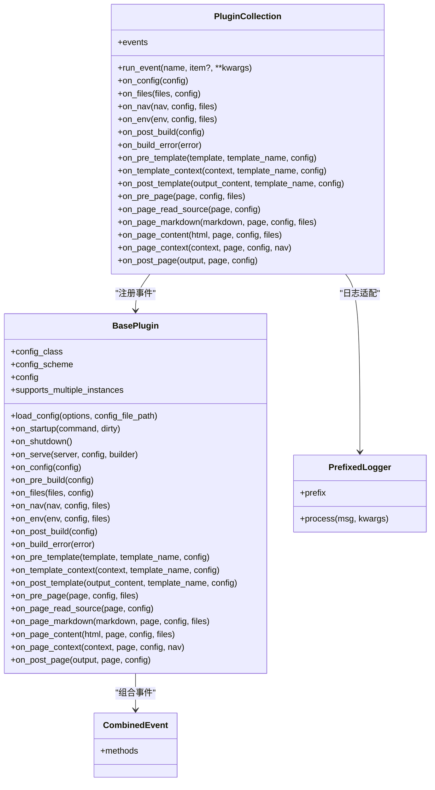
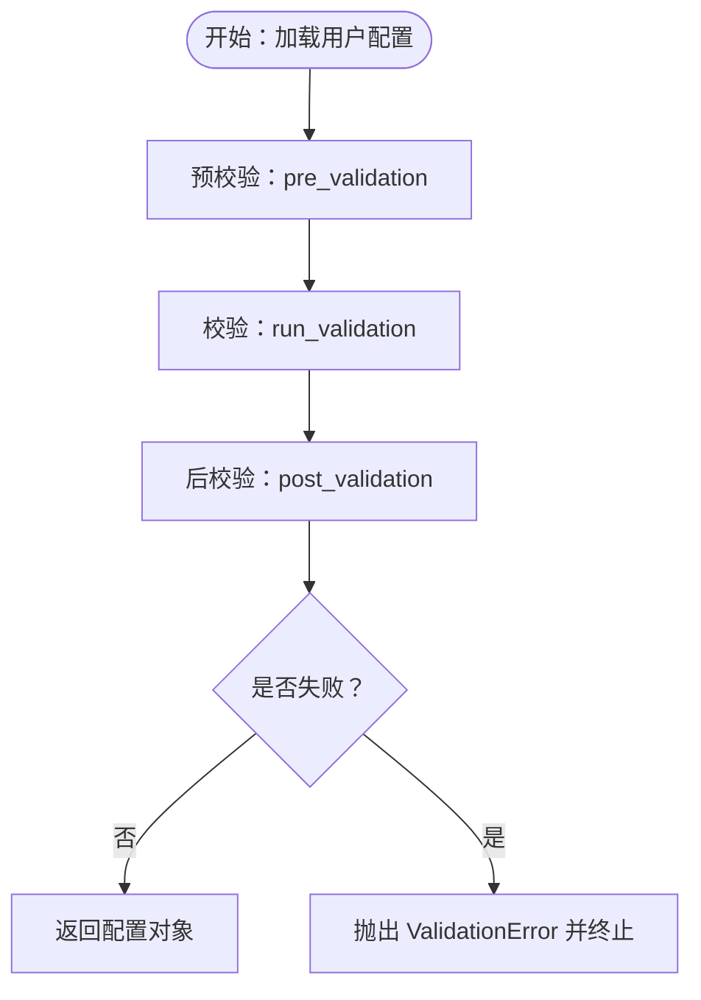
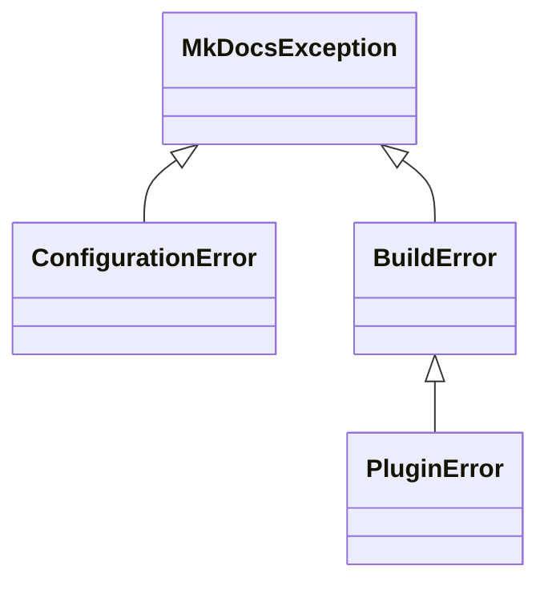
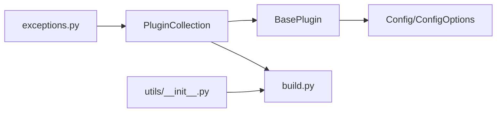

# 开发实践指南

<cite>
**本文档引用的文件**
- [mkdocs/plugins.py](file://mkdocs/plugins.py)
- [docs/dev-guide/plugins.md](file://docs/dev-guide/plugins.md)
- [mkdocs/config/config_options.py](file://mkdocs/config/config_options.py)
- [mkdocs/config/base.py](file://mkdocs/config/base.py)
- [mkdocs/exceptions.py](file://mkdocs/exceptions.py)
- [mkdocs/contrib/search/__init__.py](file://mkdocs/contrib/search/__init__.py)
- [mkdocs/utils/__init__.py](file://mkdocs/utils/__init__.py)
- [mkdocs/commands/build.py](file://mkdocs/commands/build.py)
- [mkdocs/tests/plugin_tests.py](file://mkdocs/tests/plugin_tests.py)
- [CONTRIBUTING.md](file://CONTRIBUTING.md)
</cite>

## 目录
1. [简介](#简介)
2. [项目结构](#项目结构)
3. [核心组件](#核心组件)
4. [架构总览](#架构总览)
5. [详细组件分析](#详细组件分析)
6. [依赖关系分析](#依赖关系分析)
7. [性能考量](#性能考量)
8. [故障排查指南](#故障排查指南)
9. [结论](#结论)
10. [附录](#附录)

## 简介
本指南面向希望为 MkDocs 开发插件的开发者，系统阐述插件开发的标准流程与最佳实践，覆盖项目结构设计、代码组织、日志记录、错误处理、事件机制、测试与调试、性能优化、发布与版本管理、向后兼容性以及常见陷阱与解决方案。文档以 MkDocs 源码为依据，结合官方开发者指南与测试用例，帮助你从零开始构建高质量的 MkDocs 插件。

## 项目结构
MkDocs 的插件系统由以下关键模块组成：
- 插件基类与事件调度：位于 [mkdocs/plugins.py](file://mkdocs/plugins.py)，定义 BasePlugin、PluginCollection、事件优先级与组合事件等。
- 配置验证框架：位于 [mkdocs/config/base.py](file://mkdocs/config/base.py) 与 [mkdocs/config/config_options.py](file://mkdocs/config/config_options.py)，提供类型安全的配置模式与丰富的校验器。
- 异常体系：位于 [mkdocs/exceptions.py](file://mkdocs/exceptions.py)，统一错误类型与用户可读消息。
- 构建流程中的插件调用点：位于 [mkdocs/commands/build.py](file://mkdocs/commands/build.py)，在模板渲染、页面内容处理等阶段触发插件事件。
- 官方插件示例：位于 [mkdocs/contrib/search/__init__.py](file://mkdocs/contrib/search/__init__.py)，展示如何使用配置类与事件处理。
- 测试与开发规范：位于 [mkdocs/tests/plugin_tests.py](file://mkdocs/tests/plugin_tests.py) 与 [CONTRIBUTING.md](file://CONTRIBUTING.md)，提供测试方法与风格要求。

图表来源
- [mkdocs/plugins.py](file://mkdocs/plugins.py#L58-L698)
- [mkdocs/config/base.py](file://mkdocs/config/base.py#L123-L393)
- [mkdocs/config/config_options.py](file://mkdocs/config/config_options.py#L52-L800)
- [mkdocs/commands/build.py](file://mkdocs/commands/build.py#L61-L200)
- [mkdocs/exceptions.py](file://mkdocs/exceptions.py#L6-L42)
- [mkdocs/utils/__init__.py](file://mkdocs/utils/__init__.py#L113-L150)
- [mkdocs/contrib/search/__init__.py](file://mkdocs/contrib/search/__init__.py#L54-L121)

章节来源
- [mkdocs/plugins.py](file://mkdocs/plugins.py#L58-L698)
- [docs/dev-guide/plugins.md](file://docs/dev-guide/plugins.md#L57-L567)

## 核心组件
- BasePlugin：所有插件必须继承的基类，定义了完整的事件生命周期（启动、全局、模板、页面等）与配置加载方法。
- PluginCollection：插件集合，负责事件注册、优先级排序与事件执行。
- 配置系统：通过 Config 类与多种 ConfigOption 子类实现类型安全与强校验。
- 异常体系：MkDocsException、ConfigurationError、BuildError、PluginError，确保一致的错误处理与用户提示。
- 日志：提供 get_plugin_logger 与 PrefixedLogger，统一插件日志格式与级别控制。

章节来源
- [mkdocs/plugins.py](file://mkdocs/plugins.py#L58-L698)
- [mkdocs/config/base.py](file://mkdocs/config/base.py#L123-L393)
- [mkdocs/config/config_options.py](file://mkdocs/config/config_options.py#L52-L800)
- [mkdocs/exceptions.py](file://mkdocs/exceptions.py#L6-L42)

## 架构总览
下图展示了插件在构建流程中的调用顺序与交互关系，包括事件的触发点与数据流。

图表来源
- [mkdocs/commands/build.py](file://mkdocs/commands/build.py#L61-L200)
- [mkdocs/plugins.py](file://mkdocs/plugins.py#L575-L647)

## 详细组件分析

### 组件一：BasePlugin 与事件模型
- 事件分类：一次性事件（on_startup/on_shutdown/on_serve）、全局事件（on_config/on_pre_build/on_files/on_nav/on_env/on_post_build/on_build_error）、模板事件（on_pre_template/on_template_context/on_post_template）与页面事件（on_pre_page/on_page_markdown/on_page_content/on_page_context/on_post_page）。
- 事件返回规则：若事件处理器返回非空值，则替换传入对象；返回 None 则保持原对象不变。
- 事件优先级：通过 event_priority 装饰器设置，数值越高越先执行；相同优先级按配置顺序执行。
- 组合事件：CombinedEvent 允许在同一事件名下注册多个处理器，并按优先级排序。

图表来源
- [mkdocs/plugins.py](file://mkdocs/plugins.py#L58-L698)

章节来源
- [mkdocs/plugins.py](file://mkdocs/plugins.py#L58-L698)
- [docs/dev-guide/plugins.md](file://docs/dev-guide/plugins.md#L247-L426)

### 组件二：配置系统与类型安全
- 类型安全配置：自 MkDocs 1.4 起推荐使用 Config 子类定义配置项，支持属性访问与自动默认值填充。
- 配置选项：提供 Type、Choice、Optional、ListOfItems、DictOfItems、SubConfig 等丰富校验器，支持复杂嵌套结构与列表校验。
- 验证流程：预校验（pre_validation）→ 校验（run_validation）→ 后校验（post_validation），失败时抛出 ValidationError，警告收集到 warnings 中。

图表来源
- [mkdocs/config/base.py](file://mkdocs/config/base.py#L181-L243)
- [mkdocs/config/config_options.py](file://mkdocs/config/config_options.py#L323-L382)

章节来源
- [mkdocs/config/base.py](file://mkdocs/config/base.py#L123-L393)
- [mkdocs/config/config_options.py](file://mkdocs/config/config_options.py#L52-L800)
- [docs/dev-guide/plugins.md](file://docs/dev-guide/plugins.md#L71-L201)

### 组件三：异常与日志
- 异常类型：MkDocsException 为基类；ConfigurationError 用于配置校验；BuildError 由构建过程抛出；PluginError 供插件事件抛出，保证用户友好提示。
- 日志：建议使用 get_plugin_logger 或以 mkdocs.plugins.<name> 命名空间的日志器，配合 --verbose/--debug 控制输出级别。

图表来源
- [mkdocs/exceptions.py](file://mkdocs/exceptions.py#L6-L42)

章节来源
- [mkdocs/exceptions.py](file://mkdocs/exceptions.py#L6-L42)
- [docs/dev-guide/plugins.md](file://docs/dev-guide/plugins.md#L442-L514)

### 组件四：官方插件示例（搜索插件）
- SearchPlugin 展示了如何：
  - 使用类型安全配置类定义插件配置；
  - 在 on_config 中注入主题资源与脚本；
  - 在 on_pre_build 初始化索引；
  - 在 on_page_context 收集页面条目；
  - 在 on_post_build 生成搜索索引与复制语言资源。

章节来源
- [mkdocs/contrib/search/__init__.py](file://mkdocs/contrib/search/__init__.py#L54-L121)

### 组件五：构建流程中的事件触发点
- 模板阶段：on_pre_template → 构建上下文 → on_template_context → 渲染 → on_post_template。
- 页面阶段：on_pre_page → 读取源码 → on_page_markdown → 渲染 → on_page_content → 上下文 → on_page_context → on_post_page。
- 全局阶段：on_config → on_pre_build → on_files → on_nav → on_env → on_post_build。

章节来源
- [mkdocs/commands/build.py](file://mkdocs/commands/build.py#L61-L200)

## 依赖关系分析
- 插件对配置系统的依赖：插件通过 BasePlugin.config 访问已验证的配置；配置类由 Config 与多种 ConfigOption 组成。
- 插件对构建流程的依赖：PluginCollection 在构建各阶段调用插件事件，形成“事件驱动”的扩展点。
- 工具与异常：utils 提供文件写入、路径处理等；exceptions 提供统一错误类型。

图表来源
- [mkdocs/plugins.py](file://mkdocs/plugins.py#L58-L698)
- [mkdocs/config/base.py](file://mkdocs/config/base.py#L123-L393)
- [mkdocs/config/config_options.py](file://mkdocs/config/config_options.py#L52-L800)
- [mkdocs/commands/build.py](file://mkdocs/commands/build.py#L61-L200)
- [mkdocs/exceptions.py](file://mkdocs/exceptions.py#L6-L42)
- [mkdocs/utils/__init__.py](file://mkdocs/utils/__init__.py#L113-L150)

章节来源
- [mkdocs/plugins.py](file://mkdocs/plugins.py#L58-L698)
- [mkdocs/config/base.py](file://mkdocs/config/base.py#L123-L393)
- [mkdocs/config/config_options.py](file://mkdocs/config/config_options.py#L52-L800)
- [mkdocs/commands/build.py](file://mkdocs/commands/build.py#L61-L200)
- [mkdocs/exceptions.py](file://mkdocs/exceptions.py#L6-L42)
- [mkdocs/utils/__init__.py](file://mkdocs/utils/__init__.py#L113-L150)

## 性能考量
- 事件优先级与组合事件：合理设置优先级减少重复处理，避免同一事件被多个插件同时处理导致的性能问题。
- 文件与目录操作：使用 utils.copy_file 与 utils.write_file，确保目录存在与原子写入，减少不必要的 I/O。
- 路径与 URL 处理：使用 utils.normalize_url 与相对路径计算，避免重复解析与错误链接。
- 调试日志：仅在必要时输出 debug 级别日志，避免在热路径中进行昂贵计算。

章节来源
- [mkdocs/utils/__init__.py](file://mkdocs/utils/__init__.py#L113-L150)
- [mkdocs/plugins.py](file://mkdocs/plugins.py#L426-L491)

## 故障排查指南
- 配置错误：使用 ConfigOptions 的 ValidationError 抛出具体错误信息；严格模式下警告也会导致构建中断。
- 运行时错误：在插件事件中捕获异常并抛出 PluginError，确保用户看到清晰的错误提示；未捕获异常会中断构建。
- 事件冲突：当多个插件注册同一事件（如 on_page_read_source）时会发出警告；应通过优先级或合并事件避免冲突。
- 日志定位：使用 get_plugin_logger 输出带插件前缀的日志，便于区分来源与级别控制。

章节来源
- [mkdocs/exceptions.py](file://mkdocs/exceptions.py#L6-L42)
- [mkdocs/plugins.py](file://mkdocs/plugins.py#L518-L531)
- [docs/dev-guide/plugins.md](file://docs/dev-guide/plugins.md#L442-L514)

## 结论
MkDocs 的插件系统以事件驱动为核心，结合类型安全的配置与严格的异常处理，提供了强大的扩展能力。遵循本文档的结构设计、事件选择、日志与错误处理规范，配合完善的测试与调试实践，可以高效地开发出稳定、可维护且高性能的插件。

## 附录

### A. 插件开发标准流程
- 设计配置：优先使用 Config 子类定义配置项，利用 Type、Choice、Optional、ListOfItems、SubConfig 等校验器。
- 实现事件：根据需求选择合适的事件（全局/模板/页面），在事件中修改对象或返回新对象。
- 注册入口：在 setup.py 中通过 entry_points 暴露插件类，名称即用户在配置中使用的插件名。
- 测试与调试：编写单元测试与集成测试，使用断言与日志定位问题；遵循代码风格与静态检查。

章节来源
- [docs/dev-guide/plugins.md](file://docs/dev-guide/plugins.md#L515-L567)
- [CONTRIBUTING.md](file://CONTRIBUTING.md#L69-L120)

### B. 测试方法与示例
- 单元测试：参考 [mkdocs/tests/plugin_tests.py](file://mkdocs/tests/plugin_tests.py)，验证配置加载、事件注册、优先级与错误处理。
- 集成测试：通过构建流程触发插件事件，验证页面内容、导航与模板输出。
- 断言与日志：使用 unittest 断言与断言日志输出，确保行为符合预期。

章节来源
- [mkdocs/tests/plugin_tests.py](file://mkdocs/tests/plugin_tests.py#L1-L329)
- [CONTRIBUTING.md](file://CONTRIBUTING.md#L69-L81)

### C. 发布与版本管理
- 包发布：在 PyPI 发布插件包，确保 entry_points 正确；在 Catalog 注册以提升发现度。
- 版本策略：遵循语义化版本，注意向后兼容性；对破坏性变更提供迁移指南。
- 文档与示例：提供最小可复现示例与完整配置说明，便于用户快速上手。

章节来源
- [docs/dev-guide/plugins.md](file://docs/dev-guide/plugins.md#L548-L567)
- [CONTRIBUTING.md](file://CONTRIBUTING.md#L135-L146)

### D. 常见陷阱与解决方案
- 事件冲突：多个插件注册同一事件时会发出警告；通过优先级或合并事件避免冲突。
- 配置类型不匹配：使用 ConfigOptions 的类型校验，确保配置正确；严格模式下警告也会导致失败。
- 错误处理不当：在插件事件中捕获异常并抛出 PluginError，避免未捕获异常中断构建。
- 性能瓶颈：避免在热路径中进行昂贵操作；合理使用缓存与延迟计算。

章节来源
- [mkdocs/plugins.py](file://mkdocs/plugins.py#L518-L531)
- [mkdocs/exceptions.py](file://mkdocs/exceptions.py#L6-L42)
- [docs/dev-guide/plugins.md](file://docs/dev-guide/plugins.md#L442-L514)