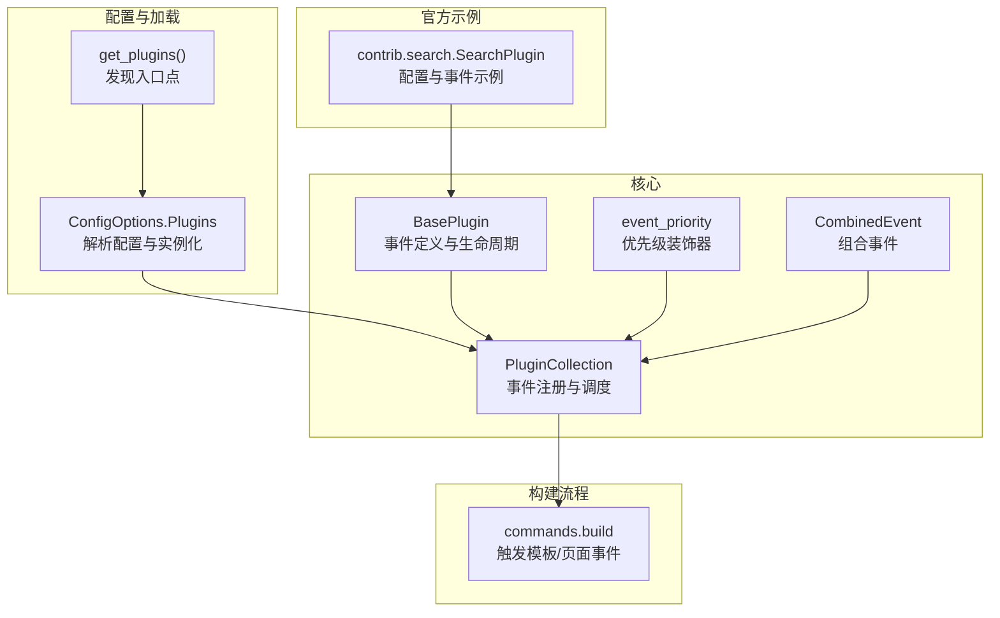
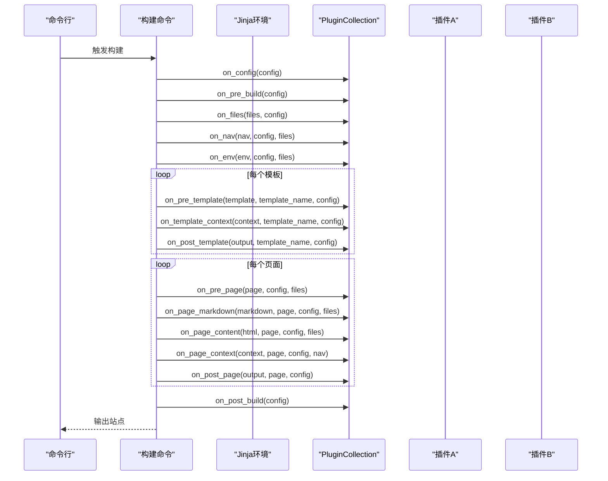
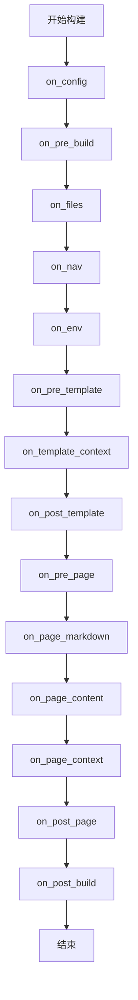

# 插件开发

<cite>
**本文引用的文件列表**
- [mkdocs/plugins.py](file://mkdocs/plugins.py)
- [docs/dev-guide/plugins.md](file://docs/dev-guide/plugins.md)
- [mkdocs/contrib/search/__init__.py](file://mkdocs/contrib/search/__init__.py)
- [mkdocs/commands/build.py](file://mkdocs/commands/build.py)
- [mkdocs/config/config_options.py](file://mkdocs/config/config_options.py)
- [mkdocs/tests/plugin_tests.py](file://mkdocs/tests/plugin_tests.py)
- [mkdocs/tests/config/config_options_tests.py](file://mkdocs/tests/config/config_options_tests.py)
- [docs/img/plugin-events.py](file://docs/img/plugin-events.py)
</cite>

## 目录
1. [简介](#简介)
2. [项目结构与定位](#项目结构与定位)
3. [核心组件总览](#核心组件总览)
4. [架构概览](#架构概览)
5. [详细组件解析](#详细组件解析)
6. [依赖关系分析](#依赖关系分析)
7. [性能与可维护性建议](#性能与可维护性建议)
8. [故障排查与调试](#故障排查与调试)
9. [结论](#结论)
10. [附录：开发示例与最佳实践](#附录开发示例与最佳实践)

## 简介
本指南面向希望为 MkDocs 开发插件的开发者，系统讲解 BasePlugin 的设计与实现、配置方案定义、事件处理机制、生命周期管理、插件注册与入口点、事件优先级与组合事件、调试与测试、以及发布流程。文档以源码为依据，辅以图示帮助理解事件流与数据流。

## 项目结构与定位
- 核心插件 API 位于 mkdocs/plugins.py，定义了 BasePlugin、PluginCollection、事件装饰器与日志工具。
- 官方插件示例位于 mkdocs/contrib/search/__init__.py，展示了配置校验、事件钩子与构建期行为。
- 构建命令在 mkdocs/commands/build.py 中触发模板与页面事件，体现事件在构建过程中的调用时机。
- 配置加载与插件实例化逻辑在 mkdocs/config/config_options.py 中，负责从用户配置中解析插件并实例化。
- 文档 docs/dev-guide/plugins.md 提供了事件类型、优先级、错误处理与日志的最佳实践说明。
- 测试用例位于 mkdocs/tests 下，覆盖插件集合、事件优先级、配置校验、多实例与禁用等场景。

图表来源
- [mkdocs/plugins.py](file://mkdocs/plugins.py#L40-L52)
- [mkdocs/config/config_options.py](file://mkdocs/config/config_options.py#L1045-L1169)
- [mkdocs/commands/build.py](file://mkdocs/commands/build.py#L61-L88)
- [mkdocs/contrib/search/__init__.py](file://mkdocs/contrib/search/__init__.py#L62-L121)

章节来源
- [mkdocs/plugins.py](file://mkdocs/plugins.py#L40-L52)
- [mkdocs/config/config_options.py](file://mkdocs/config/config_options.py#L1045-L1169)
- [mkdocs/commands/build.py](file://mkdocs/commands/build.py#L61-L88)
- [docs/dev-guide/plugins.md](file://docs/dev-guide/plugins.md#L1-L567)

## 核心组件总览
- BasePlugin：所有插件的基类，定义事件方法签名、配置加载与验证、生命周期钩子（启动/关闭/开发服务器）。
- PluginCollection：插件集合，负责事件注册、按优先级排序、统一调度 run_event，并暴露 on_* 方法桥接至事件执行。
- event_priority：为事件处理器设置优先级，数值越高越先执行；默认 0。
- CombinedEvent：允许在同一事件名下注册多个不同优先级的处理器，形成“组合事件”。
- get_plugin_logger：便捷的日志适配器，自动前缀插件包名，便于统一输出格式。
- get_plugins：通过 importlib.metadata/importlib_metadata 发现已安装插件的入口点，支持覆盖核心插件。

章节来源
- [mkdocs/plugins.py](file://mkdocs/plugins.py#L58-L457)
- [mkdocs/plugins.py](file://mkdocs/plugins.py#L493-L647)
- [mkdocs/plugins.py](file://mkdocs/plugins.py#L649-L697)
- [mkdocs/plugins.py](file://mkdocs/plugins.py#L40-L52)

## 架构概览
下面的时序图展示了一个典型构建周期中，模板与页面事件的调用顺序，以及插件如何参与其中。

图表来源
- [mkdocs/commands/build.py](file://mkdocs/commands/build.py#L61-L88)
- [mkdocs/commands/build.py](file://mkdocs/commands/build.py#L147-L200)
- [mkdocs/plugins.py](file://mkdocs/plugins.py#L575-L646)

章节来源
- [mkdocs/commands/build.py](file://mkdocs/commands/build.py#L61-L88)
- [mkdocs/commands/build.py](file://mkdocs/commands/build.py#L147-L200)
- [mkdocs/plugins.py](file://mkdocs/plugins.py#L575-L646)

## 详细组件解析

### BasePlugin 设计与生命周期
- 配置方案定义
  - 支持两种方式：
    - config_scheme 元组：兼容旧版，使用配置选项类进行校验与默认值填充。
    - 泛型子类 BasePlugin[Config]：MkDocs 1.4+ 推荐，获得类型安全与更清晰的 schema 定义。
  - load_config(options, config_file_path)：加载并验证用户配置，返回 (errors, warnings)，用于在配置阶段反馈问题。
- 生命周期与一次性事件
  - on_startup(command, dirty)：一次命令调用内仅运行一次，用于跨构建保持状态或初始化资源。
  - on_shutdown()：与 on_startup 对应，用于清理。
  - on_serve(server, config, builder)：开发服务器模式下首次构建完成后运行，可修改 LiveReload 服务器。
- 全局事件（一次构建）
  - on_config(config)：配置加载后立即运行，适合修改全局配置。
  - on_pre_build(config)：构建开始前，适合准备外部资源。
  - on_files(files, config)：文件收集完成后，适合增删改文件集合。
  - on_nav(nav, config, files)：导航生成后，适合调整导航结构。
  - on_env(env, config, files)：Jinja 环境创建后，适合扩展环境。
  - on_post_build(config)：构建结束，适合收尾工作。
  - on_build_error(error)：捕获任何异常后的回调，适合清理。
- 模板事件（每个非页面模板）
  - on_pre_template(template, template_name, config)：模板加载后，适合修改模板对象。
  - on_template_context(context, template_name, config)：上下文创建后，适合修改上下文。
  - on_post_template(output_content, template_name, config)：渲染后写盘前，适合修改输出。
- 页面事件（每个 Markdown 页面）
  - on_pre_page(page, config, files)：页面处理前，适合修改 Page 实例。
  - on_page_read_source(...)：已弃用，推荐在 on_files 中设置 File 的内容。
  - on_page_markdown(markdown, page, config, files)：Markdown 加载后，适合修改源文本。
  - on_page_content(html, page, config, files)：Markdown 渲染为 HTML 后，适合修改 HTML。
  - on_page_context(context, page, config, nav)：页面上下文创建后，适合修改上下文。
  - on_post_page(output, page, config)：模板渲染后写盘前，适合修改输出。

章节来源
- [mkdocs/plugins.py](file://mkdocs/plugins.py#L58-L417)
- [docs/dev-guide/plugins.md](file://docs/dev-guide/plugins.md#L247-L425)

### PluginCollection：事件注册与调度
- 事件注册
  - 在 __setitem__ 中扫描插件类上以 on_ 开头的方法，注册到内部 events 字典。
  - 对于 page_read_source，若已有处理器则发出警告（不可并存）。
- 优先级与排序
  - 使用 event_priority 装饰器为方法附加 mkdocs_priority 属性，默认 0。
  - 注册时按优先级降序插入，高优先级先执行。
- 组合事件
  - CombinedEvent 可将多个子方法合并为同一事件名，分别指定不同优先级。
- 调度
  - run_event(name, item=None, **kwargs)：遍历该事件的所有处理器，传入 item 或关键字参数，若处理器返回非空则替换 item，最终返回最终 item。
  - 提供 on_* 方法的便捷包装，直接转发到 run_event。

章节来源
- [mkdocs/plugins.py](file://mkdocs/plugins.py#L493-L574)
- [mkdocs/plugins.py](file://mkdocs/plugins.py#L426-L457)
- [mkdocs/tests/plugin_tests.py](file://mkdocs/tests/plugin_tests.py#L105-L184)

### 配置加载与插件实例化
- 配置解析
  - ConfigOptions.Plugins 解析用户配置中的 plugins 列表或字典，支持命名空间与主题前缀展开。
- 插件实例化
  - 通过入口点加载插件类，校验是否继承自 BasePlugin。
  - 支持多次实例化（多实例），但需插件声明 supports_multiple_instances。
  - 若插件定义了 on_startup/on_shutdown，则实例会被缓存以便跨构建复用。
- 配置验证
  - 调用 plugin.load_config，收集 errors/warnings 并在有错误时抛出异常。
  - 对未识别键发出警告，对 enabled 等通用开关进行处理。

章节来源
- [mkdocs/config/config_options.py](file://mkdocs/config/config_options.py#L1045-L1169)
- [mkdocs/tests/config/config_options_tests.py](file://mkdocs/tests/config/config_options_tests.py#L2231-L2346)

### 官方插件示例：SearchPlugin
- 配置方案
  - 使用 _PluginConfig 定义语言、分隔符、最小搜索长度、预构建索引策略、索引范围等选项。
  - 自定义 LangOption 校验语言列表，自动回退与替换不支持的语言。
- 事件使用
  - on_config：根据主题配置决定是否包含搜索页与静态模板目录。
  - on_pre_build：创建 SearchIndex 实例。
  - on_page_context：将页面条目加入索引。
  - on_post_build：生成搜索索引 JSON 并复制所需语言脚本。

章节来源
- [mkdocs/contrib/search/__init__.py](file://mkdocs/contrib/search/__init__.py#L54-L121)

### 事件类型与使用场景
- 全局事件：适合对整个站点进行一次性调整，如添加模板、修改主题配置、准备外部资源。
- 模板事件：适合对模板与上下文进行细粒度控制，如注入变量、修改模板对象。
- 页面事件：适合对单个页面的 Markdown、HTML、上下文进行处理，如内容增强、元数据注入。

章节来源
- [docs/dev-guide/plugins.md](file://docs/dev-guide/plugins.md#L247-L425)

### 事件优先级与组合事件
- 优先级
  - 建议值：100（first）、50（early）、0（default）、-50（late）、-100（last）。
  - 相同优先级按配置中出现顺序执行。
- 组合事件
  - 通过 CombinedEvent 将多个子方法合并为同一事件名，分别设置不同优先级，实现“多段式处理”。

章节来源
- [mkdocs/plugins.py](file://mkdocs/plugins.py#L426-L457)
- [mkdocs/plugins.py](file://mkdocs/plugins.py#L460-L491)
- [mkdocs/tests/plugin_tests.py](file://mkdocs/tests/plugin_tests.py#L135-L184)

### 日志与错误处理
- 日志
  - 使用 get_plugin_logger 获取带前缀的日志器，遵循 MkDocs 的日志级别与格式。
  - 建议在 debug 级别下做昂贵计算，避免影响常规构建速度。
- 错误处理
  - 优先抛出 PluginError 以向用户提供友好消息。
  - on_build_error 可用于清理与收尾。
  - 未捕获异常会中断构建并显示堆栈，不利于用户体验。

章节来源
- [docs/dev-guide/plugins.md](file://docs/dev-guide/plugins.md#L442-L514)
- [mkdocs/plugins.py](file://mkdocs/plugins.py#L677-L697)

## 依赖关系分析
- 插件发现与加载
  - get_plugins 通过入口点 group='mkdocs.plugins' 发现插件，支持第三方覆盖核心插件。
- 配置到插件实例
  - ConfigOptions.Plugins 解析配置，调用 get_plugins 与入口点加载器，实例化插件类并缓存（含生命周期钩子）。
- 事件调度
  - PluginCollection 在插件注册时建立事件到处理器的映射，运行时按优先级顺序调用。

图表来源
- [mkdocs/plugins.py](file://mkdocs/plugins.py#L40-L52)
- [mkdocs/config/config_options.py](file://mkdocs/config/config_options.py#L1105-L1169)
- [mkdocs/plugins.py](file://mkdocs/plugins.py#L509-L541)

章节来源
- [mkdocs/plugins.py](file://mkdocs/plugins.py#L40-L52)
- [mkdocs/config/config_options.py](file://mkdocs/config/config_options.py#L1045-L1169)
- [mkdocs/plugins.py](file://mkdocs/plugins.py#L509-L541)

## 性能与可维护性建议
- 事件优先级
  - 明确各插件的相对顺序，避免不必要的多次重排。
- 组合事件
  - 将复杂逻辑拆分为多个子处理器，分别设置优先级，提升可维护性。
- 日志级别
  - 将昂贵操作放在 debug 级别，减少常规构建开销。
- 配置校验
  - 使用类型安全的 Config 子类，提前发现配置错误。
- 多实例支持
  - 当需要同一插件多次实例化时，确保 supports_multiple_instances 为真，并在配置中区分实例名。

[本节为通用建议，无需特定文件来源]

## 故障排查与调试
- 常见问题
  - 多个插件同时注册 page_read_source：会触发警告，无法并存。
  - 重复启用同一插件且未声明多实例支持：会给出警告提示。
  - 配置项类型不符：在 load_config 返回错误列表，需修正配置。
- 调试技巧
  - 使用 --verbose/--debug 提升日志级别，观察事件执行顺序与来源插件。
  - 在关键事件中打印上下文摘要，确认数据流转是否符合预期。
  - 使用 get_plugin_logger 记录插件专属日志，便于定位问题。
- 单元测试
  - 参考测试用例：事件注册、优先级排序、多实例与禁用、配置校验与错误传播。

章节来源
- [mkdocs/tests/plugin_tests.py](file://mkdocs/tests/plugin_tests.py#L105-L200)
- [mkdocs/tests/config/config_options_tests.py](file://mkdocs/tests/config/config_options_tests.py#L2231-L2346)
- [docs/dev-guide/plugins.md](file://docs/dev-guide/plugins.md#L442-L514)

## 结论
MkDocs 插件体系以 BasePlugin 为核心，通过 PluginCollection 实现事件注册与调度，结合配置加载与入口点机制，形成灵活而强大的扩展能力。合理使用事件优先级与组合事件，配合严格的配置校验与日志规范，可以开发出高质量、可维护的插件。

[本节为总结，无需特定文件来源]

## 附录：开发示例与最佳实践

### 插件开发步骤
- 定义配置方案
  - 使用 Config 子类或 config_scheme 元组，明确选项类型与默认值。
- 编写事件处理器
  - 在合适阶段（全局/模板/页面）实现 on_* 方法，返回修改后的对象或 None。
- 设置优先级
  - 对需要控制顺序的处理器使用 @event_priority 指定优先级。
- 组合事件
  - 对同一事件的不同阶段拆分为多个子处理器，使用 CombinedEvent 合并。
- 日志与错误
  - 使用 get_plugin_logger 输出日志；在异常时抛出 PluginError。
- 注册入口点
  - 在 setup.py 中通过 entry_points 暴露插件类，名称即用户在配置中使用的名称。

章节来源
- [docs/dev-guide/plugins.md](file://docs/dev-guide/plugins.md#L58-L567)
- [mkdocs/plugins.py](file://mkdocs/plugins.py#L426-L457)
- [mkdocs/plugins.py](file://mkdocs/plugins.py#L460-L491)
- [mkdocs/plugins.py](file://mkdocs/plugins.py#L677-L697)

### 官方示例参考
- SearchPlugin 展示了：
  - 配置校验与默认值设置；
  - on_config/on_pre_build/on_page_context/on_post_build 的完整生命周期使用；
  - 条件性地引入模板与脚本资源。

章节来源
- [mkdocs/contrib/search/__init__.py](file://mkdocs/contrib/search/__init__.py#L54-L121)

### 事件流程图（概念示意）
以下为事件在构建流程中的时序示意，帮助理解事件的先后关系与适用场景。

图表来源
- [docs/dev-guide/plugins.md](file://docs/dev-guide/plugins.md#L247-L425)