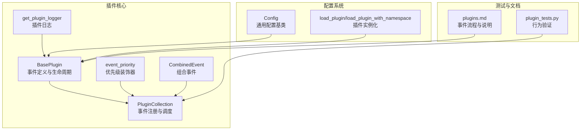
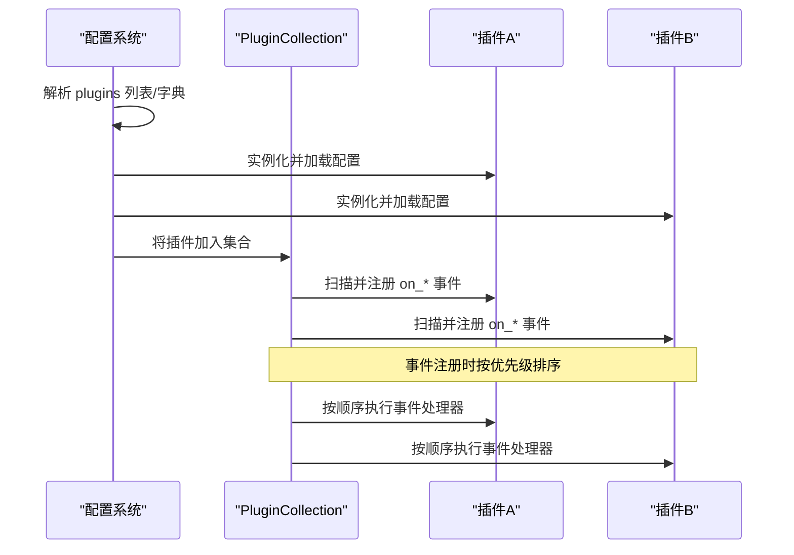
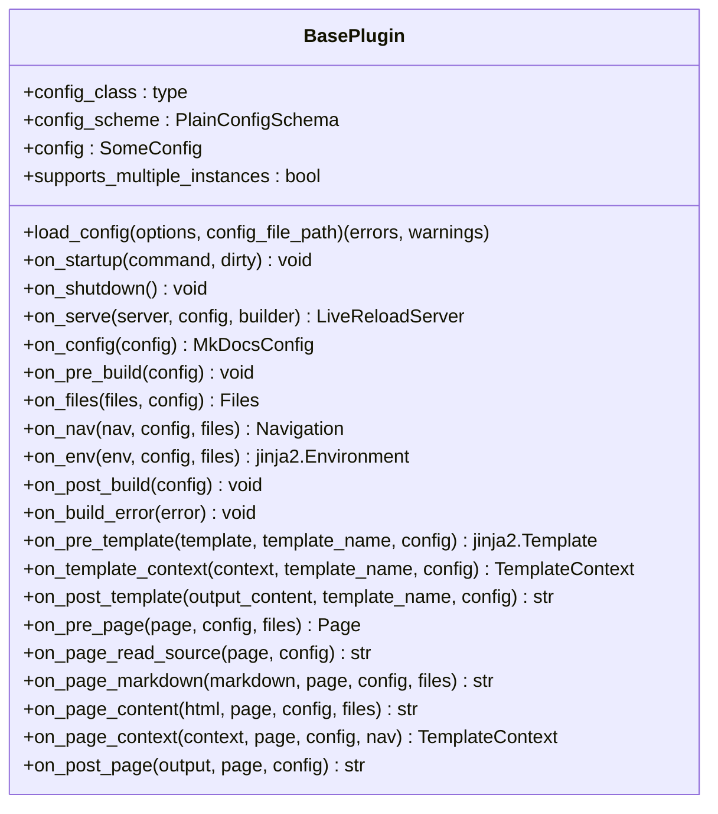
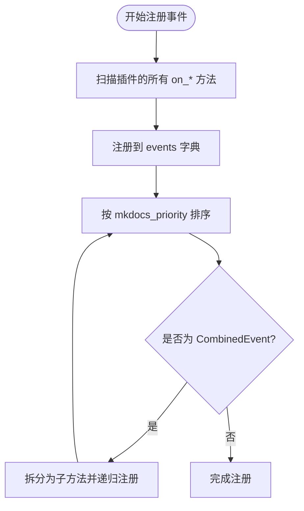
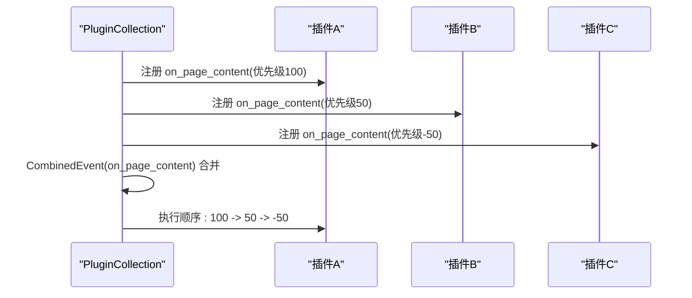
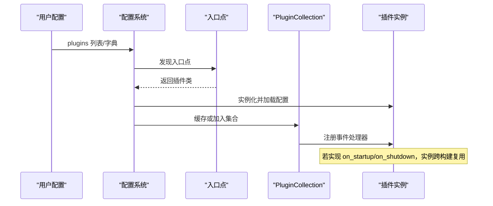
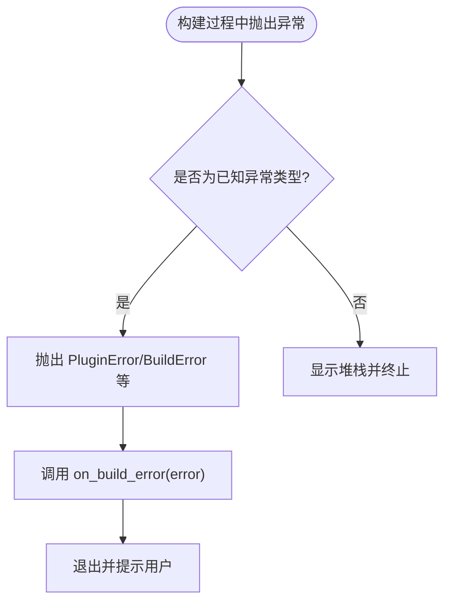
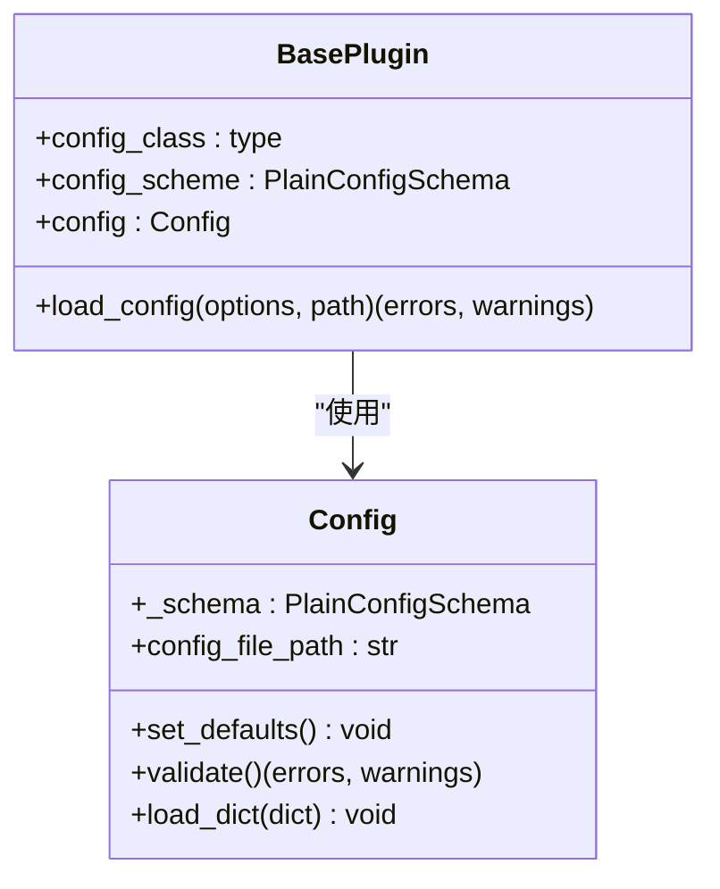
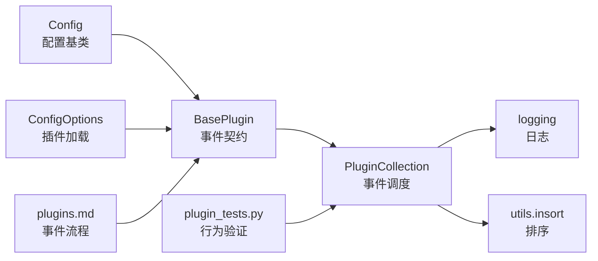

# 插件架构设计

<cite>
**本文档引用的文件**
- [mkdocs/plugins.py](file://mkdocs/plugins.py)
- [mkdocs/tests/plugin_tests.py](file://mkdocs/tests/plugin_tests.py)
- [mkdocs/config/base.py](file://mkdocs/config/base.py)
- [mkdocs/config/config_options.py](file://mkdocs/config/config_options.py)
- [docs/dev-guide/plugins.md](file://docs/dev-guide/plugins.md)
</cite>

## 目录
1. [简介](#简介)
2. [项目结构](#项目结构)
3. [核心组件](#核心组件)
4. [架构总览](#架构总览)
5. [详细组件分析](#详细组件分析)
6. [依赖关系分析](#依赖关系分析)
7. [性能考量](#性能考量)
8. [故障排查指南](#故障排查指南)
9. [结论](#结论)
10. [附录](#附录)

## 简介
本文件系统性阐述 MkDocs 插件架构的设计与实现，重点围绕 BasePlugin 基类、泛型配置系统、事件处理机制、生命周期管理、插件注册与调度、事件优先级与组合事件等核心概念展开，并结合测试用例与官方文档进行验证与补充说明。目标是帮助开发者在理解整体设计思路的同时，掌握插件系统的类型安全、扩展性与可维护性设计要点。

## 项目结构
与插件架构直接相关的模块主要集中在以下位置：
- 核心实现：mkdocs/plugins.py（定义 BasePlugin、PluginCollection、事件装饰器与日志工具）
- 配置系统：mkdocs/config/base.py（通用配置基类与校验框架）、mkdocs/config/config_options.py（插件配置加载与实例化）
- 测试与示例：mkdocs/tests/plugin_tests.py（覆盖事件注册、优先级、错误处理等）
- 开发指南：docs/dev-guide/plugins.md（事件流程图与使用说明）

**图表来源**
- [mkdocs/plugins.py](file://mkdocs/plugins.py#L58-L698)
- [mkdocs/config/base.py](file://mkdocs/config/base.py#L123-L200)
- [mkdocs/config/config_options.py](file://mkdocs/config/config_options.py#L1088-L1166)
- [mkdocs/tests/plugin_tests.py](file://mkdocs/tests/plugin_tests.py#L1-L329)
- [docs/dev-guide/plugins.md](file://docs/dev-guide/plugins.md#L1-L567)

**章节来源**
- [mkdocs/plugins.py](file://mkdocs/plugins.py#L1-L698)
- [mkdocs/config/base.py](file://mkdocs/config/base.py#L1-L200)
- [mkdocs/config/config_options.py](file://mkdocs/config/config_options.py#L1088-L1166)
- [mkdocs/tests/plugin_tests.py](file://mkdocs/tests/plugin_tests.py#L1-L329)
- [docs/dev-guide/plugins.md](file://docs/dev-guide/plugins.md#L1-L567)

## 核心组件
- BasePlugin：所有插件的抽象基类，定义了完整的事件契约与生命周期方法，支持通过泛型指定强类型的配置类。
- PluginCollection：插件集合与事件调度中心，负责事件注册、排序与执行。
- event_priority：为事件处理器设置优先级，影响调用顺序。
- CombinedEvent：允许在同一事件名下注册多个子处理器，形成“组合事件”。
- get_plugin_logger：提供带前缀的日志适配器，统一插件日志风格。

**章节来源**
- [mkdocs/plugins.py](file://mkdocs/plugins.py#L58-L698)

## 架构总览
MkDocs 插件系统采用“事件驱动”的流水线式架构：
- 配置阶段：解析用户配置，按插件名称查找入口点并实例化插件；对插件配置进行校验与加载。
- 注册阶段：将插件实例存入 PluginCollection，并扫描其 on_* 方法进行事件注册。
- 调度阶段：在构建流程中，按事件类型依次调用已注册的处理器，遵循优先级与组合事件规则。
- 生命周期：支持一次性事件（如 on_startup/on_shutdown）与每构建一次的全局事件。

**图表来源**
- [mkdocs/config/config_options.py](file://mkdocs/config/config_options.py#L1088-L1166)
- [mkdocs/plugins.py](file://mkdocs/plugins.py#L493-L647)

## 详细组件分析

### BasePlugin 基类与泛型配置系统
- 泛型参数 SomeConfig：通过 BasePlugin[SomeConfig] 形式声明插件的配置类型，使 self.config 成为强类型对象，便于属性访问与静态检查。
- 配置加载：load_config(options, config_file_path) 将用户提供的字典配置映射到配置对象，返回 (errors, warnings)，供上层校验。
- 事件契约：定义了从启动到页面渲染的完整事件序列，包括一次性事件、全局事件、模板事件与页面事件，每个事件均提供明确的参数与返回值约定。
- 生命周期：支持 on_startup/on_shutdown（仅在 mkdocs serve 场景下跨构建保持），以及 on_serve 在开发服务器场景下的定制。

**图表来源**
- [mkdocs/plugins.py](file://mkdocs/plugins.py#L58-L417)

**章节来源**
- [mkdocs/plugins.py](file://mkdocs/plugins.py#L58-L417)

### PluginCollection：事件注册与调度
- 事件注册：当向集合添加插件时，自动扫描其 on_* 方法并注册到对应事件列表。
- 优先级排序：使用二分插入（insort）按 mkdocs_priority 降序排列，高优先级先执行。
- 组合事件：支持 CombinedEvent，将多个子方法合并为一个事件名，内部仍按各自优先级排序。
- 调度执行：run_event(name, item=None, **kwargs) 逐个调用处理器，若返回非空则替换 item，否则保留原值；同时记录当前插件来源用于调试日志。
- 特殊处理：page_read_source 事件最多只能有一个处理器，重复注册会发出警告。

**图表来源**
- [mkdocs/plugins.py](file://mkdocs/plugins.py#L509-L542)

**章节来源**
- [mkdocs/plugins.py](file://mkdocs/plugins.py#L493-L647)

### 事件优先级系统与组合事件
- 优先级装饰器：event_priority(p) 为事件处理器设置优先级，默认 0；数值越高越早执行。
- 组合事件：CombinedEvent 可将多个子方法合并为同一事件名，子方法命名不得以 on_ 开头，推荐以 _on_ 前缀区分。
- 行为验证：测试用例展示了多插件同事件的优先级排序、组合事件的合并效果，以及 page_read_source 的互斥警告。

**图表来源**
- [mkdocs/plugins.py](file://mkdocs/plugins.py#L426-L491)
- [mkdocs/tests/plugin_tests.py](file://mkdocs/tests/plugin_tests.py#L135-L185)

**章节来源**
- [mkdocs/plugins.py](file://mkdocs/plugins.py#L426-L491)
- [mkdocs/tests/plugin_tests.py](file://mkdocs/tests/plugin_tests.py#L135-L185)

### 插件注册机制与生命周期
- 入口点发现：get_plugins() 通过 importlib.metadata/importlib_metadata 查找 group='mkdocs.plugins' 的入口点，支持第三方覆盖核心插件。
- 插件实例化：load_plugin/load_plugin_with_namespace 根据配置加载插件类，校验是否为 BasePlugin 子类，支持缓存与多实例命名。
- 生命周期迁移：若插件实现 on_startup/on_shutdown，则该实例会在多次构建间复用，从而支持跨构建的资源管理。
- 多实例支持：通过 supports_multiple_instances 标记，允许同一插件多次实例化；否则重复配置会触发警告。

**图表来源**
- [mkdocs/plugins.py](file://mkdocs/plugins.py#L40-L52)
- [mkdocs/config/config_options.py](file://mkdocs/config/config_options.py#L1088-L1166)

**章节来源**
- [mkdocs/plugins.py](file://mkdocs/plugins.py#L40-L52)
- [mkdocs/config/config_options.py](file://mkdocs/config/config_options.py#L1088-L1166)

### 错误处理策略
- 异常类型：MkDocs 定义了多种异常类型，未捕获的异常会中断构建并显示堆栈；建议在插件中抛出 PluginError 以提供友好消息。
- 构建错误事件：on_build_error(error) 在任何异常发生时被调用，用于清理资源或记录信息。
- 测试验证：测试覆盖了不同阶段抛出的异常如何被转换为合适的错误消息并终止构建。

**图表来源**
- [docs/dev-guide/plugins.md](file://docs/dev-guide/plugins.md#L442-L485)
- [mkdocs/tests/plugin_tests.py](file://mkdocs/tests/plugin_tests.py#L266-L329)

**章节来源**
- [docs/dev-guide/plugins.md](file://docs/dev-guide/plugins.md#L442-L485)
- [mkdocs/tests/plugin_tests.py](file://mkdocs/tests/plugin_tests.py#L266-L329)

### 类型安全与配置系统
- 配置基类：Config 提供基于 schema 的强类型配置模型，支持默认值、预/后校验、键名校验与警告收集。
- 插件配置：插件可通过两种方式定义配置：传统元组 schema 或现代类式 schema（继承 Config），后者提供属性访问与静态类型检查。
- 配置加载：load_config 将用户输入映射到配置对象，返回错误与警告，供上层统一处理。

**图表来源**
- [mkdocs/config/base.py](file://mkdocs/config/base.py#L123-L200)
- [mkdocs/plugins.py](file://mkdocs/plugins.py#L85-L96)

**章节来源**
- [mkdocs/config/base.py](file://mkdocs/config/base.py#L123-L200)
- [mkdocs/plugins.py](file://mkdocs/plugins.py#L85-L96)

## 依赖关系分析
- BasePlugin 依赖于配置系统（Config/ConfigOptions）与日志模块，提供事件契约与生命周期钩子。
- PluginCollection 依赖 utils.insort 进行有序插入，依赖 logging 记录调试信息。
- 配置系统通过入口点机制与插件类建立连接，确保插件实例化与配置加载的一致性。
- 测试用例覆盖了事件注册、优先级排序、组合事件、错误处理等关键路径。

**图表来源**
- [mkdocs/config/base.py](file://mkdocs/config/base.py#L123-L200)
- [mkdocs/config/config_options.py](file://mkdocs/config/config_options.py#L1088-L1166)
- [mkdocs/plugins.py](file://mkdocs/plugins.py#L493-L647)
- [mkdocs/tests/plugin_tests.py](file://mkdocs/tests/plugin_tests.py#L1-L329)
- [docs/dev-guide/plugins.md](file://docs/dev-guide/plugins.md#L247-L425)

**章节来源**
- [mkdocs/config/base.py](file://mkdocs/config/base.py#L123-L200)
- [mkdocs/config/config_options.py](file://mkdocs/config/config_options.py#L1088-L1166)
- [mkdocs/plugins.py](file://mkdocs/plugins.py#L493-L647)
- [mkdocs/tests/plugin_tests.py](file://mkdocs/tests/plugin_tests.py#L1-L329)
- [docs/dev-guide/plugins.md](file://docs/dev-guide/plugins.md#L247-L425)

## 性能考量
- 事件注册与排序：每次添加插件都会扫描并按优先级插入，复杂度近似 O(n log n)（insort），n 为该事件已注册处理器数量。
- 调度执行：run_event 对每个处理器进行一次调用，整体复杂度 O(k)，k 为该事件处理器数量。
- 组合事件：CombinedEvent 展开为多个子方法，但排序与执行逻辑一致，注意避免过度拆分导致维护成本上升。
- 日志开销：调试模式下会输出事件来源，建议在生产环境关闭 debug 日志以减少 I/O。

[本节为通用指导，不直接分析具体文件]

## 故障排查指南
- 多个插件注册同一事件：page_read_source 事件最多一个处理器，重复注册会触发警告，需合并逻辑或调整插件职责。
- 优先级冲突：相同优先级按配置顺序执行，建议为关键事件显式设置优先级以避免不确定性。
- 配置错误：load_config 返回的错误与警告应被配置系统统一处理，避免遗漏导致运行时异常。
- 日志定位：使用 get_plugin_logger 获取带前缀的日志器，结合 _current_plugin 信息快速定位问题插件。

**章节来源**
- [mkdocs/plugins.py](file://mkdocs/plugins.py#L518-L531)
- [mkdocs/plugins.py](file://mkdocs/plugins.py#L560-L573)
- [mkdocs/tests/plugin_tests.py](file://mkdocs/tests/plugin_tests.py#L162-L202)

## 结论
MkDocs 插件架构通过 BasePlugin 的强类型配置与事件契约、PluginCollection 的集中注册与调度、event_priority 与 CombinedEvent 的灵活控制，形成了清晰、可扩展且类型安全的插件生态。配合配置系统的严格校验与错误处理策略，开发者可以在保证稳定性的同时实现复杂的站点构建与渲染扩展。

[本节为总结，不直接分析具体文件]

## 附录
- 事件流程参考：官方文档提供了事件关系图，展示从启动到页面渲染的完整流程。
- 开发指南：包含插件开发、配置定义、日志与错误处理的最佳实践。

**章节来源**
- [docs/dev-guide/plugins.md](file://docs/dev-guide/plugins.md#L247-L425)