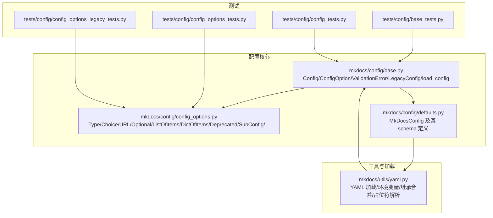
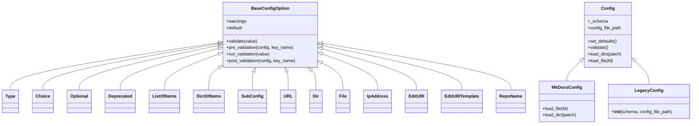
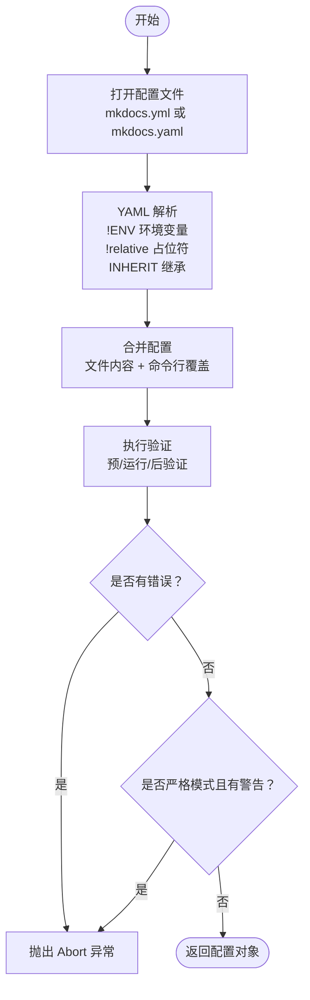
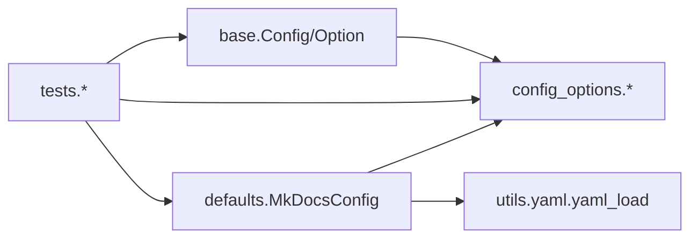

# 配置管理

<cite>
**本文引用的文件**
- [mkdocs/config/__init__.py](file://mkdocs/config/__init__.py)
- [mkdocs/config/base.py](file://mkdocs/config/base.py)
- [mkdocs/config/config_options.py](file://mkdocs/config/config_options.py)
- [mkdocs/config/defaults.py](file://mkdocs/config/defaults.py)
- [mkdocs/utils/yaml.py](file://mkdocs/utils/yaml.py)
- [mkdocs/tests/config/base_tests.py](file://mkdocs/tests/config/base_tests.py)
- [mkdocs/tests/config/config_tests.py](file://mkdocs/tests/config/config_tests.py)
- [mkdocs/tests/config/config_options_tests.py](file://mkdocs/tests/config/config_options_tests.py)
- [mkdocs/tests/config/config_options_legacy_tests.py](file://mkdocs/tests/config/config_options_legacy_tests.py)
</cite>

## 目录
1. [简介](#简介)
2. [项目结构](#项目结构)
3. [核心组件](#核心组件)
4. [架构总览](#架构总览)
5. [详细组件分析](#详细组件分析)
6. [依赖关系分析](#依赖关系分析)
7. [性能考量](#性能考量)
8. [故障排查指南](#故障排查指南)
9. [结论](#结论)
10. [附录](#附录)

## 简介
本指南聚焦于 MkDocs 的配置管理系统，系统性阐述配置类的定义与使用、配置验证、默认值设置、类型检查、配置加载流程、配置合并策略、错误处理与兼容性（LegacyConfig 与现代配置系统），并提供可操作的配置示例、验证规则、迁移建议与调试技巧。

## 项目结构
配置管理相关的核心代码位于 mkdocs/config 目录，配合 mkdocs/utils/yaml.py 提供 YAML 解析与继承合并能力；测试用例位于 mkdocs/tests/config 下，覆盖基础行为、选项类型、遗留模式等。



图表来源
- [mkdocs/config/base.py](file://mkdocs/config/base.py#L123-L392)
- [mkdocs/config/config_options.py](file://mkdocs/config/config_options.py#L1-L800)
- [mkdocs/config/defaults.py](file://mkdocs/config/defaults.py#L38-L219)
- [mkdocs/utils/yaml.py](file://mkdocs/utils/yaml.py#L109-L151)

章节来源
- [mkdocs/config/__init__.py](file://mkdocs/config/__init__.py#L1-L4)
- [mkdocs/config/base.py](file://mkdocs/config/base.py#L123-L392)
- [mkdocs/config/config_options.py](file://mkdocs/config/config_options.py#L1-L800)
- [mkdocs/config/defaults.py](file://mkdocs/config/defaults.py#L38-L219)
- [mkdocs/utils/yaml.py](file://mkdocs/utils/yaml.py#L109-L151)

## 核心组件
- 配置基类与验证框架
  - Config：现代配置对象，支持 schema 定义、预/运行/后验证、默认值注入、键名校验、严格模式等。
  - BaseConfigOption：所有配置项类型的基类，提供 validate、pre_validation、run_validation、post_validation 生命周期钩子。
  - LegacyConfig：遗留配置对象，面向旧式 schema 元组，兼容历史插件配置。
  - load_config：入口函数，负责打开配置文件、构建 MkDocsConfig、加载 YAML、应用命令行覆盖、执行验证与日志输出。
- 配置选项类型体系
  - 基础类型：Type、Choice、Optional、Deprecated。
  - 复合类型：ListOfItems、DictOfItems、SubConfig、PropagatingSubConfig。
  - 文件系统与网络：URL、Dir、File、DocsDir、SiteDir、IpAddress、EditURI、EditURITemplate、RepoName。
  - 特殊类型：MarkdownExtensions、Theme、Plugins、Hooks、ExtraScript、PathSpec 等。
- 默认配置对象
  - MkDocsConfig：定义 mkdocs.yml 的完整 schema，含站点、主题、目录、链接校验、插件、钩子、严格模式等。
- YAML 工具
  - yaml_load：支持环境变量、!ENV、!relative 占位符、INHERIT 继承合并、异常包装为 ConfigurationError。

章节来源
- [mkdocs/config/base.py](file://mkdocs/config/base.py#L37-L279)
- [mkdocs/config/config_options.py](file://mkdocs/config/config_options.py#L52-L800)
- [mkdocs/config/defaults.py](file://mkdocs/config/defaults.py#L38-L219)
- [mkdocs/utils/yaml.py](file://mkdocs/utils/yaml.py#L109-L151)

## 架构总览
下图展示从用户传入配置到最终验证通过的关键流程，以及与 YAML 工具的交互。

```mermaid
sequenceDiagram
participant CLI as "命令行/调用方"
participant Loader as "load_config"
participant Yaml as "yaml_load"
participant Cfg as "MkDocsConfig"
participant Opt as "配置选项类型"
participant Log as "日志"
CLI->>Loader : 调用 load_config(config_file, **kwargs)
Loader->>Loader : 打开配置文件或使用默认 mkdocs.yml/mkdocs.yaml
Loader->>Cfg : 初始化 MkDocsConfig(config_file_path)
Loader->>Yaml : 读取 YAML 并解析环境变量/占位符/继承
Yaml-->>Loader : 返回字典
Loader->>Cfg : load_dict(文件内容)
Loader->>Cfg : load_dict(kwargs 覆盖)
Loader->>Cfg : validate()
Cfg->>Opt : 预验证(pre_validation)
Cfg->>Opt : 运行验证(run_validation)
Cfg->>Opt : 后验证(post_validation)
Cfg-->>Loader : 返回 (errors, warnings)
Loader->>Log : 输出警告/错误
alt 有错误或严格模式下有警告
Loader-->>CLI : 抛出 Abort 异常
else 成功
Loader-->>CLI : 返回 MkDocsConfig 实例
end
```

图表来源
- [mkdocs/config/base.py](file://mkdocs/config/base.py#L340-L392)
- [mkdocs/utils/yaml.py](file://mkdocs/utils/yaml.py#L128-L151)
- [mkdocs/config/defaults.py](file://mkdocs/config/defaults.py#L205-L214)

## 详细组件分析

### 配置类与生命周期
- Config 类
  - 通过类装饰器式 schema 收集：在子类中以属性方式声明 BaseConfigOption，自动收集为 _schema。
  - 默认值注入：set_defaults 按 schema 逐项设置默认值。
  - 验证三阶段：
    - 预验证：对每个选项调用 pre_validation，用于依赖准备、参数迁移等。
    - 运行验证：调用 run_validation 执行类型/范围/格式等检查。
    - 后验证：对每个选项调用 post_validation，用于跨字段联动、派生计算、警告提示。
  - 键名校验：对 schema 之外的键发出警告。
  - 严格模式：strict=True 时，任何警告都会导致构建中断。
- BaseConfigOption
  - 提供 warnings 列表，允许在各阶段追加警告消息。
  - 支持 Optional 包装，使 None 值合法化。
  - 支持 Deprecated 选项的迁移与去重。
- LegacyConfig
  - 接受旧式 schema 元组，兼容历史插件配置。
  - 仍可参与验证，但不支持现代类式 schema 的自动收集。



图表来源
- [mkdocs/config/base.py](file://mkdocs/config/base.py#L37-L279)
- [mkdocs/config/config_options.py](file://mkdocs/config/config_options.py#L52-L800)
- [mkdocs/config/defaults.py](file://mkdocs/config/defaults.py#L38-L219)

章节来源
- [mkdocs/config/base.py](file://mkdocs/config/base.py#L123-L279)
- [mkdocs/config/config_options.py](file://mkdocs/config/config_options.py#L52-L800)
- [mkdocs/config/defaults.py](file://mkdocs/config/defaults.py#L38-L219)

### 配置加载与合并策略
- 文件打开与选择
  - 默认优先尝试 mkdocs.yml，其次 mkdocs.yaml。
  - 支持传入字符串路径、已打开文件描述符、None（默认）。
- YAML 解析与继承
  - 使用自定义 Loader，启用环境变量替换（!ENV）、!relative 占位符（结合 MkDocsConfig）。
  - 支持 INHERIT 关键字进行父级配置文件继承，使用 mergedeep.merge 合并。
- 字典合并与覆盖
  - load_dict 将传入字典与 YAML 内容合并，后者可被命令行参数覆盖。
  - 命令行覆盖逻辑在 load_config 中实现，仅保留非 None 参数。
- 严格模式与日志
  - 严格模式下，任何警告都会导致中断。
  - 日志记录错误与警告，便于定位问题。



图表来源
- [mkdocs/config/base.py](file://mkdocs/config/base.py#L340-L392)
- [mkdocs/utils/yaml.py](file://mkdocs/utils/yaml.py#L128-L151)

章节来源
- [mkdocs/config/base.py](file://mkdocs/config/base.py#L290-L392)
- [mkdocs/utils/yaml.py](file://mkdocs/utils/yaml.py#L109-L151)

### 配置验证与错误处理
- 验证顺序与短路
  - 预验证失败会记录错误并继续运行验证；运行验证失败会阻止后验证。
  - 一旦出现错误，立即停止后续验证。
- 警告收集
  - 每个选项可在三个阶段向 warnings 列表追加消息；最终统一输出。
- 常见错误场景
  - 缺失必填项、类型不符、URL 格式错误、路径不存在、IP 地址格式错误、导航/链接校验规则触发等。
- 测试覆盖
  - 基础测试覆盖未识别键、缺失必填、文件读取、严格模式等。
  - 选项测试覆盖 Type/Choice/Deprecated/URL/IpAddress/ListOfItems/DictOfItems 等。
  - 遗留模式测试覆盖旧式 schema 的兼容行为。

章节来源
- [mkdocs/tests/config/base_tests.py](file://mkdocs/tests/config/base_tests.py#L12-L275)
- [mkdocs/tests/config/config_options_tests.py](file://mkdocs/tests/config/config_options_tests.py#L1-L800)
- [mkdocs/tests/config/config_options_legacy_tests.py](file://mkdocs/tests/config/config_options_legacy_tests.py#L1-L800)

### LegacyConfig 与现代配置系统的差异与兼容
- 差异点
  - 现代：通过类属性声明 schema，自动收集、强类型、默认值注入、严格模式、严格键名校验。
  - 遗留：通过元组传入 schema，适用于旧插件配置；仍可参与验证，但不支持现代类式 schema 的自动收集。
- 兼容性
  - Config.__new__ 将直接构造 LegacyConfig，保持旧 API 的透明兼容。
  - SubConfig 支持两种模式：传入 Config 子类（强类型）或直接传入旧式 schema（弱类型，禁用子验证）。
  - Deprecated 选项支持 move_to 迁移，兼容新旧键名。
- 迁移建议
  - 新建配置类时优先使用现代类式 schema。
  - 对于插件配置，若需兼容旧式 schema，使用 LegacyConfig 或 SubConfig(旧式)。
  - 使用 Optional 包装可选字段，避免重复设置默认值。

章节来源
- [mkdocs/config/base.py](file://mkdocs/config/base.py#L136-L156)
- [mkdocs/config/config_options.py](file://mkdocs/config/config_options.py#L52-L123)

### 配置示例与验证规则
- 示例来源
  - 基础测试：站点名称缺失、导航为空、主题加载、相对路径解析等。
  - 选项测试：Type/Choice/Deprecated/URL/IpAddress/ListOfItems/DictOfItems/EditURI 等。
- 规则要点
  - 必填项：如 site_name、docs_dir、site_dir 等。
  - 类型约束：URL 必须包含 scheme；Dir/File 必须存在（可选）；IpAddress 必须为“IP:端口”格式。
  - 列表/字典：ListOfItems/DictOfItems 会对元素逐一验证；空列表/字典按默认值处理。
  - 警告与迁移：Deprecated 选项会发出警告并可自动迁移到新键；Strict 模式下警告也会导致中断。

章节来源
- [mkdocs/tests/config/base_tests.py](file://mkdocs/tests/config/base_tests.py#L12-L275)
- [mkdocs/tests/config/config_options_tests.py](file://mkdocs/tests/config/config_options_tests.py#L1-L800)
- [mkdocs/tests/config/config_options_legacy_tests.py](file://mkdocs/tests/config/config_options_legacy_tests.py#L1-L800)

## 依赖关系分析
- 组件耦合
  - MkDocsConfig 依赖 config_options 中的多种类型，形成强类型验证链。
  - yaml_load 与 MkDocsConfig 协作，支持占位符与继承合并。
  - Config 与 BaseConfigOption 形成组合关系，Config 负责调度验证生命周期。
- 外部依赖
  - PyYAML、yaml_env_tag、mergedeep 用于 YAML 解析、环境变量与继承合并。
- 循环依赖
  - 无循环导入；模块间单向依赖清晰。



图表来源
- [mkdocs/config/base.py](file://mkdocs/config/base.py#L123-L279)
- [mkdocs/config/config_options.py](file://mkdocs/config/config_options.py#L1-L800)
- [mkdocs/config/defaults.py](file://mkdocs/config/defaults.py#L38-L219)
- [mkdocs/utils/yaml.py](file://mkdocs/utils/yaml.py#L109-L151)

章节来源
- [mkdocs/config/base.py](file://mkdocs/config/base.py#L123-L279)
- [mkdocs/config/config_options.py](file://mkdocs/config/config_options.py#L1-L800)
- [mkdocs/config/defaults.py](file://mkdocs/config/defaults.py#L38-L219)
- [mkdocs/utils/yaml.py](file://mkdocs/utils/yaml.py#L109-L151)

## 性能考量
- 验证阶段短路：一旦出现错误即停止后续验证，减少无效计算。
- 默认值复制保护：BaseConfigOption.default 在访问时返回副本，避免可变默认值带来的副作用。
- 列表/字典验证：对空集合快速返回，减少不必要的迭代。
- YAML 解析：!relative 占位符在渲染上下文才解析，避免在配置阶段产生昂贵计算。

## 故障排查指南
- 常见错误与定位
  - 缺少必填项：查看 site_name、docs_dir、site_dir 等。
  - URL 格式错误：确认包含 scheme 与 netloc，必要时使用 is_dir=True。
  - 路径不存在：确认 Dir/File/exclude_docs 等路径存在或允许不存在。
  - IP 地址格式：确保为“IP:端口”，支持 localhost、IPv4、IPv6。
  - 导航/链接校验：根据 validation.nav.links 的级别调整日志级别或修正链接。
- 严格模式
  - 开启 strict 后，任何警告都会导致构建中断，便于早期发现潜在问题。
- 调试技巧
  - 使用日志输出查看最终配置值（load_config 会在最后打印 debug 日志）。
  - 逐步注释掉复杂配置段落，缩小问题范围。
  - 使用命令行覆盖参数临时验证某一项配置的影响。
  - 对于插件配置，优先使用现代类式 schema，便于 IDE 类型提示与静态检查。

章节来源
- [mkdocs/config/base.py](file://mkdocs/config/base.py#L374-L392)
- [mkdocs/tests/config/base_tests.py](file://mkdocs/tests/config/base_tests.py#L12-L275)
- [mkdocs/tests/config/config_options_tests.py](file://mkdocs/tests/config/config_options_tests.py#L1-L800)

## 结论
MkDocs 的配置系统以 Config/ConfigOption 为核心，通过严格的三阶段验证、完善的类型体系与 YAML 工具支持，提供了高可靠性的配置体验。现代类式 schema 与 LegacyConfig 并存，既保证了向后兼容，又为新用户提供强类型与默认值管理能力。遵循本文的验证规则、合并策略与调试方法，可显著提升配置质量与开发效率。

## 附录
- 配置加载流程（代码路径）
  - [mkdocs/config/base.py](file://mkdocs/config/base.py#L340-L392)
  - [mkdocs/utils/yaml.py](file://mkdocs/utils/yaml.py#L128-L151)
- 配置选项类型参考
  - [mkdocs/config/config_options.py](file://mkdocs/config/config_options.py#L52-L800)
- 默认配置 schema
  - [mkdocs/config/defaults.py](file://mkdocs/config/defaults.py#L38-L219)
- 测试用例参考
  - [mkdocs/tests/config/base_tests.py](file://mkdocs/tests/config/base_tests.py#L12-L275)
  - [mkdocs/tests/config/config_tests.py](file://mkdocs/tests/config/config_tests.py#L16-L273)
  - [mkdocs/tests/config/config_options_tests.py](file://mkdocs/tests/config/config_options_tests.py#L1-L800)
  - [mkdocs/tests/config/config_options_legacy_tests.py](file://mkdocs/tests/config/config_options_legacy_tests.py#L1-L800)