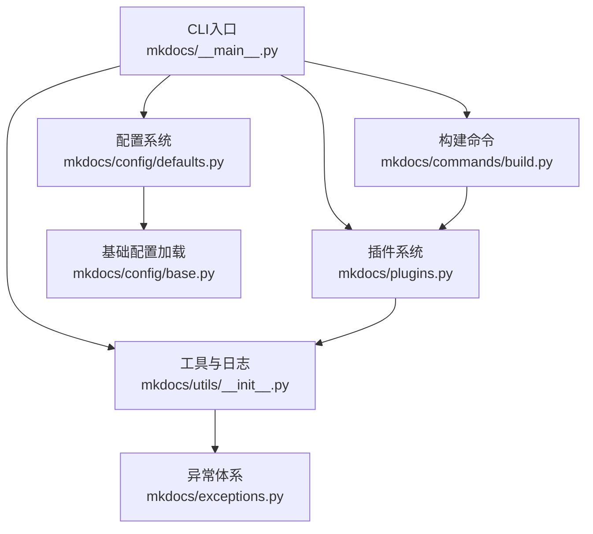
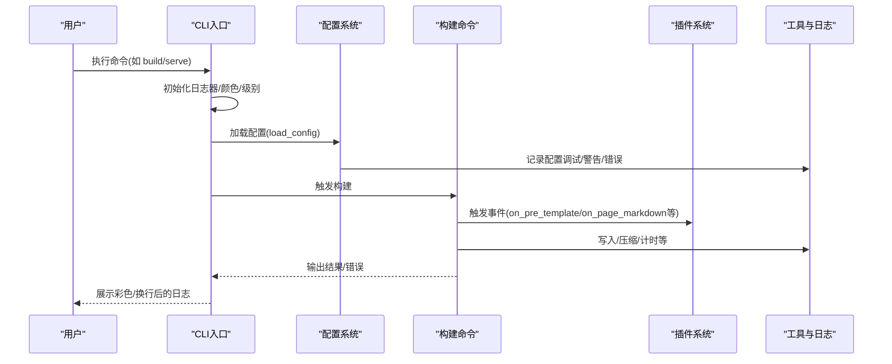
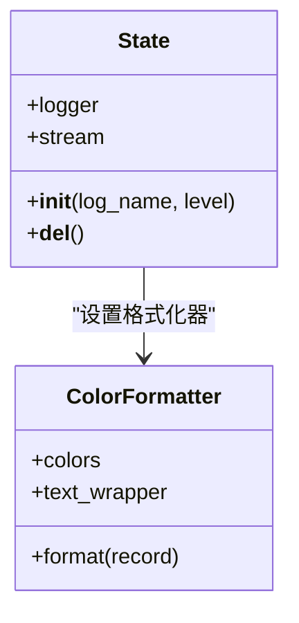
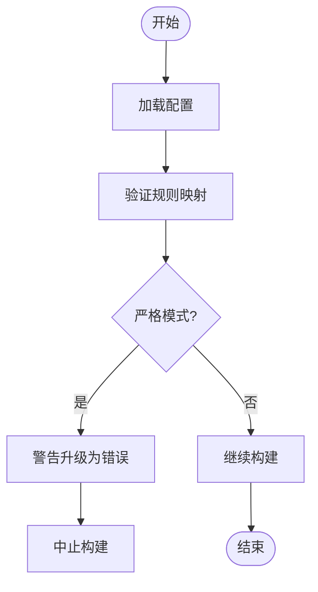
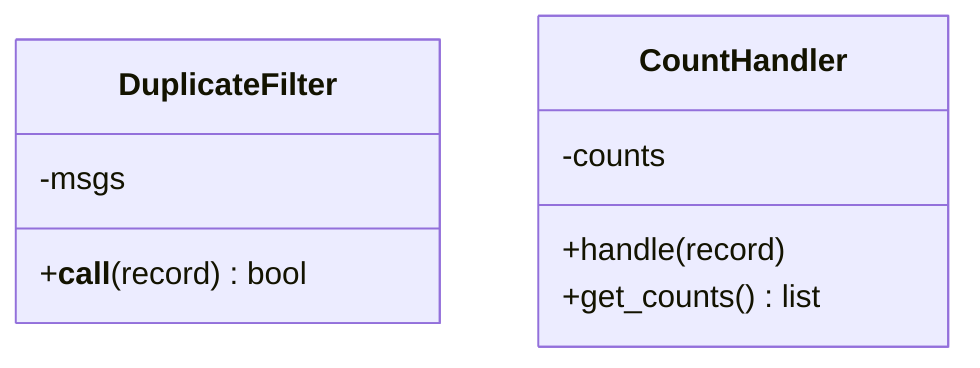
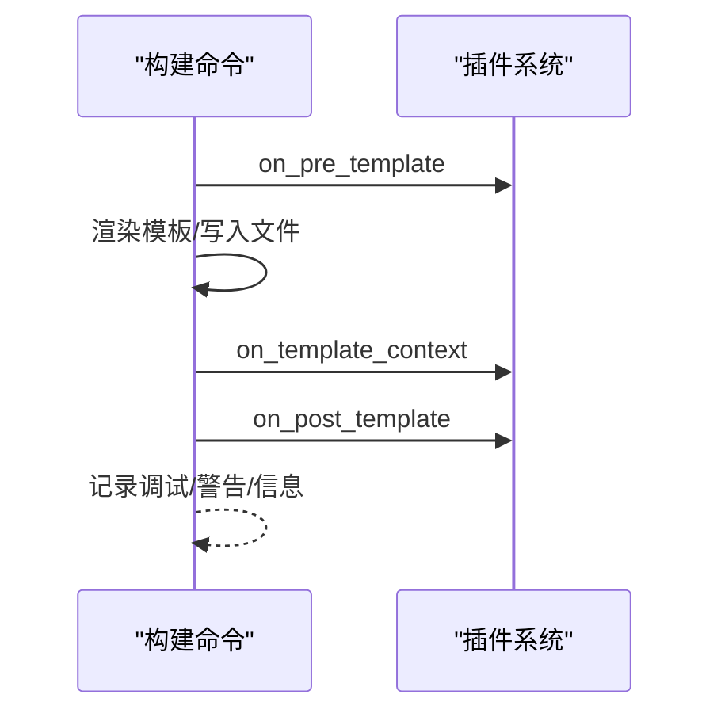
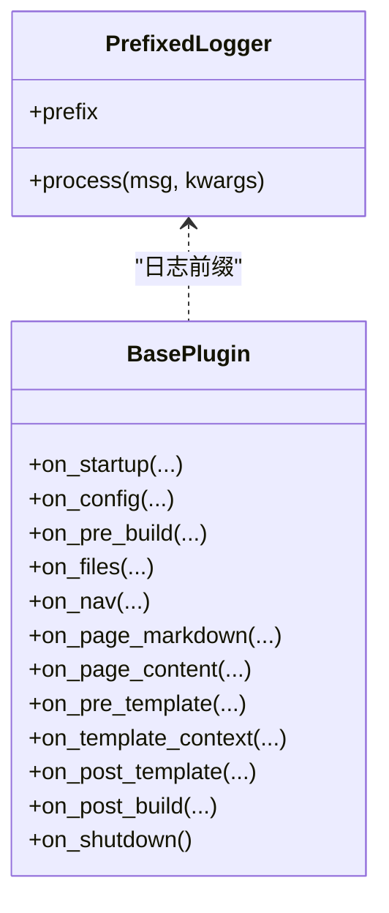
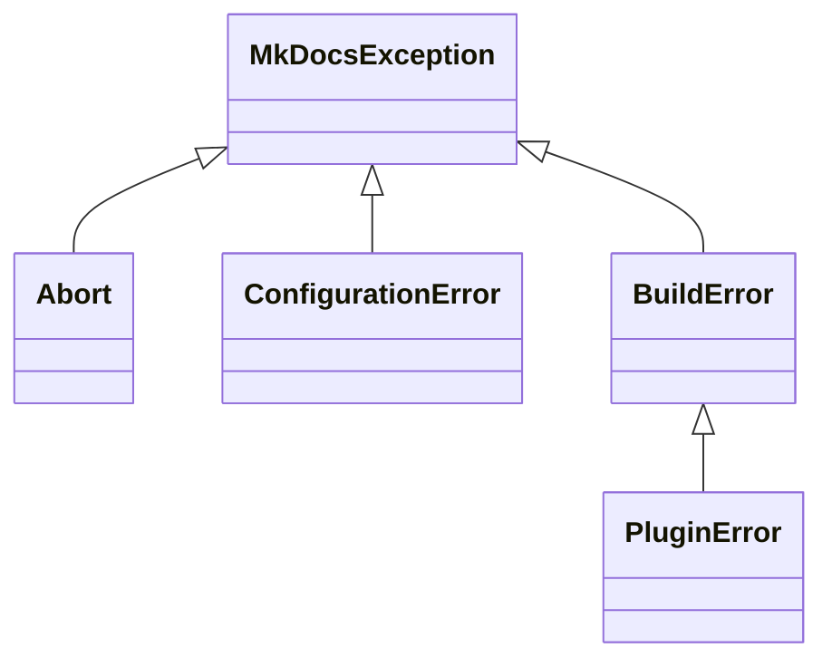
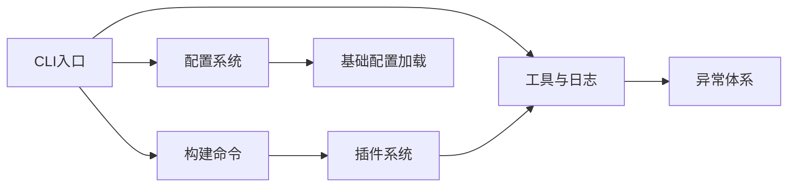

# 监控与日志

<cite>
**本文引用的文件**
- [mkdocs\__main__.py](file://mkdocs/__main__.py)
- [mkdocs\config\defaults.py](file://mkdocs/config/defaults.py)
- [mkdocs\config\base.py](file://mkdocs/config/base.py)
- [mkdocs\utils\__init__.py](file://mkdocs/utils/__init__.py)
- [mkdocs\commands\build.py](file://mkdocs/commands/build.py)
- [mkdocs\plugins.py](file://mkdocs/plugins.py)
- [mkdocs\exceptions.py](file://mkdocs/exceptions.py)
- [docs\user-guide\configuration.md](file://docs/user-guide/configuration.md)
</cite>

## 目录
1. [简介](#简介)
2. [项目结构](#项目结构)
3. [核心组件](#核心组件)
4. [架构总览](#架构总览)
5. [详细组件分析](#详细组件分析)
6. [依赖关系分析](#依赖关系分析)
7. [性能考量](#性能考量)
8. [故障排查指南](#故障排查指南)
9. [结论](#结论)
10. [附录](#附录)

## 简介
本指南面向在生产或开发环境中使用 MkDocs 的工程团队，聚焦“监控与日志”的落地实践。内容覆盖：
- 日志配置与输出格式设置（颜色、宽度包裹、级别控制）
- 监控指标采集与性能跟踪（构建时间、模板渲染、页面处理等）
- 错误日志分析与故障诊断（异常类型、严格模式、重复消息过滤）
- 告警机制与通知配置（严格模式、统计计数器、警告去重）
- 外部监控工具集成建议（日志采集、指标上报、告警联动）
- 日志轮转与存储管理策略（基于外部工具）

说明：MkDocs 本身未内置内置的指标导出或远程上报能力，本指南提供可操作的配置与流程建议，帮助将 MkDocs 构建过程纳入现有监控体系。

## 项目结构
围绕“监控与日志”，以下模块是关键：
- CLI 入口与日志初始化：负责日志级别、颜色、终端宽度适配、警告去重与显示
- 配置系统：提供严格模式、验证规则、默认级别映射
- 工具与通用逻辑：提供重复消息过滤、日志计数器、构建时间戳等
- 构建命令：记录模板与页面处理的关键日志点
- 插件系统：提供统一的日志前缀与事件钩子，便于扩展监控
- 异常体系：定义不同类型的异常，便于区分错误来源与处理策略

图表来源
- [mkdocs\__main__.py](file://mkdocs/__main__.py#L25-L108)
- [mkdocs\config\defaults.py](file://mkdocs/config/defaults.py#L38-L219)
- [mkdocs\config\base.py](file://mkdocs/config/base.py#L31-L392)
- [mkdocs\utils\__init__.py](file://mkdocs/utils/__init__.py#L36-L410)
- [mkdocs\commands\build.py](file://mkdocs/commands/build.py#L26-L200)
- [mkdocs\plugins.py](file://mkdocs/plugins.py#L37-L200)
- [mkdocs\exceptions.py](file://mkdocs/exceptions.py#L6-L42)

章节来源
- [mkdocs\__main__.py](file://mkdocs/__main__.py#L25-L108)
- [mkdocs\config\defaults.py](file://mkdocs/config/defaults.py#L38-L219)
- [mkdocs\config\base.py](file://mkdocs/config/base.py#L31-L392)
- [mkdocs\utils\__init__.py](file://mkdocs/utils/__init__.py#L36-L410)
- [mkdocs\commands\build.py](file://mkdocs/commands/build.py#L26-L200)
- [mkdocs\plugins.py](file://mkdocs/plugins.py#L37-L200)
- [mkdocs\exceptions.py](file://mkdocs/exceptions.py#L6-L42)

## 核心组件
- 日志初始化与格式化
  - CLI 中通过状态类维护根日志器，自动检测终端宽度并进行文本换行；支持颜色输出与禁用颜色；支持 -v/-q 控制级别
  - 警告系统启用去重过滤，避免重复提示
- 配置与严格模式
  - 验证规则将字符串级别映射为日志级别；严格模式下，任何警告会导致构建中止
- 工具与计数
  - 提供重复消息过滤器与日志计数器，便于统计各级别日志数量
- 构建命令中的关键日志点
  - 模板渲染、页面读取与渲染、gzip 输出、空输出跳过等
- 插件日志前缀
  - 插件日志统一前缀，便于识别来源
- 异常体系
  - 定义基础异常、中止、配置错误、构建错误、插件错误，便于区分与处理

章节来源
- [mkdocs\__main__.py](file://mkdocs/__main__.py#L61-L108)
- [mkdocs\config\defaults.py](file://mkdocs/config/defaults.py#L12-L33)
- [mkdocs\utils\__init__.py](file://mkdocs/utils/__init__.py#L358-L386)
- [mkdocs\commands\build.py](file://mkdocs/commands/build.py#L91-L145)
- [mkdocs\plugins.py](file://mkdocs/plugins.py#L649-L697)
- [mkdocs\exceptions.py](file://mkdocs/exceptions.py#L6-L42)

## 架构总览
下图展示了从 CLI 到配置、构建与插件的调用链路，并标注了日志与异常的关键节点。

图表来源
- [mkdocs\__main__.py](file://mkdocs/__main__.py#L275-L291)
- [mkdocs\config\base.py](file://mkdocs/config/base.py#L340-L392)
- [mkdocs\commands\build.py](file://mkdocs/commands/build.py#L61-L122)
- [mkdocs\plugins.py](file://mkdocs/plugins.py#L100-L132)
- [mkdocs\utils\__init__.py](file://mkdocs/utils/__init__.py#L370-L386)

## 详细组件分析

### 组件A：日志初始化与输出格式
- 功能要点
  - 自动检测终端宽度，对长消息进行换行，避免滚动条
  - 支持按级别着色（错误/警告/信息/调试）
  - 支持强制开启/关闭颜色输出
  - 通过 -v/-q 控制日志级别
  - 启用重复消息过滤，减少噪音
- 关键路径
  - 状态类初始化日志器与处理器
  - 彩色格式化器根据级别选择颜色
  - 警告系统启用去重过滤

图表来源
- [mkdocs\__main__.py](file://mkdocs/__main__.py#L91-L108)
- [mkdocs\__main__.py](file://mkdocs/__main__.py#L61-L89)

章节来源
- [mkdocs\__main__.py](file://mkdocs/__main__.py#L61-L108)

### 组件B：配置与严格模式
- 功能要点
  - 将字符串级别的验证规则映射为日志级别
  - 严格模式下，任何警告导致构建中止
  - 默认级别与嵌套配置的传播行为
- 关键路径
  - 验证级别选项到日志级别的映射
  - 配置加载与校验阶段记录警告/错误

图表来源
- [mkdocs\config\defaults.py](file://mkdocs/config/defaults.py#L12-L33)
- [mkdocs\config\defaults.py](file://mkdocs/config/defaults.py#L169-L219)
- [mkdocs\config\base.py](file://mkdocs/config/base.py#L340-L392)

章节来源
- [mkdocs\config\defaults.py](file://mkdocs/config/defaults.py#L12-L33)
- [mkdocs\config\defaults.py](file://mkdocs/config/defaults.py#L169-L219)
- [mkdocs\config\base.py](file://mkdocs/config/base.py#L340-L392)

### 组件C：工具与日志计数
- 功能要点
  - 重复消息过滤器：避免同一消息多次出现
  - 日志计数器：按级别统计日志数量，支持设置阈值
- 关键路径
  - 在 CLI 中添加计数器处理器，用于统计警告/错误数量
  - 测试用例验证计数器行为与级别过滤

图表来源
- [mkdocs\utils\__init__.py](file://mkdocs/utils/__init__.py#L358-L386)

章节来源
- [mkdocs\utils\__init__.py](file://mkdocs/utils/__init__.py#L358-L386)

### 组件D：构建命令中的日志点
- 功能要点
  - 模板渲染与主题模板构建过程中的调试/警告/信息日志
  - 页面读取与渲染失败时的错误日志
  - sitemap.xml 压缩与空输出跳过的日志
- 关键路径
  - 主题模板构建、额外模板构建、页面填充与构建

图表来源
- [mkdocs\commands\build.py](file://mkdocs/commands/build.py#L61-L122)
- [mkdocs\commands\build.py](file://mkdocs/commands/build.py#L147-L200)

章节来源
- [mkdocs\commands\build.py](file://mkdocs/commands/build.py#L61-L122)
- [mkdocs\commands\build.py](file://mkdocs/commands/build.py#L147-L200)

### 组件E：插件日志前缀与事件
- 功能要点
  - 插件日志统一前缀，便于识别来源
  - 提供启动/关闭、配置、预构建、文件、导航、页面、模板、后处理等事件钩子
- 关键路径
  - 获取带前缀的日志器
  - 事件触发与参数传递

图表来源
- [mkdocs\plugins.py](file://mkdocs/plugins.py#L649-L697)
- [mkdocs\plugins.py](file://mkdocs/plugins.py#L100-L132)

章节来源
- [mkdocs\plugins.py](file://mkdocs/plugins.py#L649-L697)
- [mkdocs\plugins.py](file://mkdocs/plugins.py#L100-L132)

### 组件F：异常体系与错误分类
- 功能要点
  - 基础异常、中止、配置错误、构建错误、插件错误
  - 不同异常类型用于区分来源与处理策略
- 关键路径
  - CLI 中根据严格模式与配置错误决定是否中止

图表来源
- [mkdocs\exceptions.py](file://mkdocs/exceptions.py#L6-L42)

章节来源
- [mkdocs\exceptions.py](file://mkdocs/exceptions.py#L6-L42)

## 依赖关系分析
- CLI 依赖配置系统进行配置加载与校验，再驱动构建命令执行
- 构建命令依赖插件系统以触发事件，同时使用工具模块进行文件写入与计时
- 工具模块提供日志计数器与重复消息过滤，服务于 CLI 与测试场景
- 插件系统依赖日志器与配置对象，提供统一的事件钩子

图表来源
- [mkdocs\__main__.py](file://mkdocs/__main__.py#L275-L291)
- [mkdocs\config\defaults.py](file://mkdocs/config/defaults.py#L38-L219)
- [mkdocs\config\base.py](file://mkdocs/config/base.py#L340-L392)
- [mkdocs\utils\__init__.py](file://mkdocs/utils/__init__.py#L358-L386)
- [mkdocs\commands\build.py](file://mkdocs/commands/build.py#L61-L122)
- [mkdocs\plugins.py](file://mkdocs/plugins.py#L100-L132)
- [mkdocs\exceptions.py](file://mkdocs/exceptions.py#L6-L42)

章节来源
- [mkdocs\__main__.py](file://mkdocs/__main__.py#L275-L291)
- [mkdocs\config\defaults.py](file://mkdocs/config/defaults.py#L38-L219)
- [mkdocs\config\base.py](file://mkdocs/config/base.py#L340-L392)
- [mkdocs\utils\__init__.py](file://mkdocs/utils/__init__.py#L358-L386)
- [mkdocs\commands\build.py](file://mkdocs/commands/build.py#L61-L122)
- [mkdocs\plugins.py](file://mkdocs/plugins.py#L100-L132)
- [mkdocs\exceptions.py](file://mkdocs/exceptions.py#L6-L42)

## 性能考量
- 日志输出性能
  - 彩色与宽度包裹会增加少量 CPU 开销，适合本地开发；CI 环境可考虑禁用颜色以减少输出开销
  - 重复消息过滤避免重复日志带来的冗余输出
- 构建性能观测
  - 可结合工具模块的时间戳函数与构建命令中的日志点，统计模板渲染与页面处理耗时
  - 使用日志计数器统计警告/错误数量，辅助定位性能瓶颈（如大量空输出跳过）
- 建议
  - 在 CI 中使用 -q 降低噪声，仅在失败时查看详细日志
  - 对于大型站点，优先启用“脏增量”构建（如适用），减少不必要的重渲染

[本节为通用指导，无需特定文件引用]

## 故障排查指南
- 如何启用更详细的日志
  - 使用 -v 提升到调试级别，查看模板与页面处理的详细日志
  - 使用 -q 降低到错误级别，聚焦关键问题
- 如何避免重复日志
  - CLI 已启用重复消息过滤；若仍出现重复，检查自定义插件是否绕过该过滤
- 如何在严格模式下快速定位问题
  - 严格模式下任何警告都会导致构建中止；结合日志计数器统计警告数量，快速定位高频问题
- 常见错误类型与处理
  - 配置错误：检查配置文件语法与字段名称，关注配置加载阶段的日志
  - 构建错误：关注页面读取与渲染失败的日志，确认源文件与插件事件处理
  - 插件错误：通过插件日志前缀定位来源，检查插件配置与事件实现

章节来源
- [mkdocs\__main__.py](file://mkdocs/__main__.py#L163-L216)
- [mkdocs\utils\__init__.py](file://mkdocs/utils/__init__.py#L358-L386)
- [mkdocs\config\base.py](file://mkdocs/config/base.py#L340-L392)
- [mkdocs\commands\build.py](file://mkdocs/commands/build.py#L147-L200)
- [mkdocs\plugins.py](file://mkdocs/plugins.py#L649-L697)
- [mkdocs\exceptions.py](file://mkdocs/exceptions.py#L6-L42)

## 结论
- MkDocs 的日志体系以 CLI 初始化为核心，结合配置系统的严格模式与工具模块的计数/去重能力，形成完整的可观测性基础
- 构建命令与插件系统提供了丰富的日志点，便于定位问题与评估性能
- 对于指标导出与远程告警，建议通过外部工具（如日志采集、指标代理）对接 CLI 输出与配置加载阶段的日志，实现统一监控与告警

[本节为总结性内容，无需特定文件引用]

## 附录

### A. 日志配置与输出格式设置
- CLI 级别控制
  - -v：提升到调试级别
  - -q：降级到错误级别
  - --color/--no-color：强制启用/禁用颜色输出
- 终端适配
  - 自动检测终端宽度并进行换行，避免长行溢出
- 插件日志前缀
  - 插件日志统一前缀，便于识别来源

章节来源
- [mkdocs\__main__.py](file://mkdocs/__main__.py#L163-L216)
- [mkdocs\plugins.py](file://mkdocs/plugins.py#L649-L697)

### B. 监控指标收集与性能跟踪
- 可观测点
  - 配置加载阶段的警告/错误统计
  - 构建阶段的模板渲染与页面处理日志
  - 空输出跳过与 sitemap 压缩日志
- 建议指标
  - 构建总耗时（结合时间戳函数）
  - 模板渲染次数与失败数
  - 页面读取/渲染失败数
  - 警告/错误数量趋势

章节来源
- [mkdocs\utils\__init__.py](file://mkdocs/utils/__init__.py#L47-L84)
- [mkdocs\commands\build.py](file://mkdocs/commands/build.py#L91-L145)

### C. 告警机制与通知配置
- 严格模式
  - 任何警告导致构建中止，适合 CI 环境
- 日志计数器
  - 统计各级别日志数量，便于生成告警阈值
- 警告去重
  - 减少重复告警噪音

章节来源
- [mkdocs\config\defaults.py](file://mkdocs/config/defaults.py#L140-L143)
- [mkdocs\utils\__init__.py](file://mkdocs/utils/__init__.py#L370-L386)
- [mkdocs\__main__.py](file://mkdocs/__main__.py#L48-L59)

### D. 集成外部监控工具与服务
- 日志采集
  - 将 CLI 输出与配置加载日志接入集中式日志平台（如 ELK、Loki、Cloud Logging）
- 指标上报
  - 将构建耗时、模板渲染失败数、页面处理失败数等指标上报至监控系统（如 Prometheus、Grafana）
- 告警联动
  - 基于严格模式与日志计数器设定阈值，触发邮件/IM 告警

[本节为概念性内容，无需特定文件引用]

### E. 日志轮转与存储管理策略
- 建议
  - 使用系统级日志轮转工具（如 logrotate、Windows Event Viewer）对 CLI 输出进行轮转
  - 将构建产物与日志分离存储，避免日志占用站点目录空间
  - 在 CI 环境中，将日志上传至制品库或专用存储，保留一定周期以便回溯

[本节为通用指导，无需特定文件引用]