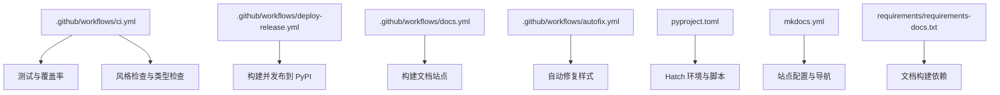
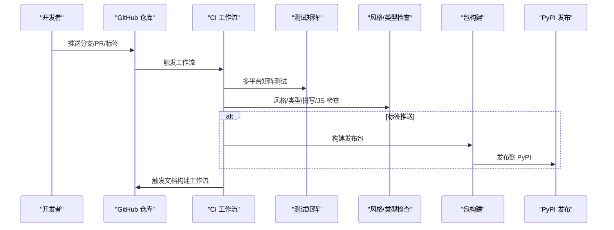
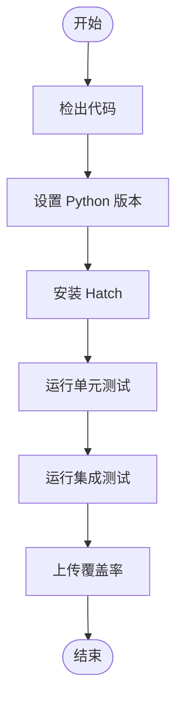
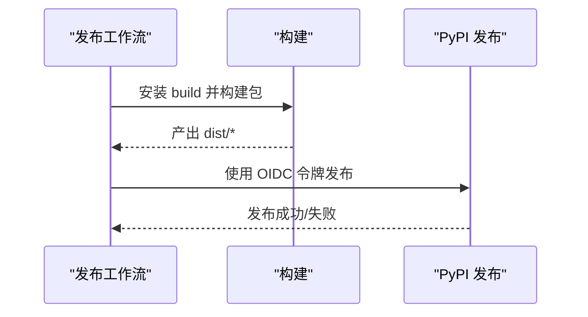
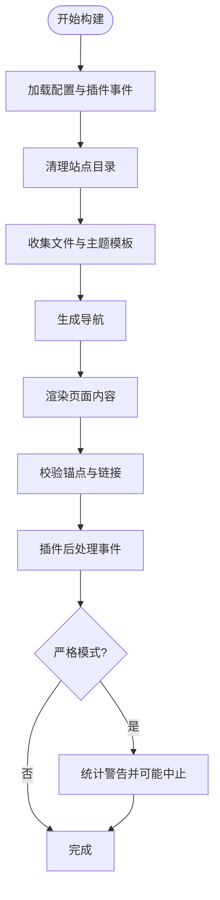
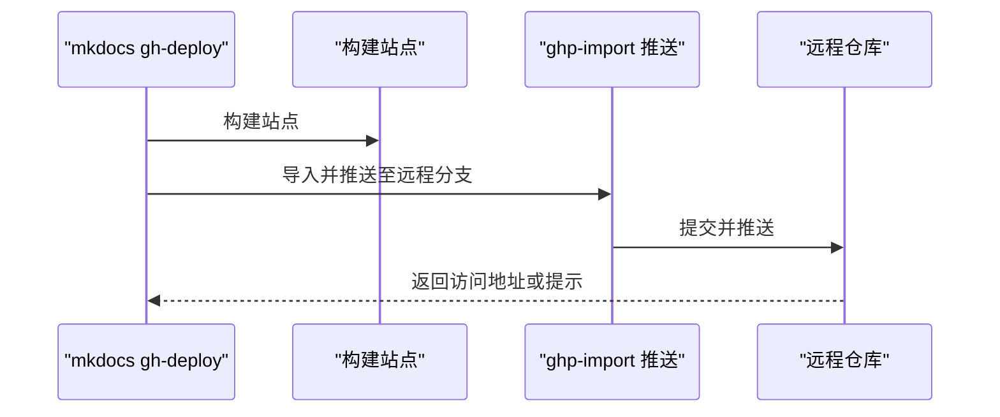
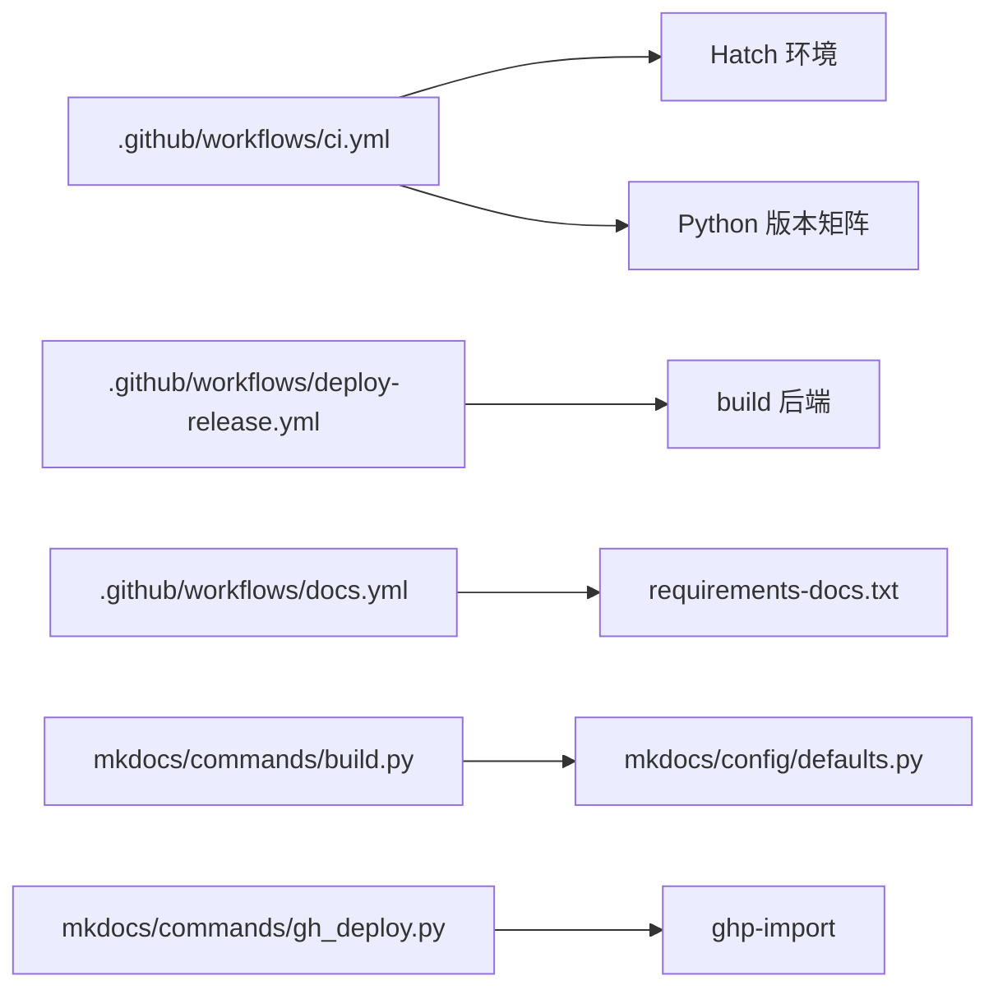

# CI/CD 集成

<cite>
**本文引用的文件**
- [.github/workflows/ci.yml](file://.github/workflows/ci.yml)
- [.github/workflows/deploy-release.yml](file://.github/workflows/deploy-release.yml)
- [.github/workflows/docs.yml](file://.github/workflows/docs.yml)
- [.github/workflows/autofix.yml](file://.github/workflows/autofix.yml)
- [pyproject.toml](file://pyproject.toml)
- [mkdocs.yml](file://mkdocs.yml)
- [requirements/requirements-docs.txt](file://requirements/requirements-docs.txt)
- [mkdocs/commands/build.py](file://mkdocs/commands/build.py)
- [mkdocs/commands/gh_deploy.py](file://mkdocs/commands/gh_deploy.py)
- [mkdocs/config/defaults.py](file://mkdocs/config/defaults.py)
- [mkdocs/config/config_options.py](file://mkdocs/config/config_options.py)
- [mkdocs/tests/cli_tests.py](file://mkdocs/tests/cli_tests.py)
</cite>

## 目录
1. [简介](#简介)
2. [项目结构](#项目结构)
3. [核心组件](#核心组件)
4. [架构总览](#架构总览)
5. [详细组件分析](#详细组件分析)
6. [依赖关系分析](#依赖关系分析)
7. [性能考量](#性能考量)
8. [故障排查指南](#故障排查指南)
9. [结论](#结论)
10. [附录](#附录)

## 简介
本指南聚焦 MkDocs 与 CI/CD 工具的集成实践，围绕 GitHub Actions 的配置与使用展开，覆盖自动构建、测试、打包与发布流程；同时给出 GitLab CI、Azure DevOps 的集成思路与最佳实践。文档基于仓库内现有工作流与源码实现，提供可直接参考的 YAML 配置要点、多阶段构建策略、缓存与环境变量管理、错误处理与安全注意事项，并总结常见问题排查与性能优化建议。

## 项目结构
本项目采用“根目录 + GitHub Actions 工作流 + 源码模块 + 文档配置”的组织方式：
- 根目录包含构建与发布配置（如 pyproject.toml、mkdocs.yml）、依赖清单（requirements/*.txt）以及 CI 工作流定义（.github/workflows/*.yml）
- 源码位于 mkdocs/ 下，包含命令实现（build、gh_deploy）、配置解析（defaults、config_options）、主题与插件等
- 文档位于 docs/，并通过 mkdocs.yml 进行站点配置与导航

图表来源
- [.github/workflows/ci.yml](file://.github/workflows/ci.yml#L1-L105)
- [.github/workflows/deploy-release.yml](file://.github/workflows/deploy-release.yml#L1-L23)
- [.github/workflows/docs.yml](file://.github/workflows/docs.yml#L1-L21)
- [.github/workflows/autofix.yml](file://.github/workflows/autofix.yml#L1-L24)
- [pyproject.toml](file://pyproject.toml#L104-L139)
- [mkdocs.yml](file://mkdocs.yml#L1-L80)
- [requirements/requirements-docs.txt](file://requirements/requirements-docs.txt#L1-L135)

章节来源
- file://.github/workflows/ci.yml#L1-L105
- file://.github/workflows/deploy-release.yml#L1-L23
- file://.github/workflows/docs.yml#L1-L21
- file://.github/workflows/autofix.yml#L1-L24
- file://pyproject.toml#L104-L139
- file://mkdocs.yml#L1-L80
- file://requirements/requirements-docs.txt#L1-L135

## 核心组件
- 测试与多平台矩阵：通过 GitHub Actions 在 Ubuntu、Windows、macOS 上对 Python 3.8–3.12 与 PyPy 进行矩阵化测试，结合覆盖率与集成测试
- 风格与类型检查：统一使用 ruff、mypy、markdownlint、jshint、codespell 等工具进行静态检查
- 包构建与发布：使用 build 后在 PyPI 发布，支持签名令牌与严格权限控制
- 文档站点构建：按严格模式构建站点，确保链接与模板一致性
- 自动修复：当风格检查失败时，优先尝试自动修复，必要时回退到 pre-commit-ci-lite

章节来源
- file://.github/workflows/ci.yml#L8-L54
- file://.github/workflows/ci.yml#L55-L85
- file://.github/workflows/deploy-release.yml#L7-L23
- file://.github/workflows/docs.yml#L8-L21
- file://.github/workflows/autofix.yml#L6-L24

## 架构总览
下图展示了从代码提交到文档构建与发布的端到端流程，以及各工作流之间的职责划分：

图表来源
- [.github/workflows/ci.yml](file://.github/workflows/ci.yml#L1-L105)
- [.github/workflows/deploy-release.yml](file://.github/workflows/deploy-release.yml#L1-L23)
- [.github/workflows/docs.yml](file://.github/workflows/docs.yml#L1-L21)

## 详细组件分析

### GitHub Actions 工作流概览
- CI 工作流：执行多平台测试矩阵、集成测试与覆盖率上传；同时运行风格与类型检查
- 发布工作流：仅在标签推送时触发，构建并发布到 PyPI，使用 OIDC 身份令牌
- 文档工作流：在 PR 与推送时构建文档站点，使用严格模式
- 自动修复工作流：在 PR 中自动修复风格问题，必要时回退到 pre-commit

章节来源
- file://.github/workflows/ci.yml#L1-L105
- file://.github/workflows/deploy-release.yml#L1-L23
- file://.github/workflows/docs.yml#L1-L21
- file://.github/workflows/autofix.yml#L1-L24

### 测试与多平台矩阵
- 矩阵策略：组合 Python 版本与操作系统，排除部分高成本或不兼容组合以优化时间
- 步骤拆分：分别运行单元测试与集成测试，便于定位问题
- 覆盖率：使用 Codecov Action 上传覆盖率报告，失败不阻断 CI

图表来源
- [.github/workflows/ci.yml](file://.github/workflows/ci.yml#L30-L54)

章节来源
- file://.github/workflows/ci.yml#L8-L54

### 风格与类型检查
- 使用 Hatch 环境统一管理工具链，避免本地差异
- 按需启用 ruff、mypy、markdownlint、jshint、codespell 等检查
- 使用 always() 条件保证即使前置步骤失败也执行检查

章节来源
- file://.github/workflows/ci.yml#L55-L85

### 包构建与 PyPI 发布
- 使用 build 后端构建 wheel 与 sdist
- 严格权限：仅授予 OIDC 身份令牌写入权限
- 发布动作：使用官方 PyPI 发布动作

图表来源
- [.github/workflows/deploy-release.yml](file://.github/workflows/deploy-release.yml#L7-L23)

章节来源
- file://.github/workflows/deploy-release.yml#L1-L23

### 文档站点构建
- 使用严格模式构建，确保链接与模板一致性
- 仅安装文档所需依赖，避免污染测试环境

章节来源
- file://.github/workflows/docs.yml#L8-L21
- file://requirements/requirements-docs.txt#L1-L135

### 自动修复与回退
- 先尝试自动修复，若仍有差异则在 PR 场景回退到 pre-commit-ci-lite
- 通过 git diff 判断是否需要提交修复

章节来源
- file://.github/workflows/autofix.yml#L6-L24

### MkDocs 构建命令与错误处理
- 构建流程：加载配置 → 清理输出目录 → 收集文件与导航 → 渲染页面与模板 → 校验链接 → 插件事件回调 → 输出日志与耗时
- 严格模式：统计警告并可能中断构建
- 错误处理：捕获异常并触发插件错误事件，记录日志并抛出中止信号

图表来源
- [mkdocs/commands/build.py](file://mkdocs/commands/build.py#L249-L365)

章节来源
- file://mkdocs/commands/build.py#L249-L365

### GitHub Pages 部署流程
- 命令入口：gh-deploy 将站点复制到远程分支并推送
- 版本检查：防止降级部署
- CNAME 支持：根据 CNAME 文件提示访问地址

图表来源
- [mkdocs/commands/gh_deploy.py](file://mkdocs/commands/gh_deploy.py#L100-L170)

章节来源
- file://mkdocs/commands/gh_deploy.py#L100-L170
- file://mkdocs/tests/cli_tests.py#L420-L471

### 配置与选项
- 默认配置：包含站点名称、URL、主题、导航、Markdown 扩展、验证级别、远程分支等
- 验证子配置：支持导航与链接的验证等级配置

章节来源
- file://mkdocs/config/defaults.py#L38-L200
- file://mkdocs/config/config_options.py#L52-L123

## 依赖关系分析
- 工作流依赖：CI 工作流依赖 Hatch 环境与 Python 版本矩阵；发布工作流依赖 build 与 PyPI 发布动作；文档工作流依赖 requirements-docs.txt
- 源码依赖：构建命令依赖配置系统与插件系统；部署命令依赖 ghp-import 与 Git 子进程

图表来源
- [.github/workflows/ci.yml](file://.github/workflows/ci.yml#L30-L54)
- [.github/workflows/deploy-release.yml](file://.github/workflows/deploy-release.yml#L17-L22)
- [.github/workflows/docs.yml](file://.github/workflows/docs.yml#L17-L20)
- [mkdocs/commands/build.py](file://mkdocs/commands/build.py#L249-L365)
- [mkdocs/commands/gh_deploy.py](file://mkdocs/commands/gh_deploy.py#L100-L170)
- [mkdocs/config/defaults.py](file://mkdocs/config/defaults.py#L38-L200)

章节来源
- file://.github/workflows/ci.yml#L30-L54
- file://.github/workflows/deploy-release.yml#L17-L22
- file://.github/workflows/docs.yml#L17-L20
- file://mkdocs/commands/build.py#L249-L365
- file://mkdocs/commands/gh_deploy.py#L100-L170
- file://mkdocs/config/defaults.py#L38-L200

## 性能考量
- 多平台矩阵优化：通过排除高成本组合减少运行时间
- 严格模式：在文档构建中启用严格模式，提前发现潜在问题，降低后期返工成本
- 依赖隔离：文档构建仅安装文档所需依赖，避免测试环境污染
- 缓存策略：建议在 CI 中引入 pip/Hatch 缓存以缩短安装时间（具体缓存键位可在各平台工作流中配置）

## 故障排查指南
- 构建失败（严格模式）：查看严格模式统计的警告数量与类型，逐项修复
- 链接/锚点校验失败：根据验证级别调整配置或修正文档内部链接
- 部署版本降级：gh-deploy 会阻止旧版本部署，升级当前版本后再试
- Git 不可用：确认 CI 环境已安装并可执行 git 命令
- PyPI 发布失败：检查 OIDC 令牌权限与发布动作版本，确保标签命名规范

章节来源
- file://mkdocs/commands/build.py#L349-L361
- file://mkdocs/commands/gh_deploy.py#L92-L97
- file://mkdocs/commands/gh_deploy.py#L30-L34
- file://.github/workflows/deploy-release.yml#L8-L9

## 结论
本项目通过 GitHub Actions 实现了从测试、风格检查、文档构建到包发布的全链路自动化。结合 MkDocs 的严格模式与配置系统，能够在 CI 环境中稳定地产出高质量文档与包。建议在实际企业环境中进一步引入缓存、并行化与安全扫描，以提升整体效率与安全性。

## 附录

### GitHub Actions 集成要点
- 触发条件：push、pull_request、schedule 与标签推送
- 环境准备：actions/setup-python、actions/checkout
- 多平台矩阵：合理排除组合，平衡覆盖率与耗时
- 严格模式：在文档构建与 CI 中启用严格模式
- 安全发布：PyPI 发布使用 OIDC 身份令牌，最小权限原则

章节来源
- file://.github/workflows/ci.yml#L2-L6
- file://.github/workflows/docs.yml#L2-L6
- file://.github/workflows/deploy-release.yml#L8-L9

### GitLab CI 集成思路
- 触发器：使用 pipeline 触发器或镜像推送触发
- 任务拆分：与 GitHub Actions 类似，拆分为测试、风格检查、文档构建、包构建与发布
- 缓存：利用 GitLab Runner 的缓存功能加速依赖安装
- 安全：使用项目令牌或 CI/CD 变量管理 PyPI 发布凭据

[本节为概念性说明，未直接分析具体文件，故无章节来源]

### Azure DevOps 集成思路
- YAML 管道：将测试、构建、发布拆分为独立作业
- 代理池：选择合适的托管代理（Ubuntu、Windows、macOS）
- 变量组：集中管理环境变量与机密信息
- 发布管道：将构建产物发布到 PyPI 或制品库

[本节为概念性说明，未直接分析具体文件，故无章节来源]

### 环境变量与缓存策略
- 环境变量：通过 CI 平台的变量组或加密变量注入敏感信息
- 缓存策略：缓存 pip/Hatch 缓存目录，设置合理的失效策略
- 依赖锁定：使用 requirements-docs.txt 与 Hatch 管理依赖版本

章节来源
- file://requirements/requirements-docs.txt#L1-L135
- file://pyproject.toml#L104-L139