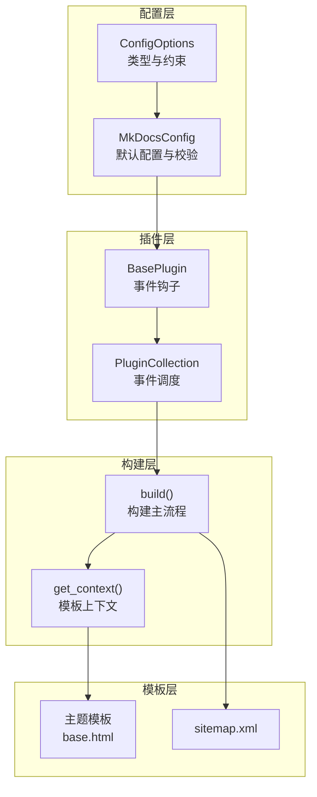
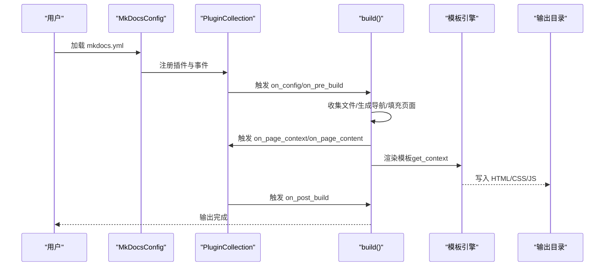
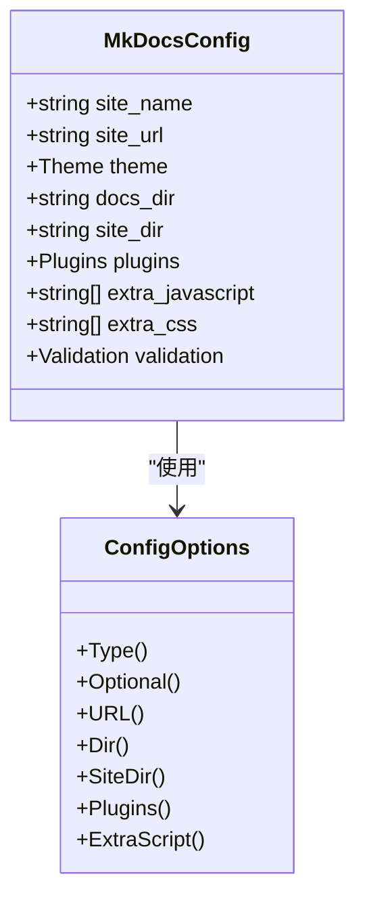
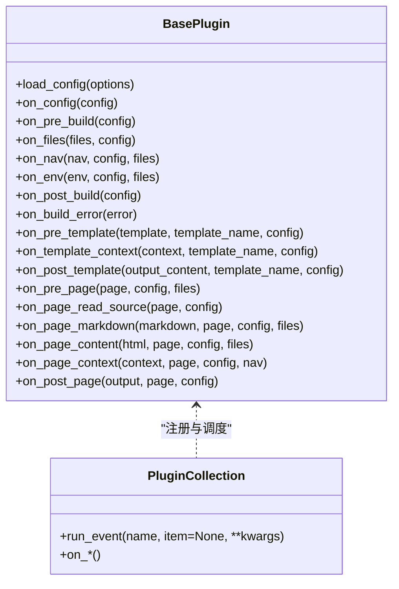
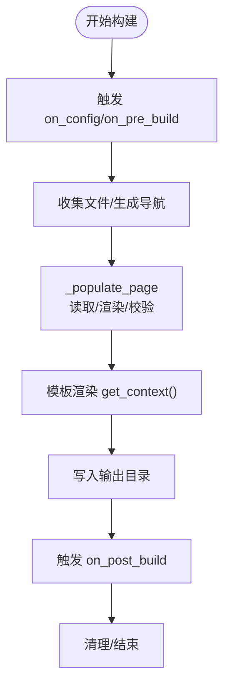
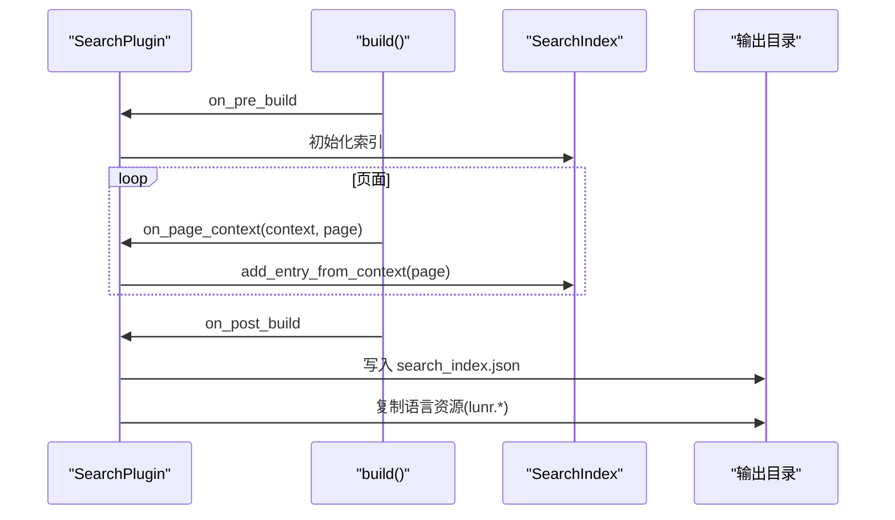
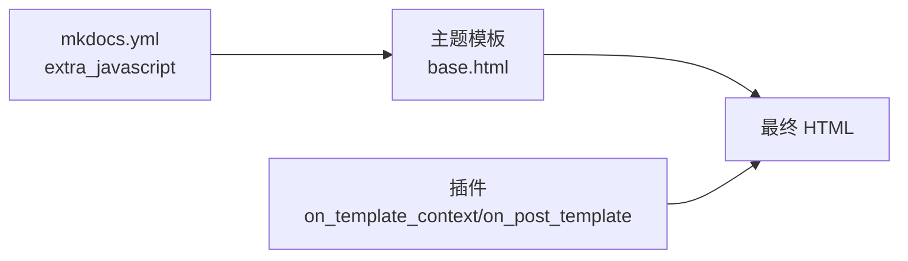
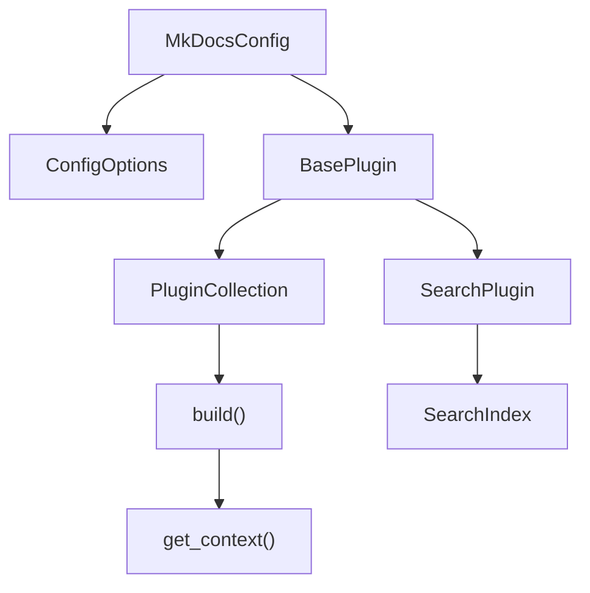

# 外部系统集成

<cite>
**本文引用的文件**
- [mkdocs/config/base.py](file://mkdocs/config/base.py)
- [mkdocs/config/defaults.py](file://mkdocs/config/defaults.py)
- [mkdocs/config/config_options.py](file://mkdocs/config/config_options.py)
- [mkdocs/plugins.py](file://mkdocs/plugins.py)
- [mkdocs/commands/build.py](file://mkdocs/commands/build.py)
- [mkdocs/contrib/search/__init__.py](file://mkdocs/contrib/search/__init__.py)
- [mkdocs/contrib/search/search_index.py](file://mkdocs/contrib/search/search_index.py)
- [mkdocs/utils/__init__.py](file://mkdocs/utils/__init__.py)
- [mkdocs/themes/mkdocs/base.html](file://mkdocs/themes/mkdocs/base.html)
- [mkdocs/themes/readthedocs/base.html](file://mkdocs/themes/readthedocs/base.html)
- [mkdocs/templates/sitemap.xml](file://mkdocs/templates/sitemap.xml)
- [docs/dev-guide/plugins.md](file://docs/dev-guide/plugins.md)
- [docs/user-guide/configuration.md](file://docs/user-guide/configuration.md)
</cite>

## 目录
1. [简介](#简介)
2. [项目结构](#项目结构)
3. [核心组件](#核心组件)
4. [架构总览](#架构总览)
5. [详细组件分析](#详细组件分析)
6. [依赖关系分析](#依赖关系分析)
7. [性能考量](#性能考量)
8. [故障排查指南](#故障排查指南)
9. [结论](#结论)
10. [附录](#附录)

## 简介
本指南聚焦于 MkDocs 与外部系统的集成实践，覆盖以下主题：
- 与内容管理系统（CMS）的集成：通过插件机制在构建流程中注入数据、生成索引或输出静态资源；结合站点地图与搜索索引实现内容同步。
- 第三方服务集成：在模板中嵌入分析脚本（如 Google Analytics），或通过插件预构建搜索索引。
- 监控与日志：利用内置计数器与日志记录器在严格模式下捕获问题，便于 CI/CD 中的监控。
- 企业级系统对接：通过插件事件扩展页面上下文、模板上下文，实现权限控制与访问限制的前置处理。
- 微服务与分布式部署：通过 extra_javascript、extra_css、extra_templates 等配置在多环境复用前端资源，配合站点 URL 与相对链接策略保障跨环境一致性。

## 项目结构
围绕“配置—插件—构建—模板”的主线梳理关键模块：
- 配置层：定义全局配置项与校验规则，支持插件列表、主题、额外脚本等。
- 插件层：提供事件钩子贯穿构建生命周期，允许第三方扩展。
- 构建层：组织页面读取、渲染、写盘与清理流程。
- 模板层：主题模板与站点地图模板，承载分析脚本与静态资源注入。

图示来源
- [mkdocs/config/defaults.py](file://mkdocs/config/defaults.py#L38-L219)
- [mkdocs/config/config_options.py](file://mkdocs/config/config_options.py#L1-L200)
- [mkdocs/plugins.py](file://mkdocs/plugins.py#L58-L698)
- [mkdocs/commands/build.py](file://mkdocs/commands/build.py#L249-L370)
- [mkdocs/themes/mkdocs/base.html](file://mkdocs/themes/mkdocs/base.html#L35-L60)
- [mkdocs/templates/sitemap.xml](file://mkdocs/templates/sitemap.xml#L1-L11)

章节来源
- [mkdocs/config/defaults.py](file://mkdocs/config/defaults.py#L38-L219)
- [mkdocs/config/config_options.py](file://mkdocs/config/config_options.py#L1-L200)
- [mkdocs/plugins.py](file://mkdocs/plugins.py#L58-L698)
- [mkdocs/commands/build.py](file://mkdocs/commands/build.py#L249-L370)
- [mkdocs/themes/mkdocs/base.html](file://mkdocs/themes/mkdocs/base.html#L35-L60)
- [mkdocs/templates/sitemap.xml](file://mkdocs/templates/sitemap.xml#L1-L11)

## 核心组件
- 配置系统
  - MkDocsConfig 定义站点名称、URL、主题、文档目录、站点目录、插件、额外脚本、验证规则等。
  - ConfigOptions 提供类型、可选值、URL、路径、列表、字典等校验与转换能力。
- 插件系统
  - BasePlugin 定义事件钩子（启动、配置、文件收集、导航、模板、页面、后处理、错误处理等）。
  - PluginCollection 负责注册与按优先级执行事件。
- 构建流程
  - build() 组织文件收集、导航生成、页面填充与渲染、静态资源复制、模板输出与清理。
  - get_context() 为模板注入额外 CSS/JS、站点信息、构建时间等上下文。
- 搜索与站点地图
  - SearchPlugin 在构建前创建索引，在页面上下文事件中加入条目，在后处理阶段输出 JSON 并复制语言资源。
  - sitemap.xml 模板遍历页面生成站点地图。

章节来源
- [mkdocs/config/defaults.py](file://mkdocs/config/defaults.py#L38-L219)
- [mkdocs/config/config_options.py](file://mkdocs/config/config_options.py#L1-L200)
- [mkdocs/plugins.py](file://mkdocs/plugins.py#L58-L698)
- [mkdocs/commands/build.py](file://mkdocs/commands/build.py#L249-L370)
- [mkdocs/contrib/search/__init__.py](file://mkdocs/contrib/search/__init__.py#L62-L121)
- [mkdocs/contrib/search/search_index.py](file://mkdocs/contrib/search/search_index.py#L25-L140)
- [mkdocs/templates/sitemap.xml](file://mkdocs/templates/sitemap.xml#L1-L11)

## 架构总览
MkDocs 的外部系统集成主要通过“配置—插件—模板”三段式实现：
- 配置阶段：用户在 mkdocs.yml 中声明插件、主题、额外脚本、站点 URL 等。
- 插件阶段：插件在 on_config/on_pre_build/on_page_context/on_post_build 等事件中接入数据流与输出产物。
- 模板阶段：主题模板与站点地图模板消费上下文，注入分析脚本或生成索引/站点地图。

图示来源
- [mkdocs/commands/build.py](file://mkdocs/commands/build.py#L249-L370)
- [mkdocs/plugins.py](file://mkdocs/plugins.py#L575-L647)
- [mkdocs/config/defaults.py](file://mkdocs/config/defaults.py#L38-L219)

## 详细组件分析

### 配置与校验（与 CMS/外部系统对接的关键入口）
- 插件列表 plugins：支持字符串名与键值对配置，键值对中可传入插件专属配置。
- 主题 theme：可包含静态模板 static_templates、自定义目录 custom_dir 等。
- 额外脚本 extra_javascript/extra_css：用于注入分析脚本、第三方 SDK 或样式。
- 站点 URL site_url：影响模板中的绝对/相对链接与站点地图生成。
- 验证 validation：可配置导航与链接的严格程度，便于在 CI 中统一质量标准。

图示来源
- [mkdocs/config/defaults.py](file://mkdocs/config/defaults.py#L38-L219)
- [mkdocs/config/config_options.py](file://mkdocs/config/config_options.py#L1-L200)

章节来源
- [mkdocs/config/defaults.py](file://mkdocs/config/defaults.py#L38-L219)
- [mkdocs/config/config_options.py](file://mkdocs/config/config_options.py#L1-L200)
- [docs/user-guide/configuration.md](file://docs/user-guide/configuration.md#L1-L800)

### 插件系统（与第三方服务/监控/分析对接）
- 事件体系：startup/shutdown/serve、config/pre_build/files/nav/env/post_build/build_error、pre_template/template_context/post_template、pre_page/page_read_source/page_markdown/page_content/page_context/post_page。
- 事件优先级：通过 event_priority 与 CombinedEvent 控制同事件多处理器顺序。
- 日志：推荐使用 get_plugin_logger 获取带命名空间与前缀的日志器，便于统一格式与级别控制。

图示来源
- [mkdocs/plugins.py](file://mkdocs/plugins.py#L58-L698)
- [docs/dev-guide/plugins.md](file://docs/dev-guide/plugins.md#L247-L567)

章节来源
- [mkdocs/plugins.py](file://mkdocs/plugins.py#L58-L698)
- [docs/dev-guide/plugins.md](file://docs/dev-guide/plugins.md#L247-L567)

### 构建流程（页面与模板渲染）
- 页面填充：从文件系统读取源文件，触发 pre_page/page_markdown/page_content，再进入模板渲染。
- 模板上下文：get_context 注入 extra_css/extra_javascript、站点版本、构建时间、当前页等。
- 写盘与清理：按优先级写入文件，最后清理旧产物（受 --clean/--dirty 影响）。

图示来源
- [mkdocs/commands/build.py](file://mkdocs/commands/build.py#L249-L370)

章节来源
- [mkdocs/commands/build.py](file://mkdocs/commands/build.py#L249-L370)

### 搜索与站点地图（与 CMS 同步与 SEO）
- 搜索索引：SearchPlugin 在 on_pre_build 创建索引对象，在 on_page_context 将页面加入索引，在 on_post_build 输出 JSON，并复制语言资源。
- 站点地图：sitemap.xml 模板遍历页面生成 URL 列表，配合构建时压缩输出。

图示来源
- [mkdocs/contrib/search/__init__.py](file://mkdocs/contrib/search/__init__.py#L62-L121)
- [mkdocs/contrib/search/search_index.py](file://mkdocs/contrib/search/search_index.py#L25-L140)
- [mkdocs/commands/build.py](file://mkdocs/commands/build.py#L109-L122)

章节来源
- [mkdocs/contrib/search/__init__.py](file://mkdocs/contrib/search/__init__.py#L62-L121)
- [mkdocs/contrib/search/search_index.py](file://mkdocs/contrib/search/search_index.py#L25-L140)
- [mkdocs/templates/sitemap.xml](file://mkdocs/templates/sitemap.xml#L1-L11)

### 分析脚本注入（Google Analytics/Hootsuite 等）
- 主题模板：mkdocs 与 readthedocs 主题均在 base.html 中提供 analytics 区块，支持 gtag 或传统 GA 脚本注入。
- 额外脚本：通过 extra_javascript 注入第三方 SDK（如 Hotjar、百度统计等），或在 on_template_context/on_post_template 中动态修改上下文。

图示来源
- [mkdocs/themes/mkdocs/base.html](file://mkdocs/themes/mkdocs/base.html#L35-L60)
- [mkdocs/themes/readthedocs/base.html](file://mkdocs/themes/readthedocs/base.html#L56-L78)
- [mkdocs/config/defaults.py](file://mkdocs/config/defaults.py#L123-L127)

章节来源
- [mkdocs/themes/mkdocs/base.html](file://mkdocs/themes/mkdocs/base.html#L35-L60)
- [mkdocs/themes/readthedocs/base.html](file://mkdocs/themes/readthedocs/base.html#L56-L78)
- [mkdocs/config/defaults.py](file://mkdocs/config/defaults.py#L123-L127)

### 企业级系统对接（LDAP/SSO/权限）
- 权限控制建议：在 on_config/on_pre_build 中读取环境变量或外部配置，决定是否启用特定插件或模板；在 on_page_context 中根据上下文注入访问控制标记或条件加载资源。
- 单点登录：通过 extra_javascript 注入 SSO 登录 SDK，并在 on_template_context 中传递登录状态到模板上下文。
- 注意：MkDocs 本身不直接提供 LDAP/SSO 实现，需借助插件与模板上下文进行桥接。

章节来源
- [mkdocs/plugins.py](file://mkdocs/plugins.py#L156-L417)
- [docs/dev-guide/plugins.md](file://docs/dev-guide/plugins.md#L247-L567)

### 微服务与分布式部署（多环境与资源复用）
- 多环境复用：通过 extra_javascript/extra_css/extra_templates 在不同环境注入差异化资源；使用 site_url 与相对链接策略保证跨环境一致性。
- 站点地图：sitemap.xml 模板自动过滤不可见页面，适合搜索引擎抓取。
- 压缩输出：构建时对 sitemap.xml 进行 gzip 压缩，减少传输体积。

章节来源
- [mkdocs/commands/build.py](file://mkdocs/commands/build.py#L109-L122)
- [mkdocs/templates/sitemap.xml](file://mkdocs/templates/sitemap.xml#L1-L11)

## 依赖关系分析
- 配置依赖：MkDocsConfig 依赖 ConfigOptions 完成类型与范围校验；插件列表由 ConfigOptions.Plugins 解析。
- 插件依赖：PluginCollection 调用 BasePlugin 的事件方法；事件执行顺序受优先级与注册顺序影响。
- 构建依赖：build() 串联文件收集、导航生成、页面填充、模板渲染与写盘；get_context() 为模板提供上下文。
- 搜索依赖：SearchPlugin 依赖 SearchIndex 生成索引；SearchIndex 依赖内容解析器提取标题与文本。

图示来源
- [mkdocs/config/defaults.py](file://mkdocs/config/defaults.py#L38-L219)
- [mkdocs/config/config_options.py](file://mkdocs/config/config_options.py#L1-L200)
- [mkdocs/plugins.py](file://mkdocs/plugins.py#L58-L698)
- [mkdocs/commands/build.py](file://mkdocs/commands/build.py#L249-L370)
- [mkdocs/contrib/search/__init__.py](file://mkdocs/contrib/search/__init__.py#L62-L121)
- [mkdocs/contrib/search/search_index.py](file://mkdocs/contrib/search/search_index.py#L25-L140)

章节来源
- [mkdocs/config/defaults.py](file://mkdocs/config/defaults.py#L38-L219)
- [mkdocs/config/config_options.py](file://mkdocs/config/config_options.py#L1-L200)
- [mkdocs/plugins.py](file://mkdocs/plugins.py#L58-L698)
- [mkdocs/commands/build.py](file://mkdocs/commands/build.py#L249-L370)
- [mkdocs/contrib/search/__init__.py](file://mkdocs/contrib/search/__init__.py#L62-L121)
- [mkdocs/contrib/search/search_index.py](file://mkdocs/contrib/search/search_index.py#L25-L140)

## 性能考量
- 搜索索引预构建：SearchPlugin 支持 node/python 两种方式预构建索引，python 方案已标注待弃用，建议优先使用 node。
- 模板渲染：尽量减少 on_template_context/on_post_template 中的重计算，必要时缓存中间结果。
- 静态资源：合理使用 extra_javascript/extra_css，避免重复加载与阻塞渲染。
- 链接与验证：在 CI 中开启严格模式与锚点验证，提前发现潜在问题，降低后期修复成本。

## 故障排查指南
- 严格模式与计数器：构建时启用严格模式会将警告计数化，便于 CI 报错；可通过 CountHandler 获取统计信息。
- 日志：插件应使用 get_plugin_logger 输出日志，确保与 --verbose/--debug 行为一致。
- 链接与导航验证：通过 validation 配置调整日志级别，定位导航缺失、绝对链接、锚点缺失等问题。
- 插件冲突：若多个插件注册同一事件，检查 event_priority 与注册顺序，必要时使用 CombinedEvent。

章节来源
- [mkdocs/utils/__init__.py](file://mkdocs/utils/__init__.py#L370-L410)
- [mkdocs/plugins.py](file://mkdocs/plugins.py#L677-L698)
- [docs/user-guide/configuration.md](file://docs/user-guide/configuration.md#L390-L483)

## 结论
MkDocs 通过“配置—插件—模板”三层架构实现了与外部系统的灵活对接。对于 CMS、第三方分析与监控、企业级权限与 SSO、以及微服务与分布式部署场景，均可基于插件事件与模板上下文进行扩展。建议在 CI 中启用严格模式与链接验证，在构建前预构建搜索索引，并通过 extra_javascript/extra_css 实现多环境资源复用与 SEO 优化。

## 附录
- 参考文档
  - 插件开发指南：[docs/dev-guide/plugins.md](file://docs/dev-guide/plugins.md#L1-L567)
  - 配置参考：[docs/user-guide/configuration.md](file://docs/user-guide/configuration.md#L1-L800)