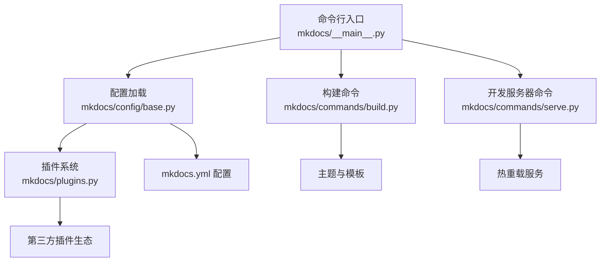
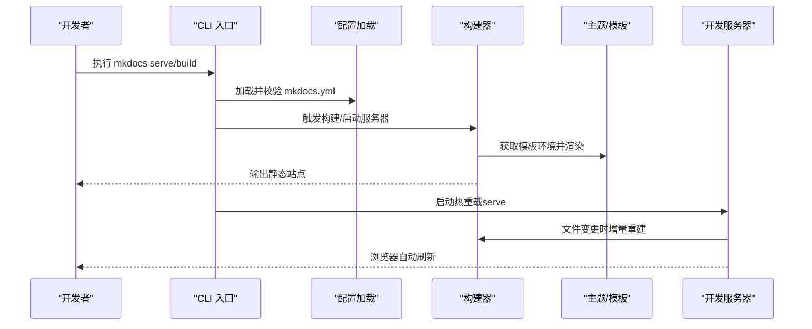
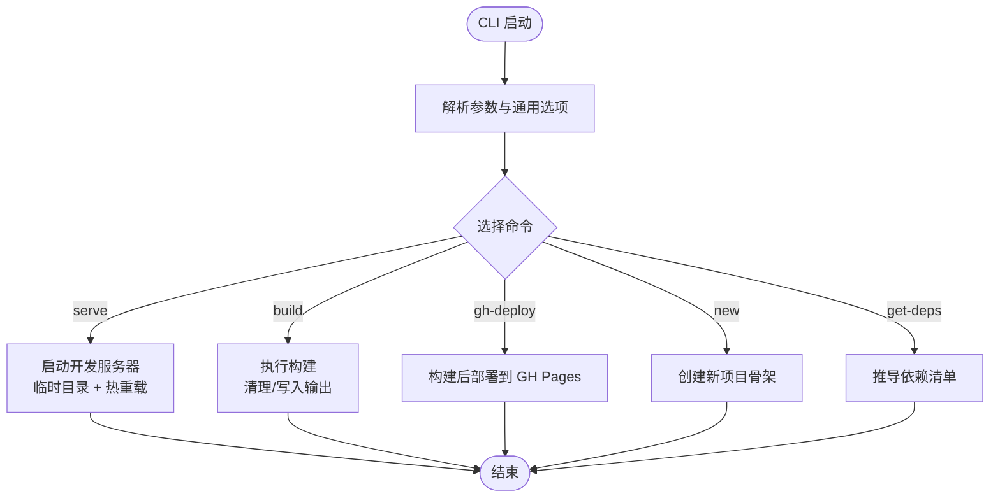
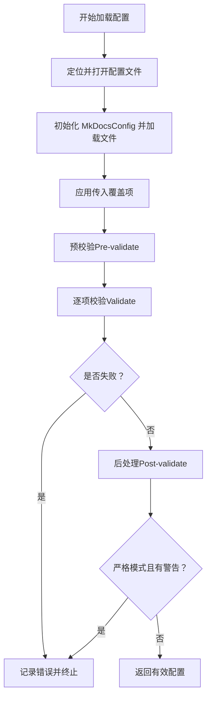
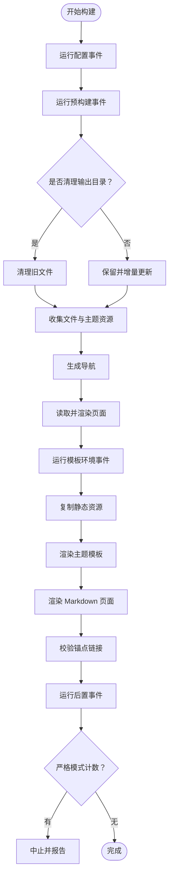
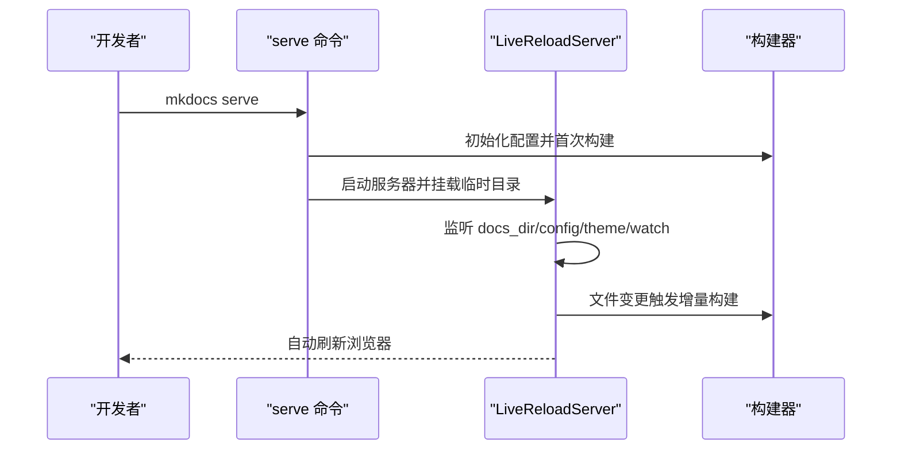
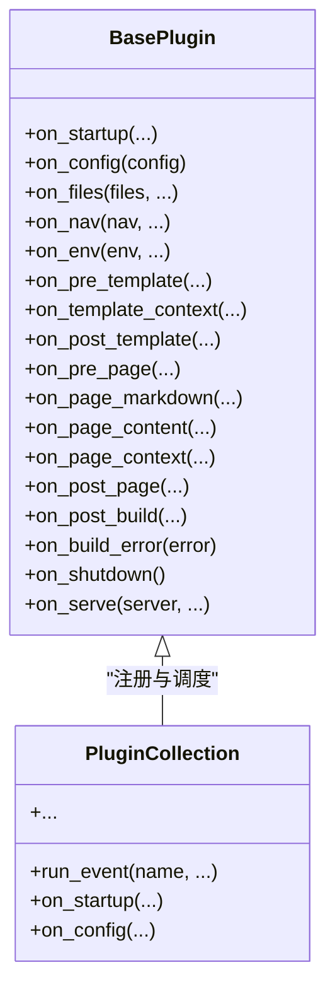
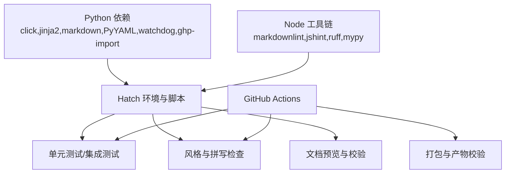

# 开发工具链集成

<cite>
**本文引用的文件**
- [README.md](file://README.md)
- [CONTRIBUTING.md](file://CONTRIBUTING.md)
- [mkdocs.yml](file://mkdocs.yml)
- [pyproject.toml](file://pyproject.toml)
- [.markdownlint.yaml](file://.markdownlint.yaml)
- [.editorconfig](file://.editorconfig)
- [.gitignore](file://.gitignore)
- [.github/workflows/ci.yml](file://.github/workflows/ci.yml)
- [docs/hooks.py](file://docs/hooks.py)
- [mkdocs/__main__.py](file://mkdocs/__main__.py)
- [mkdocs/config/base.py](file://mkdocs/config/base.py)
- [mkdocs/commands/build.py](file://mkdocs/commands/build.py)
- [mkdocs/commands/serve.py](file://mkdocs/commands/serve.py)
- [mkdocs/plugins.py](file://mkdocs/plugins.py)
- [requirements/requirements-style.txt](file://requirements/requirements-style.txt)
</cite>

## 目录
1. [简介](#简介)
2. [项目结构](#项目结构)
3. [核心组件](#核心组件)
4. [架构总览](#架构总览)
5. [详细组件分析](#详细组件分析)
6. [依赖关系分析](#依赖关系分析)
7. [性能考量](#性能考量)
8. [故障排查指南](#故障排查指南)
9. [结论](#结论)
10. [附录](#附录)

## 简介
本指南面向希望将 MkDocs 与各类开发工具链（IDE/编辑器、代码质量工具、包管理与构建、测试、调试与性能分析、监控）进行深度集成的团队与个人开发者。基于仓库中的实际配置与实现，我们将系统性地说明：
- 如何在 VS Code、WebStorm、Sublime Text 等环境中高效编写与预览文档
- 如何集成 ESLint、Prettier、SonarQube 等质量工具
- 如何与 Hatch、pip、Node/npm 生态协同工作
- 如何在本地与 CI 中运行测试、风格检查与类型检查
- 如何通过插件机制扩展构建流程，以及如何在团队中落地最佳实践

## 项目结构
该仓库采用“命令行工具 + 配置驱动 + 插件扩展”的组织方式：
- 命令入口：CLI 定义于命令行模块，负责解析参数、加载配置、触发构建或开发服务器
- 配置系统：以 YAML 驱动，支持主题、插件、导航、Markdown 扩展等
- 构建与服务：构建器负责页面渲染与静态输出；开发服务器结合热重载
- 插件系统：通过入口点注册，提供事件钩子贯穿构建生命周期
- 质量与自动化：通过 pyproject.toml 的脚本与 GitHub Actions 实现统一的检查与打包流程

图表来源
- [mkdocs/__main__.py](file://mkdocs/__main__.py#L240-L371)
- [mkdocs/config/base.py](file://mkdocs/config/base.py#L340-L393)
- [mkdocs/commands/build.py](file://mkdocs/commands/build.py#L249-L370)
- [mkdocs/commands/serve.py](file://mkdocs/commands/serve.py#L20-L111)
- [mkdocs/plugins.py](file://mkdocs/plugins.py#L40-L698)
- [mkdocs.yml](file://mkdocs.yml#L1-L80)

章节来源
- [README.md](file://README.md#L1-L80)
- [mkdocs.yml](file://mkdocs.yml#L1-L80)
- [pyproject.toml](file://pyproject.toml#L1-L240)

## 核心组件
- CLI 与命令分发：提供 serve/build/gh-deploy/new/get-deps 等命令，统一日志与警告处理
- 配置系统：支持 schema 校验、默认值注入、严格模式、多源合并
- 构建流水线：收集文件 → 生成导航 → 渲染页面 → 写出静态资源 → 运行后置事件
- 开发服务器：临时目录托管、热重载监听、错误页回退
- 插件系统：事件模型贯穿启动/配置/文件/导航/模板/页面/构建完成等阶段

章节来源
- [mkdocs/__main__.py](file://mkdocs/__main__.py#L240-L371)
- [mkdocs/config/base.py](file://mkdocs/config/base.py#L123-L393)
- [mkdocs/commands/build.py](file://mkdocs/commands/build.py#L249-L370)
- [mkdocs/commands/serve.py](file://mkdocs/commands/serve.py#L20-L111)
- [mkdocs/plugins.py](file://mkdocs/plugins.py#L493-L698)

## 架构总览
下图展示了从 CLI 到构建与服务的关键交互路径，以及插件事件在各阶段的触发点。

图表来源
- [mkdocs/__main__.py](file://mkdocs/__main__.py#L253-L326)
- [mkdocs/config/base.py](file://mkdocs/config/base.py#L340-L393)
- [mkdocs/commands/build.py](file://mkdocs/commands/build.py#L249-L370)
- [mkdocs/commands/serve.py](file://mkdocs/commands/serve.py#L20-L111)

## 详细组件分析

### CLI 与命令流
- serve/build/gh-deploy/new/get-deps 命令均通过 Click 注册，统一处理日志级别、颜色、严格模式等通用选项
- serve 命令会创建临时目录作为站点输出根，结合 LiveReloadServer 实现热重载
- get-deps 命令用于根据配置推导所需依赖，便于在 CI 或本地快速安装

图表来源
- [mkdocs/__main__.py](file://mkdocs/__main__.py#L240-L371)

章节来源
- [mkdocs/__main__.py](file://mkdocs/__main__.py#L240-L371)

### 配置加载与验证
- 支持从标准文件名或指定文件读取配置，自动定位并打开文件
- 通过 Schema 驱动的验证流程，先预校验、再逐项校验，最后后处理
- 严格模式下，任何警告都会导致构建中止

图表来源
- [mkdocs/config/base.py](file://mkdocs/config/base.py#L340-L393)

章节来源
- [mkdocs/config/base.py](file://mkdocs/config/base.py#L123-L393)

### 构建流水线
- 收集文件与主题资源，计算导航，按顺序渲染静态模板与 Markdown 页面
- 支持“脏构建”（仅重建变更文件），并进行链接锚点校验
- 构建完成后触发 post_build 事件，严格模式下统计并报告警告

图表来源
- [mkdocs/commands/build.py](file://mkdocs/commands/build.py#L249-L370)

章节来源
- [mkdocs/commands/build.py](file://mkdocs/commands/build.py#L249-L370)

### 开发服务器与热重载
- 使用临时目录承载站点输出，避免污染工作区
- 默认监听文档目录、配置文件与主题目录，支持额外 watch 列表
- 错误页回退：当 404/500 时优先返回本地生成的错误页

图表来源
- [mkdocs/commands/serve.py](file://mkdocs/commands/serve.py#L20-L111)

章节来源
- [mkdocs/commands/serve.py](file://mkdocs/commands/serve.py#L20-L111)

### 插件系统与事件模型
- 插件通过入口点注册，支持同一事件多个处理器，可设置优先级
- 事件覆盖构建生命周期：startup/config/files/nav/env/pre_template/template_context/post_template/pre_page/page_markdown/page_content/page_context/post_page/post_build/build_error/shutdown/serve
- 提供统一日志适配器，便于插件输出带前缀的日志

图表来源
- [mkdocs/plugins.py](file://mkdocs/plugins.py#L58-L698)

章节来源
- [mkdocs/plugins.py](file://mkdocs/plugins.py#L40-L698)

### 配置示例与扩展点
- 主题与国际化：启用内置主题、高亮、语言设置、分析等
- 导航与页面：导航结构、页面元数据、重定向、自动导航
- Markdown 扩展：目录、表格、代码高亮、调用块、链接增强等
- 插件：搜索、重定向、自动引用、字面导航、Python 文档生成等
- 监视：对源码目录与主题目录进行监听，加速迭代

章节来源
- [mkdocs.yml](file://mkdocs.yml#L1-L80)

### 钩子与动态内容
- 通过 hooks.py 在特定页面渲染前替换占位文本，实现动态列表生成
- 适用于根据翻译文件动态列出可用语言条目等场景

章节来源
- [docs/hooks.py](file://docs/hooks.py#L1-L37)

## 依赖关系分析
- 包管理与构建：使用 Hatch 作为环境与脚本编排中心，统一运行样式检查、类型检查、测试与打包
- Python 依赖：click、Jinja2、Markdown、PyYAML、watchdog、ghp-import 等
- Node 工具链：markdownlint、jshint、ruff（Python）、mypy（类型检查）
- CI：GitHub Actions 统一矩阵测试、跨平台 lint 与打包校验

图表来源
- [pyproject.toml](file://pyproject.toml#L104-L240)
- [.github/workflows/ci.yml](file://.github/workflows/ci.yml#L1-L105)

章节来源
- [pyproject.toml](file://pyproject.toml#L1-L240)
- [.github/workflows/ci.yml](file://.github/workflows/ci.yml#L1-L105)

## 性能考量
- 脏构建：在本地开发时使用“仅变更文件重建”，显著缩短迭代时间
- 模板与静态资源：主题模板与额外模板按优先级写出，避免重复渲染
- 锚点校验：在构建末尾统一校验，减少后续调试成本
- 热重载：仅监听必要目录，减少不必要的重建

章节来源
- [mkdocs/commands/build.py](file://mkdocs/commands/build.py#L249-L370)
- [mkdocs/commands/serve.py](file://mkdocs/commands/serve.py#L20-L111)

## 故障排查指南
- 配置错误与严格模式
  - 若配置校验失败，构建会直接中止；严格模式下任何警告也会导致中止
  - 建议在本地先运行“构建”命令，确认无误后再开启严格模式
- 日志与颜色
  - CLI 提供 -v/-q 控制日志级别，--color/--no-color 控制输出颜色
  - Windows 下自动初始化颜色支持
- 插件冲突与优先级
  - 多个插件处理同一事件时，可通过优先级控制执行顺序
  - 若出现“多个处理器无法共存”的提示，需调整插件组合
- 站点目录残留
  - “脏构建”可能导致过期文件残留，建议在正式构建前使用“清理”模式

章节来源
- [mkdocs/__main__.py](file://mkdocs/__main__.py#L163-L216)
- [mkdocs/config/base.py](file://mkdocs/config/base.py#L374-L391)
- [mkdocs/plugins.py](file://mkdocs/plugins.py#L509-L531)

## 结论
通过将 MkDocs 的 CLI、配置、构建与插件体系与现代开发工具链整合，可以实现：
- 高效的本地开发体验（热重载、增量构建）
- 可靠的质量保障（风格、拼写、类型、测试、CI）
- 易于扩展的文档生态（主题、插件、钩子）

建议团队在本地与 CI 中统一使用 Hatch 脚本，确保一致性；在 IDE 中启用 Markdown 与 YAML 校验规则，提升协作效率。

## 附录

### IDE 与编辑器集成要点
- VS Code
  - 推荐启用 Markdown 预览与大纲视图，使用 EditorConfig 与 MarkdownLint 规则保持一致
  - 在工作区设置中启用“实时预览”与“自动保存”，结合本地 serve 命令
- WebStorm/IntelliJ
  - 启用 Markdown 插件与 YAML 支持，利用 EditorConfig 与 MarkdownLint
  - 将 mkdocs.yml 作为外部工具或脚本任务，一键运行构建/预览
- Sublime Text
  - 安装 Markdown 相关插件，启用 EditorConfig 与语法高亮
  - 使用任务或构建系统调用本地 serve 命令

章节来源
- [.editorconfig](file://.editorconfig#L1-L17)
- [.markdownlint.yaml](file://.markdownlint.yaml#L1-L148)
- [CONTRIBUTING.md](file://CONTRIBUTING.md#L106-L121)

### 代码质量工具集成
- Python
  - Black、isort、Ruff：统一格式与风格检查，Hatch 脚本已配置
  - mypy：类型检查，Hatch 脚本已配置
- JavaScript/Node
  - markdownlint：Markdown 规范检查
  - jshint：JS 风格检查
- 拼写检查
  - codespell：统一拼写规范
- SonarQube
  - 可在 CI 中接入 SonarQube 分析，建议对 Python 与 JS 文件分别扫描
  - 与现有 Hatch 脚本配合，将报告上传至 SonarQube

章节来源
- [pyproject.toml](file://pyproject.toml#L167-L240)
- [.github/workflows/ci.yml](file://.github/workflows/ci.yml#L55-L85)

### 包管理器、构建与测试
- Hatch
  - 作为统一环境与脚本编排工具，支持多 Python 版本矩阵测试与类型检查
  - 常用脚本：style:check/style:fix、types:check、test:test、lint:check、docs:serve
- pip
  - 可直接安装依赖，但建议优先使用 Hatch 以保证一致性
- Node/npm
  - 用于 markdownlint、jshint 等前端质量工具

章节来源
- [CONTRIBUTING.md](file://CONTRIBUTING.md#L57-L121)
- [pyproject.toml](file://pyproject.toml#L104-L240)

### 调试、性能分析与监控
- 调试
  - 使用 -v/-q 控制日志级别，结合插件日志定位问题
- 性能分析
  - 本地 serve 时关注热重载触发频率，合理设置 watch 列表
- 监控
  - 通过 mkdocs.yml 的 analytics 字段接入站点分析（如 gtag）
  - CI 中使用 Codecov 上报覆盖率

章节来源
- [mkdocs.yml](file://mkdocs.yml#L9-L16)
- [.github/workflows/ci.yml](file://.github/workflows/ci.yml#L46-L54)

### 团队开发最佳实践
- 统一工具链：在团队内固定使用 Hatch，确保本地与 CI 行为一致
- 配置即文档：将 mkdocs.yml 作为单点配置，避免分散在 IDE 设置中
- 插件治理：明确插件职责边界，使用优先级控制事件顺序
- CI 强约束：严格模式下禁止任何警告，保证文档质量

章节来源
- [CONTRIBUTING.md](file://CONTRIBUTING.md#L135-L146)
- [mkdocs.yml](file://mkdocs.yml#L57-L80)