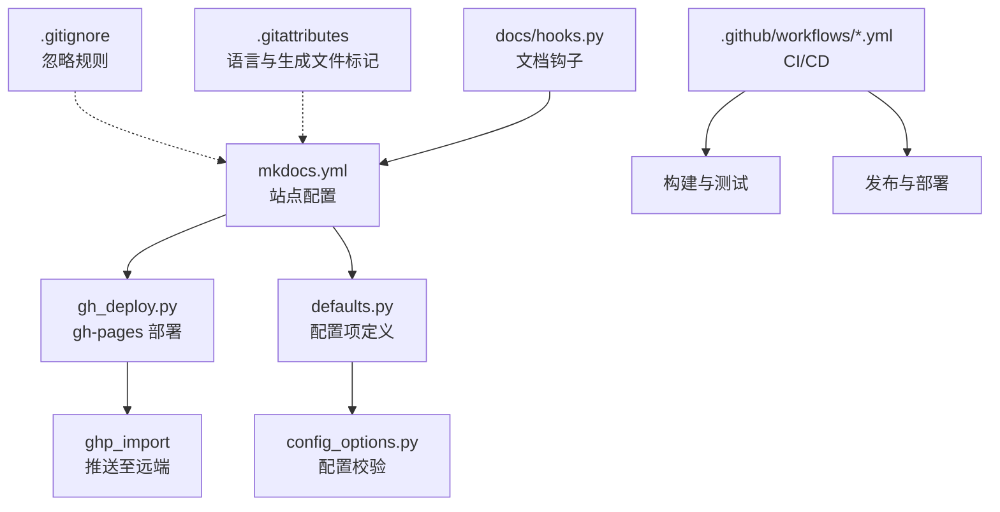
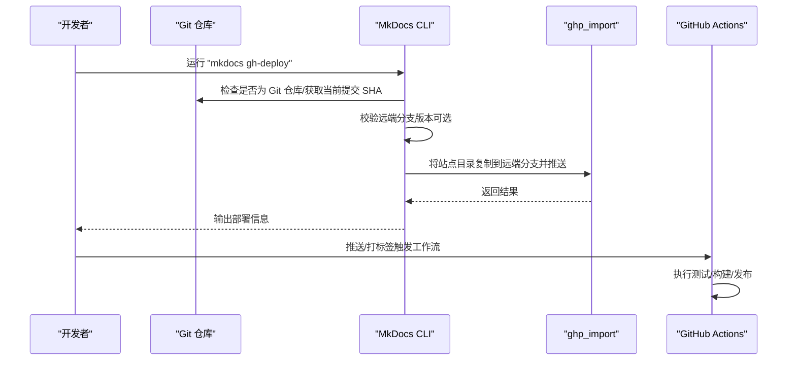
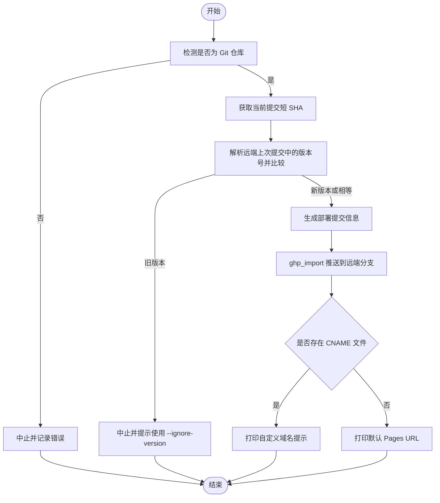
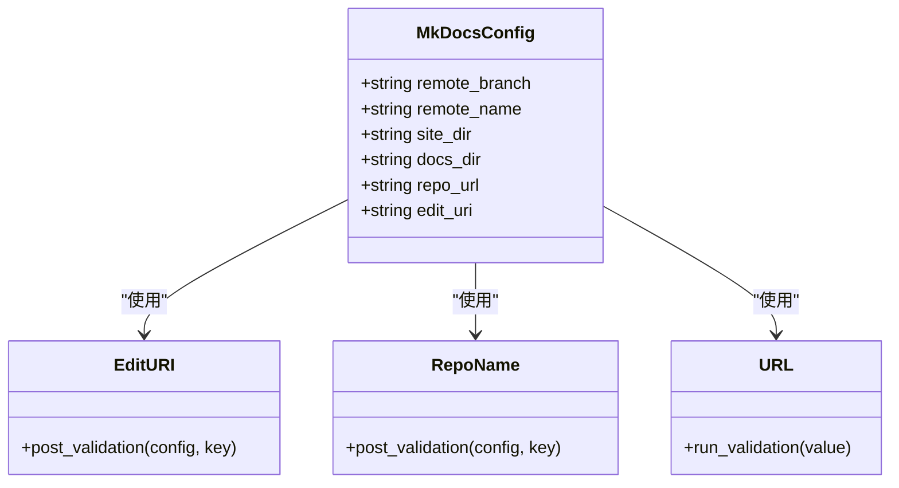
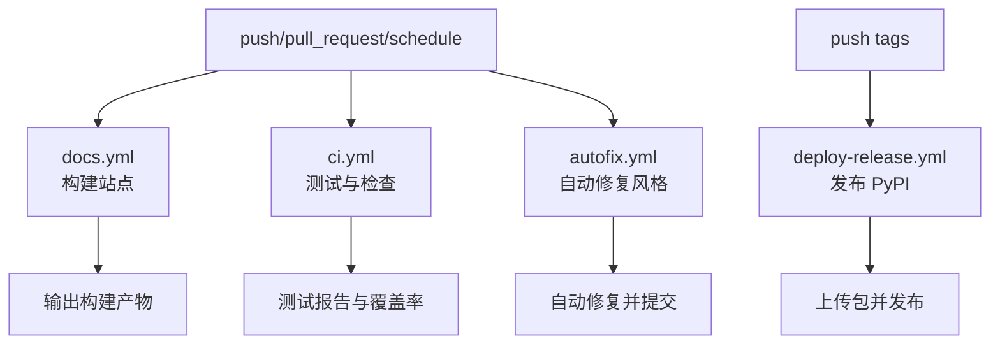
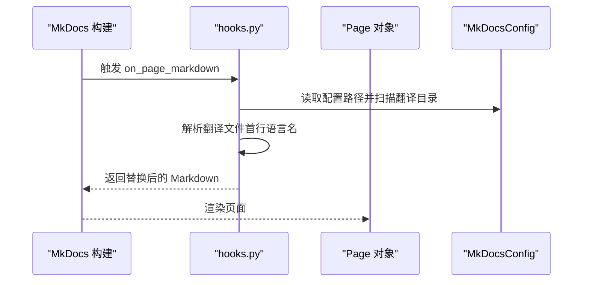
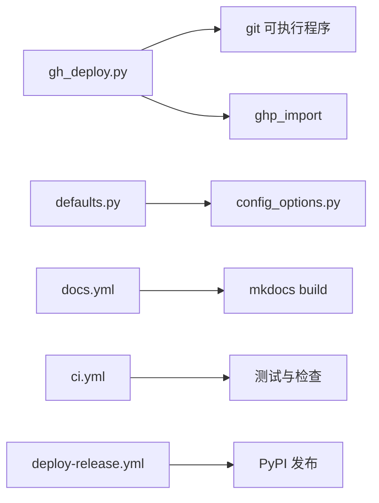

# 版本控制集成

<cite>
**本文引用的文件**
- [mkdocs.yml](file://mkdocs.yml)
- [gh_deploy.py](file://mkdocs/commands/gh_deploy.py)
- [defaults.py](file://mkdocs/config/defaults.py)
- [config_options.py](file://mkdocs/config/config_options.py)
- [docs.yml](file://.github/workflows/docs.yml)
- [ci.yml](file://.github/workflows/ci.yml)
- [deploy-release.yml](file://.github/workflows/deploy-release.yml)
- [autofix.yml](file://.github/workflows/autofix.yml)
- [.gitignore](file://.gitignore)
- [.gitattributes](file://.gitattributes)
- [hooks.py](file://docs/hooks.py)
- [deploying-your-docs.md](file://docs/user-guide/deploying-your-docs.md)
- [CONTRIBUTING.md](file://CONTRIBUTING.md)
</cite>

## 目录
1. [简介](#简介)
2. [项目结构](#项目结构)
3. [核心组件](#核心组件)
4. [架构总览](#架构总览)
5. [详细组件分析](#详细组件分析)
6. [依赖关系分析](#依赖关系分析)
7. [性能考量](#性能考量)
8. [故障排查指南](#故障排查指南)
9. [结论](#结论)
10. [附录](#附录)

## 简介
本指南面向希望将 MkDocs 与版本控制系统（尤其是 Git）深度集成的团队与个人。内容覆盖从本地开发到 CI/CD 自动化部署的完整流程，重点包括：
- 分支管理策略与提交信息格式建议
- 标签发布与版本校验机制
- 远程仓库配置与多平台（GitHub/GitLab/Bitbucket）集成要点
- 冲突处理与回滚策略
- Git Hooks 与自动化工作流
- 在版本控制中管理站点配置与内容更新的最佳实践

## 项目结构
围绕版本控制与文档构建的关键文件与目录如下：
- 配置与命令：mkdocs.yml、gh_deploy.py、defaults.py、config_options.py
- CI/CD 工作流：.github/workflows/*.yml
- 版本控制忽略与属性：.gitignore、.gitattributes
- 文档钩子：docs/hooks.py
- 用户指南：docs/user-guide/deploying-your-docs.md
- 贡献指南：CONTRIBUTING.md

**图示来源**
- [mkdocs.yml](file://mkdocs.yml#L1-L80)
- [gh_deploy.py](file://mkdocs/commands/gh_deploy.py#L100-L142)
- [defaults.py](file://mkdocs/config/defaults.py#L144-L148)
- [config_options.py](file://mkdocs/config/config_options.py#L529-L562)
- [docs.yml](file://.github/workflows/docs.yml#L1-L21)
- [ci.yml](file://.github/workflows/ci.yml#L1-L105)
- [.gitignore](file://.gitignore#L69-L71)
- [.gitattributes](file://.gitattributes#L1-L11)

**章节来源**
- [mkdocs.yml](file://mkdocs.yml#L1-L80)
- [gh_deploy.py](file://mkdocs/commands/gh_deploy.py#L100-L142)
- [defaults.py](file://mkdocs/config/defaults.py#L144-L148)
- [config_options.py](file://mkdocs/config/config_options.py#L529-L562)
- [docs.yml](file://.github/workflows/docs.yml#L1-L21)
- [ci.yml](file://.github/workflows/ci.yml#L1-L105)
- [.gitignore](file://.gitignore#L69-L71)
- [.gitattributes](file://.gitattributes#L1-L11)

## 核心组件
- 部署命令与版本校验：gh_deploy.py 提供 gh-deploy 命令的实现，包含 Git 仓库检测、当前提交 SHA 获取、远端 URL 解析、版本号比较与强制推送等能力。
- 配置模型：defaults.py 定义了 remote_branch、remote_name 等与部署相关的核心配置项；config_options.py 提供编辑 URI、URL 校验等配置选项。
- CI/CD 工作流：docs.yml 执行文档构建；ci.yml 执行跨平台测试与静态检查；deploy-release.yml 在打标签时发布到 PyPI；autofix.yml 自动修复风格问题。
- 文档钩子：hooks.py 展示了如何通过钩子在构建前动态替换内容，便于版本控制中维护可复用的模板片段。

**章节来源**
- [gh_deploy.py](file://mkdocs/commands/gh_deploy.py#L23-L142)
- [defaults.py](file://mkdocs/config/defaults.py#L144-L148)
- [config_options.py](file://mkdocs/config/config_options.py#L607-L627)
- [docs.yml](file://.github/workflows/docs.yml#L1-L21)
- [ci.yml](file://.github/workflows/ci.yml#L1-L105)
- [deploy-release.yml](file://.github/workflows/deploy-release.yml#L1-L23)
- [autofix.yml](file://.github/workflows/autofix.yml#L1-L24)
- [hooks.py](file://docs/hooks.py#L20-L37)

## 架构总览
下图展示了从本地开发到 CI/CD 自动化的整体流程，以及与 Git 的交互点。

**图示来源**
- [gh_deploy.py](file://mkdocs/commands/gh_deploy.py#L100-L142)
- [docs.yml](file://.github/workflows/docs.yml#L1-L21)
- [ci.yml](file://.github/workflows/ci.yml#L1-L105)
- [deploy-release.yml](file://.github/workflows/deploy-release.yml#L1-L23)

## 详细组件分析

### 组件 A：gh-deploy 命令与版本校验
- 功能要点
  - 仓库检测：确认当前目录为 Git 工作区。
  - 版本校验：解析远端分支最后一次提交中的版本号，与当前 MkDocs 版本比较，防止降级部署。
  - 远端解析：识别 GitHub/GitLab/Bitbucket 等平台的 URL，推断 Pages 地址。
  - 部署执行：调用 ghp_import 将站点目录推送到指定远端分支，并支持强制推送与历史保留控制。
  - CNAME 支持：若存在 CNAME 文件，输出用户自定义域名提示。

**图示来源**
- [gh_deploy.py](file://mkdocs/commands/gh_deploy.py#L23-L142)

**章节来源**
- [gh_deploy.py](file://mkdocs/commands/gh_deploy.py#L23-L142)

### 组件 B：配置模型与部署参数
- 关键配置项
  - remote_branch：默认 gh-pages，用于指定部署分支。
  - remote_name：默认 origin，用于指定远端名称。
- 编辑 URI 与 URL 校验
  - EditURI/RepoName/URL 等选项用于派生编辑链接与校验 URL 合法性，便于在不同平台（GitHub/GitLab/Bitbucket）上正确生成“编辑”链接。

**图示来源**
- [defaults.py](file://mkdocs/config/defaults.py#L144-L148)
- [config_options.py](file://mkdocs/config/config_options.py#L607-L627)
- [config_options.py](file://mkdocs/config/config_options.py#L492-L527)

**章节来源**
- [defaults.py](file://mkdocs/config/defaults.py#L144-L148)
- [config_options.py](file://mkdocs/config/config_options.py#L607-L627)
- [config_options.py](file://mkdocs/config/config_options.py#L492-L527)

### 组件 C：CI/CD 工作流与自动化
- 文档构建工作流：在推送/拉取请求/定时任务触发时，安装依赖并执行严格模式构建。
- 全量测试与静态检查：矩阵式运行多平台测试，上传覆盖率，执行代码风格、类型检查、Markdown 与 JS 校验。
- 发布工作流：在打标签时构建并发布到 PyPI。
- 自动修复：自动修复风格问题并在 PR 中尝试应用修复。

**图示来源**
- [docs.yml](file://.github/workflows/docs.yml#L1-L21)
- [ci.yml](file://.github/workflows/ci.yml#L1-L105)
- [deploy-release.yml](file://.github/workflows/deploy-release.yml#L1-L23)
- [autofix.yml](file://.github/workflows/autofix.yml#L1-L24)

**章节来源**
- [docs.yml](file://.github/workflows/docs.yml#L1-L21)
- [ci.yml](file://.github/workflows/ci.yml#L1-L105)
- [deploy-release.yml](file://.github/workflows/deploy-release.yml#L1-L23)
- [autofix.yml](file://.github/workflows/autofix.yml#L1-L24)

### 组件 D：文档钩子与内容管理
- 钩子示例：hooks.py 展示了在页面渲染前根据翻译文件动态生成列表内容的机制，便于在版本控制中维护可复用的模板片段。

**图示来源**
- [hooks.py](file://docs/hooks.py#L20-L37)

**章节来源**
- [hooks.py](file://docs/hooks.py#L20-L37)

## 依赖关系分析
- 部署命令依赖 Git 子进程与 ghp_import 库，通过解析远端 URL 推断 Pages 地址。
- 配置层提供编辑 URI 与 URL 校验，确保在不同平台生成正确的“编辑”链接。
- CI/CD 工作流与本地部署命令相互补充，前者保障质量，后者负责快速迭代。

**图示来源**
- [gh_deploy.py](file://mkdocs/commands/gh_deploy.py#L100-L142)
- [defaults.py](file://mkdocs/config/defaults.py#L144-L148)
- [config_options.py](file://mkdocs/config/config_options.py#L607-L627)
- [docs.yml](file://.github/workflows/docs.yml#L1-L21)
- [ci.yml](file://.github/workflows/ci.yml#L1-L105)
- [deploy-release.yml](file://.github/workflows/deploy-release.yml#L1-L23)

**章节来源**
- [gh_deploy.py](file://mkdocs/commands/gh_deploy.py#L100-L142)
- [defaults.py](file://mkdocs/config/defaults.py#L144-L148)
- [config_options.py](file://mkdocs/config/config_options.py#L607-L627)
- [docs.yml](file://.github/workflows/docs.yml#L1-L21)
- [ci.yml](file://.github/workflows/ci.yml#L1-L105)
- [deploy-release.yml](file://.github/workflows/deploy-release.yml#L1-L23)

## 性能考量
- 构建阶段：使用严格模式（--strict）可在早期发现配置与内容问题，减少无效部署。
- CI 矩阵：合理选择测试矩阵，避免不必要的重复作业，缩短反馈周期。
- 静态资源：利用 .gitattributes 标记第三方资源为 vendored，减少语言检测开销。
- 忽略规则：通过 .gitignore 避免将构建产物与临时文件纳入版本控制，降低仓库体积。

## 故障排查指南
- 无法找到 git
  - 现象：日志提示找不到 git。
  - 处理：确保 git 安装并加入 PATH，或在 CI 环境中显式安装。
- 非 Git 仓库
  - 现象：提示当前目录不是 Git 仓库。
  - 处理：初始化仓库或切换到正确的仓库根目录。
- 版本降级阻止
  - 现象：远端上次部署使用更高版本，阻止使用旧版本部署。
  - 处理：升级本地 MkDocs 或使用忽略版本参数进行部署。
- 部署失败
  - 现象：ghp_import 抛出异常。
  - 处理：检查远端权限、网络连通性与推送目标分支状态。
- CI 失败
  - 现象：测试或静态检查失败。
  - 处理：根据工作流输出修复问题，必要时启用自动修复工作流。

**章节来源**
- [gh_deploy.py](file://mkdocs/commands/gh_deploy.py#L30-L32)
- [gh_deploy.py](file://mkdocs/commands/gh_deploy.py#L108-L110)
- [gh_deploy.py](file://mkdocs/commands/gh_deploy.py#L91-L97)
- [gh_deploy.py](file://mkdocs/commands/gh_deploy.py#L140-L142)
- [ci.yml](file://.github/workflows/ci.yml#L46-L53)
- [autofix.yml](file://.github/workflows/autofix.yml#L17-L23)

## 结论
通过将 MkDocs 与 Git 深度结合，并配合完善的 CI/CD 工作流与版本校验机制，可以显著提升文档构建的稳定性与效率。建议团队遵循统一的分支策略、提交信息规范与标签发布流程，以确保版本控制与部署过程的可追溯性与一致性。

## 附录

### 分支管理策略与提交信息格式
- 分支策略
  - 主分支：仅合并已测试通过的变更，保持稳定。
  - 文档专用分支：针对重大文档改版或长周期迭代使用独立分支，完成后合并主分支。
- 提交信息格式
  - 类型：feat/fix/docs/style/refactor/test/chore
  - 示例：feat(docs): 添加部署指南章节；fix(ci): 修复 macOS 测试矩阵

**章节来源**
- [CONTRIBUTING.md](file://CONTRIBUTING.md#L144-L147)

### 标签发布流程
- 打标签
  - 使用语义化版本标签（如 v1.2.3），触发 PyPI 发布工作流。
- 发布内容
  - 包含构建产物与元数据，确保与 mkdocs.yml 中的站点信息一致。

**章节来源**
- [deploy-release.yml](file://.github/workflows/deploy-release.yml#L1-L23)

### 远程仓库配置与多平台集成
- GitHub Pages
  - 默认部署到 gh-pages 分支；支持自定义域名（CNAME 文件）。
- GitLab Pages
  - 使用相同流程，注意将远端 URL 与 Pages 分支配置为 GitLab 对应值。
- Bitbucket
  - 使用相同流程，注意编辑 URI 与 Pages 分支配置。

**章节来源**
- [deploying-your-docs.md](file://docs/user-guide/deploying-your-docs.md#L7-L104)
- [config_options.py](file://mkdocs/config/config_options.py#L607-L627)

### 冲突处理与回滚机制
- 冲突处理
  - 在合并前先同步上游变更，优先使用合并提交而非变基，避免强制推送导致审查历史不可追踪。
- 回滚
  - 利用 Git 标签与提交 SHA 定位历史版本，必要时回退到上一稳定标签。

**章节来源**
- [CONTRIBUTING.md](file://CONTRIBUTING.md#L144-L147)

### Git Hooks 与自动化工作流
- 钩子
  - 使用 hooks.py 在构建前动态替换内容，便于版本控制中维护可复用片段。
- 自动化
  - 通过 CI/CD 工作流实现测试、构建、发布与自动修复，减少人工干预。

**章节来源**
- [hooks.py](file://docs/hooks.py#L20-L37)
- [autofix.yml](file://.github/workflows/autofix.yml#L1-L24)

### 在版本控制中管理站点配置与内容更新
- 配置文件
  - 将 mkdocs.yml 与主题、插件配置纳入版本控制，确保团队一致性。
- 内容更新
  - 使用 .gitignore 忽略构建产物，使用 .gitattributes 标记第三方资源，避免误检。
- 文档钩子
  - 通过钩子在构建前注入动态内容，减少重复维护成本。

**章节来源**
- [.gitignore](file://.gitignore#L69-L71)
- [.gitattributes](file://.gitattributes#L1-L11)
- [hooks.py](file://docs/hooks.py#L20-L37)