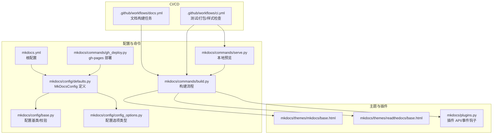
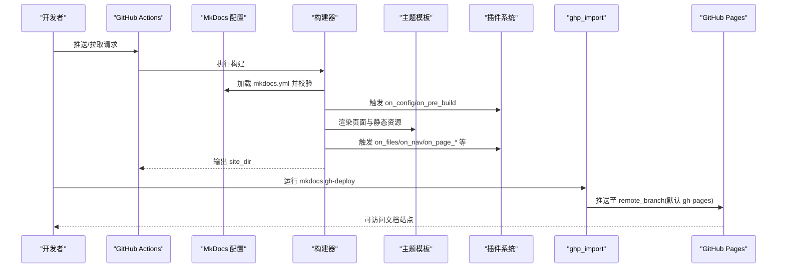
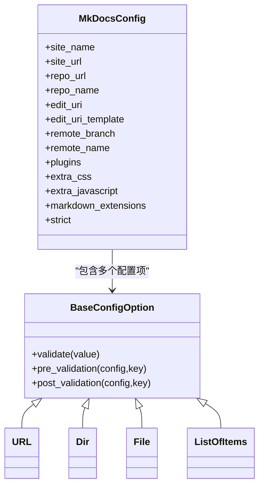
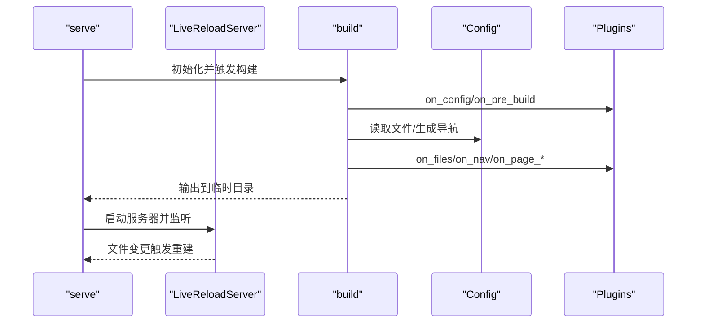
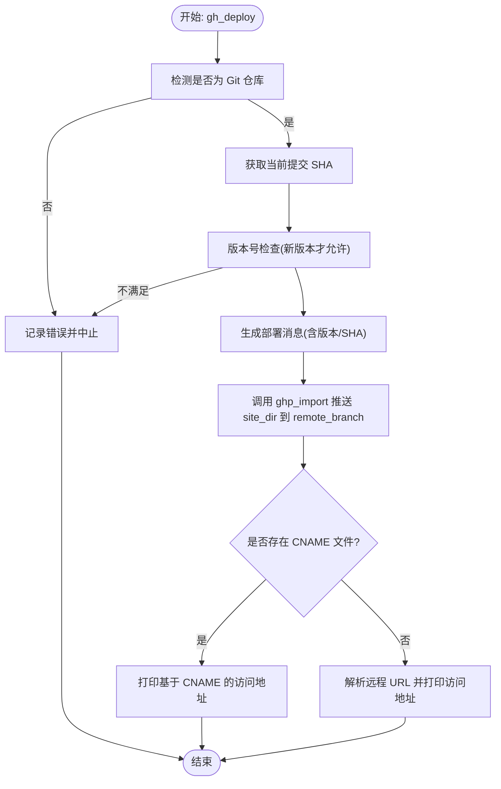
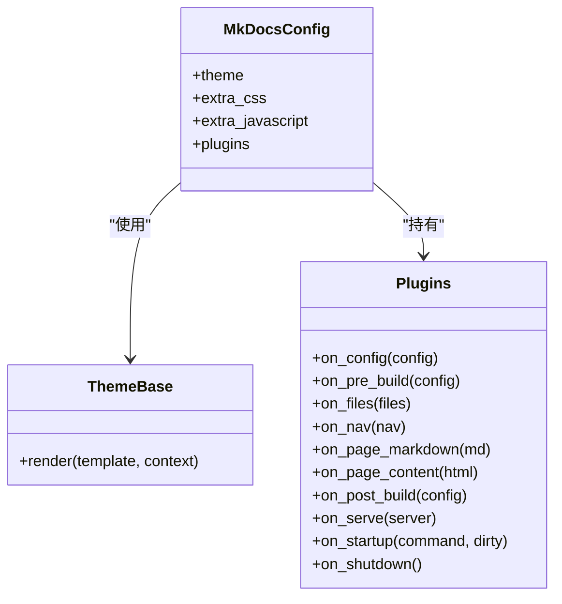
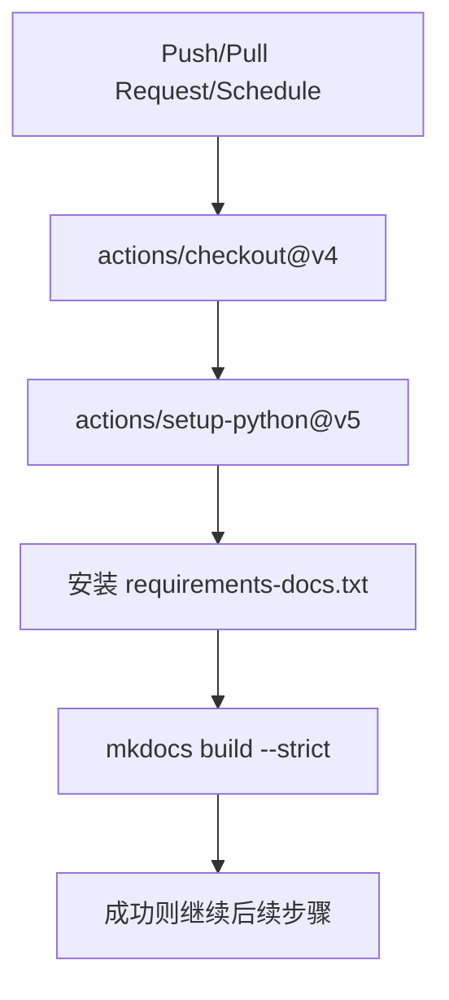
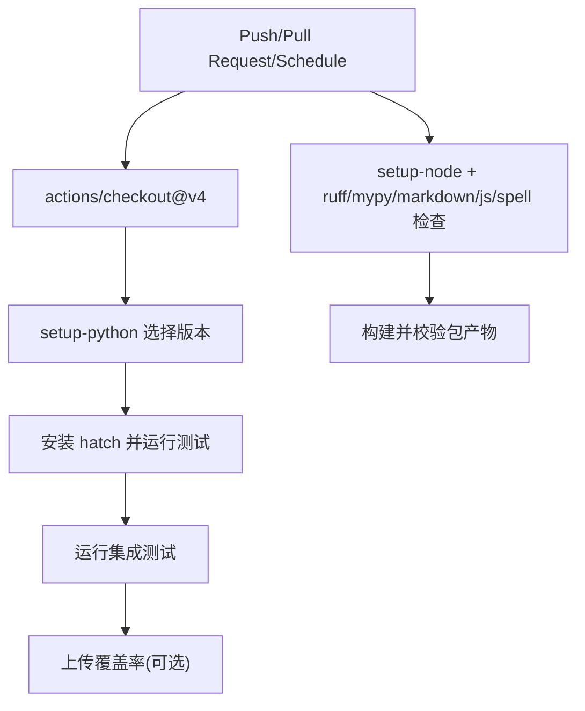
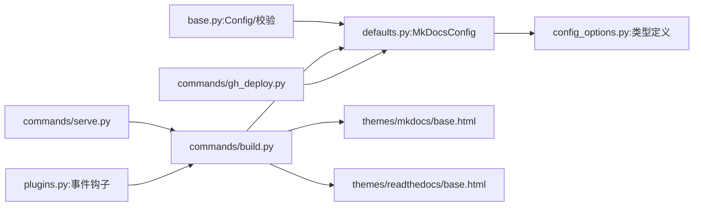

# 集成模式

<cite>
**本文引用的文件**
- [.github/workflows/docs.yml](file://.github/workflows/docs.yml)
- [.github/workflows/ci.yml](file://.github/workflows/ci.yml)
- [mkdocs/commands/gh_deploy.py](file://mkdocs/commands/gh_deploy.py)
- [mkdocs/config/base.py](file://mkdocs/config/base.py)
- [mkdocs/config/config_options.py](file://mkdocs/config/config_options.py)
- [mkdocs/config/defaults.py](file://mkdocs/config/defaults.py)
- [mkdocs/commands/build.py](file://mkdocs/commands/build.py)
- [mkdocs/commands/serve.py](file://mkdocs/commands/serve.py)
- [mkdocs/plugins.py](file://mkdocs/plugins.py)
- [mkdocs/themes/mkdocs/base.html](file://mkdocs/themes/mkdocs/base.html)
- [mkdocs/themes/readthedocs/base.html](file://mkdocs/themes/readthedocs/base.html)
- [mkdocs.yml](file://mkdocs.yml)
- [docs/user-guide/configuration.md](file://docs/user-guide/configuration.md)
- [docs/user-guide/deploying-your-docs.md](file://docs/user-guide/deploying-your-docs.md)
- [README.md](file://README.md)
</cite>

## 目录
1. [简介](#简介)
2. [项目结构](#项目结构)
3. [核心组件](#核心组件)
4. [架构总览](#架构总览)
5. [详细组件分析](#详细组件分析)
6. [依赖关系分析](#依赖关系分析)
7. [性能考量](#性能考量)
8. [故障排查指南](#故障排查指南)
9. [结论](#结论)
10. [附录](#附录)

## 简介
本指南聚焦 MkDocs 在工程化与自动化方面的“集成模式”，围绕以下目标展开：
- 与 CI/CD 工具（如 GitHub Actions）的集成方法
- 与版本控制与代码托管平台（GitHub Pages）的协作模式
- 与内容管理与 API 的集成方案（通过配置项与插件）
- 微服务架构下的文档管理策略（多仓库、多站点、统一入口）
- 与其他开发工具链协同（构建、测试、发布）

本指南以仓库内现有实现为依据，结合官方文档与主题模板，给出可操作的实践建议与可视化说明。

## 项目结构
从集成视角看，MkDocs 的关键集成点包括：
- 配置系统：集中定义站点信息、导航、编辑链接、远程分支等
- 构建与预览：本地开发与严格构建流程
- 部署：针对 GitHub Pages 的一键部署命令
- 主题与插件：通过模板上下文与事件钩子扩展能力
- CI/CD：在 GitHub Actions 中执行构建、测试与文档部署

图表来源
- [.github/workflows/docs.yml](file://.github/workflows/docs.yml#L1-L21)
- [.github/workflows/ci.yml](file://.github/workflows/ci.yml#L1-L105)
- [mkdocs/commands/build.py](file://mkdocs/commands/build.py#L249-L370)
- [mkdocs/commands/serve.py](file://mkdocs/commands/serve.py#L20-L111)
- [mkdocs/commands/gh_deploy.py](file://mkdocs/commands/gh_deploy.py#L100-L170)
- [mkdocs/config/defaults.py](file://mkdocs/config/defaults.py#L38-L219)
- [mkdocs/config/base.py](file://mkdocs/config/base.py#L123-L393)
- [mkdocs/config/config_options.py](file://mkdocs/config/config_options.py#L1-L200)
- [mkdocs/themes/mkdocs/base.html](file://mkdocs/themes/mkdocs/base.html#L1-L200)
- [mkdocs/themes/readthedocs/base.html](file://mkdocs/themes/readthedocs/base.html#L1-L200)
- [mkdocs/plugins.py](file://mkdocs/plugins.py#L40-L200)

章节来源
- [README.md](file://README.md#L1-L80)
- [mkdocs.yml](file://mkdocs.yml#L1-L80)

## 核心组件
- 配置系统
  - MkDocsConfig：集中定义站点名称、URL、作者、导航、编辑链接、远程分支、插件、验证规则等
  - 配置选项类型：URL、Dir、File、List、Choice、Optional 等，确保配置合法与一致
  - 加载与校验：支持从 YAML 文件加载、合并 CLI 覆盖项，并在严格模式下中断构建
- 构建与预览
  - build：读取文件、生成导航、渲染页面、写入静态资源与模板
  - serve：临时目录构建、LiveReload、监听变更、错误页回退
- 部署
  - gh_deploy：基于 ghp_import 将站点推送到指定远程分支（默认 gh-pages），支持 CNAME、版本号检查与消息格式化
- 主题与插件
  - 主题模板：通过 Jinja2 环境渲染，注入站点元数据、导航、额外 CSS/JS
  - 插件 API：提供 on_config、on_pre_build、on_files、on_nav、on_page_*、on_post_build 等事件钩子
- CI/CD
  - 文档构建：安装依赖后执行 mkdocs build --strict
  - 测试与打包：矩阵测试、覆盖率上传、样式检查、Markdown/拼写检查

章节来源
- [mkdocs/config/defaults.py](file://mkdocs/config/defaults.py#L38-L219)
- [mkdocs/config/config_options.py](file://mkdocs/config/config_options.py#L1-L200)
- [mkdocs/config/base.py](file://mkdocs/config/base.py#L123-L393)
- [mkdocs/commands/build.py](file://mkdocs/commands/build.py#L249-L370)
- [mkdocs/commands/serve.py](file://mkdocs/commands/serve.py#L20-L111)
- [mkdocs/commands/gh_deploy.py](file://mkdocs/commands/gh_deploy.py#L100-L170)
- [mkdocs/plugins.py](file://mkdocs/plugins.py#L40-L200)
- [.github/workflows/docs.yml](file://.github/workflows/docs.yml#L1-L21)
- [.github/workflows/ci.yml](file://.github/workflows/ci.yml#L1-L105)

## 架构总览
下图展示了从配置到构建、部署与 CI/CD 的端到端集成路径：

图表来源
- [.github/workflows/docs.yml](file://.github/workflows/docs.yml#L1-L21)
- [mkdocs/commands/gh_deploy.py](file://mkdocs/commands/gh_deploy.py#L100-L170)
- [mkdocs/commands/build.py](file://mkdocs/commands/build.py#L249-L370)
- [mkdocs/plugins.py](file://mkdocs/plugins.py#L156-L200)
- [mkdocs/themes/mkdocs/base.html](file://mkdocs/themes/mkdocs/base.html#L1-L200)

## 详细组件分析

### 组件一：配置系统与严格模式
- 设计要点
  - 使用类 Schema 定义配置项，内置类型校验与默认值
  - 支持严格模式：当存在警告时中断构建，便于在 CI 中强制质量门槛
  - 提供编辑链接与远程分支等部署相关配置
- 关键配置项
  - site_url、site_name、site_author、copyright
  - repo_url、repo_name、edit_uri/edit_uri_template
  - remote_branch、remote_name（用于 gh-deploy）
  - plugins、extra_css、extra_javascript、markdown_extensions
- 复杂度与性能
  - 配置加载与校验为 O(n)（n 为配置项数量），开销极低
  - 严格模式仅增加日志计数器与异常抛出成本

图表来源
- [mkdocs/config/base.py](file://mkdocs/config/base.py#L37-L122)
- [mkdocs/config/config_options.py](file://mkdocs/config/config_options.py#L492-L527)
- [mkdocs/config/config_options.py](file://mkdocs/config/config_options.py#L714-L748)
- [mkdocs/config/config_options.py](file://mkdocs/config/config_options.py#L750-L772)
- [mkdocs/config/defaults.py](file://mkdocs/config/defaults.py#L38-L219)

章节来源
- [mkdocs/config/base.py](file://mkdocs/config/base.py#L123-L393)
- [mkdocs/config/config_options.py](file://mkdocs/config/config_options.py#L1-L200)
- [mkdocs/config/defaults.py](file://mkdocs/config/defaults.py#L38-L219)
- [mkdocs.yml](file://mkdocs.yml#L1-L80)
- [docs/user-guide/configuration.md](file://docs/user-guide/configuration.md#L1-L200)

### 组件二：构建与预览流水线
- 构建流程
  - 触发 on_config/on_pre_build → 收集文件/导航 → 渲染页面 → 写入静态资源 → 触发 on_post_build
  - 严格模式下统计警告并可能中断
- 本地预览
  - 临时目录构建，LiveReload 监听 docs_dir、配置文件与主题目录
  - 错误页回退：404/500 优先返回本地错误页

图表来源
- [mkdocs/commands/serve.py](file://mkdocs/commands/serve.py#L20-L111)
- [mkdocs/commands/build.py](file://mkdocs/commands/build.py#L249-L370)
- [mkdocs/plugins.py](file://mkdocs/plugins.py#L156-L200)

章节来源
- [mkdocs/commands/serve.py](file://mkdocs/commands/serve.py#L20-L111)
- [mkdocs/commands/build.py](file://mkdocs/commands/build.py#L249-L370)

### 组件三：GitHub Pages 部署（gh-deploy）
- 功能特性
  - 检测当前目录是否为 Git 仓库
  - 获取当前提交 SHA，生成部署消息
  - 版本号检查：禁止降级部署
  - 自动识别 CNAME 与远程 URL，输出访问地址提示
- 关键步骤
  - 读取 remote_name/remote_branch
  - 调用 ghp_import 推送 site_dir 到指定分支
  - 若存在 CNAME 文件，按其域名输出访问提示

图表来源
- [mkdocs/commands/gh_deploy.py](file://mkdocs/commands/gh_deploy.py#L23-L170)

章节来源
- [mkdocs/commands/gh_deploy.py](file://mkdocs/commands/gh_deploy.py#L100-L170)
- [docs/user-guide/deploying-your-docs.md](file://docs/user-guide/deploying-your-docs.md#L1-L200)

### 组件四：主题与插件扩展
- 主题模板
  - 注入站点元数据、导航、额外 CSS/JS、高亮脚本、分析脚本
  - 支持用户颜色模式切换与搜索按钮
- 插件 API
  - 提供 on_config、on_pre_build、on_files、on_nav、on_page_*、on_post_build、on_serve、on_startup/on_shutdown 等事件
  - 插件可修改配置、文件集合、导航、页面内容与上下文

图表来源
- [mkdocs/themes/mkdocs/base.html](file://mkdocs/themes/mkdocs/base.html#L1-L200)
- [mkdocs/themes/readthedocs/base.html](file://mkdocs/themes/readthedocs/base.html#L1-L200)
- [mkdocs/plugins.py](file://mkdocs/plugins.py#L58-L200)
- [mkdocs/commands/build.py](file://mkdocs/commands/build.py#L29-L88)

章节来源
- [mkdocs/themes/mkdocs/base.html](file://mkdocs/themes/mkdocs/base.html#L1-L200)
- [mkdocs/themes/readthedocs/base.html](file://mkdocs/themes/readthedocs/base.html#L1-L200)
- [mkdocs/plugins.py](file://mkdocs/plugins.py#L40-L200)

### 组件五：CI/CD 集成（GitHub Actions）
- 文档构建任务
  - 安装 Python 与依赖，执行 mkdocs build --strict
- 全量 CI
  - 多 Python 版本/平台矩阵测试
  - 代码风格、类型检查、Markdown/JS/拼写检查
  - 构建包并校验产物完整性
  - 上传覆盖率结果

图表来源
- [.github/workflows/docs.yml](file://.github/workflows/docs.yml#L1-L21)

图表来源
- [.github/workflows/ci.yml](file://.github/workflows/ci.yml#L1-L105)

章节来源
- [.github/workflows/docs.yml](file://.github/workflows/docs.yml#L1-L21)
- [.github/workflows/ci.yml](file://.github/workflows/ci.yml#L1-L105)

## 依赖关系分析
- 配置层
  - defaults.py 基于 config_options.py 定义的类型，组合为 MkDocsConfig
  - base.py 提供通用配置基类与校验框架
- 命令层
  - build.py 依赖结构模块（文件/页面/导航）与模板上下文
  - serve.py 依赖 build 与 LiveReload
  - gh_deploy.py 依赖 ghp_import 与 Git 配置
- 主题与插件
  - 主题模板依赖 Jinja2 环境与配置上下文
  - 插件系统通过事件钩子贯穿构建生命周期

图表来源
- [mkdocs/config/defaults.py](file://mkdocs/config/defaults.py#L38-L219)
- [mkdocs/config/config_options.py](file://mkdocs/config/config_options.py#L1-L200)
- [mkdocs/config/base.py](file://mkdocs/config/base.py#L123-L393)
- [mkdocs/commands/build.py](file://mkdocs/commands/build.py#L249-L370)
- [mkdocs/commands/serve.py](file://mkdocs/commands/serve.py#L20-L111)
- [mkdocs/commands/gh_deploy.py](file://mkdocs/commands/gh_deploy.py#L100-L170)
- [mkdocs/plugins.py](file://mkdocs/plugins.py#L40-L200)
- [mkdocs/themes/mkdocs/base.html](file://mkdocs/themes/mkdocs/base.html#L1-L200)
- [mkdocs/themes/readthedocs/base.html](file://mkdocs/themes/readthedocs/base.html#L1-L200)

章节来源
- [mkdocs/config/defaults.py](file://mkdocs/config/defaults.py#L38-L219)
- [mkdocs/commands/build.py](file://mkdocs/commands/build.py#L249-L370)
- [mkdocs/commands/gh_deploy.py](file://mkdocs/commands/gh_deploy.py#L100-L170)

## 性能考量
- 构建阶段
  - 页面渲染与模板写入为 I/O 密集；可通过减少不必要的插件与静态资源优化
  - 严格模式仅引入日志计数器，对性能影响可忽略
- 预览阶段
  - LiveReload 监听文件变更，增量构建；合理设置 watch 列表可降低热更新开销
- 部署阶段
  - ghp_import 一次性推送，耗时与站点规模近似线性；建议保持 site_dir 清晰、避免冗余文件

## 故障排查指南
- 配置错误
  - 现象：构建失败或警告过多被严格模式中断
  - 排查：查看配置项类型与默认值，确认 site_url、repo_url、edit_uri 等是否正确
- 部署失败
  - 现象：gh-deploy 报错或版本降级被拒绝
  - 排查：确认当前目录为 Git 仓库、remote 配置、CNAME 文件与远程 URL；必要时使用 --ignore-version（不推荐）
- 预览异常
  - 现象：本地无法访问或链接失效
  - 排查：检查 site_url 与 dev_addr；若使用 file://，需禁用 search 或改用兼容方案

章节来源
- [mkdocs/commands/gh_deploy.py](file://mkdocs/commands/gh_deploy.py#L100-L170)
- [mkdocs/commands/build.py](file://mkdocs/commands/build.py#L249-L370)
- [docs/user-guide/deploying-your-docs.md](file://docs/user-guide/deploying-your-docs.md#L1-L200)

## 结论
- MkDocs 的集成模式以“配置即契约”为核心：通过严格的配置校验与清晰的命令边界，使 CI/CD、主题与插件生态协同高效
- 在 GitHub Pages 场景下，gh-deploy 与 CNAME 支持完善，配合 CI 的文档构建任务即可实现自动化发布
- 对于微服务与多仓库场景，建议采用统一的 CI 模板与共享的主题/插件策略，结合 site_url 与导航配置实现多站点聚合

## 附录

### 实战清单（按类别）
- CI/CD
  - 在 PR 与主分支上执行文档构建任务，确保 --strict
  - 在全量 CI 中加入多版本矩阵、样式与类型检查
- 版本控制与托管
  - 使用 gh-deploy 推送至 gh-pages 分支；如需自定义域，添加 CNAME 并复制到 docs_dir
  - 通过 repo_url 与 edit_uri/edit_uri_template 提供“在源码中编辑”的体验
- 内容管理与 API
  - 使用 plugins 扩展：如 redirects、autorefs、mkdocstrings 等
  - 通过 extra_css/extra_javascript 注入外部资源
- 微服务架构
  - 多仓库：每个服务独立构建与部署，统一入口由 Read the Docs 或自建网关聚合
  - 多站点：通过 site_url 与导航配置形成站点地图
- 工具链协同
  - 与 Markdown/拼写检查、代码风格工具联动，统一在 CI 中执行

章节来源
- [.github/workflows/docs.yml](file://.github/workflows/docs.yml#L1-L21)
- [.github/workflows/ci.yml](file://.github/workflows/ci.yml#L1-L105)
- [mkdocs.yml](file://mkdocs.yml#L1-L80)
- [docs/user-guide/configuration.md](file://docs/user-guide/configuration.md#L1-L200)
- [docs/user-guide/deploying-your-docs.md](file://docs/user-guide/deploying-your-docs.md#L1-L200)