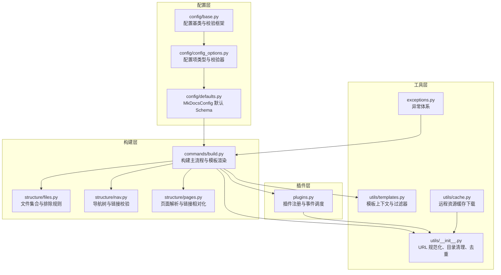
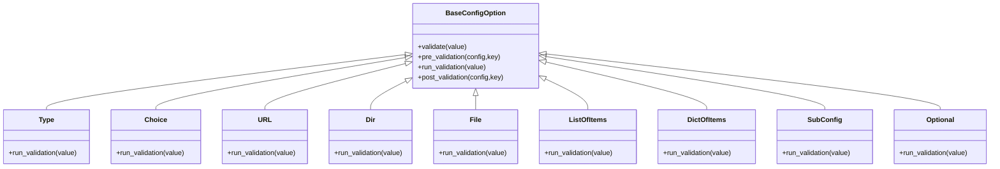
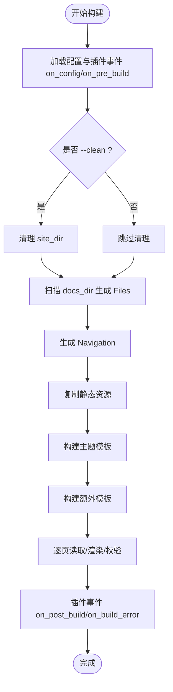
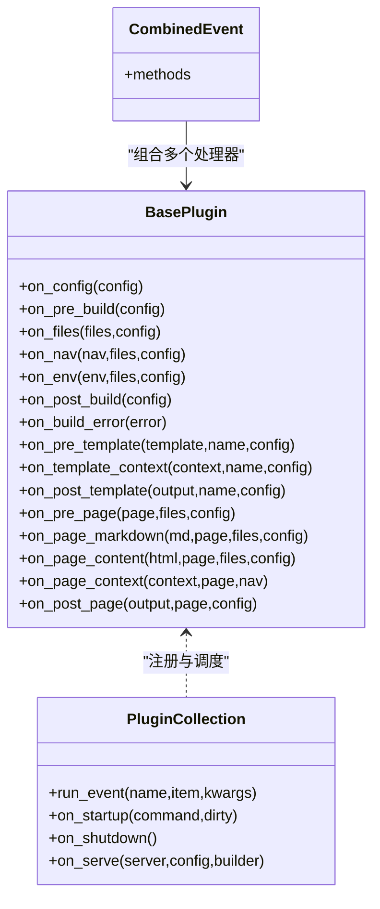
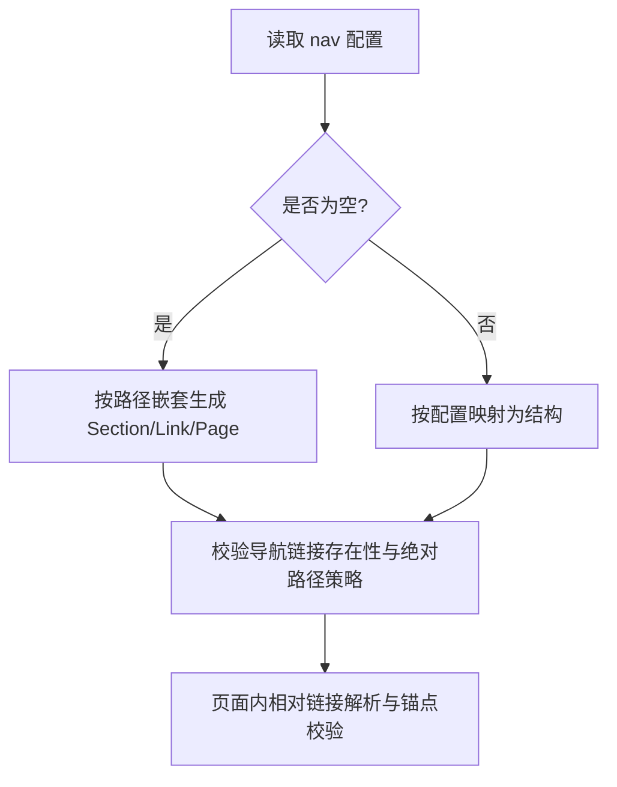
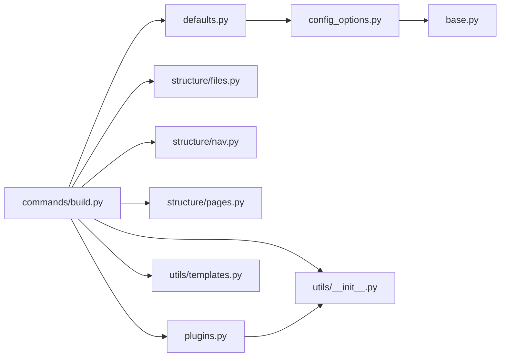

# 高级功能

<cite>
**本文引用的文件**
- [mkdocs\config\config_options.py](file://mkdocs/config/config_options.py)
- [mkdocs\config\defaults.py](file://mkdocs/config/defaults.py)
- [mkdocs\config\base.py](file://mkdocs/config/base.py)
- [mkdocs\commands\build.py](file://mkdocs/commands/build.py)
- [mkdocs\plugins.py](file://mkdocs/plugins.py)
- [mkdocs\utils\cache.py](file://mkdocs/utils/cache.py)
- [mkdocs\utils\__init__.py](file://mkdocs/utils/__init__.py)
- [mkdocs\structure\files.py](file://mkdocs/structure/files.py)
- [mkdocs\structure\nav.py](file://mkdocs/structure/nav.py)
- [mkdocs\structure\pages.py](file://mkdocs/structure/pages.py)
- [mkdocs\utils\templates.py](file://mkdocs/utils/templates.py)
- [mkdocs\exceptions.py](file://mkdocs/exceptions.py)
- [mkdocs\tests\integration\complicated_config\mkdocs.yml](file://mkdocs/tests/integration/complicated_config/mkdocs.yml)
- [mkdocs\tests\integration\minimal\mkdocs.yml](file://mkdocs/tests/integration/minimal/mkdocs.yml)
- [mkdocs\tests\integration\projects.yaml](file://mkdocs/tests/integration/projects.yaml)
</cite>

## 目录
1. [简介](#简介)
2. [项目结构](#项目结构)
3. [核心组件](#核心组件)
4. [架构总览](#架构总览)
5. [详细组件分析](#详细组件分析)
6. [依赖关系分析](#依赖关系分析)
7. [性能考量](#性能考量)
8. [故障排查指南](#故障排查指南)
9. [结论](#结论)
10. [附录](#附录)

## 简介
本篇“高级功能”文档聚焦 MkDocs 的高级配置与复杂场景实践，覆盖以下主题：
- 高级配置项与校验机制（类型、集合、子配置、路径与 URL 校验）
- 构建流程与并发处理策略（增量构建、静态资源复制、模板渲染）
- 插件系统与事件钩子（事件优先级、组合事件、插件日志）
- 大型项目与复杂文档结构（导航生成、页面链接验证、排除/草稿规则）
- 安全与访问控制（编辑链接、绝对链接策略）
- 监控与日志（严格模式计数、重复消息过滤）
- 与其他工具与服务的集成（缓存下载、外部依赖）

## 项目结构
MkDocs 的高级能力由“配置层—构建层—结构层—插件层—工具层”协同实现。下图给出与“高级功能”直接相关的模块关系。



**图表来源**
- [mkdocs\config\defaults.py](file://mkdocs/config/defaults.py#L38-L219)
- [mkdocs\config\config_options.py](file://mkdocs/config/config_options.py#L37-L1227)
- [mkdocs\config\base.py](file://mkdocs/config/base.py#L37-L393)
- [mkdocs\commands\build.py](file://mkdocs/commands/build.py#L249-L370)
- [mkdocs\structure\files.py](file://mkdocs/structure/files.py#L527-L588)
- [mkdocs\structure\nav.py](file://mkdocs/structure/nav.py#L130-L186)
- [mkdocs\structure\pages.py](file://mkdocs/structure/pages.py#L263-L327)
- [mkdocs\plugins.py](file://mkdocs/plugins.py#L493-L647)
- [mkdocs\utils\__init__.py](file://mkdocs/utils/__init__.py#L126-L150)
- [mkdocs\utils\templates.py](file://mkdocs/utils/templates.py#L25-L56)
- [mkdocs\utils\cache.py](file://mkdocs/utils/cache.py#L10-L37)
- [mkdocs\exceptions.py](file://mkdocs/exceptions.py#L6-L42)

**章节来源**
- [mkdocs\config\defaults.py](file://mkdocs/config/defaults.py#L38-L219)
- [mkdocs\config\config_options.py](file://mkdocs/config/config_options.py#L37-L1227)
- [mkdocs\config\base.py](file://mkdocs/config/base.py#L37-L393)
- [mkdocs\commands\build.py](file://mkdocs/commands/build.py#L249-L370)
- [mkdocs\structure\files.py](file://mkdocs/structure/files.py#L527-L588)
- [mkdocs\structure\nav.py](file://mkdocs/structure/nav.py#L130-L186)
- [mkdocs\structure\pages.py](file://mkdocs/structure/pages.py#L263-L327)
- [mkdocs\plugins.py](file://mkdocs/plugins.py#L493-L647)
- [mkdocs\utils\__init__.py](file://mkdocs/utils/__init__.py#L126-L150)
- [mkdocs\utils\templates.py](file://mkdocs/utils/templates.py#L25-L56)
- [mkdocs\utils\cache.py](file://mkdocs/utils/cache.py#L10-L37)
- [mkdocs\exceptions.py](file://mkdocs/exceptions.py#L6-L42)

## 核心组件
- 配置系统：通过类型安全的配置项（Type、Choice、URL、Dir、File、ListOfItems、DictOfItems、SubConfig、Optional）与预/后置校验链路，确保配置在加载阶段即被严格约束。
- 构建流程：分阶段执行（清理、收集文件、导航、页面读取与渲染、静态资源复制、模板输出），并在关键节点触发插件事件。
- 结构模型：文件集合（Files）、页面（Page）、导航（Navigation）三者协作，支持复杂的文档层级与链接校验。
- 插件系统：统一事件模型（全局/模板/页面/环境等），支持优先级与组合事件，便于扩展与定制。
- 工具集：URL 规范化、目录清理、重复消息过滤、严格模式计数、缓存下载等，提升稳定性与可维护性。

**章节来源**
- [mkdocs\config\config_options.py](file://mkdocs/config/config_options.py#L323-L567)
- [mkdocs\config\defaults.py](file://mkdocs/config/defaults.py#L38-L219)
- [mkdocs\commands\build.py](file://mkdocs/commands/build.py#L249-L370)
- [mkdocs\structure\files.py](file://mkdocs/structure/files.py#L62-L180)
- [mkdocs\structure\nav.py](file://mkdocs/structure/nav.py#L21-L186)
- [mkdocs\structure\pages.py](file://mkdocs/structure/pages.py#L35-L160)
- [mkdocs\plugins.py](file://mkdocs/plugins.py#L493-L647)
- [mkdocs\utils\__init__.py](file://mkdocs/utils/__init__.py#L126-L150)

## 架构总览
下图展示从配置加载到站点构建的关键交互，突出“高级配置—构建流程—结构与插件”的耦合点。

```mermaid
sequenceDiagram
participant CLI as "命令入口"
participant CFG as "MkDocsConfig"
participant BASE as "Config 基类"
participant OPT as "配置项校验器"
participant BUILD as "build()"
participant FILES as "Files 收集"
participant NAV as "导航生成"
participant PAGES as "页面渲染"
participant PLUG as "插件事件"
participant OUT as "输出写入"
CLI->>CFG : 加载 mkdocs.yml
CFG->>BASE : 初始化 Schema
BASE->>OPT : 运行预校验/类型校验
OPT-->>BASE : 校验结果
BASE-->>CFG : 合法化配置
CLI->>BUILD : 执行构建
BUILD->>PLUG : on_config/on_pre_build
BUILD->>FILES : 获取文件集合
FILES-->>BUILD : Files 对象
BUILD->>NAV : 生成 Navigation
NAV-->>BUILD : 导航树
BUILD->>PAGES : 逐页读取/渲染
PAGES-->>BUILD : HTML 内容
BUILD->>OUT : 写入静态资源与页面
BUILD->>PLUG : on_post_build/on_build_error
```

**图表来源**
- [mkdocs\config\defaults.py](file://mkdocs/config/defaults.py#L38-L219)
- [mkdocs\config\config_options.py](file://mkdocs/config/config_options.py#L103-L122)
- [mkdocs\config\base.py](file://mkdocs/config/base.py#L181-L243)
- [mkdocs\commands\build.py](file://mkdocs/commands/build.py#L249-L370)
- [mkdocs\structure\files.py](file://mkdocs/structure/files.py#L546-L588)
- [mkdocs\structure\nav.py](file://mkdocs/structure/nav.py#L130-L186)
- [mkdocs\structure\pages.py](file://mkdocs/structure/pages.py#L208-L293)
- [mkdocs\plugins.py](file://mkdocs/plugins.py#L575-L647)

## 详细组件分析

### 高级配置与复杂场景
- 类型与集合校验：通过 Type、Choice、URL、Dir、File、ListOfItems、DictOfItems 实现强约束；配合 Optional/SubConfig/PropagatingSubConfig 支持嵌套与默认值传播。
- 路径与 URL 校验：Dir/File/DocsDir/SiteDir 等确保目录存在性与互斥；URL/RepoURL/EditURI/EditURITemplate/RepoName 提供仓库与编辑链接的自动化推断。
- 子配置与默认值：MkDocsConfig 中的 Validation/Nav/Links 子配置，以及 extra 字典，满足主题与插件扩展的数据传递需求。
- 严格模式与警告计数：strict 模式结合 CountHandler 在构建结束时统计并终止，保障质量门禁。



**图表来源**
- [mkdocs\config\config_options.py](file://mkdocs/config/config_options.py#L323-L567)
- [mkdocs\config\config_options.py](file://mkdocs/config/config_options.py#L569-L800)

**章节来源**
- [mkdocs\config\config_options.py](file://mkdocs/config/config_options.py#L323-L800)
- [mkdocs\config\defaults.py](file://mkdocs/config/defaults.py#L169-L219)
- [mkdocs\config\base.py](file://mkdocs/config/base.py#L181-L243)

### 构建流程与并发处理
- 清理与增量：支持 --clean 与 --dirty；dirty 模式仅重建修改过的页面，避免全量复制。
- 文件收集与排除：基于 pathspec 的 exclude_docs/draft_docs/not_in_nav 规则，计算 InclusionLevel 并在 serve 与 build 中差异化处理。
- 导航与页面：先生成 Navigation，再逐页读取源内容、应用插件事件、渲染为 HTML，并进行锚点与相对链接校验。
- 模板渲染：Theme 模板与用户自定义模板分别构建，支持 gzip 压缩 sitemap.xml。
- 并发与性能：构建主循环按顺序写入，避免竞争；静态资源复制与页面渲染通过插件事件扩展点实现解耦。



**图表来源**
- [mkdocs\commands\build.py](file://mkdocs/commands/build.py#L249-L370)
- [mkdocs\structure\files.py](file://mkdocs/structure/files.py#L527-L588)
- [mkdocs\structure\nav.py](file://mkdocs/structure/nav.py#L130-L186)
- [mkdocs\structure\pages.py](file://mkdocs/structure/pages.py#L304-L327)

**章节来源**
- [mkdocs\commands\build.py](file://mkdocs/commands/build.py#L249-L370)
- [mkdocs\structure\files.py](file://mkdocs/structure/files.py#L527-L588)
- [mkdocs\structure\nav.py](file://mkdocs/structure/nav.py#L130-L186)
- [mkdocs\structure\pages.py](file://mkdocs/structure/pages.py#L304-L327)

### 插件系统与事件钩子
- 事件模型：startup/serve/config/pre_build/files/nav/env/post_build/build_error 以及模板与页面相关事件。
- 优先级与组合事件：event_priority 控制执行顺序；CombinedEvent 将多个处理器合并为一个事件名。
- 日志适配：PrefixedLogger 为插件提供带前缀的日志器，便于调试与定位。



**图表来源**
- [mkdocs\plugins.py](file://mkdocs/plugins.py#L58-L488)
- [mkdocs\plugins.py](file://mkdocs/plugins.py#L493-L647)

**章节来源**
- [mkdocs\plugins.py](file://mkdocs/plugins.py#L493-L647)

### 大型项目与复杂文档结构
- 导航生成：支持从配置 nav 或自动推断；自动将文件按目录嵌套为 Section/Link/Page 结构，并补充上一页/下一页/父级关系。
- 页面链接验证：相对路径解析、锚点存在性检查、未识别链接建议、绝对链接策略（相对文档根或严格绝对）。
- 排除与草稿：exclude_docs/draft_docs/not_in_nav 三类规则，InclusionLevel 统一管理包含/排除状态。



**图表来源**
- [mkdocs\structure\nav.py](file://mkdocs/structure/nav.py#L130-L186)
- [mkdocs\structure\pages.py](file://mkdocs/structure/pages.py#L419-L517)
- [mkdocs\structure\files.py](file://mkdocs/structure/files.py#L527-L588)

**章节来源**
- [mkdocs\structure\nav.py](file://mkdocs/structure/nav.py#L130-L186)
- [mkdocs\structure\pages.py](file://mkdocs/structure/pages.py#L419-L517)
- [mkdocs\structure\files.py](file://mkdocs/structure/files.py#L527-L588)

### 安全考虑与访问控制
- 编辑链接：根据 repo_url 与 edit_uri/edit_uri_template 自动生成“编辑此页”链接，支持模板格式化与 URL 规范化。
- 绝对链接策略：支持“相对文档根”“严格绝对”“忽略”三种策略，避免误用绝对路径导致跨域或失效。
- 访问控制：通过 draft_docs/exclude_docs/not_in_nav 控制可见性；在 serve 与 build 中分别对待，避免生产环境暴露草稿。

**章节来源**
- [mkdocs\structure\pages.py](file://mkdocs/structure/pages.py#L171-L207)
- [mkdocs\structure\nav.py](file://mkdocs/structure/nav.py#L166-L184)
- [mkdocs\structure\files.py](file://mkdocs/structure/files.py#L527-L588)

### 监控与日志最佳实践
- 严格模式：strict=true 时启用 CountHandler，统计并汇总警告/错误数量，达到阈值即中止。
- 重复消息过滤：DuplicateFilter 避免重复日志刷屏。
- 插件日志：get_plugin_logger 为插件提供带前缀的日志器，便于多插件并行调试。

**章节来源**
- [mkdocs\commands\build.py](file://mkdocs/commands/build.py#L249-L370)
- [mkdocs\utils\__init__.py](file://mkdocs/utils/__init__.py#L358-L386)
- [mkdocs\plugins.py](file://mkdocs/plugins.py#L649-L698)

### 与其他工具与服务的集成
- 缓存下载：download_and_cache_url 支持远程资源缓存与注释标记，减少网络波动影响。
- 主题与插件生态：通过入口点 group='mkdocs.themes'/'mkdocs.plugins' 发现主题与插件，支持覆盖与冲突提示。
- 测试样例：integration 项目展示了复杂配置与多插件/主题组合的实践。

**章节来源**
- [mkdocs\utils\cache.py](file://mkdocs/utils/cache.py#L10-L37)
- [mkdocs\plugins.py](file://mkdocs/plugins.py#L40-L53)
- [mkdocs\tests\integration\complicated_config\mkdocs.yml](file://mkdocs/tests/integration/complicated_config/mkdocs.yml#L1-L47)
- [mkdocs\tests\integration\minimal\mkdocs.yml](file://mkdocs/tests/integration/minimal/mkdocs.yml#L1-L7)
- [mkdocs\tests\integration\projects.yaml](file://mkdocs/tests/integration/projects.yaml#L1-L83)

## 依赖关系分析
- 配置层依赖：defaults 依赖 config_options 与 base；config_options 依赖 base 与第三方库（pathspec、markdown 等）。
- 构建层依赖：build 依赖 files、nav、pages、plugins、utils、templates；plugins 依赖 utils 与 config。
- 工具层：utils 提供 URL 规范化、目录清理、去重、严格模式计数等基础能力，被多处复用。



**图表来源**
- [mkdocs\config\defaults.py](file://mkdocs/config/defaults.py#L38-L219)
- [mkdocs\config\config_options.py](file://mkdocs/config/config_options.py#L37-L1227)
- [mkdocs\config\base.py](file://mkdocs/config/base.py#L37-L393)
- [mkdocs\commands\build.py](file://mkdocs/commands/build.py#L249-L370)
- [mkdocs\structure\files.py](file://mkdocs/structure/files.py#L527-L588)
- [mkdocs\structure\nav.py](file://mkdocs/structure/nav.py#L130-L186)
- [mkdocs\structure\pages.py](file://mkdocs/structure/pages.py#L263-L327)
- [mkdocs\plugins.py](file://mkdocs/plugins.py#L493-L647)
- [mkdocs\utils\__init__.py](file://mkdocs/utils/__init__.py#L126-L150)
- [mkdocs\utils\templates.py](file://mkdocs/utils/templates.py#L25-L56)

**章节来源**
- [mkdocs\config\defaults.py](file://mkdocs/config/defaults.py#L38-L219)
- [mkdocs\config\config_options.py](file://mkdocs/config/config_options.py#L37-L1227)
- [mkdocs\config\base.py](file://mkdocs/config/base.py#L37-L393)
- [mkdocs\commands\build.py](file://mkdocs/commands/build.py#L249-L370)
- [mkdocs\structure\files.py](file://mkdocs/structure/files.py#L527-L588)
- [mkdocs\structure\nav.py](file://mkdocs/structure/nav.py#L130-L186)
- [mkdocs\structure\pages.py](file://mkdocs/structure/pages.py#L263-L327)
- [mkdocs\plugins.py](file://mkdocs/plugins.py#L493-L647)
- [mkdocs\utils\__init__.py](file://mkdocs/utils/__init__.py#L126-L150)
- [mkdocs\utils\templates.py](file://mkdocs/utils/templates.py#L25-L56)

## 性能考量
- 增量构建：--dirty 仅重建修改过的页面，减少 I/O；静态资源复制支持 is_modified 判定。
- 链接解析优化：相对路径解析与锚点提取使用树处理器，避免重复扫描；严格模式下仅在 DEBUG 以下级别记录建议。
- 模板与资源：主题模板与额外模板分离构建，sitemap.xml 压缩减少体积。
- 缓存与网络：download_and_cache_url 减少远程依赖波动对构建时间的影响。

**章节来源**
- [mkdocs\commands\build.py](file://mkdocs/commands/build.py#L249-L370)
- [mkdocs\structure\pages.py](file://mkdocs/structure/pages.py#L346-L517)
- [mkdocs\utils\cache.py](file://mkdocs/utils/cache.py#L10-L37)

## 故障排查指南
- 配置错误：ConfigurationError 由配置校验抛出；strict 模式下 CountHandler 会统计并终止。
- 构建错误：BuildError 由构建过程抛出；插件可通过 PluginError 抛出特定错误。
- 日志策略：启用严格模式与 DuplicateFilter，结合插件前缀日志快速定位问题。
- 常见问题：未识别链接、缺失锚点、绝对链接策略不当、草稿/排除规则导致页面不包含。

**章节来源**
- [mkdocs\exceptions.py](file://mkdocs/exceptions.py#L6-L42)
- [mkdocs\commands\build.py](file://mkdocs/commands/build.py#L249-L370)
- [mkdocs\utils\__init__.py](file://mkdocs/utils/__init__.py#L358-L386)

## 结论
MkDocs 的高级功能围绕“强配置—稳构建—可扩展—可集成”展开。通过类型化的配置项、严格的校验链路、可组合的插件事件与完善的工具集，既能支撑中小型项目的快速迭代，也能应对大型文档工程的复杂需求。建议在生产环境中启用 strict 模式、合理配置导航与链接策略，并利用插件生态扩展能力。

## 附录
- 示例配置参考
  - 复杂配置示例：[mkdocs.yml](file://mkdocs/tests/integration/complicated_config/mkdocs.yml#L1-L47)
  - 最小配置示例：[mkdocs.yml](file://mkdocs/tests/integration/minimal/mkdocs.yml#L1-L7)
  - 生态项目清单：[projects.yaml](file://mkdocs/tests/integration/projects.yaml#L1-L83)