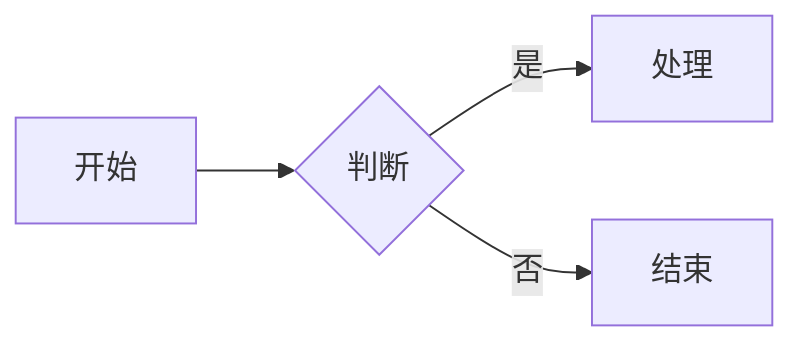

# 定制与进阶配置

本篇讲怎么把主题改成你要的样子。所有自定义都推荐放进独立的 CSS / JS 文件，再通过 `extra_css` / `extra_javascript` 引入，**不要直接改主题源码**——那样升级主题时会冲突。

```yaml
extra_css:
  - stylesheets/custom.css

extra_javascript:
  - javascripts/custom.js
```

这两个键的加载位置：

- `extra_css` 注入在主题样式 `css/theme.css` **之后**，所以同名选择器可以直接覆盖。
- `extra_javascript` 注入在主题脚本 `js/theme.js` **之前**。想用 `window.SmzhbookTheme` 时，要等 `DOMContentLoaded` 之后再调用。

## 0x01. 自定义颜色

主题的全部颜色都收敛在 CSS 变量里（前缀 `--vp-c-`），改变量即可换肤：

```css
/* stylesheets/custom.css */
:root {
    --vp-c-brand-1: #2563eb;   /* 品牌色：链接、激活项、强调 */
    --vp-c-brand-2: #1d4ed8;   /* hover 态 */
    --vp-c-brand-3: #1e40af;   /* 按下态 */
    --vp-c-bg: #fffdf7;        /* 页面主背景 */
    --vp-c-bg-alt: #f7f3e9;    /* 侧边栏背景 */
    --vp-c-text-1: #2b2b2b;    /* 正文色 */
}
```

常用变量一览：

| 变量 | 用途 |
| --- | --- |
| `--vp-c-brand-1/2/3` | 品牌色：常规 / hover / 按下 |
| `--vp-c-brand-soft` | 品牌色浅底，用于激活项背景 |
| `--vp-c-bg` | 页面主背景 |
| `--vp-c-bg-alt` | 侧边栏背景 |
| `--vp-c-bg-soft` | hover 面、表头、Mermaid 容器底色 |
| `--vp-c-bg-elv` | 下拉菜单、浮动面板底色 |
| `--vp-c-text-1/2/3` | 正文 / 次级 / 弱化文字 |
| `--vp-c-divider`、`--vp-c-gutter` | 分割线、边框 |
| `--vp-c-gray-soft` | 行内代码底色 |

**要让暗色皮肤也生效，必须同时覆盖 `html.dark`：**

```css
html.dark {
    --vp-c-brand-1: #60a5fa;
    --vp-c-brand-2: #93c5fd;
    --vp-c-brand-3: #3b82f6;
    --vp-c-bg: #0b1020;
}
```

## 0x02. 自定义字体

```css
:root {
    --vp-font-family-base: 'HarmonyOS Sans SC', 'Microsoft YaHei', sans-serif;
    --vp-font-family-mono: 'JetBrains Mono', 'Consolas', monospace;
}
```

使用 Web 字体时，把 `@font-face` 和上面的变量一起放进同一个自定义 CSS 即可，无需额外配置。

## 0x03. 调整布局尺寸

```css
:root {
    --vp-content-width: 860px;   /* 正文栏宽度，默认 800px */
    --vp-aside-width: 220px;     /* 右侧目录栏宽度，默认 200px */
    --vp-sidebar-width: 280px;   /* 左侧边栏宽度，默认 260px */
    --vp-nav-height: 60px;       /* 顶栏高度，默认 60px */
}
```

> `--vp-nav-height` 会被 JavaScript 读取，用于锚点跳转时补偿顶栏高度，也会参与 404 页的高度计算。**不要删除这个变量**，改数值没问题。

## 0x04. 亮 / 暗皮肤的默认行为

主题默认的行为链条是：

1. 用户手动点过切换按钮 → 读取 `localStorage` 里的 `smzh-theme`（值为 `light` 或 `dark`）；
2. 没点过 → 跟随操作系统的 `prefers-color-scheme`；
3. 页面加载时，有一小段内联脚本在首屏渲染前就把 `dark` 类加到 `<html>` 上，因此暗色用户不会看到一闪而过的白屏。

如果你希望**站点默认就是暗色**（但仍允许用户手动切回亮色），在自定义 JS 里写入初始值即可：

```js
// 仅在用户从未手动选择过时，设置默认皮肤
if (!localStorage.getItem('smzh-theme')) {
    localStorage.setItem('smzh-theme', 'dark');
}
```

想彻底去掉切换入口，见 [0x07 隐藏或改造界面元素](#0x07-隐藏或改造界面元素)。

## 0x05. Mermaid 图表

### 书写方式

在 Markdown 里用围栏代码块，语言标注为 `mermaid`：

````markdown

````

渲染、配色跟随皮肤、点击放大等行为都由主题内置实现（基于本地打包的 Mermaid，不请求 CDN）。

### 放大交互

| 操作 | 效果 |
| --- | --- |
| 点击图表 | 进入全屏放大 |
| 滚轮 | 以指针位置为锚点缩放，范围 1×~4× |
| 按住拖拽 | 平移画布 |
| 双击放大区 | 在 1× 与 2.5× 之间切换（触摸设备的替代交互） |
| <kbd>Esc</kbd> / 点击遮罩 / 右上角关闭按钮 | 退出放大 |

放大期间页面背景滚动会被锁定。

### 自定义图表容器样式

```css
/* 普通状态的图表容器 */
.mermaid {
    background: #fafbfc;
    border: 1px solid var(--vp-c-divider);
    border-radius: 8px;
}

/* 放大弹窗的面板 */
.mz-modal-panel {
    background: var(--vp-c-bg);
}
```

## 0x06. 配置站内搜索

搜索由 MkDocs 内置的 `search` 插件提供：

```yaml
plugins:
  - search:
      lang: ['zh', 'en']              # 中文必须显式声明 zh，否则分词不可用
      separator: '[\s\-\.]+'
      min_search_length: 2            # 少于该长度的词不返回结果
      indexing: full                  # full | sections | titles
      prebuild_index: false           # true / node 需构建环境有 Node.js
```

中文站的三个经验值：

1. `lang` 里一定要有 `zh`，否则中文会被整段当成一个词，几乎搜不到东西；
2. `indexing: full` 索引全文，召回最好但索引体积最大；想减小体积用 `sections`；
3. `min_search_length` 设成 `2`，中文双字词才搜得到。

更细的机制与排错见 [搜索插件原理](../mkdocs/search.md)。

## 0x07. 隐藏或改造界面元素

主题的元素都有固定类名，用 CSS 就能关掉：

```css
/* 隐藏亮/暗切换按钮（建议配合 0x04 固定默认皮肤） */
.vp-theme-toggle { display: none; }

/* 隐藏顶栏的搜索按钮 */
.vp-search-button { display: none; }

/* 隐藏右侧目录栏 */
.vp-doc-aside { display: none; }

/* 隐藏上一页/下一页 */
.vp-doc-footer { display: none; }
```

## 0x08. 调用 JS API

主题的交互都挂在 `window.SmzhbookTheme` 上：

```js
document.addEventListener('DOMContentLoaded', function () {
    // 界面控制
    SmzhbookTheme.openMenu();
    SmzhbookTheme.closeMenu();
    SmzhbookTheme.focusSearch();
    SmzhbookTheme.openSearchModal();

    // 亮/暗主题
    SmzhbookTheme.getTheme();        // 'light' | 'dark'
    SmzhbookTheme.setTheme('dark');  // 切换、写入 localStorage，并重绘 Mermaid 图
    SmzhbookTheme.toggleTheme();

    // Mermaid 放大（参数是 <svg> 元素，不是 .mermaid 容器）
    SmzhbookTheme.openMermaidZoom(document.querySelector('.mermaid svg'));
    SmzhbookTheme.isMermaidZoomOpen();
    SmzhbookTheme.closeMermaidZoom();

    // 平滑滚动（自动补偿顶栏高度）
    SmzhbookTheme.smoothScrollTo(document.querySelector('#目标锚点'), 400);
});
```

## 0x09. 一个完整的定制示例

```yaml
# mkdocs.yml
extra_css:
  - stylesheets/custom.css
extra_javascript:
  - javascripts/print-button.js

plugins:
  - search:
      lang: ['zh']
      min_search_length: 2
```

```css
/* docs/stylesheets/custom.css —— 换一套墨绿主题 */
:root {
    --vp-c-brand-1: #0f766e;
    --vp-c-brand-2: #0d9488;
    --vp-c-brand-3: #115e59;
    --vp-c-brand-soft: rgba(15, 118, 110, 0.10);
    --vp-content-width: 860px;
}

html.dark {
    --vp-c-brand-1: #2dd4bf;
    --vp-c-brand-2: #5eead4;
    --vp-c-brand-soft: rgba(45, 212, 191, 0.15);
}
```

```js
// docs/javascripts/print-button.js —— 往顶栏塞一个打印按钮
document.addEventListener('DOMContentLoaded', function () {
    var bar = document.querySelector('.vp-nav-bar-content');
    if (!bar) return;

    var btn = document.createElement('button');
    btn.className = 'vp-theme-toggle';   // 复用切换按钮的样式
    btn.title = '打印本页';
    btn.textContent = '🖨';
    btn.addEventListener('click', function () { window.print(); });
    bar.appendChild(btn);
});
```
