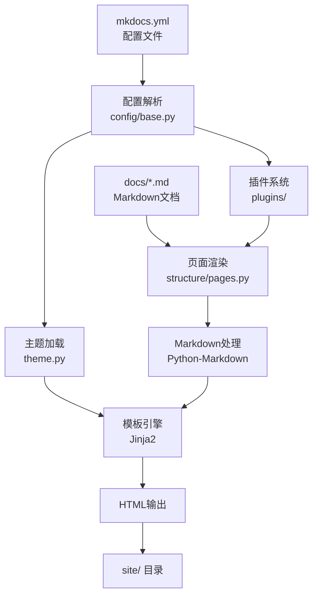

# MkDocs 文档构建的解析过程

[MkDocs](https://mkdocs.readthedocs.io/en/stable/) 是一个静态站点构建工具，从源码来看，解析过程包括以下几个核心环节。

## 0x01. 整体流程图



## 0x02. 关键环节说明

### 1. 配置加载（Configuration Loading）

```python
# mkdocs/config/base.py
config = Config.load_config(config_file='mkdocs.yml')
```

- 读取 `mkdocs.yml` 配置文件
- 解析所有配置选项
- 验证配置合法性
- 加载主题和插件配置

### 2. 文档扫描（Docs Scanning）

```python
# mkdocs/structure/pages.py
pages = PageManager.build_pages(docs_dir, config)
```

- 扫描 `docs_dir` 目录
- 收集所有 Markdown 文件
- 构建页面导航结构
- 生成页面 URL 映射

### 3. Markdown 渲染（Markdown Rendering）

```python
# mkdocs/structure/pages.py
content = page.render(markdown_extensions)
```

- 调用 Python-Markdown 引擎
- 应用配置的 Markdown 扩展
- 生成 Table of Contents (TOC)
- 提取元数据（Front Matter）

### 4. 主题渲染（Theme Rendering）

```python
# mkdocs/theme.py
template = theme.get_template('base.html')
html = template.render(context)
```

- 加载 Jinja2 模板
- 注入页面上下文变量
- 执行模板渲染
- 输出 HTML

### 5. 静态文件复制（Static Files）

- 复制主题静态资源（CSS, JS, 图片）
- 复制 `extra_css` 和 `extra_javascript`
- 复制文档中的媒体文件

### 6. 搜索索引构建（Search Index）

```python
# mkdocs/contrib/search/
index = SearchIndexBuilder.build(pages, config)
```

- 解析所有页面内容
- 建立搜索索引
- 生成搜索数据文件

## 0x03. 核心组件

### 配置系统

| 组件 | 文件 | 功能 |
|------|------|------|
| `MkDocsConfig` | `config/defaults.py` | 根配置类 |
| `Config.load_config` | `config/base.py` | 配置加载 |
| 配置校验器 | `config/config_options.py` | 类型校验 |

### 页面系统

| 组件 | 文件 | 功能 |
|------|------|------|
| `Page` | `structure/pages.py` | 页面对象 |
| `PageManager` | `structure/pages.py` | 页面管理 |
| `TableOfContents` | `structure/toc.py` | 目录生成 |

### 主题系统

| 组件 | 文件 | 功能 |
|------|------|------|
| `Theme` | `theme.py` | 主题加载器 |
| 模板过滤器 | `utils/templates.py` | url/script_tag |

### 插件系统

| 组件 | 文件 | 功能 |
|------|------|------|
| `PluginManager` | `plugins/base.py` | 插件管理 |
| 事件系统 | `plugins/events.py` | 事件触发 |

## 0x04. 数据流

```
mkdocs.yml ──┬──> MkDocsConfig ──> Theme ──> Jinja2 ──> HTML
             │                                │
docs/*.md ───┴──> PageManager ──> Pages ─────┘
                │
                ├── Markdown 渲染
                ├── TOC 生成
                └── 搜索索引
```

## 0x05. 构建命令工作流

```bash
mkdocs build
```

1. **加载配置**：读取并验证 `mkdocs.yml`
2. **初始化主题**：加载主题模板和资源
3. **扫描文档**：遍历 `docs_dir` 下的所有 `.md` 文件
4. **渲染页面**：将每个 Markdown 文件转换为 HTML
5. **应用布局**：用主题模板包裹渲染后的内容
6. **复制资源**：复制静态文件到 `site_dir`
7. **生成索引**：构建搜索索引
8. **输出站点**：生成完整的静态站点

## 0x06. 开发服务器工作流

```bash
mkdocs serve
```

1. 监听文件变化
2. 自动重新加载
3. 增量构建
4. 浏览器热更新

## 0x07. 模板上下文变量

**全局变量**：
- `config` - MkDocs 配置对象
- `nav` - 导航对象
- `pages` - 所有页面列表
- `base_url` - 基础 URL
- `mkdocs_version` - MkDocs 版本

**页面变量**：
- `page.title` - 页面标题
- `page.content` - 渲染后的 HTML 内容
- `page.toc` - 页面目录对象
- `page.url` - 页面相对 URL
- `page.abs_url` - 页面绝对 URL
- `page.canonical_url` - 规范 URL
- `page.edit_url` - 编辑链接
- `page.meta` - Front Matter 元数据