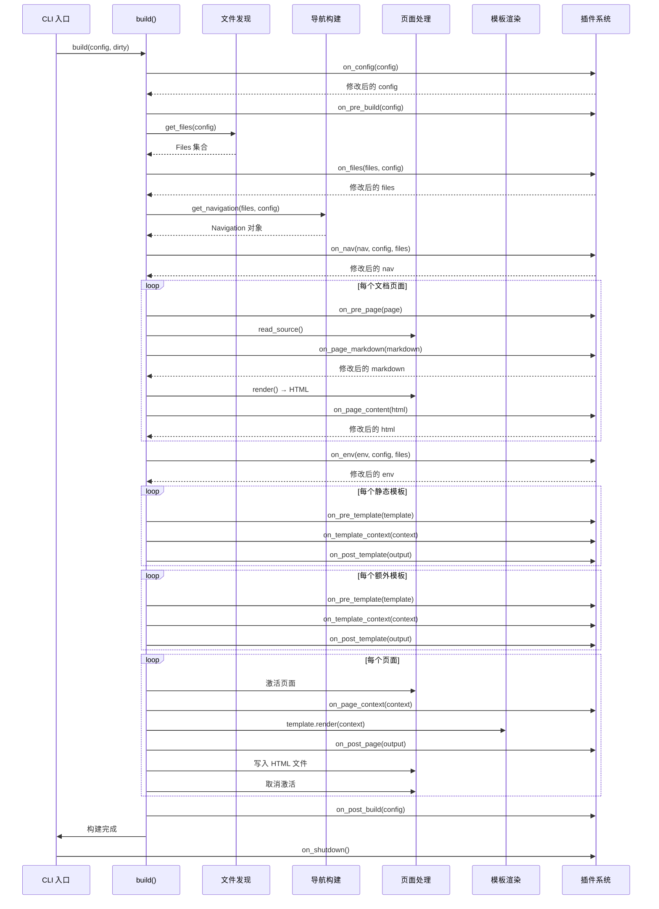
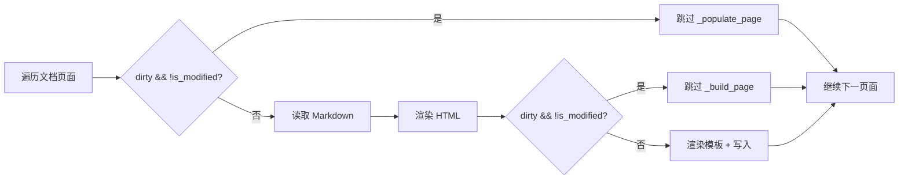

# MkDocs `mkdocs build` 完整构建过程详解

本文档从 `mkdocs build` 命令出发，深入 MkDocs 源码，详细解析从命令行输入到最终 HTML 站点输出的完整构建流程。所有源码引用基于 MkDocs 最新 master 分支（commit `28625367`）。

## 0x01. 整体构建流程图

```mermaid
graph TB
    subgraph CLI["CLI 入口层"]
        A1["mkdocs build<br/>__main__.py"] --> A2["_enable_warnings"]
        A2 --> A3["config.load_config<br/>加载并验证配置"]
        A3 --> A4["on_startup 事件<br/>command='build'"]
        A4 --> A5["build.build<br/>核心构建函数"]
    end

    subgraph Phase1["阶段一：配置与初始化"]
        A5 --> B1["CountHandler<br/>严格模式计数"]
        B1 --> B2["on_config 事件<br/>插件修改配置"]
        B2 --> B3["on_pre_build 事件<br/>构建前准备"]
        B3 --> B4["clean_directory<br/>清理 site_dir"]
    end

    subgraph Phase2["阶段二：文件发现与导航"]
        B4 --> C1["get_files<br/>扫描 docs_dir"]
        C1 --> C2["theme.get_env<br/>创建 Jinja2 环境"]
        C2 --> C3["add_files_from_theme<br/>添加主题静态文件"]
        C3 --> C4["on_files 事件<br/>插件操作文件集合"]
        C4 --> C5["set_exclusions<br/>应用排除规则"]
        C5 --> C6["get_navigation<br/>构建导航树"]
        C6 --> C7["on_nav 事件<br/>插件修改导航"]
    end

    subgraph Phase3["阶段三：页面内容处理"]
        C7 --> D1["遍历文档页面"]
        D1 --> D2["_populate_page<br/>读取并渲染 Markdown"]
        D2 --> D3["on_page_markdown 事件"]
        D3 --> D4["page.render<br/>Markdown → HTML"]
        D4 --> D5["on_page_content 事件"]
    end

    subgraph Phase4["阶段四：模板与输出"]
        D5 --> E1["on_env 事件<br/>修改 Jinja2 环境"]
        E1 --> E2["copy_static_files<br/>复制静态资源"]
        E2 --> E3["_build_theme_template<br/>构建主题模板 sitemap/404"]
        E3 --> E4["_build_extra_template<br/>构建额外模板"]
        E4 --> E5["_build_page<br/>页面模板渲染 + 写入"]
        E5 --> E6["validate_anchor_links<br/>锚点链接验证"]
    end

    subgraph Phase5["阶段五：收尾与完成"]
        E6 --> F1["on_post_build 事件"]
        F1 --> F2{"strict 模式检查"}
        F2 -->|有警告| F3["Abort 中止构建"]
        F2 -->|无警告| F4["记录构建耗时"]
        F4 --> F5["on_shutdown 事件"]
        F5 --> F6["site/ 输出完成"]
    end

    A3 -.-> C1
    Phase1 --> Phase2
    Phase2 --> Phase3
    Phase3 --> Phase4
    Phase4 --> Phase5
```



## 0x02. CLI 入口层

### 命令定义

`mkdocs build` 命令在 `mkdocs/__main__.py` 中通过 Click 框架定义：

**源码**：[`mkdocs/__main__.py#L275-L291`](https://github.com/mkdocs/mkdocs/blob/28625367/mkdocs/__main__.py#L275-L291)

```python
@cli.command(name="build", cls=MkDocsCommands)
@click.option('-c', '--clean/--dirty', is_flag=True, default=True,
              help="清除站点目录后重建 / 增量构建")
@click.option('-f', '--config-file', type=click.File('rb'),
              help="MkDocs 配置文件路径")
@click.option('-s', '--strict', is_flag=True,
              help="将警告视为错误")
@click.option('-t', '--theme', type=click.Choice(get_theme_names()),
              help="覆盖配置中的主题")
@click.option('-d', '--site-dir', type=click.Path(file_okay=False),
              help="覆盖输出目录")
@click.option('--use-directory-urls/--no-directory-urls', is_flag=True,
              help="覆盖目录 URL 生成策略")
@verbose_option
@quiet_option
def build_command(clean, config_file, strict, theme, site_dir,
                  use_directory_urls, verbose, quiet):
    """构建文档站点"""
    _enable_warnings()
    # ... 加载配置并调用 build.build()
```

### 命令选项

| 选项 | 类型 | 默认值 | 说明 |
|------|------|--------|------|
| `-c, --clean/--dirty` | Flag | `--clean` | 构建前是否清理 `site_dir` |
| `-f, --config-file` | File | `mkdocs.yml` | 配置文件路径 |
| `-s, --strict` | Flag | `False` | 将警告视为错误 |
| `-t, --theme` | Choice | 配置文件中的值 | 覆盖主题 |
| `-d, --site-dir` | Path | 配置文件中的值 | 覆盖输出目录 |
| `--use-directory-urls` | Flag | 配置文件中的值 | 覆盖 URL 策略 |
| `-v, --verbose` | Flag | `False` | 启用调试日志 |
| `-q, --quiet` | Flag | `False` | 仅显示错误 |

### 命令执行流程

```python
# mkdocs/__main__.py 中的 build 命令处理函数
def build_command(...):
    _enable_warnings()                                        # 启用警告

    # 1. 加载并验证配置
    cfg = config.load_config(
        config_file=config_file,
        strict=strict,
        theme=theme,
        site_dir=site_dir,
        use_directory_urls=use_directory_urls,
    )

    # 2. 触发 on_startup 事件
    cfg.plugins.on_startup(command='build', dirty=not clean)

    try:
        # 3. 调用核心构建函数
        build.build(cfg, dirty=not clean)
    except Exception:
        # 4. 确保 on_shutdown 事件即使在异常时也触发
        cfg.plugins.on_shutdown()
        raise
    else:
        cfg.plugins.on_shutdown()
```

**关键源码**：[`mkdocs/__main__.py#L280-L291`](https://github.com/mkdocs/mkdocs/blob/28625367/mkdocs/__main__.py#L280-L291)

## 0x03. 阶段一：配置与初始化

### 3.1 配置加载

配置加载由 `config.load_config()` 完成，位于 `mkdocs/config/base.py`：

**源码**：[`mkdocs/config/base.py`](https://github.com/mkdocs/mkdocs/blob/28625367/mkdocs/config/base.py)

```python
def load_config(
    config_file: str | IO | None = None,
    *,
    config_file_path: str | None = None,
    **kwargs,
) -> MkDocsConfig:
    """加载并验证 MkDocs 配置。"""
    # 1. 创建默认配置实例
    cfg = MkDocsConfig(config_file_path=config_file_path)

    # 2. 从 YAML 文件加载配置
    # 3. 应用命令行覆盖参数
    # 4. 验证所有配置项
    # 5. 加载插件集合
    # 6. 返回验证后的配置对象
    return cfg
```

配置验证基于 `MkDocsConfig` 类定义的模式，位于 `mkdocs/config/defaults.py`：

**源码**：[`mkdocs/config/defaults.py`](https://github.com/mkdocs/mkdocs/blob/28625367/mkdocs/config/defaults.py)

```python
class MkDocsConfig(Config):
    """MkDocs 根配置类，定义所有配置项的验证规则。"""

    site_name = c.Type(str)
    site_url = c.Optional(c.URL())
    site_description = c.Optional(c.Type(str))
    site_author = c.Optional(c.Type(str))

    docs_dir = c.Dir(exists=True)
    site_dir = c.Type(str)

    theme = c.Theme()
    nav = c.Optional(c.Nav())
    plugins = c.Plugins(theme_key='theme.name')

    markdown_extensions = c.MarkdownExtensions()
    mdx_configs = c.Private()

    extra_css = c.Type(list)
    extra_javascript = c.Type(list)

    repo_url = c.Optional(c.URL())
    repo_name = c.Optional(c.Type(str))
    edit_uri = c.Optional(c.Type(str))

    strict = c.Type(bool, default=False)
    use_directory_urls = c.Type(bool, default=True)

    # ... 更多配置项
```

### 3.2 插件加载

在配置验证过程中，`c.Plugins()` 配置选项会自动：

1. 通过 `entry_points(group='mkdocs.plugins')` 发现所有已安装的插件
2. 根据 `mkdocs.yml` 中 `plugins` 列表实例化指定的插件
3. 验证每个插件的 `config_scheme`
4. 将所有插件实例注册到 `PluginCollection` 中

**源码**：[`mkdocs/config/config_options.py`](https://github.com/mkdocs/mkdocs/blob/28625367/mkdocs/config/config_options.py)

### 3.3 构建函数入口

核心构建函数 `build()` 位于 `mkdocs/commands/build.py`：

**源码**：[`mkdocs/commands/build.py#L249-L365`](https://github.com/mkdocs/mkdocs/blob/28625367/mkdocs/commands/build.py#L249-L365)

```python
def build(config: MkDocsConfig, *, serve_url: str | None = None, dirty: bool = False) -> None:
    """构建 MkDocs 文档站点。

    参数:
        config: 已验证的 MkDocsConfig 对象
        serve_url: serve 模式下的 URL（用于包含草稿）
        dirty: 增量构建模式
    """
    # 1. 设置严格模式 CountHandler
    # 2. 设置 inclusion level
    # 3. 触发 on_config 事件
    # 4. 触发 on_pre_build 事件
    # 5. 清理 site_dir
    # 6. 文件发现与导航构建
    # 7. 页面内容处理
    # 8. 模板与输出
    # 9. 收尾与完成
```

### 3.4 严格模式设置

```python
# mkdocs/commands/build.py#L254-L257
if config.strict:
    # 使用 CountHandler 统计各等级的日志数量
    # 构建结束后如果有任何 WARNING 级别日志，则中止构建
    error_counter = Counter()
    log.addFilter(CountHandler(error_counter))
```

### 3.5 文件包含级别设置

```python
# mkdocs/commands/build.py#L259
# 根据是否在 serve 模式，决定使用哪种包含级别
inclusion = config.files.inclusion_level_for_serve if serve_url else config.files.inclusion_level
```

### 3.6 配置与预构建事件

```python
# mkdocs/commands/build.py#L265
# on_config：允许插件修改配置
config = config.plugins.on_config(config)

# mkdocs/commands/build.py#L268
# on_pre_build：构建前准备
config.plugins.on_pre_build(config=config)
```

### 3.7 目录清理

```python
# mkdocs/commands/build.py#L270-L283
if not dirty:
    # 默认：清理 site_dir 中所有非隐藏文件
    log.info("Cleaning site directory")
    utils.clean_directory(config.site_dir)
else:
    # dirty 模式：跳过清理，发出警告
    log.warning(
        "A 'dirty' build is being performed, this will likely lead to inaccurate "
        "navigation and other links within your site. This option is designed "
        "for site development purposes only."
    )
    # 检查是否存在残留文件
    if site_directory_contains_stale_files(config.site_dir):
        log.info("The directory contains stale files. Use --clean to remove them.")
```

## 0x04. 阶段二：文件发现与导航构建

### 4.1 文件发现（get_files）

```python
# mkdocs/commands/build.py#L287
files = get_files(config)
```

**源码**：[`mkdocs/structure/files.py#L472-L548`](https://github.com/mkdocs/mkdocs/blob/28625367/mkdocs/structure/files.py#L472-L548)

`get_files()` 函数使用 `os.walk()` 递归遍历 `docs_dir`，为每个文件创建 `File` 对象：

```python
def get_files(config: MkDocsConfig) -> Files:
    """扫描 docs_dir，返回 Files 集合。"""
    files = Files()
    for source_dir, dirnames, filenames in os.walk(config.docs_dir):
        # 排除隐藏目录（以 . 开头）
        # 排除 /templates/ 目录
        for filename in filenames:
            src_path = os.path.join(source_dir, filename)
            # 计算相对路径
            # 创建 File 对象
            files.append(File(path, config.docs_dir, config.site_dir, config.use_directory_urls))
    return files
```

#### File 类核心属性

**源码**：[`mkdocs/structure/files.py#L181-L429`](https://github.com/mkdocs/mkdocs/blob/28625367/mkdocs/structure/files.py#L181-L429)

| 属性 | 类型 | 说明 | 示例 |
|------|------|------|------|
| `src_uri` | str | 相对于 docs_dir 的 POSIX 路径 | `"foo/bar.md"` |
| `dest_uri` | str | site_dir 中的写入路径 | `"foo/bar/index.html"` |
| `url` | str | URL 编码的相对 URL | `"foo/bar/"` |
| `inclusion` | InclusionLevel | 包含级别 | `INCLUDED` / `EXCLUDED` / `DRAFT` |
| `page` | Page \| None | 关联的页面对象 | — |
| `name` | str | 不带扩展名的文件名 | `"bar"` |
| `edit_uri` | str | 编辑链接路径 | `"foo/bar.md"` |

#### InclusionLevel 枚举

**源码**：[`mkdocs/structure/files.py#L31-L60`](https://github.com/mkdocs/mkdocs/blob/28625367/mkdocs/structure/files.py#L31-L60)

| 级别 | 说明 |
|------|------|
| `INCLUDED` | 包含在构建输出中 |
| `EXCLUDED` | 完全排除 |
| `DRAFT` | 仅在 serve 模式中可见 |
| `NOT_IN_NAV` | 不在导航中但会被构建 |

#### 默认排除规则

- `.*` — 根级别的隐藏文件和目录
- `/templates/` — 顶层 templates 目录
- 用户通过 `exclude_docs` 配置的额外排除模式

### 4.2 创建 Jinja2 环境

```python
# mkdocs/commands/build.py#L288
env = config.theme.get_env()
```

`theme.get_env()` 创建 Jinja2 模板环境，加载主题目录中的所有模板，并注册 MkDocs 自定义过滤器（如 `url`、`script_tag` 等）。

**源码**：[`mkdocs/theme.py`](https://github.com/mkdocs/mkdocs/blob/28625367/mkdocs/theme.py)

### 4.3 添加主题静态文件

```python
# mkdocs/commands/build.py#L289
files.add_files_from_theme(env, config)
```

从主题目录中收集非模板的静态资源（CSS、JS、图片、字体等），创建对应的 `File` 对象并加入 `Files` 集合。

**源码**：[`mkdocs/structure/files.py#L146-L169`](https://github.com/mkdocs/mkdocs/blob/28625367/mkdocs/structure/files.py#L146-L169)

### 4.4 on_files 事件

```python
# mkdocs/commands/build.py#L292
files = config.plugins.on_files(files, config)
```

允许插件添加、删除或修改文件集合。例如插件可以在此阶段注入虚拟文件（MkDocs 1.6+ 支持 `File.generated()` 创建内存文件）。

### 4.5 应用排除规则

```python
# mkdocs/commands/build.py#L294
set_exclusions(files, config)
```

根据 `exclude_docs`、`draft_docs`、`not_in_nav` 配置，重新计算每个文件的 `inclusion` 级别。

**源码**：[`mkdocs/structure/files.py#L551-L616`](https://github.com/mkdocs/mkdocs/blob/28625367/mkdocs/structure/files.py#L551-L616)

### 4.6 构建导航树

```python
# mkdocs/commands/build.py#L296
nav = get_navigation(files, config)
```

`get_navigation()` 函数根据 `nav` 配置或文件结构自动构建导航树：

**源码**：[`mkdocs/structure/nav.py#L130-L185`](https://github.com/mkdocs/mkdocs/blob/28625367/mkdocs/structure/nav.py#L130-L185)

```python
def get_navigation(files: Files, config: MkDocsConfig) -> Navigation:
    """构建站点导航结构。"""
    # 1. 判断导航来源：nav 配置 or 自动生成
    if config.nav:
        nav_items = config.nav
    else:
        # 自动：按路径排序并嵌套
        nav_items = nest_paths(files.documentation_pages())

    # 2. 递归转换为导航结构
    items = _data_to_navigation(nav_items, files, config)

    # 3. 提取所有 Page 对象
    pages = _get_by_type(items, Page)

    # 4. 建立页面关系（prev/next, parent）
    _add_previous_and_next_links(pages)
    _add_parent_links(items)

    # 5. 处理孤儿页面（不在 nav 中的文件）
    orphaned = set(files.documentation_pages()) - set(pages)
    for f in orphaned:
        pages.append(Page(None, f, config))

    return Navigation(items, pages)
```

#### 导航结构类

| 类 | 源码 | 说明 |
|----|------|------|
| `Navigation` | [`nav.py#L21-L46`](https://github.com/mkdocs/mkdocs/blob/28625367/mkdocs/structure/nav.py#L21-L46) | 导航根容器，包含 `items`、`pages`、`homepage` |
| `Section` | [`nav.py#L48-L95`](https://github.com/mkdocs/mkdocs/blob/28625367/mkdocs/structure/nav.py#L48-L95) | 导航分组，包含 `title`、`children` |
| `Page` | [`pages.py#L35-L159`](https://github.com/mkdocs/mkdocs/blob/28625367/mkdocs/structure/pages.py#L35-L159) | 页面导航项，包含 `title`、`file`、`next_page`、`previous_page` |
| `Link` | [`nav.py#L97-L128`](https://github.com/mkdocs/mkdocs/blob/28625367/mkdocs/structure/nav.py#L97-L128) | 外部链接，包含 `title`、`url` |

### 4.7 on_nav 事件

```python
# mkdocs/commands/build.py#L299
nav = config.plugins.on_nav(nav, config, files)
```

允许插件修改导航结构（添加、删除、重排序导航项）。

## 0x05. 阶段三：页面内容处理

### 5.1 遍历文档页面

```python
# mkdocs/commands/build.py#L301-L316
log.debug("Reading markdown pages.")
for file in files.documentation_pages(inclusion=inclusion):
    log.debug(f"Reading: {file.src_uri}")

    if file.inclusion.is_excluded():
        continue

    # 处理每个页面
    _populate_page(file.page, config, files, dirty)
```

在 serve 模式下，还会处理草稿页面并记录其 URL：

```python
if serve_url and file.inclusion.is_draft():
    log.info(
        "The following pages are being built only for the preview "
        "but will be excluded from `mkdocs build` per the "
        "`draft_docs` config:\n  - %s", file.src_uri
    )
```

### 5.2 _populate_page 函数

**源码**：[`mkdocs/commands/build.py#L147-L183`](https://github.com/mkdocs/mkdocs/blob/28625367/mkdocs/commands/build.py#L147-L183)

```python
def _populate_page(page: Page, config: MkDocsConfig, files: Files, dirty: bool = False) -> None:
    """读取并渲染单个页面的 Markdown 内容。"""
    # 1. dirty 模式：跳过未修改的文件
    if dirty and not page.file.is_modified():
        return

    # 2. 设置当前页面对象（用于错误上下文）
    config._current_page = page
    try:
        # 3. on_pre_page 事件
        page = config.plugins.on_pre_page(page, config, files)

        # 4. 读取 Markdown 源码（含 Front Matter 解析）
        page.read_source()

        # 5. on_page_markdown 事件（允许插件修改 Markdown）
        page.markdown = config.plugins.on_page_markdown(
            page.markdown, page, config, files
        )

        # 6. 渲染 Markdown → HTML
        page.render(config, files)

        # 7. on_page_content 事件（允许插件修改 HTML）
        page.content = config.plugins.on_page_content(
            page.content, page, config, files
        )
    except Exception as e:
        # 错误处理：附加文件路径信息
        log.error(f"Error reading page '{page.file.src_uri}':")
        raise
    finally:
        config._current_page = None
```

### 5.3 页面读取源码

**源码**：[`mkdocs/structure/pages.py#L208-L220`](https://github.com/mkdocs/mkdocs/blob/28625367/mkdocs/structure/pages.py#L208-L220)

```python
def read_source(self) -> None:
    """从文件加载 Markdown 内容并提取 Front Matter。"""
    # 1. on_page_read_source 事件（插件可提供内容）
    source = self._config.plugins.on_page_read_source(self, self._config)

    # 2. 默认：从文件读取
    if source is None:
        source = self.file.content_string

    # 3. 分离 Front Matter 和正文
    self.meta, self.markdown = meta.get_data(source)
```

### 5.4 Markdown 渲染

**源码**：[`mkdocs/structure/pages.py#L263-L293`](https://github.com/mkdocs/mkdocs/blob/28625367/mkdocs/structure/pages.py#L263-L293)

```python
def render(self, config: MkDocsConfig, files: Files) -> None:
    """将 Markdown 渲染为 HTML。"""
    # 1. 创建 Markdown 实例，加载配置的扩展
    md = Markdown(
        extensions=config.markdown_extensions,
        extension_configs=config.mdx_configs,
    )

    # 2. 添加 MkDocs 自定义处理器
    md.registerExtension(_RawHTMLPreprocessor(self))
    md.registerExtension(_ExtractAnchorsTreeprocessor(self))
    md.registerExtension(_RelativePathTreeprocessor(self, files, config))
    md.registerExtension(_ExtractTitleTreeprocessor(self))

    # 3. 执行渲染
    self.content = md.convert(self.markdown)
    self.toc = TableOfContents(md.toc_tokens)
```

#### MkDocs 自定义处理器

| 处理器 | 优先级 | 功能 | 源码 |
|--------|--------|------|------|
| `_RawHTMLPreprocessor` | 30 | 从原始 HTML 块中提取 anchor ID | [`pages.py#L528-L557`](https://github.com/mkdocs/mkdocs/blob/28625367/mkdocs/structure/pages.py#L528-L557) |
| `_ExtractAnchorsTreeprocessor` | 5 | 从渲染后的 HTML 树中收集所有 anchor ID | [`pages.py#L329-L343`](https://github.com/mkdocs/mkdocs/blob/28625367/mkdocs/structure/pages.py#L329-L343) |
| `_RelativePathTreeprocessor` | 0 | 解析和转换相对路径链接，验证链接有效性 | [`pages.py#L346-L525`](https://github.com/mkdocs/mkdocs/blob/28625367/mkdocs/structure/pages.py#L346-L525) |
| `_ExtractTitleTreeprocessor` | 3 | 提取第一个 H1 作为页面标题 | [`pages.py#L560-L583`](https://github.com/mkdocs/mkdocs/blob/28625367/mkdocs/structure/pages.py#L560-L583) |

#### 页面标题确定优先级

1. 导航配置中指定的标题
2. Front Matter 中的 `title` 字段
3. 第一个 H1 标题（由 `_ExtractTitleTreeprocessor` 提取）
4. 文件名（替换 `-` 和 `_` 为空格）

## 0x06. 阶段四：模板与输出

### 6.1 on_env 事件

```python
# mkdocs/commands/build.py#L319
env = config.plugins.on_env(env, config, files)
```

允许插件修改 Jinja2 环境（添加自定义过滤器、全局变量等）。

### 6.2 复制静态文件

```python
# mkdocs/commands/build.py#L325
log.debug("Copying static assets.")
files.copy_static_files(dirty=dirty, inclusion=inclusion)
```

将所有非文档文件（图片、CSS、JS、字体等）复制到 `site_dir`。

**源码**：[`mkdocs/structure/files.py#L113-L122`](https://github.com/mkdocs/mkdocs/blob/28625367/mkdocs/structure/files.py#L113-L122)

### 6.3 构建主题静态模板

```python
# mkdocs/commands/build.py#L327-L328
for template_name in config.theme.static_templates:
    _build_theme_template(template_name, env, files, config, nav)
```

处理主题中定义的静态模板（如 `sitemap.xml`、`404.html`）。

#### _build_theme_template

**源码**：[`mkdocs/commands/build.py#L91-L122`](https://github.com/mkdocs/mkdocs/blob/28625367/mkdocs/commands/build.py#L91-L122)

```python
def _build_theme_template(template_name, env, files, config, nav):
    """渲染并写入主题静态模板。"""
    # 1. 获取模板
    template = env.get_template(template_name)

    # 2. on_pre_template 事件
    template = config.plugins.on_pre_template(template, template_name, config)

    # 3. 构建模板上下文
    context = get_context(nav, files, config, template_name=template_name)

    # 4. on_template_context 事件
    context = config.plugins.on_template_context(context, template_name, config)

    # 5. 渲染模板
    output = template.render(context)

    # 6. on_post_template 事件
    output = config.plugins.on_post_template(output, template_name, config)
    if not output:
        log.info(f"Template '{template_name}' was empty, skipping.")
        return

    # 7. 写入文件
    dest = os.path.join(config.site_dir, template_name)

    # 8. 特殊处理：sitemap.xml 生成 gzip 版本
    if template_name == 'sitemap.xml':
        _write_gzipped_sitemap(output, dest)
    else:
        utils.write_file(output.encode('utf-8'), dest)
```

### 6.4 构建额外模板

```python
# mkdocs/commands/build.py#L330-L331
for file in files.extra_templates():
    _build_extra_template(file, env, files, config, nav)
```

处理用户在 `extra_templates` 中配置的自定义模板。

#### _build_extra_template

**源码**：[`mkdocs/commands/build.py#L124-L145`](https://github.com/mkdocs/mkdocs/blob/28625367/mkdocs/commands/build.py#L124-L145)

```python
def _build_extra_template(file, env, files, config, nav):
    """渲染并写入用户自定义模板。"""
    # 1. 从文件内容创建独立 Jinja2 模板
    template = jinja2.Template(file.content_string)

    # 2. on_pre_template 事件
    template = config.plugins.on_pre_template(template, file.src_uri, config)

    # 3. 构建上下文
    context = get_context(nav, files, config, template_name=file.src_uri)

    # 4. on_template_context 事件
    context = config.plugins.on_template_context(context, file.src_uri, config)

    # 5. 渲染
    output = template.render(context)

    # 6. on_post_template 事件
    output = config.plugins.on_post_template(output, file.src_uri, config)
    if not output:
        return

    # 7. 写入到 site_dir 中对应的路径
    utils.write_file(output.encode('utf-8'), file.abs_dest_path)
```

### 6.5 构建页面（核心渲染）

```python
# mkdocs/commands/build.py#L333-L339
log.debug("Building markdown pages.")
for file in files.documentation_pages(inclusion=inclusion):
    _build_page(file.page, config, files, env, nav)
```

#### _build_page

**源码**：[`mkdocs/commands/build.py#L185-L247`](https://github.com/mkdocs/mkdocs/blob/28625367/mkdocs/commands/build.py#L185-L247)

```python
def _build_page(page, config, files, env, nav):
    """应用主题模板并写入页面 HTML。"""
    # 1. dirty 模式：跳过未修改的页面
    if not page.file.is_modified():
        return

    config._current_page = page
    try:
        # 2. 激活当前页面（导航高亮）
        page.active = True

        # 3. 选择模板（默认 main.html，可通过 meta['template'] 覆盖）
        template_name = page.meta.get('template', 'main.html')
        template = env.get_template(template_name)

        # 4. 构建页面上下文
        context = get_context(nav, files, config, page=page)

        # 5. on_page_context 事件
        context = config.plugins.on_page_context(context, page, config, nav)

        # 6. 草稿标记（仅 serve 模式）
        if serve_url and page.file.inclusion.is_excluded():
            draft_marker = '<div class="mkdocs-draft-marker" title="This page is a draft.">DRAFT</div>'
            context['page'].content = draft_marker + context['page'].content

        # 7. 渲染模板
        output = template.render(context)

        # 8. on_post_page 事件
        output = config.plugins.on_post_page(output, page, config)
        if not output:
            log.info(f"Page '{page.file.src_uri}' output was empty, skipping.")
            return

        # 9. 写入文件
        utils.write_file(output.encode('utf-8'), page.file.abs_dest_path)

    except Exception as e:
        log.error(f"Error building page '{page.file.src_uri}':")
        raise
    finally:
        # 10. 取消激活
        page.active = False
        config._current_page = None
```

#### 模板上下文变量

**源码**：[`mkdocs/commands/build.py#L29-L59`](https://github.com/mkdocs/mkdocs/blob/28625367/mkdocs/commands/build.py#L29-L59)

| 变量 | 类型 | 说明 |
|------|------|------|
| `nav` | `Navigation` | 完整导航树 |
| `pages` | `Sequence[File]` | 仅文档页面列表 |
| `base_url` | `str` | 相对于站点根目录的 URL |
| `extra_css` | `list[str]` | 规范化后的 CSS 文件 URL |
| `extra_javascript` | `list[str]` | 规范化后的 JS 文件 URL |
| `mkdocs_version` | `str` | MkDocs 版本号 |
| `build_date_utc` | `datetime` | 构建时间戳（UTC） |
| `config` | `MkDocsConfig` | 完整配置对象 |
| `page` | `Page \| None` | 当前页面（静态模板为 None） |

### 6.6 锚点链接验证

```python
# mkdocs/commands/build.py#L341-L344
# 验证所有页面间的锚点链接
for page in files.documentation_pages():
    if page.present_anchor_ids:
        page.validate_anchor_links(files, config)
```

检查所有跨页面的锚点链接是否指向有效的目标 anchor。

## 0x07. 阶段五：收尾与完成

### 7.1 on_post_build 事件

```python
# mkdocs/commands/build.py#L347
config.plugins.on_post_build(config=config)
```

所有输出文件写入完成后触发。插件可在此阶段执行：
- 生成搜索索引（search 插件）
- 压缩文件（minify 插件）
- 生成额外报告或统计

### 7.2 严格模式检查

```python
# mkdocs/commands/build.py#L349-L351
if config.strict and error_counter['WARNING']:
    raise exceptions.Abort(
        f"Aborted with {error_counter['WARNING']} warning(s) in strict mode!"
    )
```

如果启用了 `strict` 模式且构建过程中产生了任何 WARNING 级别日志，则中止构建并报告所有警告类型。

### 7.3 构建耗时报告

```python
# mkdocs/commands/build.py#L353
log.info(f"Documentation built in {time.monotonic() - start_time:.2f} seconds")
```

使用 `time.monotonic()` 计算并报告总构建耗时。

### 7.4 错误处理

```python
# mkdocs/commands/build.py#L355-L364
except Exception as e:
    # on_build_error 事件：允许插件清理资源
    config.plugins.on_build_error(error=e)

    if isinstance(e, exceptions.BuildError):
        # BuildError：已记录日志，转换为 Abort 退出
        log.error(str(e))
        raise exceptions.Abort('Aborted with a BuildError!')
    # 其他异常：正常传播（显示完整堆栈）
    raise
```

### 7.5 on_shutdown 事件

在 `__main__.py` 中确保无论构建成功还是失败，`on_shutdown` 都会被调用：

```python
try:
    build.build(cfg, dirty=not clean)
except Exception:
    cfg.plugins.on_shutdown()
    raise
else:
    cfg.plugins.on_shutdown()
```

## 0x08. 完整事件调用时序



## 0x09. 核心源码文件参考

### 构建命令

| 文件 | 功能 | 源码链接 |
|------|------|----------|
| `mkdocs/__main__.py` | CLI 入口、命令定义 | [GitHub](https://github.com/mkdocs/mkdocs/blob/28625367/mkdocs/__main__.py) |
| `mkdocs/commands/build.py` | 核心构建逻辑 | [GitHub](https://github.com/mkdocs/mkdocs/blob/28625367/mkdocs/commands/build.py) |
| `mkdocs/commands/serve.py` | 开发服务器 | [GitHub](https://github.com/mkdocs/mkdocs/blob/28625367/mkdocs/commands/serve.py) |

### 配置系统

| 文件 | 功能 | 源码链接 |
|------|------|----------|
| `mkdocs/config/defaults.py` | MkDocsConfig 根配置类 | [GitHub](https://github.com/mkdocs/mkdocs/blob/28625367/mkdocs/config/defaults.py) |
| `mkdocs/config/base.py` | Config 基类、load_config | [GitHub](https://github.com/mkdocs/mkdocs/blob/28625367/mkdocs/config/base.py) |
| `mkdocs/config/config_options.py` | 配置选项验证器 | [GitHub](https://github.com/mkdocs/mkdocs/blob/28625367/mkdocs/config/config_options.py) |
| `mkdocs/theme.py` | 主题加载器 | [GitHub](https://github.com/mkdocs/mkdocs/blob/28625367/mkdocs/theme.py) |

### 结构与页面

| 文件 | 功能 | 源码链接 |
|------|------|----------|
| `mkdocs/structure/files.py` | File、Files、InclusionLevel | [GitHub](https://github.com/mkdocs/mkdocs/blob/28625367/mkdocs/structure/files.py) |
| `mkdocs/structure/pages.py` | Page、渲染、Treeprocessors | [GitHub](https://github.com/mkdocs/mkdocs/blob/28625367/mkdocs/structure/pages.py) |
| `mkdocs/structure/nav.py` | Navigation、Section、Link | [GitHub](https://github.com/mkdocs/mkdocs/blob/28625367/mkdocs/structure/nav.py) |
| `mkdocs/structure/toc.py` | TableOfContents | [GitHub](https://github.com/mkdocs/mkdocs/blob/28625367/mkdocs/structure/toc.py) |

### 插件系统

| 文件 | 功能 | 源码链接 |
|------|------|----------|
| `mkdocs/plugins.py` | BasePlugin、PluginCollection | [GitHub](https://github.com/mkdocs/mkdocs/blob/28625367/mkdocs/plugins.py) |
| `mkdocs/exceptions.py` | 异常类定义 | [GitHub](https://github.com/mkdocs/mkdocs/blob/28625367/mkdocs/exceptions.py) |

### 工具函数

| 文件 | 功能 | 源码链接 |
|------|------|----------|
| `mkdocs/utils/__init__.py` | clean_directory、write_file 等 | [GitHub](https://github.com/mkdocs/mkdocs/blob/28625367/mkdocs/utils/__init__.py) |
| `mkdocs/utils/templates.py` | 模板过滤器 | [GitHub](https://github.com/mkdocs/mkdocs/blob/28625367/mkdocs/utils/templates.py) |

## 0x10. Dirty Build 机制

Dirty Build（`mkdocs build --dirty`）通过文件修改时间比较实现增量构建：

**源码**：[`mkdocs/structure/files.py#L495-L501`](https://github.com/mkdocs/mkdocs/blob/28625367/mkdocs/structure/files.py#L495-L501)

```python
def is_modified(self) -> bool:
    """判断文件是否需要重新构建。"""
    # 1. 虚拟文件（内存内容）：始终视为已修改
    if self._content is not None:
        return True

    # 2. 目标文件不存在：需要构建
    if not os.path.exists(self.abs_dest_path):
        return True

    # 3. 比较源文件和目标文件的修改时间
    return os.path.getmtime(self.abs_dest_path) < os.path.getmtime(self.abs_src_path)
```

**Dirty Build 在构建流程中的影响**：



> **警告**：Dirty Build 仅适用于开发阶段。由于跳过了未修改文件，导航链接和交叉引用可能不准确。

## 0x11. 构建输出结构

```
site/
├── index.html                    # 首页
├── 404.html                      # 404 页面（来自主题 static_templates）
├── sitemap.xml                   # 站点地图（自动生成）
├── sitemap.xml.gz                # 压缩版站点地图
├── search/
│   └── search_index.json         # 搜索索引（search 插件生成）
├── css/                          # 主题 CSS
│   ├── theme.css
│   └── theme_extra.css
├── js/                           # 主题 JS
│   ├── theme.js
│   └── theme_extra.js
├── fonts/                        # 主题字体
├── img/                          # 主题图片
├── user-guide/                   # 文档页面
│   ├── index.html
│   ├── configuration.html
│   └── custom-plugins.html
└── [额外模板输出]                # extra_templates 生成的文件
```

## 0x12. 构建时间分布

典型构建的时间分配（近似值）：

| 阶段 | 占比 | 说明 |
|------|------|------|
| 文件发现 | ~5% | 遍历目录树，创建 File 对象 |
| 导航构建 | ~5% | 解析 nav 配置，构建导航树 |
| 页面读取 | ~15% | 加载 Markdown 文件 |
| Markdown 渲染 | ~30% | Python-Markdown 转换 |
| 模板渲染 | ~25% | Jinja2 模板执行 |
| 文件写入 | ~15% | 写入 HTML 和复制资源 |
| 插件开销 | ~5% | 事件分发和插件逻辑 |

## 0x13. Serve 模式与 Build 模式的差异

`mkdocs serve` 本质上是在后台调用 `build()` 函数，但有以下区别：

| 特性 | `mkdocs build` | `mkdocs serve` |
|------|---------------|----------------|
| 临时输出目录 | 使用配置的 `site_dir` | 使用临时目录 |
| 草稿文件 | 排除 | 包含（带 DRAFT 标记） |
| 构建次数 | 一次 | 持续监听文件变化 |
| 插件对象生命周期 | 每次构建新建 | 跨构建保持存活 |
| 文件监控 | 无 | LiveReload 监控 |
| `serve_url` 参数 | None | 提供 serve 地址 |

Serve 模式的核心流程：

```python
# mkdocs/commands/serve.py
def serve(config_file=None, ...):
    # 1. 创建临时 site_dir
    # 2. 加载配置
    # 3. 调用 build(config, serve_url=..., dirty=False)
    # 4. 启动 LiveReloadServer
    # 5. 监控文件变化 → 触发增量 rebuild
    # 6. 关闭时清理临时目录
```

## 0x14. 错误处理与诊断

### 错误分类

| 错误类型 | 触发时机 | 处理方式 |
|----------|----------|----------|
| `ConfigurationError` | 配置验证失败 | 构建前中止，显示配置错误 |
| `PluginError` | 插件事件处理失败 | 中止构建，显示插件错误消息 |
| `BuildError` | 构建过程中出错 | 记录日志，转换为 Abort 退出 |
| 未捕获异常 | 代码 bug | 显示完整 Python 堆栈跟踪 |

### 错误上下文追踪

MkDocs 通过 `config._current_page` 追踪当前正在处理的页面，确保错误消息包含文件路径：

```python
# 在 _populate_page 和 _build_page 中
config._current_page = page
try:
    # ... 处理页面
except Exception as e:
    log.error(f"Error processing page '{page.file.src_uri}':")
    raise
finally:
    config._current_page = None
```

## 0x15. 参考资源

- [MkDocs 官方文档](https://www.mkdocs.org/)
- [MkDocs 源码仓库](https://github.com/mkdocs/mkdocs)（commit `28625367`）
- [MkDocs 构建命令 DeepWiki](https://deepwiki.com/mkdocs/mkdocs/4.2-build-command)
- [MkDocs 构建流水线 DeepWiki](https://deepwiki.com/mkdocs/mkdocs/3.1-build-pipeline)
- [MkDocs 文件发现与管理 DeepWiki](https://deepwiki.com/mkdocs/mkdocs/3.2-file-discovery-and-management)
- [MkDocs 页面处理 DeepWiki](https://deepwiki.com/mkdocs/mkdocs/3.3-page-processing)
- [MkDocs 导航构建 DeepWiki](https://deepwiki.com/mkdocs/mkdocs/3.4-navigation-builder)
- [插件开发指南](custom-plugins.md)
- [主题开发指南](custom-themes.md)
