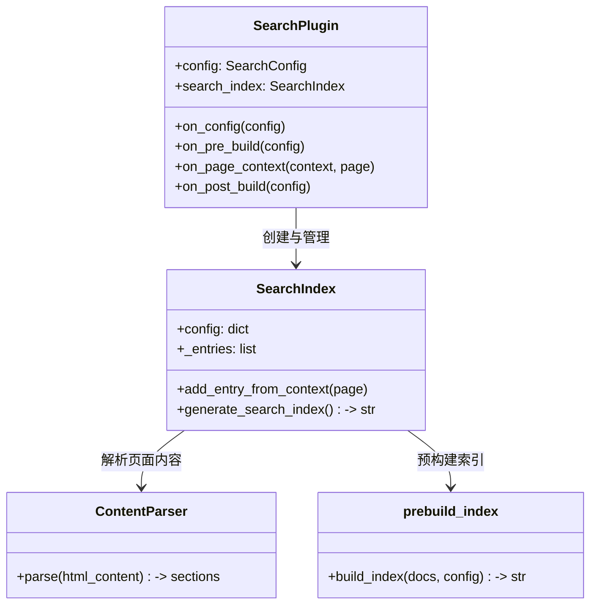
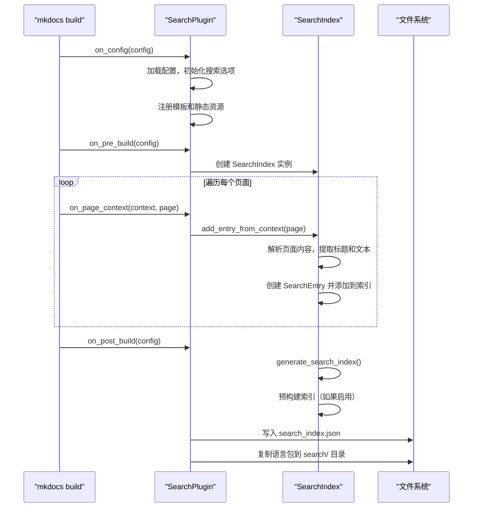
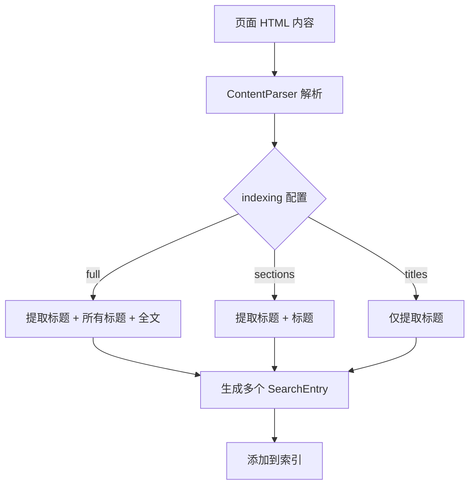
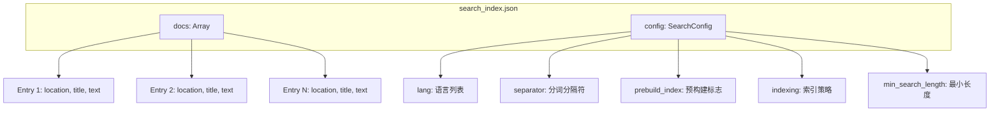
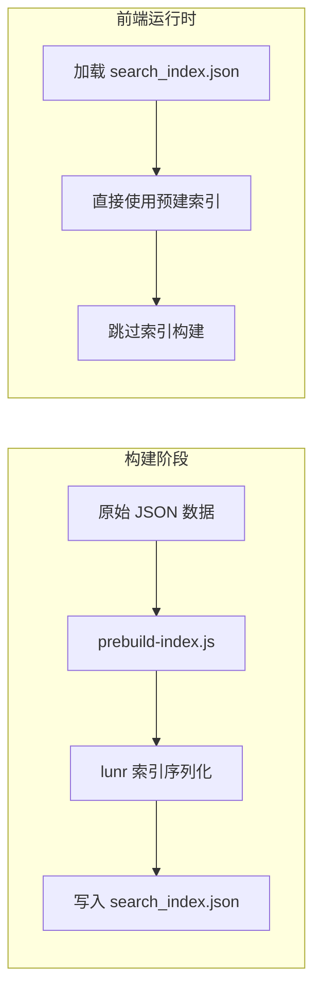
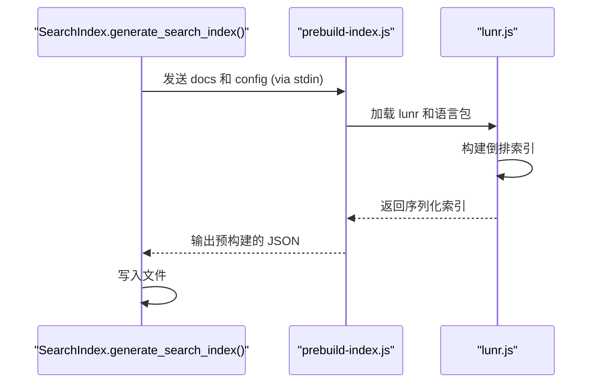
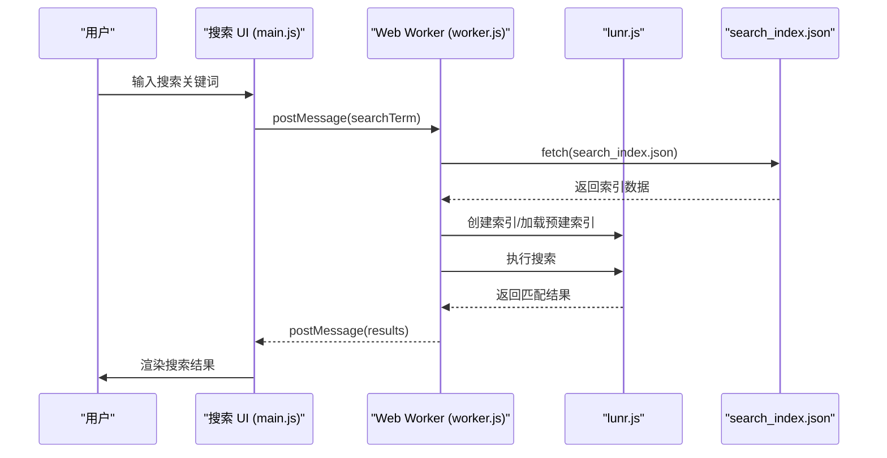
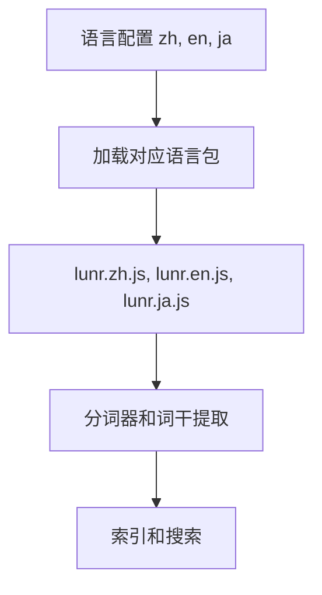
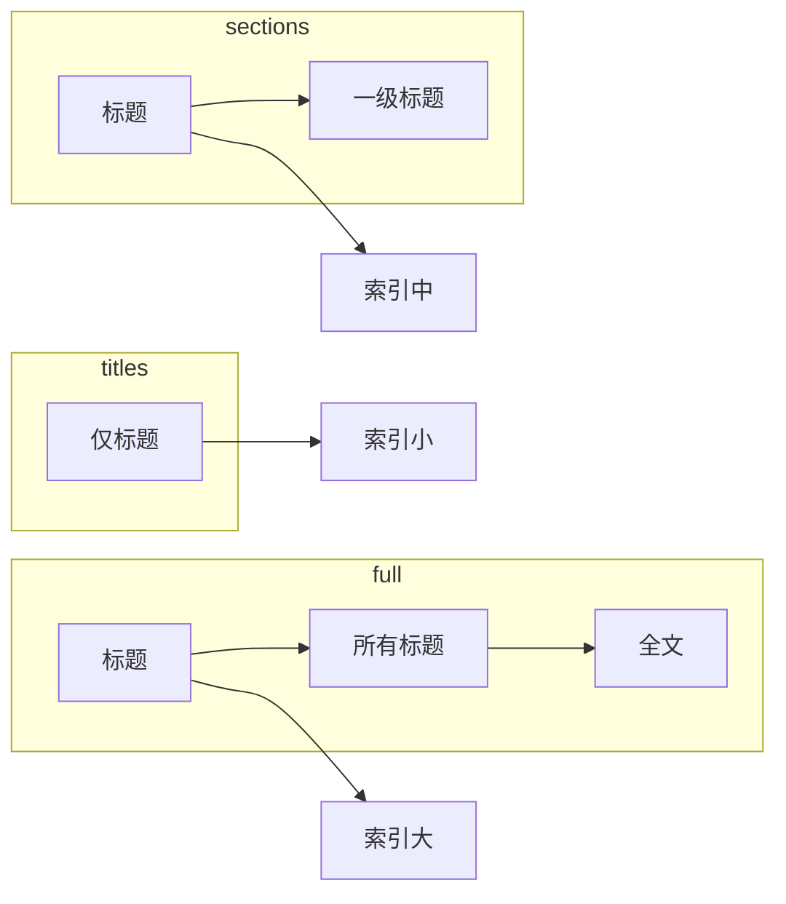

# Search 插件解析与构建原理

## 0x01. 概述

MkDocs 内置的搜索插件（search plugin）是一个功能完整、性能优化的客户端搜索解决方案。它不依赖外部搜索服务，而是通过在构建阶段生成搜索索引，并在前端使用 Lunr.js 搜索引擎实现本地搜索功能。


## 0x02. 核心组件

搜索功能由以下几个核心组件组成：



### 1. SearchPlugin（搜索插件主类）

位于 `mkdocs/contrib/search/__init__.py`，是整个搜索功能的核心入口。它继承自 `BasePlugin`，通过监听 MkDocs 的构建生命周期事件来协调搜索索引的构建。

**主要职责：**

- 配置管理与验证
- 生命周期事件处理
- 模板与静态资源注入

### 2. SearchIndex（搜索索引类）

位于 `mkdocs/contrib/search/search_index.py`，负责管理搜索条目的收集和索引的生成。

**主要方法：**

- `add_entry_from_context(page)` - 从页面上下文添加条目
- `generate_search_index()` - 生成最终的搜索索引 JSON

### 3. ContentParser（内容解析器）

负责解析页面 HTML 内容，按标题分段提取文本。

### 4. prebuild-index.js（预构建脚本）

Node.js 脚本，用于在构建阶段预生成 lunr 索引，提高前端加载性能。

### 5. 前端脚本

- `main.js` - 搜索 UI 与交互逻辑
- `worker.js` - Web Worker，在后台执行搜索
- `lunr.js` - 搜索引擎核心库

## 0x03. 构建原理与过程

搜索插件的构建过程遵循 MkDocs 的插件事件机制，按顺序触发以下事件：



### 阶段一：配置初始化（on_config）

当 MkDocs 加载配置文件时，搜索插件会执行以下操作：

```python
def on_config(self, config: MkDocsConfig):
    # 1. 检查主题是否支持搜索页面
    if config.theme['name'].value in self.theme_with_search_page:
        config.plugins['search'].include_search_page = True
    
    # 2. 添加搜索相关的 JavaScript
    if 'search' in config.plugins:
        config['extra_javascript'].append('search/search.js')
    
    # 3. 如果未指定语言，从主题 locale 推断
    if not self._config.get('lang'):
        self._config['lang'] = [config.theme['locale'].language]
```

### 阶段二：创建索引实例（on_pre_build）

在构建开始前，创建 SearchIndex 实例：

```python
def on_pre_build(self, config: MkDocsConfig):
    self.search_index = SearchIndex(
        lang=self.config['lang'],
        separator=self.config['separator'],
        min_search_length=self.config['min_search_length'],
        prebuild_index=self.config['prebuild_index'],
        indexing=self.config['indexing']
    )
```

### 阶段三：收集页面条目（on_page_context）

对于每个渲染后的页面，提取搜索条目：



每个 SearchEntry 包含：

- `title` - 标题
- `text` - 文本内容（可选）
- `location` - 页面相对路径

### 阶段四：生成索引文件（on_post_build）

最后阶段生成搜索索引文件：

```python
def on_post_build(self, config: MkDocsConfig):
    output_base_path = os.path.join(config.site_dir, 'search')
    
    # 生成索引（可能包含预构建的 lunr 索引）
    search_index = self.search_index.generate_search_index()
    
    # 写入 JSON 文件
    json_output_path = os.path.join(output_base_path, 'search_index.json')
    utils.write_file(search_index.encode('utf-8'), json_output_path)
    
    # 复制语言包文件
    self._copy_language_files(config, output_base_path)
```

## 0x04. 搜索索引数据结构

生成的 `search_index.json` 文件结构如下：

```json
{
  "docs": [
    {
      "location": "/guide/getting-started/",
      "title": "快速开始",
      "text": "本指南帮助您快速上手 MkDocs..."
    },
    {
      "location": "/guide/getting-started/#installation",
      "title": "安装",
      "text": "使用 pip 安装 MkDocs..."
    }
  ],
  "config": {
    "lang": ["zh", "en"],
    "separator": "[\\s\\-]+",
    "prebuild_index": true,
    "indexing": "full",
    "min_search_length": 3
  }
}
```



## 0x05. 预构建索引机制

预构建索引是 MkDocs 搜索功能的一个重要优化特性，它将 lunr 索引的构建过程从浏览器端移到构建阶段：



### 1. 预构建流程



### 2. 预构建配置选项

| 值 | 说明 |
|---|---|
| `false` | 不预构建，运行时构建索引 |
| `true` | 使用 Node.js 预构建（推荐） |
| `'node'` | 等同于 `true`，明确指定 Node |
| `'python'` | 使用 Python 的 lunr.py（已废弃） |

## 0x06. 前端搜索流程

前端搜索通过以下组件协作完成：



### 1. main.js 职责

- 监听搜索输入框的 `input` 事件
- 管理搜索 UI 的显示/隐藏
- 与 Web Worker 通信
- 渲染搜索结果

### 2. worker.js 职责

- 在独立的线程中执行搜索
- 加载 lunr.js 和语言包
- 管理搜索索引的生命周期

### 3. 性能优化

1. **Web Worker** - 搜索在后台线程执行，不阻塞 UI
2. **预构建索引** - 大型站点可跳过运行时索引构建
3. **按需加载** - 仅加载需要的语言包

## 0x07. 多语言支持

MkDocs 搜索支持多种语言，通过语言包（Language Pack）实现：



### 1. 支持的语言

MkDocs 通过 lunr-languages 支持以下语言：

- 英语 (en)
- 中文 (zh)
- 日语 (ja)
- 韩语 (ko)
- 德语 (de)
- 法语 (fr)
- 西班牙语 (es)
- 俄语 (ru)
- 等等...

### 2. 语言包文件

搜索插件会复制以下文件到输出目录：

```
search/
├── search_index.json      # 搜索索引
├── lunr.min.js           # lunr 核心库
├── lunr.zh.min.js        # 中文语言包
├── lunr.en.min.js        # 英文语言包
└── ...
```

## 0x08. 配置选项详解

在 `mkdocs.yml` 中配置搜索插件：

```yaml
plugins:
  - search:
      # 语言配置
      lang: 'zh'
      
      # 或使用多语言
      # lang: ['zh', 'en', 'ja']
      
      # 分词分隔符（正则表达式）
      separator: '[\s\-\.]+'
      
      # 最小搜索长度
      min_search_length: 3
      
      # 预构建索引
      prebuild_index: true
      
      # 索引策略
      indexing: full
```

### 1. 配置项说明

| 选项 | 类型 | 默认值 | 说明 |
|------|------|--------|------|
| `lang` | string/list | `['en']` | 搜索使用的语言，支持多语言 |
| `separator` | string | `\s+` | 分词分隔符的正则表达式 |
| `min_search_length` | int | `3` | 最小搜索关键词长度 |
| `prebuild_index` | bool/str | `false` | 是否预构建索引 |
| `indexing` | str | `full` | 索引策略：`full`/`sections`/`titles` |

### 2. indexing 策略对比



- **full** - 索引标题、所有层级标题和全文，召回率最高，索引体积最大
- **sections** - 索引标题和一级标题，平衡召回率和体积
- **titles** - 仅索引页面标题，适合超大型站点

## 0x09. 中文搜索配置与常见问题

在使用 MkDocs 搜索插件支持中文时，需要特别注意配置方式。

### 1. 语言配置

中文搜索需要在 `mkdocs.yml` 中正确配置语言选项：

```yaml
plugins:
  - search:
      # ✅ 正确：使用 YAML 列表格式
      lang: ['zh', 'en']
      
      # ❌ 错误：字符串格式会导致语言无法识别
      # lang: '[zh,en]'
      
      separator: '[\s\-\.]+'
      prebuild_index: true
      indexing: full
```

**重要说明**：
- `lang` 必须是 **列表类型** `['zh', 'en']`，不能是字符串 `'[zh,en]'`
- 如果配置为字符串，插件会提示 `Option search.lang '[zh,en]' is not supported, falling back to 'en'`

### 2. 中文分词依赖问题

当启用 `prebuild_index: true` 时，如果配置了中文语言，MkDocs 会尝试使用 Node.js 预构建搜索索引。中文语言包 `lunr.zh.js` 依赖 `@node-rs/jieba` 模块进行中文分词。

**错误信息**：

```
Error: Cannot find module '@node-rs/jieba'
Require stack:
- D:\...\mkdocs\contrib\search\lunr-language\lunr.zh.js
- D:\...\mkdocs\contrib\search\prebuild-index.js
```

**解决方案**：安装 `@node-rs/jieba` npm 包

```bash
# 在项目根目录执行
npm install @node-rs/jieba --save
```

这会在项目目录下创建 `node_modules/` 并安装所需的 Node 模块。

### 3. 构建验证

配置正确后，构建成功会在 `site/search/` 目录生成以下文件：

```
site/search/
├── search_index.json        # 搜索索引（包含中文内容）
├── lunr.js                   # lunr 核心库
├── lunr.stemmer.support.js   # 词干支持
├── lunr.multi.js             # 多语言支持
├── lunr.zh.js                # 中文分词支持 ⭐
├── main.js                   # 搜索 UI
└── worker.js                 # Web Worker
```

可以通过检查 `lunr.zh.js` 是否存在来确认中文语言包是否正确加载。

### 4. 替代方案

如果不想安装 Node 模块，可以选择以下替代方案：

#### 方案一：禁用预构建索引

```yaml
plugins:
  - search:
      lang: ['zh', 'en']
      prebuild_index: false  # 禁用预构建，运行时构建索引
```

这会让浏览器在首次搜索时构建索引，但不需要安装 `@node-rs/jieba`。

#### 方案二：仅使用英文搜索

如果不需要中文搜索，可以只配置英文：

```yaml
plugins:
  - search:
      lang: ['en']
      prebuild_index: true
```

### 5. 常见错误汇总

| 错误信息 | 原因 | 解决方案 |
|----------|------|----------|
| `Option search.lang '[zh,en]' is not supported` | `lang` 配置为字符串而非列表 | 改为 `lang: ['zh', 'en']` |
| `Cannot find module '@node-rs/jieba'` | 缺少 Node.js 中文分词模块 | 执行 `npm install @node-rs/jieba --save` |
| 搜索结果为空 | 语言包未正确加载 | 检查 `site/search/lunr.zh.js` 是否存在 |

## 0x0A. 总结

MkDocs 搜索插件是一个设计精良的客户端搜索解决方案：

1. **构建阶段** - 通过插件事件机制收集页面内容，生成搜索索引
2. **索引策略** - 支持三种粒度的索引策略，满足不同规模站点的需求
3. **预构建优化** - 通过 Node.js 预构建索引，提升大型站点的搜索加载速度
4. **多语言支持** - 通过 lunr-language 包支持全球多种语言
5. **前端交互** - 使用 Web Worker 实现非阻塞搜索，提升用户体验

这套机制使得 MkDocs 能够在不依赖外部搜索服务的情况下，提供功能完整、性能优异的搜索体验。